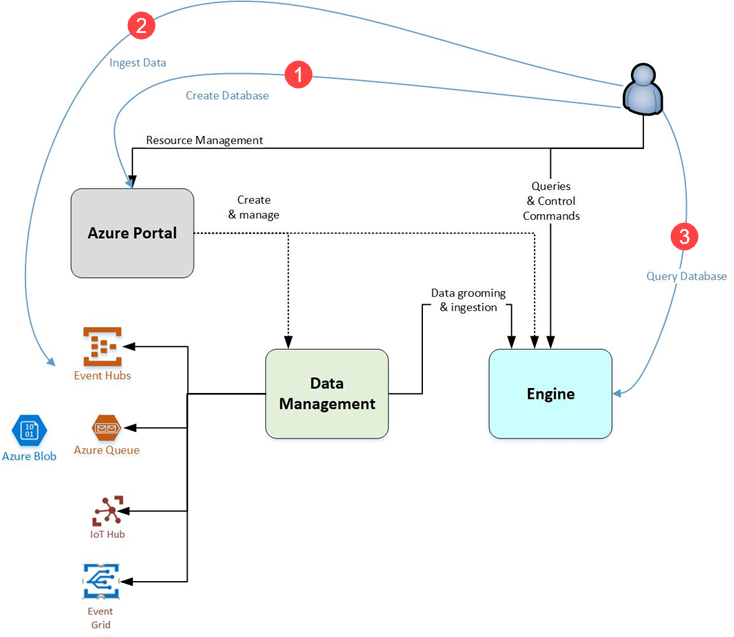
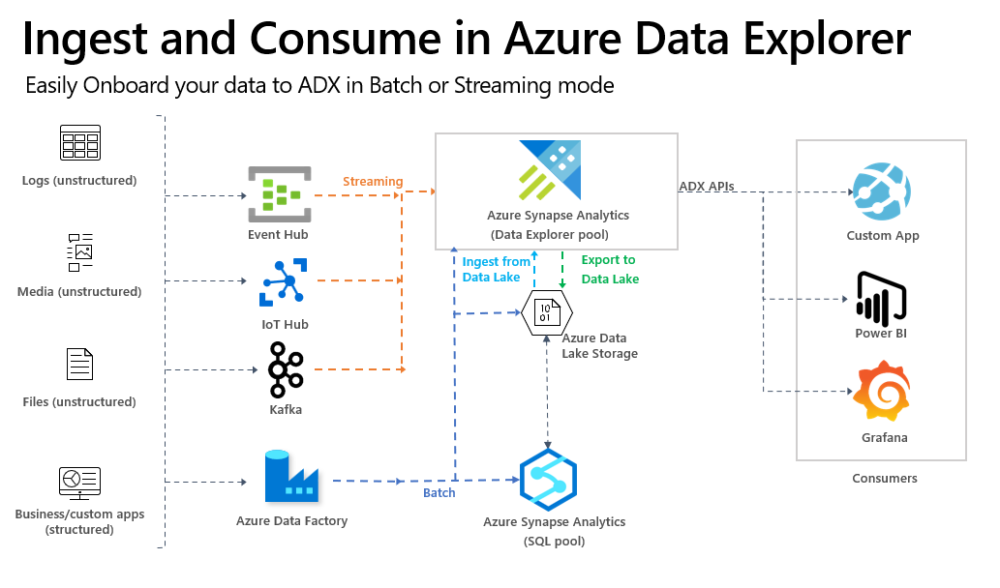
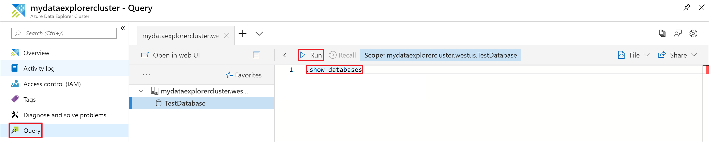
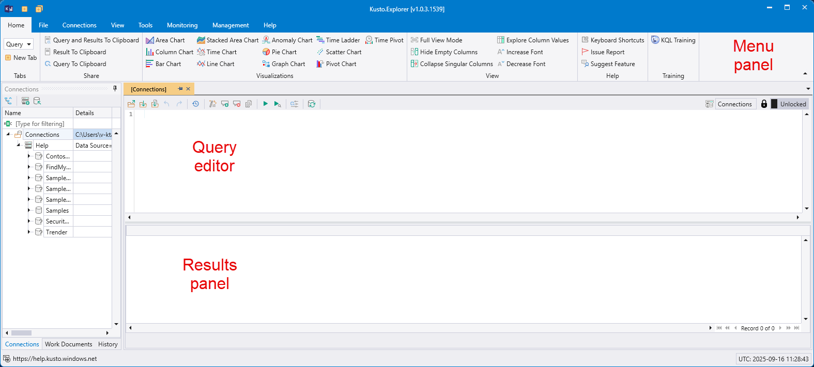
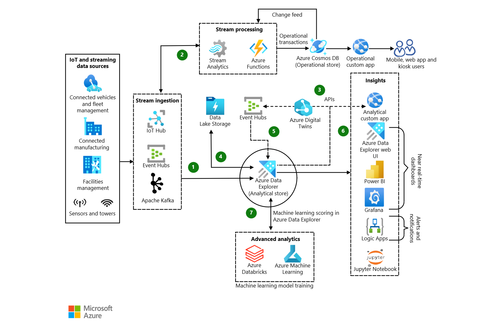

# Azure Data Explorer (ADX)

## Actividad 1 - Principales servicios de Azure orientado a Datos

### IFCD0078 - Data Engineering

**Alumno:** Rafael Velasco

**Servicio Azure seleccionado:** Azure Data Explorer

**Repositorio:** IFCD0078_Bloque_02-Data_Engineering

**Fecha:** Junio de 2026

---

# Índice

1. Introducción
2. ¿Qué es Azure Data Explorer?
3. Características principales
4. Arquitectura de Azure Data Explorer
5. Creación y configuración del servicio
6. Lenguaje Kusto Query Language (KQL)
7. Caso práctico 1: Monitorización IoT
8. Caso práctico 2: Análisis de logs y telemetría
9. Comparación con otros servicios Azure
10. Conclusiones
11. Referencias


---

## 1. Introducción

Las organizaciones generan diariamente grandes cantidades de datos procedentes de aplicaciones, dispositivos IoT, sistemas empresariales, redes y servicios en la nube. Para poder obtener información útil de estos datos es necesario disponer de plataformas capaces de almacenarlos, procesarlos y analizarlos de forma eficiente.

Microsoft Azure ofrece diferentes servicios orientados al análisis y procesamiento de datos, cada uno diseñado para resolver necesidades específicas como la integración de datos, el análisis en tiempo real, el procesamiento masivo o la gobernanza de la información.

En este trabajo se estudia Azure Data Explorer (ADX), un servicio de análisis de datos totalmente administrado que permite recopilar, almacenar y consultar grandes volúmenes de información con una latencia muy baja. Este servicio resulta especialmente útil para escenarios de monitorización, telemetría, análisis de registros (logs) y soluciones IoT.


---

## 2. ¿Qué es Azure Data Explorer?

Azure Data Explorer (ADX) es un servicio de análisis de datos totalmente administrado de Microsoft Azure diseñado para recopilar, almacenar y analizar grandes volúmenes de datos en tiempo casi real. Está especialmente orientado al procesamiento de registros (logs), telemetría, eventos y datos procedentes de dispositivos IoT, permitiendo obtener información valiosa con baja latencia y gran capacidad de escalado.




*Figura 1. Flujo de trabajo de Azure Data Explorer. Fuente: Microsoft Learn.*

La Figura 1 muestra el flujo de trabajo general de Azure Data Explorer. El 
servicio permite crear bases de datos, ingerir datos desde múltiples orígenes 
como Azure Event Hubs, Azure Blob Storage o Azure IoT Hub, procesarlos 
mediante el motor analítico de ADX y consultarlos utilizando Kusto Query 
Language (KQL). Los resultados pueden visualizarse posteriormente mediante 
herramientas como Power BI o aplicaciones personalizadas.


Gracias a su arquitectura escalable y a su capacidad para analizar millones de
eventos por segundo, Azure Data Explorer es una solución ampliamente utilizada
en escenarios de monitorización de infraestructuras, análisis de telemetría, 
observabilidad, ciberseguridad y análisis de datos IoT.

### Capacidades principales

- Ingesta de datos en tiempo real y por lotes.
- Consultas rápidas mediante Kusto Query Language (KQL).
- Escalado automático para grandes volúmenes de datos.
- Integración con Power BI, Azure Monitor y Microsoft Fabric.
- Soporte para escenarios de IoT, telemetría y análisis de registros.


---

## 3. Características principales

Azure Data Explorer incorpora diversas características que lo convierten en una plataforma eficiente para el análisis de grandes volúmenes de datos. Su diseño está orientado a escenarios donde es necesario recopilar, almacenar y consultar información con una latencia muy baja y una alta capacidad de escalado.

| Característica                    | Descripción                                                                                        |
| --------------------------------- | -------------------------------------------------------------------------------------------------- |
| Análisis en tiempo real           | Permite consultar datos pocos segundos después de su ingesta.                                      |
| Alta escalabilidad                | Puede escalar horizontalmente para procesar grandes volúmenes de información.                      |
| Servicio PaaS                     | Microsoft administra la infraestructura, reduciendo las tareas de mantenimiento.                   |
| Kusto Query Language (KQL)        | Lenguaje de consultas optimizado para explorar y analizar datos rápidamente.                       |
| Ingesta flexible                  | Admite datos procedentes de Azure Event Hubs, IoT Hub, Blob Storage, Data Factory y otras fuentes. |
| Integración con Azure             | Se integra con servicios como Power BI, Azure Monitor, Microsoft Sentinel y Microsoft Fabric.      |
| Optimizado para telemetría y logs | Diseñado específicamente para analizar eventos, registros y datos IoT.                             |

### Ventajas de Azure Data Explorer

* Consultas rápidas sobre grandes volúmenes de datos.
* Capacidad para trabajar con datos históricos y datos en tiempo real.
* Escalado automático según la carga de trabajo.
* Amplio ecosistema de integración con servicios de Azure.
* Soporte para visualización y creación de paneles interactivos.

Estas características hacen que Azure Data Explorer sea una solución especialmente adecuada para escenarios de monitorización, observabilidad, análisis de telemetría, ciberseguridad y análisis de datos procedentes de dispositivos IoT.


---

## 4. Arquitectura de Azure Data Explorer



*Figura 2. Arquitectura de ingesta y consumo de datos en Azure Data Explorer. Fuente: Microsoft Learn.*

La arquitectura de Azure Data Explorer está diseñada para procesar grandes volúmenes de datos procedentes de múltiples fuentes y ponerlos a disposición de los usuarios para su análisis en tiempo casi real. El servicio admite tanto cargas de datos por lotes (batch) como flujos continuos de eventos (streaming).

Las fuentes de datos pueden incluir registros de aplicaciones, telemetría de dispositivos IoT, archivos almacenados en Azure Data Lake Storage o información procedente de aplicaciones empresariales. Estos datos son ingeridos mediante servicios como Azure Event Hubs, Azure IoT Hub, Apache Kafka o Azure Data Factory.

Una vez almacenados en Azure Data Explorer, los datos pueden ser consultados mediante Kusto Query Language (KQL) para realizar análisis, generar informes o entrenar modelos de aprendizaje automático. Los resultados pueden consumirse desde herramientas como Power BI, Grafana o aplicaciones personalizadas.

### Componentes principales

* **Fuentes de datos:** aplicaciones, dispositivos IoT, registros y archivos.
* **Servicios de ingesta:** Event Hubs, IoT Hub, Kafka y Azure Data Factory.
* **Motor de Azure Data Explorer:** almacenamiento y procesamiento analítico.
* **Herramientas de análisis:** KQL, Azure Synapse Analytics y Azure Machine Learning.
* **Visualización:** Power BI, Grafana y aplicaciones web.


---

## 5. Creación y configuración del servicio



*Figura 3. Clúster y bases de datos creadas en Azure Data Explorer. Fuente: Microsoft Learn.*

Para comenzar a trabajar con Azure Data Explorer es necesario crear un clúster y, posteriormente, una o varias bases de datos donde se almacenarán los datos que se desean analizar. Microsoft proporciona diferentes métodos para realizar esta configuración, incluyendo el Portal de Azure, Azure CLI, PowerShell y plantillas ARM.

Los pasos básicos para desplegar el servicio son los siguientes:

| Paso | Descripción                                                                   |
| ---- | ----------------------------------------------------------------------------- |
| 1    | Crear un clúster de Azure Data Explorer.                                      |
| 2    | Seleccionar la suscripción, grupo de recursos y región de Azure.              |
| 3    | Configurar el nombre y tamaño inicial del clúster.                            |
| 4    | Crear una base de datos dentro del clúster.                                   |
| 5    | Ingerir datos desde archivos, Event Hubs, IoT Hub u otras fuentes.            |
| 6    | Ejecutar consultas KQL para analizar la información almacenada.               |
| 7    | Visualizar los resultados mediante Power BI u otras herramientas compatibles. |

Una vez completada la configuración inicial, Azure Data Explorer permite escalar los recursos de forma dinámica para adaptarse al volumen de datos y a las necesidades de procesamiento de cada organización.


---

## 6. Lenguaje Kusto Query Language (KQL)



*Figura 4. Interfaz de Kusto Explorer para la ejecución de consultas KQL. Fuente: Microsoft Learn.*

Kusto Query Language (KQL) es el lenguaje de consultas utilizado por Azure Data Explorer para explorar, analizar y visualizar grandes volúmenes de datos de forma eficiente. Está diseñado específicamente para trabajar con datos de telemetría, registros (logs) y eventos, permitiendo obtener resultados rápidamente incluso sobre conjuntos de datos muy grandes.

KQL utiliza una sintaxis sencilla basada en operadores encadenados mediante el carácter `|` (pipe), donde la salida de una operación se convierte en la entrada de la siguiente. Este enfoque facilita la lectura y el análisis de las consultas.

### Ejemplo 1: Mostrar los primeros registros de una tabla

```kusto
StormEvents
| take 10
```

Esta consulta devuelve los diez primeros registros de la tabla `StormEvents`.

### Ejemplo 2: Contar registros por estado

```kusto
StormEvents
| summarize TotalEventos=count() by State
| sort by TotalEventos desc
```

Esta consulta agrupa los eventos por estado, calcula el número total de eventos registrados y los ordena de mayor a menor.

### Ventajas de KQL

* Sintaxis sencilla y fácil de aprender.
* Optimizado para grandes volúmenes de datos.
* Consultas rápidas sobre información histórica y en tiempo real.
* Integración nativa con Azure Data Explorer, Microsoft Sentinel y Azure Monitor.
* Posibilidad de generar visualizaciones directamente desde las consultas.

Gracias a estas características, KQL se ha convertido en una herramienta fundamental para la monitorización, observabilidad y análisis de datos dentro del ecosistema Microsoft Azure.


---

## 7. Caso práctico 1: Monitorización IoT



*Figura 5. Arquitectura de análisis IoT mediante Azure IoT Hub y Azure Data Explorer. Fuente: Microsoft Learn.*

Uno de los escenarios más habituales de Azure Data Explorer es la monitorización de dispositivos IoT (Internet of Things). En este tipo de soluciones, miles de sensores y dispositivos generan continuamente información que debe ser procesada y analizada en tiempo real.

En este caso práctico, los dispositivos IoT envían datos de telemetría a través de Azure IoT Hub. Posteriormente, Azure Data Explorer recibe e ingiere estos eventos para almacenarlos y analizarlos mediante consultas KQL. Finalmente, los resultados pueden visualizarse mediante herramientas como Power BI o aplicaciones personalizadas.

### Funcionamiento de la solución

1. Los dispositivos IoT generan datos de forma continua.
2. Azure IoT Hub recibe los mensajes enviados por los dispositivos.
3. Azure Data Explorer ingiere y almacena los eventos recibidos.
4. Los analistas ejecutan consultas KQL para detectar anomalías, tendencias o incidencias.
5. Los resultados se muestran en paneles de control y herramientas de visualización.

### Ejemplo de aplicación

Una empresa de transporte dispone de cientos de vehículos equipados con sensores que registran:

* Temperatura del motor.
* Consumo de combustible.
* Velocidad.
* Posición GPS.

Azure Data Explorer permite analizar esta información en tiempo real para detectar averías, optimizar rutas y mejorar el mantenimiento preventivo de la flota.

### Beneficios

* Monitorización en tiempo real.
* Detección temprana de anomalías.
* Escalabilidad para millones de eventos diarios.
* Integración con servicios Azure orientados a IoT.
* Mejora de la toma de decisiones basada en datos.


---

## 8. Caso práctico 2: Análisis de logs y telemetría

Además de los escenarios IoT, Azure Data Explorer es ampliamente utilizado para el análisis de registros (logs) y datos de telemetría generados por aplicaciones, servidores e infraestructuras tecnológicas.

Las organizaciones generan millones de eventos diarios relacionados con accesos de usuarios, errores de aplicaciones, rendimiento de sistemas y actividad de red. Azure Data Explorer permite almacenar y consultar esta información de forma eficiente para identificar incidencias y mejorar el funcionamiento de los servicios.

### Funcionamiento de la solución

1. Las aplicaciones y servicios generan registros de actividad.
2. Los datos son enviados a Azure Data Explorer mediante diferentes mecanismos de ingesta.
3. Los registros se almacenan y organizan en tablas.
4. Los equipos técnicos utilizan consultas KQL para analizar la información.
5. Los resultados se visualizan mediante paneles de control y herramientas de monitorización.

### Ejemplo de aplicación

Una empresa de comercio electrónico dispone de una plataforma web que recibe miles de visitas diarias. Cada acceso genera registros que contienen información sobre:

* Usuario.
* Fecha y hora.
* Dirección IP.
* Tiempo de respuesta.
* Errores producidos.
* Recursos consumidos.

Mediante Azure Data Explorer, los administradores pueden identificar rápidamente problemas de rendimiento, detectar errores recurrentes y analizar el comportamiento de los usuarios para mejorar la calidad del servicio.

### Beneficios

* Análisis rápido de grandes volúmenes de registros.
* Identificación de incidencias en tiempo real.
* Mejora del rendimiento de aplicaciones y servicios.
* Integración con Azure Monitor y Microsoft Sentinel.
* Mayor capacidad de supervisión y observabilidad.

Este tipo de soluciones es especialmente útil en centros de datos, plataformas de comercio electrónico, servicios en la nube y entornos empresariales donde la disponibilidad y el rendimiento de las aplicaciones son factores críticos.


---

## 9. Comparación con otros servicios Azure

Microsoft Azure dispone de numerosos servicios orientados al procesamiento y análisis de datos. Cada uno de ellos está diseñado para resolver necesidades específicas, por lo que es importante seleccionar la herramienta adecuada según el escenario.

La siguiente tabla resume las principales diferencias entre Azure Data Explorer y otros servicios relacionados:

| Servicio               | Función principal                                            | Casos de uso habituales                                           |
| ---------------------- | ------------------------------------------------------------ | ----------------------------------------------------------------- |
| Azure Data Explorer    | Análisis rápido de grandes volúmenes de datos en tiempo real | Logs, telemetría, monitorización, IoT y observabilidad            |
| Azure Data Factory     | Integración y movimiento de datos                            | Procesos ETL y ELT, migración y transformación de datos           |
| Azure Databricks       | Procesamiento Big Data y Machine Learning                    | Ciencia de datos, ingeniería de datos e inteligencia artificial   |
| Azure Stream Analytics | Procesamiento continuo de eventos en streaming               | Detección de eventos en tiempo real y análisis de flujos de datos |
| Microsoft Purview      | Gobierno y catalogación de datos                             | Gestión, clasificación y cumplimiento normativo de los datos      |

### ¿Cuándo utilizar Azure Data Explorer?

Azure Data Explorer es la opción más adecuada cuando se necesita analizar grandes cantidades de eventos, registros o datos de telemetría con tiempos de respuesta muy reducidos. Su diseño está optimizado para consultas analíticas rápidas y para la monitorización de sistemas en tiempo real.

### Diferencias con Azure Databricks

Aunque ambos servicios pueden trabajar con grandes volúmenes de datos, Azure Databricks está orientado al procesamiento Big Data, la ingeniería de datos y el desarrollo de modelos de Machine Learning utilizando Apache Spark. Por su parte, Azure Data Explorer está especializado en la exploración y análisis interactivo de datos de telemetría y registros.

### Diferencias con Azure Data Factory

Azure Data Factory no es una plataforma de análisis, sino un servicio de integración de datos. Su función principal consiste en mover y transformar información entre distintos sistemas. En muchos proyectos, Data Factory se utiliza para cargar datos que posteriormente serán analizados en Azure Data Explorer.

### Diferencias con Azure Stream Analytics

Azure Stream Analytics está enfocado al procesamiento de flujos de eventos en tiempo real. Azure Data Explorer puede complementar este servicio almacenando y permitiendo consultar posteriormente los datos procesados para realizar análisis históricos y exploratorios.

En muchos proyectos empresariales estos servicios no compiten entre sí, sino que trabajan de forma conjunta dentro de una misma arquitectura de datos.

### Resumen rápido

| Servicio | Función principal |
|-----------|------------------|
| Azure Data Factory | Mover e integrar datos |
| Azure Stream Analytics | Procesar eventos en tiempo real |
| Azure Data Explorer | Analizar telemetría y registros |
| Azure Databricks | Big Data e Inteligencia Artificial |
| Microsoft Purview | Gobierno y catalogación de datos |


---

## 10. Conclusiones

Azure Data Explorer es un servicio de análisis de datos de Microsoft Azure diseñado para procesar grandes volúmenes de información de forma rápida y eficiente. Su capacidad para ingerir, almacenar y consultar datos en tiempo casi real lo convierte en una solución especialmente adecuada para escenarios de monitorización, telemetría, observabilidad y análisis de dispositivos IoT.

A lo largo de este trabajo se han estudiado las principales características de Azure Data Explorer, su arquitectura, el proceso de despliegue y configuración, así como el lenguaje de consultas Kusto Query Language (KQL). También se han analizado dos casos prácticos representativos relacionados con la monitorización IoT y el análisis de registros y telemetría.

La comparación con otros servicios de Azure ha permitido comprender mejor el papel que desempeña Azure Data Explorer dentro del ecosistema de datos de Microsoft. Mientras que servicios como Azure Data Factory se orientan a la integración de datos y Azure Databricks al procesamiento Big Data y Machine Learning, Azure Data Explorer destaca por su capacidad para realizar consultas analíticas rápidas sobre grandes cantidades de eventos y registros.

En conclusión, Azure Data Explorer es una herramienta potente y escalable que facilita la obtención de información útil a partir de datos operacionales, ayudando a las organizaciones a mejorar la supervisión de sus sistemas y la toma de decisiones basada en datos.


---

## 11. Referencias

- Microsoft Learn. Azure Data Explorer Documentation.
   https://learn.microsoft.com/es-es/azure/data-explorer/

- Microsoft Learn. ¿Qué es Azure Data Explorer?
   https://learn.microsoft.com/es-es/azure/data-explorer/data-explorer-overview

- Microsoft Learn. Crear un clúster y una base de datos de Azure Data Explorer.
   https://learn.microsoft.com/es-es/azure/data-explorer/create-cluster-and-database

- Microsoft Learn. Información general sobre la ingesta de datos en Azure Data Explorer.
   https://learn.microsoft.com/es-es/azure/data-explorer/ingest-data-overview

- Microsoft Learn. Kusto Query Language (KQL).
   https://learn.microsoft.com/es-es/kusto/

- Microsoft Learn. Kusto Explorer.
   https://learn.microsoft.com/es-es/kusto/tools/kusto-explorer

- Microsoft Learn. IoT Analytics con Azure Data Explorer y Azure IoT Hub.
   https://learn.microsoft.com/es-es/azure/architecture/solution-ideas/articles/iot-azure-data-explorer

- Microsoft Azure Architecture Center. Arquitecturas de análisis de datos.
   https://learn.microsoft.com/es-es/azure/architecture/


Las imágenes utilizadas en este documento proceden de la documentación oficial de Microsoft Learn.


