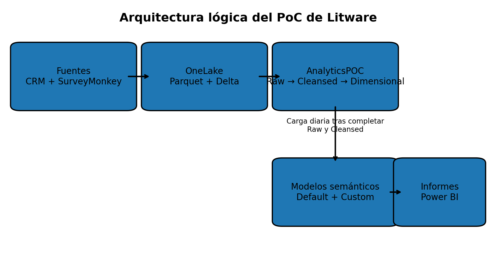
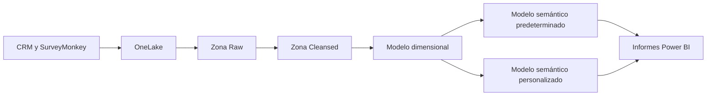
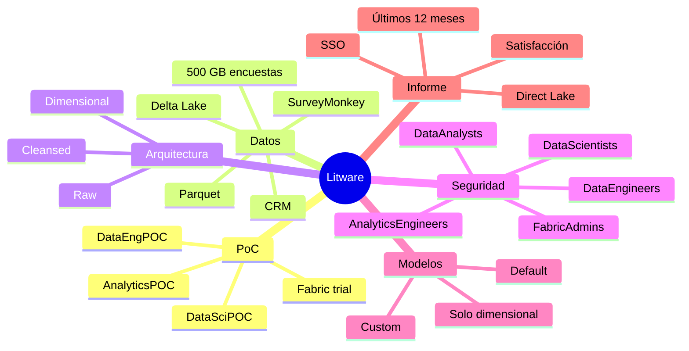

# CASO DE ESTUDIO: LITWARE, INC.

> **Guía visual de análisis — DP-600 / Microsoft Fabric**

---

## 1. Visión general

Litware, Inc. es una empresa de fabricación con oficinas en Norteamérica. Su equipo de analítica está formado por ingenieros de datos, ingenieros analíticos, analistas de datos y científicos de datos.

La empresa lleva tres años usando Power BI, pero todavía no ha habilitado capacidades ni funcionalidades de Microsoft Fabric.

---

## 2. Entorno existente

### 2.1 Fabric y Power BI

- Existe un tenant de Power BI.
- Fabric todavía no está habilitado.
- Se realizará una prueba de concepto (**PoC**) con una capacidad de prueba de Fabric.
- Solo los administradores de Fabric y el equipo de analítica podrán ver los elementos creados durante la PoC.

### 2.2 Fuentes de datos

| Datos | Origen | Tamaño aproximado |
|---|---|---:|
| Customer | CRM | 50 MB |
| Product | CRM | 200 MB |
| Customer satisfaction surveys | SurveyMonkey | 500 GB |


> La fuente dominante es la de encuestas de satisfacción, con **500 GB**.

### 2.3 Datos de Product

| Columna | Tipo |
|---|---|
| ProductID | Integer |
| ProductName | String |
| ProductCategory | String |
| ListPrice | Decimal |

### 2.4 Datos de satisfacción

Las encuestas contienen tres tablas:

- `Survey`
- `Question`
- `Response`

Por cada encuesta enviada:

- Se añade una fila a `Survey`.
- Se añade una fila a `Response` por cada pregunta.
- La tercera pregunta representa la puntuación global de satisfacción.
- Un cliente puede enviar una encuesta después de cada compra.

---

## 3. Problemas detectados

### 3.1 Volumen y variedad

- Existen grandes volúmenes de datos.
- Parte de los datos es semiestructurada.
- Se necesita un nuevo almacén de datos en Fabric.

### 3.2 Inconsistencia en grupos de precios

Los productos se clasifican como **Low**, **Medium** y **High**, pero la lógica está repetida en varios sistemas y modelos semánticos y no siempre coincide.

---

## 4. Cambios planeados

| Workspace | Contenido principal |
|---|---|
| `AnalyticsPOC` | Data store, modelos semánticos, informes, pipelines, dataflows y notebooks relacionados con el almacén |
| `DataEngPOC` | Pipelines, dataflows y notebooks usados para cargar OneLake |
| `DataSciPOC` | Notebooks e informes de los científicos de datos |

En `AnalyticsPOC` se crearán:

- Un data store
- Un modelo semántico personalizado
- Un modelo semántico predeterminado
- Informes interactivos

---

## 5. Arquitectura lógica del PoC





### Regla de carga

1. Actualizar completamente **Raw**.
2. Actualizar completamente **Cleansed**.
3. Cargar después el **modelo dimensional**.

---

## 6. Requisitos técnicos del data store

Debe admitir:

- Lectura mediante **T-SQL**
- Lectura mediante **Python**
- Datos semiestructurados
- Datos no estructurados
- RLS para usuarios que ejecuten consultas T-SQL

Los archivos cargados en OneLake:

- Se almacenarán en Parquet.
- Cumplirán las especificaciones de Delta Lake.

### Deducción clave

Los requisitos apuntan a una solución basada en **Lakehouse**.

---

## 7. Modelo dimensional

Debe existir una dimensión de fecha:

- Sin origen previo.
- Año fiscal igual al año natural.
- Fechas desde **2010** hasta el final del año actual.
- Disponible para todos los usuarios del data store.

---

## 8. Lógica centralizada de grupos de precios

| Condición de `ListPrice` | Grupo |
|---|---|
| `<= 50` | Low |
| `> 50` y `<= 1000` | Medium |
| `> 1000` | High |

```sql
CASE
    WHEN ListPrice <= 50 THEN 'Low'
    WHEN ListPrice <= 1000 THEN 'Medium'
    ELSE 'High'
END
```

La lógica debe mantenerse en un único lugar y estar disponible para T-SQL y para el modelo semántico predeterminado.

---

## 9. Seguridad y mínimo privilegio

| Grupo | Necesidades |
|---|---|
| FabricAdmins | Administrar el workspace |
| DataEngineers | Leer y escribir en el data store; sin acceso a modelos ni informes |
| AnalyticsEngineers | Leer, escribir, crear esquemas, crear y compartir modelos, modificar informes |
| DataScientists | Leer mediante Spark notebook; sin escritura |
| DataAnalysts | Leer solo objetos dimensionales y crear informes desde modelos compartidos |

### Claves de examen

- `FabricAdmins` → **Admin**
- `AnalyticsEngineers` → normalmente **Member**
- `DataScientists` → lectura mediante Spark
- `DataAnalysts` → acceso granular y permiso **Build**
- Aplicar siempre el principio de mínimo privilegio

---

## 10. Modelos semánticos

El modelo predeterminado y el personalizado deben incluir únicamente:

- Tablas del modelo dimensional
- Vistas del modelo dimensional

No deben incluir directamente objetos Raw ni Cleansed.

---

## 11. Informe de satisfacción

Debe:

- Permitir seleccionar un producto.
- Filtrar respuestas de clientes que hayan comprado ese producto.
- Mostrar la media global de satisfacción.
- Considerar los últimos 12 meses hasta una fecha seleccionada.
- Mostrar cambios en cuanto se actualice el data store.
- Incluir solo el año actual y el anterior.
- Respetar la seguridad del origen.
- Minimizar el tiempo de consulta.

### Implicaciones habituales

| Requisito | Decisión probable |
|---|---|
| Datos actualizados inmediatamente | Evitar Import |
| Baja latencia | Preferir Direct Lake |
| Respetar seguridad del origen | SSO |
| Solo año actual y anterior | Filtrado en origen o modelo |
| Últimos 12 meses | Medida DAX temporal |

---

## 12. Claves rápidas

### Arquitectura

- Fabric trial
- Lakehouse
- Parquet + Delta
- Raw → Cleansed → Dimensional

### Modelado

- Dimensión fecha desde 2010
- Modelos semánticos solo con objetos dimensionales
- Lógica de precios centralizada

### Seguridad

- Distinguir roles de workspace, permisos de elemento y permisos SQL
- Aplicar mínimo privilegio

### Informes

- Últimos 12 meses
- Año actual y anterior
- Frescura inmediata
- Seguridad de origen
- Baja latencia

---

## 13. Mapa mental



---

## 14. Regla de oro del caso

Entre varias soluciones válidas, elegir la que:

1. Cumpla literalmente el requisito.
2. Use el menor privilegio.
3. Minimice desarrollo y mantenimiento.
4. Evite duplicar lógica.
5. Mantenga el mejor rendimiento posible.


