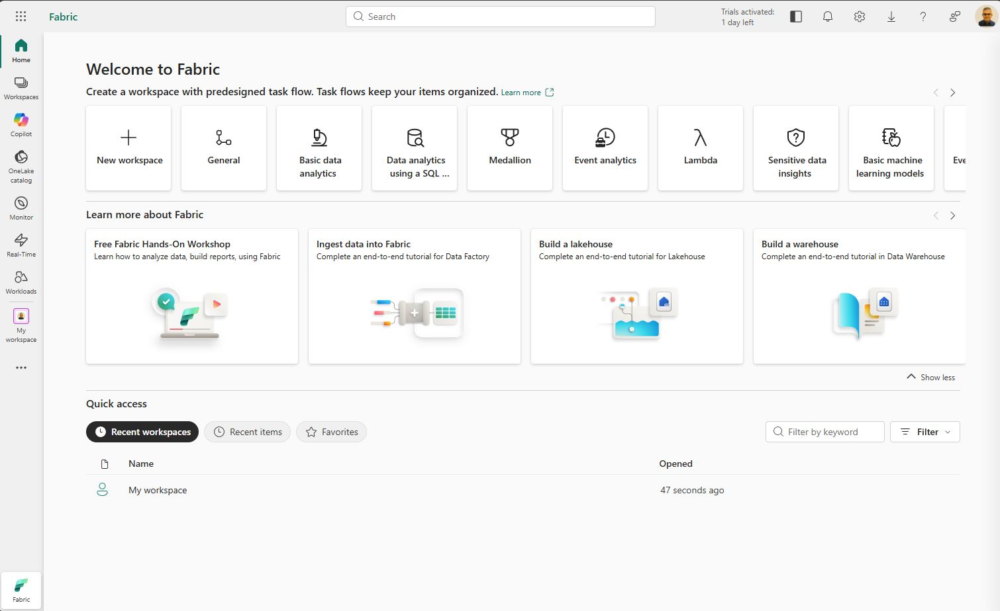

# Prepare a semantic model for AI

<br>

Copilot in Power BI relies on semantic model metadata to generate accurate responses. Without preparation, Copilot might misinterpret business terminology, use the wrong measures, or return inconsistent answers. Preparing the semantic layer ensures that Copilot understands your data the way your business users do.

You learn how to:

* Simplify the AI data schema to focus Copilot on business-relevant fields.
* Write AI instructions that provide business context and terminology.
* Create verified answers that return predefined visuals for common questions.
* Add synonyms via Q&A linguistic modeling to improve natural language interpretation.
* Test your AI preparation using the Copilot pane and HCAAT diagnostics.
* Mark the semantic model as Approved for Copilot in the Power BI service.
* This lab takes approximately 30 minutes to complete.

>! **Tip**: For related training content, see [Prepare the semantic layer for AI in Microsoft Fabric](https://learn.microsoft.com/training/modules/fabric-prepare-semantic-layer/).

<br>

** Set up the environment

>! **Note**: You need a paid Fabric capacity to complete this exercise. A Fabric trial doesn’t support Copilot capabilities. For information about Fabric licenses, see [Microsoft Fabric licenses](https://learn.microsoft.com/fabric/enterprise/licenses).

You need [Power BI Desktop](https://www.microsoft.com/download/details.aspx?id=58494) (November 2025 or newer) installed to complete this exercise. Note: *UI elements may vary slightly depending on your version*.

1. On the Fabric home page, select **Power BI**.

2. In the left navigation bar, select **Workspaces**, and then select **New workspace**.

3. Name the new workspace, such as **dp_fabric**, select a licensing mode that includes Fabric capacity (paid F2 or higher), and select Apply.

4. Open a web browser and enter the following URL to download the [30-prepare-model-ai zip folder](https://github.com/MicrosoftLearning/mslearn-fabric/raw/refs/heads/main/Allfiles/Labs/30/30-prepare-model-ai.zip):

    https://github.com/MicrosoftLearning/mslearn-fabric/raw/refs/heads/main/Allfiles/Labs/30/30-prepare-model-ai.zip

5. Save the file in **Downloads** and extract the zip file to the **30-prepare-model-ai** folder.

6. Open the **30-Starter-Sales Analysis.pbix** file from the folder you extracted.

    >! Ignore and close any warnings asking to apply changes. Don’t select *Discard changes*.

7. On the **Home** ribbon, select the **Copilot** button. When prompted to select a workspace, choose the workspace you created (for example, **dp_fabric**) and select **Connect**. This links Power BI Desktop to your Fabric capacity for Copilot features.

8. On the Home ribbon, locate the **Prep data for AI** button. If you don’t see it, confirm that you have a current version of Power BI Desktop.

    >! **Note**: Prep for AI is a preview feature. If the tabs in the Prep for AI dialog appear disabled, navigate to **Modeling** > **Q&A setup** and enable Q&A for the model. *Close the dialog and try again*.

>! **Tip**: If you are in a lab VM and have any problems entering the text, you can download the [30-snippets.txt](https://github.com/MicrosoftLearning/mslearn-fabric/raw/refs/heads/main/Allfiles/Labs/30/30-snippets.txt) file from https://github.com/MicrosoftLearning/mslearn-fabric/raw/refs/heads/main/Allfiles/Labs/30/30-snippets.txt, saving it on the VM. The file contains all the text snippets and trigger phrases used in this lab.

<br>

** Simplify the data schema

Hiding technical fields helps Copilot focus on business-relevant data and produce more accurate responses. In this section, you use the Prep for AI dialog to deselect surrogate keys, sort columns, and ETL metadata from the AI data schema.

1. On the **Home** ribbon, select **Prep data for AI**.

2. In the dialog that opens, select **Simplify the data schema** from the left navigation or by selecting the card.

3. Expand each table and deselect fields that aren’t relevant for business users. By default, all fields are visible to AI. For each table, **only keep the following fields**:

    * **Customer: City, CustomerName**
    * **Date: Date, Day, Month, Year**
    * **Product: Category, ListPrice, ProductName, StandardCost, Subcategory**
    * **Sales: LineTotal, OrderDate, OrderQty, Profit, Profit Margin, SalesOrderID, Total Sales, TotalCost, UnitPrice**

4. Select **Apply**.

    Deselected fields include surrogate keys (**CustomerKey**, **ProductKey**), sort helper columns (**Day (Sort Order)**, **Month (Sort Order)**), ETL metadata (**LoadDate**, **SourceSystem**), and internal identifiers (**SalesOrderLineNumber**). Deselecting **LoadDate** also removes its auto-generated Date Hierarchy, which is expected — the dedicated **Date** table handles time-based analysis.

5. In the Prep for AI dialog, select **Settings** from the left navigation.

6. Turn on **Share DAX expressions with Copilot**. This allows Copilot to read the underlying DAX logic in your measures, improving its ability to choose the correct measure and explain calculations.

<br>

## Add AI instructions

Table names and field descriptions don’t always capture your organization’s business rules and terminology. In this section, you write AI instructions that provide Copilot with business context, including key terminology, analysis preferences, and data scope.

1. In the Prep for AI dialog, select **Add AI instructions** from the left navigation.

2. In the instructions text box, enter the following business context:

Code
```code
 This model contains retail sales data for an outdoor recreation products company.

 Key business terminology:
 - "Revenue" and "sales" refer to the Total Sales measure.
 - Products are organized by Category and Subcategory.

 Analysis guidance:
 - When users ask about "top products," rank by Total Sales descending.
 - When users ask about profitability, use the Profit Margin measure (percentage), not the Profit measure (absolute amount).
 - Customers are identified by CustomerName, not CustomerKey.

 Data scope: This model covers retail sales from January 2024 through December 2025.
```

3. Select **Apply** and then **Close** to return to the **Report** view.

<br>

## Create verified answers

Predefined responses ensure that common business questions always return the same accurate visual. In this section, you create verified answers for two report visuals and assign trigger phrases that map to frequently asked questions.

1. From the **Sales Overview** report page, select the card visual that shows **Total Sales**.

2. Select the … menu on the visual, then select **Set verified answer**.

3. In the verified answer dialog, add the following trigger phrases:

    * **What were total sales?**
    * **Show me total revenue**
    * **How much did we sell?**

4.  Select **Apply**.

5. Select the bar chart visual that shows **Sales by Category** and repeat the action to set a verified answer:

    * **Show me sales by category**
    * **Which product categories have the most sales?**
    * **Break down revenue by product category**

6. Select **Apply** and **Close**.

You’ve created verified answers for two visuals with trigger phrases that describe common business questions.

<br>

## Add synonyms with linguistic modeling

Synonyms help Copilot and Q&A interpret natural language variations for field and measure names. In this section, you add synonyms to key fields using the Q&A linguistic modeling setup.

1. On the **Modeling** ribbon, select **Q&A setup**.

2. In the Q&A setup dialog, select the **Synonyms** tab.

3. From the **Customer** table, locate **CustomerName**. Add the following synonyms, pressing **Enter** after each one:

    * buyer
    * client

4. From the **Product** table, locate **Category**. Add the following synonym:

    * product category
    
    Notice the **Suggestions** and add **item**.

    >! When you add the suggested synonym, you are prompted to share approved synonyms with your entire org. This choice helps provide consistency across your organization and support an enterprise ontology. Select **OK** to share the synonym.

5. From the **Sales** table, locate the **Profit Margin** measure. Add the following synonyms:

    * margin
    * profit percentage
    * profitability

6. Locate the **Total Sales** measure. Add the following synonyms:

    * income
    * revenue
    * total revenue

7. Close the Q&A setup dialog.

### Publish and validate changes

Publishing the report makes the semantic model available in the Power BI service, where you can test with Copilot and mark the model as approved.

1. **Save** the report and select **Publish** from the **Home** ribbon.

2. In the **Publish to Power BI** dialog, select the workspace you created earlier. Wait for publishing to complete.

3. When the success message appears, select the link to **Open** the report in the Power BI service, or navigate to your workspace in a browser.

### Test with Copilot

Validating your AI preparation confirms that Copilot uses the correct fields, measures, and verified answers. In this section, you test the published model with Copilot in the Power BI service, use HCAAT diagnostics to inspect Copilot’s reasoning, and mark the model as Approved for Copilot.

1. In the Power BI service, open the published report from your workspace.

2. On the report toolbar, select the **Copilot** button to open the Copilot pane.

3. In the Copilot pane, enter your question in **Ask a question about this report**. If the **Understand the data** option is available, select it before entering your question.

4. Ask a question that matches one of your verified answers:

    * **What were total sales?**

    Copilot should return the predefined card visual showing total sales, rather than generating a new response.

5. Ask the second verified-answer question:

    * **Show me sales by category**

    Copilot should return the bar chart visual you created the verified answer for.

6. Ask a question that tests your synonyms and AI instructions:

    * **Show me the top products by profitability**

    Based on your AI instructions, Copilot should use the **Profit Margin** measure rather than the **Profit** measure. The synonym “profitability” should map correctly to **Profit Margin**.

7. Select the **How Copilot arrived at this answer** (HCAAT) link below the response. Review which fields, filters, and measures Copilot used. Confirm that Copilot selected the expected measure and didn’t use any hidden fields.

8. Ask an open-ended question that doesn’t have a verified answer:

    * **Which city had the highest sales?**

    Select the HCAAT link again and verify that Copilot uses **City** and **Total Sales** without referencing any surrogate keys or ETL columns.

9. If any response is inaccurate, note the question. You can improve accuracy by adjusting AI instructions, adding a verified answer, or refining synonyms.

**Unfortunately, Copilot isn't available with Fabric trial account.**

<br>

### Mark the model as Approved for Copilot

Approving a semantic model tells your organization that it’s been validated and is ready for AI consumption. In this task, you mark the published semantic model as Approved for Copilot.

1. Navigate back to your workspace.

    >! **Note**: You might need to refresh the browser tab to see the semantic model.

2. Select the ellipsis (…) for the semantic model item and select **Settings**.

3. On the model details page, expand the **Approved for Copilot** section.

4. Check the **Approved for Copilot** option and select **Apply**.

Your semantic model will have improved visibility in search results. It also removes the warning in standalone Copilot in Power BI that your organization hasn’t approved the data.

<br>

## Clean up resources

In this exercise, you configured Prep for AI features in Power BI Desktop, added synonyms, published the model to a Fabric workspace, tested with Copilot and HCAAT diagnostics, and marked the model as Approved for Copilot.

1. Navigate to your workspace in the Power BI service.

2. In the workspace settings, select **Other** and then select **Remove this workspace**.




<br>

---

[Up](#prepare-a-semantic-model-for-ai)
