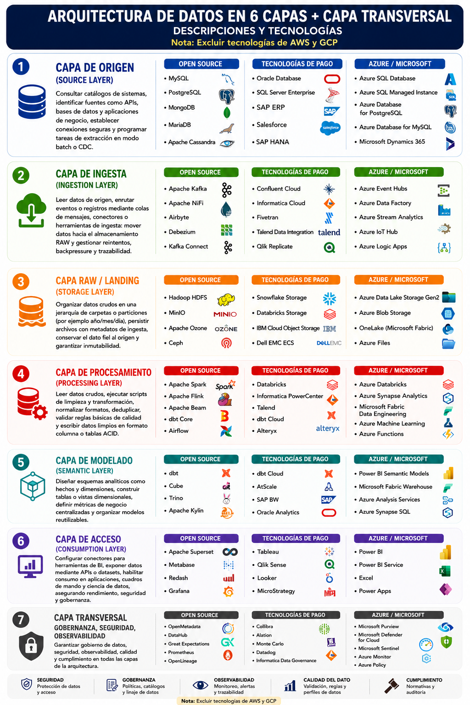

# Arquitectura de Datos en 6 Capas + Capa Transversal

## Tecnologías Open Source, Comerciales y Microsoft/Azure

> **Nota:** Se han excluido tecnologías de AWS y Google Cloud Platform (GCP).

---
 

# 1. CAPA DE ORIGEN (SOURCE LAYER)

## Objetivo

Identificar y acceder a las fuentes de datos originales de la organización.

### Tecnologías Open Source

* MySQL
* PostgreSQL
* MongoDB
* MariaDB
* Apache Cassandra

### Tecnologías Comerciales

* Oracle Database
* SQL Server Enterprise
* SAP ERP
* Salesforce
* SAP HANA

### Servicios Azure / Microsoft

* Azure SQL Database
* Azure SQL Managed Instance
* Azure Database for PostgreSQL
* Azure Database for MySQL
* Microsoft Dynamics 365

 

| Open Source      | Tecnologías de Pago   | Azure / Microsoft             |
| ---------------- | --------------------- | ----------------------------- |
| MySQL            | Oracle Database       | Azure SQL Database            |
| PostgreSQL       | SQL Server Enterprise | Azure SQL Managed Instance    |
| MongoDB          | SAP ERP               | Azure Database for PostgreSQL |
| MariaDB          | Salesforce            | Azure Database for MySQL      |
| Apache Cassandra | SAP HANA              | Microsoft Dynamics 365        |

 

---

# 2. CAPA DE INGESTA (INGESTION LAYER)

## Objetivo

Capturar y transportar datos desde los sistemas origen hacia el almacenamiento central.

### Tecnologías Open Source

* Apache Kafka
* Apache NiFi
* Airbyte
* Debezium
* Kafka Connect

### Tecnologías Comerciales

* Confluent Cloud
* Informatica Cloud
* Fivetran
* Talend Data Integration
* Qlik Replicate

### Servicios Azure / Microsoft

* Azure Event Hubs
* Azure Data Factory
* Azure Stream Analytics
* Azure IoT Hub
* Azure Logic Apps

 

| Open Source   | Tecnologías de Pago     | Azure / Microsoft      |
| ------------- | ----------------------- | ---------------------- |
| Apache Kafka  | Confluent Cloud         | Azure Event Hubs       |
| Apache NiFi   | Informatica Cloud       | Azure Data Factory     |
| Airbyte       | Fivetran                | Azure Stream Analytics |
| Debezium      | Talend Data Integration | Azure IoT Hub          |
| Kafka Connect | Qlik Replicate          | Azure Logic Apps       |

 

---

# 3. CAPA RAW / LANDING (STORAGE LAYER)

## Objetivo

Almacenar los datos en bruto manteniendo su fidelidad respecto al origen.

### Tecnologías Open Source

* Hadoop HDFS
* MinIO
* Apache Ozone
* Ceph

### Tecnologías Comerciales

* Snowflake Storage
* Databricks Storage
* IBM Cloud Object Storage
* Dell EMC ECS

### Servicios Azure / Microsoft

* Azure Data Lake Storage Gen2
* Azure Blob Storage
* Microsoft Fabric OneLake
* Azure Files

 

| Open Source  | Tecnologías de Pago      | Azure / Microsoft            |
| ------------ | ------------------------ | ---------------------------- |
| Hadoop HDFS  | Snowflake Storage        | Azure Data Lake Storage Gen2 |
| MinIO        | Databricks Storage       | Azure Blob Storage           |
| Apache Ozone | IBM Cloud Object Storage | OneLake (Microsoft Fabric)   |
| Ceph         | Dell EMC ECS             | Azure Files                  |

 

---

# 4. CAPA DE PROCESAMIENTO (PROCESSING LAYER)

## Objetivo

Transformar, limpiar y enriquecer los datos para su explotación analítica.

### Tecnologías Open Source

* Apache Spark
* Apache Flink
* Apache Beam
* dbt Core
* Apache Airflow

### Tecnologías Comerciales

* Databricks
* Informatica PowerCenter
* Talend
* dbt Cloud
* Alteryx

### Servicios Azure / Microsoft

* Azure Databricks
* Azure Synapse Analytics
* Microsoft Fabric Data Engineering
* Azure Machine Learning
* Azure Functions

 

| Open Source  | Tecnologías de Pago     | Azure / Microsoft                 |
| ------------ | ----------------------- | --------------------------------- |
| Apache Spark | Databricks              | Azure Databricks                  |
| Apache Flink | Informatica PowerCenter | Azure Synapse Analytics           |
| Apache Beam  | Talend                  | Microsoft Fabric Data Engineering |
| dbt Core     | dbt Cloud               | Azure Machine Learning            |
| Airflow      | Alteryx                 | Azure Functions                   |

 

---

# 5. CAPA DE MODELADO (SEMANTIC LAYER)

## Objetivo

Diseñar modelos analíticos reutilizables orientados al negocio.

### Tecnologías Open Source

* dbt
* Cube
* Trino
* Apache Kylin

### Tecnologías Comerciales

* dbt Cloud
* AtScale
* SAP BW
* Oracle Analytics

### Servicios Azure / Microsoft

* Power BI Semantic Models
* Microsoft Fabric Warehouse
* Azure Analysis Services
* Azure Synapse SQL

 

| Open Source  | Tecnologías de Pago | Azure / Microsoft          |
| ------------ | ------------------- | -------------------------- |
| dbt          | dbt Cloud           | Power BI Semantic Models   |
| Cube         | AtScale             | Microsoft Fabric Warehouse |
| Trino        | SAP BW              | Azure Analysis Services    |
| Apache Kylin | Oracle Analytics    | Azure Synapse SQL          |

 

---

# 6. CAPA DE ACCESO (CONSUMPTION LAYER)

## Objetivo

Proporcionar acceso a los datos mediante informes, cuadros de mando y aplicaciones.

### Tecnologías Open Source

* Apache Superset
* Metabase
* Redash
* Grafana

### Tecnologías Comerciales

* Tableau
* Qlik Sense
* Looker
* MicroStrategy

### Servicios Azure / Microsoft

* Power BI
* Power BI Service
* Microsoft Excel
* Power Apps

 

| Open Source     | Tecnologías de Pago | Azure / Microsoft |
| --------------- | ------------------- | ----------------- |
| Apache Superset | Tableau             | Power BI          |
| Metabase        | Qlik Sense          | Power BI Service  |
| Redash          | Looker              | Excel             |
| Grafana         | MicroStrategy       | Power Apps        |

 

---

# 7. CAPA TRANSVERSAL: GOBERNANZA, SEGURIDAD Y OBSERVABILIDAD

## Objetivo

Garantizar la calidad, seguridad, monitorización y cumplimiento normativo en todas las capas.

### Tecnologías Open Source

* OpenMetadata
* DataHub
* Great Expectations
* Prometheus
* OpenLineage

### Tecnologías Comerciales

* Collibra
* Alation
* Monte Carlo
* Datadog
* Informatica Data Governance

### Servicios Azure / Microsoft

* Microsoft Purview
* Microsoft Defender for Cloud
* Microsoft Sentinel
* Azure Monitor
* Azure Policy

 

| Open Source        | Tecnologías de Pago         | Azure / Microsoft            |
| ------------------ | --------------------------- | ---------------------------- |
| OpenMetadata       | Collibra                    | Microsoft Purview            |
| DataHub            | Alation                     | Microsoft Defender for Cloud |
| Great Expectations | Monte Carlo                 | Microsoft Sentinel           |
| Prometheus         | Datadog                     | Azure Monitor                |
| OpenLineage        | Informatica Data Governance | Azure Policy                 |

 

---

## Funciones de la capa transversal

### Seguridad

* Protección de datos
* Gestión de identidades
* Control de acceso

### Gobernanza

* Catálogo de datos
* Gestión de metadatos
* Linaje de datos

### Observabilidad

* Monitorización
* Alertas
* Auditoría

### Calidad del dato

* Validación
* Perfilado
* Reglas de negocio

### Cumplimiento

* Normativas
* Auditorías
* Retención de datos

 

---

 

### 
