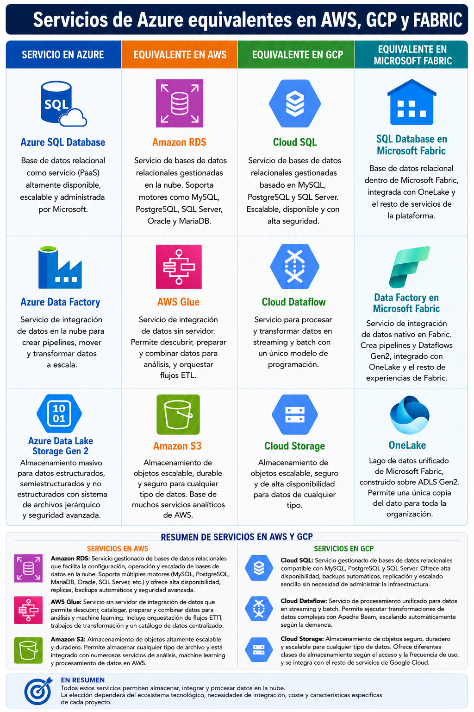

# Soluciones de almacenamiento en Azure

## Actividad 3.1 → Investiga lo siguiente:

> Fabric tiene un servicio llamado Onelake:
>
> ¿Es un data lake? ¿Qué features añade OneLake versus un Data Lake?
> 
> ¿Está basado en ADLS Gen2 o no tienen nada que ver?
> 
> Establece similitudes y diferencias.

### Fabric tiene un servicio llamado Onelake:
### ¿Es un data lake?

Sí, OneLake es el **Data Lake unificado de Microsoft Fabric**.

Proporciona un único repositorio lógico para almacenar datos estructurados, semiestructurados y no estructurados de toda la organización. Su objetivo es centralizar el almacenamiento y facilitar que todos los servicios de Microsoft Fabric trabajen sobre la misma copia de los datos.

OneLake puede considerarse un Data Lake, pero va un paso más allá al estar completamente integrado con todos los servicios de Microsoft Fabric (Data Engineering, Data Factory, Data Warehouse, Power BI, Data Science, Real-Time Intelligence, etc.).

 

### ¿Qué features añade OneLake versus un Data Lake?

Un Data Lake tradicional permite almacenar grandes volúmenes de datos de cualquier tipo. **OneLake añade funcionalidades orientadas a simplificar la administración y el análisis de los datos dentro del ecosistema Microsoft Fabric.**

| Característica                                            | Data Lake tradicional | Microsoft OneLake |
| --------------------------------------------------------- | --------------------- | ----------------- |
| Almacenamiento de datos                                   | ✔️                    | ✔️                |
| Datos estructurados, semiestructurados y no estructurados | ✔️                    | ✔️                |
| Repositorio único para toda la organización               | No necesariamente     | ✔️                |
| Integración nativa con Microsoft Fabric                   | ❌                     | ✔️                |
| Acceso desde Power BI sin configuraciones adicionales     | Limitado              | ✔️                |
| Creación automática de espacios de trabajo (Workspaces)   | ❌                     | ✔️                |
| Accesos directos (Shortcuts) sin copiar datos             | ❌                     | ✔️                |
| Gobierno centralizado de datos                            | Parcial               | ✔️                |
| Experiencia **One Copy** (una única copia del dato)       | ❌                     | ✔️                |

---

 

### ¿Está basado en ADLS Gen2 o no tienen nada que ver?

**Sí, está basado en Azure Data Lake Storage Gen2 (ADLS Gen2).**

Microsoft indica que OneLake está construido sobre **Azure Data Lake Storage Gen2** y utiliza su misma infraestructura de almacenamiento. Por tanto, ambos están directamente relacionados.

OneLake hereda las capacidades de ADLS Gen2, como:

* almacenamiento altamente escalable;
* organización jerárquica de carpetas;
* compatibilidad con formatos como Parquet, Delta Lake, CSV y JSON;
* seguridad mediante Microsoft Entra ID;
* alta disponibilidad y redundancia.

Sobre esta infraestructura, Microsoft añade las funcionalidades propias de Fabric, como la integración entre servicios, los **Shortcuts**, el acceso unificado a los datos y la experiencia **One Copy**.

---

 

### Establece similitudes y diferencias
---

### Similitudes

| Similitudes                                    | OneLake | ADLS Gen2 |
| ---------------------------------------------- | :-----: | :-------: |
| Almacenan grandes volúmenes de datos           |    ✔️   |     ✔️    |
| Admiten cualquier tipo de archivo              |    ✔️   |     ✔️    |
| Escalan prácticamente sin límite               |    ✔️   |     ✔️    |
| Utilizan una estructura jerárquica de carpetas |    ✔️   |     ✔️    |
| Son adecuados para Big Data y Analítica        |    ✔️   |     ✔️    |
| Soportan formatos como Parquet y Delta Lake    |    ✔️   |     ✔️    |

 

### Diferencias

| OneLake                                                              | Azure Data Lake Storage Gen2                                                                       |
| -------------------------------------------------------------------- | -------------------------------------------------------------------------------------------------- |
| Forma parte de Microsoft Fabric.                                     | Es un servicio independiente de Azure.                                                             |
| Se crea automáticamente al utilizar Fabric.                          | Debe crearse y administrarse manualmente.                                                          |
| Proporciona un único Data Lake para toda la organización.            | Cada cuenta de almacenamiento es independiente.                                                    |
| Incluye **Shortcuts** para acceder a datos sin duplicarlos.          | No dispone de Shortcuts de forma nativa.                                                           |
| Integración directa con todos los servicios de Microsoft Fabric.     | Requiere configurar las conexiones entre servicios.                                                |
| Ofrece una experiencia unificada para analítica y gobierno del dato. | Proporciona la infraestructura de almacenamiento sobre la que se construyen soluciones analíticas. |

 

## Actividad 3.2 → Equivalente de ADF en Fabric

> Fabric tiene un componente que se llama Data Factory. 
> Define y explica que es Data Factory.
> 
> ¿Es lo mismo que ADF?
> 
> Establece similitudes y diferencias y redacta tus conclusiones.
> 
> ¿Podría desde Fabric conectarme a datos En Azure/AWS/GCP?
> 
> ¿De qué formas se puede hacer esto y cuál sería la utilidad?

---

### Fabric tiene un componente que se llama Data Factory. 
### Define y explica qué es Data Factory

**Microsoft Fabric Data Factory** es el servicio de integración de datos de Microsoft Fabric. Permite conectar diferentes orígenes de datos, moverlos, transformarlos y orquestar procesos de integración mediante flujos de datos (Dataflows Gen2) y pipelines.

Su objetivo es facilitar la creación de procesos ETL (Extract, Transform, Load) y ELT (Extract, Load, Transform), integrando datos procedentes de múltiples fuentes para su posterior análisis dentro de Microsoft Fabric.

Entre sus principales funcionalidades destacan:

* Conexión a numerosas fuentes de datos locales y en la nube.
* Creación de pipelines para automatizar procesos.
* Transformación de datos mediante Dataflows Gen2.
* Programación y monitorización de tareas.
* Integración con OneLake y el resto de servicios de Microsoft Fabric.

---

 

## ¿Es lo mismo que ADF (Azure Data Factory)?

**No.**

Microsoft Fabric Data Factory está basado en la tecnología de Azure Data Factory y comparte gran parte de sus funcionalidades, pero está completamente integrado dentro del ecosistema de Microsoft Fabric.

Mientras que Azure Data Factory es un servicio independiente de Azure, Data Factory forma parte de una plataforma unificada donde todos los servicios comparten el mismo almacenamiento (OneLake) y la misma experiencia de usuario.

---

 

### Establece similitudes y diferencias y redacta tus conclusiones
---
### Similitudes

| Característica                | Azure Data Factory | Fabric Data Factory |
| ----------------------------- | :----------------: | :-----------------: |
| Creación de pipelines         |         ✔️         |          ✔️         |
| Integración de datos          |         ✔️         |          ✔️         |
| Procesos ETL y ELT            |         ✔️         |          ✔️         |
| Amplio catálogo de conectores |         ✔️         |          ✔️         |
| Automatización y programación |         ✔️         |          ✔️         |
| Monitorización de ejecuciones |         ✔️         |          ✔️         |

 

### Diferencias

| Fabric Data Factory                                                 | Azure Data Factory                                           |
| ------------------------------------------------------------------- | ------------------------------------------------------------ |
| Forma parte de Microsoft Fabric.                                    | Servicio independiente de Azure.                             |
| Utiliza OneLake como almacenamiento unificado.                      | Trabaja con diferentes servicios de almacenamiento de Azure. |
| Integración nativa con Power BI, Data Engineering y Data Warehouse. | Requiere configurar la integración con otros servicios.      |
| Experiencia unificada dentro de Fabric.                             | Administración independiente desde Azure Portal.             |
| Pensado para proyectos analíticos en Fabric.                        | Pensado para integración de datos en Azure en general.       |

---

 

### Conclusiones

Fabric Data Factory no sustituye a Azure Data Factory, sino que representa su evolución dentro del entorno Microsoft Fabric. Ambos ofrecen capacidades muy similares para integrar y mover datos, pero Fabric Data Factory simplifica el trabajo al integrarse de forma nativa con OneLake y con el resto de servicios de Fabric. Si toda la solución analítica se desarrolla en Microsoft Fabric, Data Factory resulta la opción más sencilla y eficiente.

---

 

### ¿Podría desde Fabric conectarme a datos en Azure, AWS o GCP?

**Sí.**

Microsoft Fabric permite conectarse a datos almacenados tanto en Azure como en otras plataformas cloud, incluyendo AWS y Google Cloud Platform (GCP), además de bases de datos locales y aplicaciones SaaS.

Esto facilita la creación de soluciones de análisis sobre datos distribuidos en diferentes entornos sin necesidad de centralizarlos previamente.

---

 

### ¿De qué formas se puede hacer esto y cuál sería la utilidad?

Microsoft Fabric ofrece varias formas de acceder a datos externos:

* **Conectores nativos**, que permiten acceder directamente a bases de datos, servicios cloud y aplicaciones empresariales.
* **Pipelines de Data Factory**, para copiar y mover datos entre diferentes sistemas.
* **Dataflows Gen2**, para transformar e integrar datos mediante una interfaz gráfica.
* **Shortcuts de OneLake**, que permiten acceder a datos almacenados en otros servicios sin duplicarlos físicamente.
* **APIs y conectores estándar (ODBC, JDBC, REST)** para integrar aplicaciones y fuentes de datos adicionales.

#### Utilidad

Estas opciones permiten integrar información procedente de múltiples plataformas en un único entorno analítico. De esta forma, una organización puede combinar datos de Azure, AWS, GCP, bases de datos locales o aplicaciones SaaS para realizar análisis, crear modelos de datos, desarrollar cuadros de mando en Power BI o entrenar modelos de Inteligencia Artificial, todo ello desde Microsoft Fabric.

---

 

## Actividad 3.3 Servicios equivalentes en AWS y GCP.

> En una infografía estilo tabla comparativa coloca los equivalentes de AWS, GCP y Fabric de estos servicios de Azure:
> 
> - Azure SQL Database
> - Azure Data Factory
> - Azure Data Lake Storage Gen 2
> 
> La tabla debe contener el logo/icono identificativo de cada servicio.
>
> Al final de la tabla comparativa escribe un resumen de cada servicio de AWS y GCP que has puesto en la tabla.

### Tabla comparativa de los equivalentes de AWS, GCP y Fabric de estos servicios de Azure:
- ### Azure SQL Database
- ### Azure Data Factory
- ### Azure Data Lake Storage Gen 2

 

