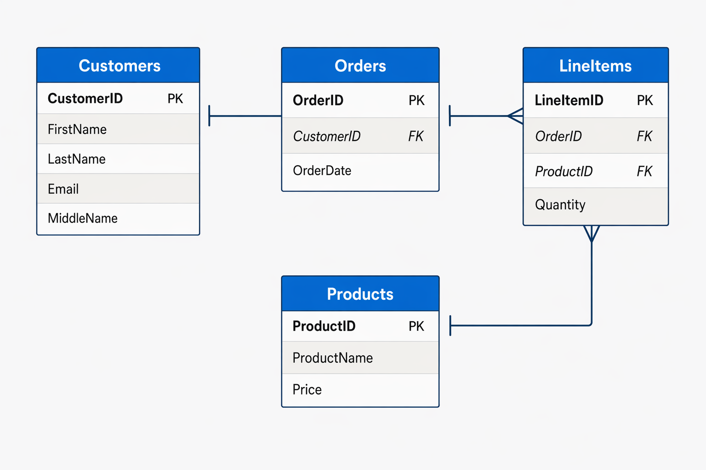

# Introducción a los datos relacionales de Microsoft Azure Data en Azure
Ruta de aprendizaje - 2 módulos

Los datos relacionales son el núcleo de la mayoría de las aplicaciones empresariales y la base sobre la que se han creado muchas soluciones de datos empresariales. Microsoft Azure proporciona servicios para administrar bases de datos relacionales, lo que le permite crear nuevas aplicaciones o migrar las existentes a la nube. Esta ruta de aprendizaje le ayudará a prepararse para obtener la certificación [Azure Data Fundamentals](https://learn.microsoft.com/es-es/credentials/certifications/azure-data-fundamentals/?azure-portal=true&practice-assessment-type=certification).

## Exploración de conceptos fundamentales de datos relacionales

Los sistemas de bases de datos relacionales son una manera común de almacenar y administrar datos transaccionales y analíticos en organizaciones de cualquier tamaño de todo el mundo.

Objetivos de aprendizaje
En este módulo aprenderá a:
- Identificación de las características de los datos relacionales.
- Definición de normalización.
- Identificación de los tipos de instrucción SQL.
- Identificación de objetos de base de datos relacionales comunes.

<br>

---

### Introducción

Cuando se empezaron a usar los sistemas informáticos, cada aplicación almacenaba los datos en su propia estructura, que era única. Cuando los desarrolladores querían crear aplicaciones para usar esos datos, necesitaban mucha información sobre la estructura de datos en particular para encontrar los que necesitaban. Estas estructuras de datos eran ineficaces, costosas de mantener y difíciles de optimizar para que la aplicación tuviera un buen rendimiento. El modelo de base de datos relacional se diseñó para resolver el problema de varias estructuras de datos arbitrarias. El modelo relacional proporciona una forma estándar de representar y consultar datos que cualquier aplicación puede usar. Una de las principales ventajas del modelo de base de datos relacional es su uso de tablas, que son una manera intuitiva, eficaz y flexible de almacenar y acceder a la información estructurada.

El modelo relacional, sencillo pero eficaz, se usa en organizaciones de todo tipo y tamaño para satisfacer diferentes necesidades de administración de la información. Las bases de datos relacionales se utilizan para realizar un seguimiento de los inventarios, procesar transacciones de comercio electrónico, administrar grandes cantidades de información de clientes críticos y mucho más. Las bases de datos relacionales son útiles para almacenar cualquier información que contenga elementos de datos relacionados que se deban organizar en una estructura coherente y basada en reglas.

En este módulo, obtendrá información sobre las características clave de las bases de datos relacionales y explorará las estructuras de datos relacionales.

<br>

---

### Comprender los datos relacionales

En una base de datos relacional, modela colecciones de entidades del mundo real como tablas. Una entidad puede ser cualquier cosa para la que desee registrar información; Normalmente, los objetos y eventos importantes. Por ejemplo, en un ejemplo de sistema minorista, puede crear tablas para clientes, productos, pedidos y artículos de línea dentro de un pedido. Una tabla contiene filas y cada fila representa una sola instancia de una entidad. En el escenario comercial, cada fila de la tabla de clientes contiene los datos de un solo cliente, cada fila de la tabla de productos define un único producto, cada fila de la tabla de pedidos representa un pedido realizado por un cliente y cada fila de la tabla de elementos de línea representa un producto incluido en un pedido.



Las tablas relacionales son un formato para los datos estructurados y cada fila de una tabla tiene las mismas columnas; aunque en algunos casos, no todas las columnas necesitan tener un valor; por ejemplo, una tabla de cliente podría incluir una columna MiddleName ; que puede estar vacío (o NULL) para las filas que representan a los clientes sin nombre intermedio o cuyo nombre intermedio es desconocido.

Cada columna almacena datos de un tipo de datos específico. Por ejemplo, es probable que una columna Correo electrónico de una tabla Customer se defina para almacenar datos basados en caracteres (texto) (que podrían ser fijos o variables de longitud), una columna Price de una tabla Product podría definirse para almacenar datos numéricos decimales, mientras que una columna Quantity de una tabla Order podría restringirse a valores numéricos enteros; y una columna OrderDate en la misma tabla Order se definiría para almacenar valores de fecha y hora. Los tipos de datos disponibles que puede usar al definir una tabla dependen del sistema de base de datos que use; aunque hay tipos de datos estándar definidos por el American National Standards Institute (ANSI) que son compatibles con la mayoría de los sistemas de base de datos.

<br>

---

### Comprensión de la normalización

La normalización es un término que usan los profesionales de bases de datos para un proceso de diseño de esquemas que minimiza la duplicación de datos y exige la integridad de los datos.

Aunque hay muchas reglas complejas que definen el proceso de refactorización de datos en varios niveles (o formas) de normalización, una definición sencilla con fines prácticos es:
1. Separar cada entidad en su propia tabla.
2. Separe cada atributo discreto en su propia columna.
3. Identifique de forma única cada instancia de entidad (fila) mediante una clave principal.
4. Use columnas de clave externa para vincular entidades relacionadas.

Para comprender los principios básicos de la normalización, supongamos que la tabla siguiente representa una hoja de cálculo que una empresa usa para realizar un seguimiento de sus ventas.

| N.º de pedido | NombreDelCliente | CustomerAddress | ProductName | Precio por Unidad | Cant. |
|---------------|------------------|-----------------|-------------|-------------------|--------|
| 1 | Jane Smith | 42 Oak St. Seattle | Widget A | 9.99 | 2 |
| 1 | Jane Smith | 42 Oak St. Seattle | Widget B | 4.49 | 1 |
| 2 | Bob Jones | 18 Pine Ave Portland | Widget A | 9.99 | 5 |
| 2 | Bob Jones | 18 Pine Ave Portland | Gadget X | 24.99 | 1 |
| 3 | Jane Smith | 42 Oak St. Seattle | Gadget X | 24.99 | 3 |
| 3 | Jane Smith | 42 Oak St. Seattle | Widget B | 4.49 | 2 |

<br>

Observe que los detalles del cliente y del producto se duplican para cada artículo individual vendido; y que el nombre del cliente y la dirección postal, y el nombre y el precio del producto se combinan en las mismas celdas de hoja de cálculo.

Ahora veamos cómo cambia la normalización de la forma en que se almacenan los datos.


Cada entidad representada en los datos (cliente, producto, pedido de ventas y elemento de línea) se almacena en su propia tabla y cada atributo discreto de esas entidades se encuentra en su propia columna.

La grabación de cada instancia de una entidad como una fila en una tabla específica de la entidad quita la duplicación de datos. Por ejemplo, para cambiar la dirección de un cliente, solo necesita modificar el valor en una sola fila.

La descomposición de los atributos en columnas individuales garantiza que cada valor esté restringido a un tipo de datos adecuado; por ejemplo, los precios del producto muSt.be valores decimales, mientras que las cantidades de elementos de línea muSt.be números enteros. Además, la creación de columnas individuales proporciona un nivel útil de granularidad en los datos para realizar consultas; por ejemplo, puede filtrar fácilmente a los clientes a aquellos que viven en una ciudad específica.

Las instancias de cada entidad se identifican de forma única mediante un identificador u otro valor de clave, conocido como clave principal; y cuando una entidad hace referencia a otra (por ejemplo, un pedido tiene un cliente asociado), la clave principal de la entidad relacionada se almacena como una clave externa. Puede buscar la dirección del cliente (que se almacena solo una vez) para cada registro de la tabla Order haciendo referencia al registro correspondiente en la tabla Customer . Normalmente, un sistema de administración de bases de datos relacionales (RDBMS) puede aplicar integridad referencial para asegurarse de que un valor especificado en un campo de clave externa tiene una clave principal correspondiente existente en la tabla relacionada; por ejemplo, evitar pedidos para clientes inexistentes.

En algunos casos, una clave (principal o externa) se puede definir como una clave compuesta basada en una combinación única de varias columnas. Por ejemplo, la tabla LineItem del ejemplo anterior usa una combinación única de OrderNo y ItemNo para identificar un elemento de línea de un pedido individual.

<br>

---

### Exploración de SQL

SQL significa Lenguaje de consulta estructurado y se usa para comunicarse con una base de datos relacional. Es el lenguaje estándar para los sistemas de administración de bases de datos relacionales. Las instrucciones SQL se usan para realizar tareas como actualizar o recuperar datos de una base de datos. Algunos sistemas comunes de administración de bases de datos relacionales que usan SQL incluyen Microsoft SQL Server, Azure SQL Database, Azure SQL Managed Instance, SQL Server en Azure Virtual Machines, MySQL, PostgreSQL, y Oracle.

>  Nota:
>
> SQL fue normalizado originalmente por el American National Standards Institute (ANSI) en 1986, y por la Organización Internacional de Normalización (ISO) en 1987. Desde entonces, el estándar se ha ampliado varias veces, ya que los proveedores de bases de datos relacionales han agregado nuevas características a sus sistemas. Además, la mayoría de los proveedores de bases de datos incluyen sus propias extensiones propietarias que no forman parte del estándar, lo que ha dado lugar a una variedad de dialectos de SQL.

Puede usar instrucciones SQL como SELECT, INSERT, UPDATE, DELETE, CREATE y DROP para lograr casi todo lo que necesita hacer con una base de datos. Aunque estas instrucciones SQL forman parte del estándar SQL, muchos sistemas de administración de bases de datos también tienen sus propias extensiones propietarias adicionales para controlar los detalles de ese sistema de administración de bases de datos. Estas extensiones proporcionan una funcionalidad que no se incluye en el estándar de SQL y contienen áreas como la administración de la seguridad y la capacidad de programación. Por ejemplo, Microsoft SQL Server y los servicios de base de datos de Azure que se basan en el motor de base de datos de SQL Server usan Transact-SQL. Esta implementación incluye extensiones propietarias para escribir procedimientos almacenados y desencadenadores (código de aplicación que se puede almacenar en la base de datos) y administrar cuentas de usuario. PostgreSQL y MySQL también tienen sus propias versiones de estas características.

Algunos dialectos populares de SQL incluyen:
- Transact-SQL (T-SQL). Esta versión de SQL la usan Microsoft SQL Server, Azure SQL Database, Azure SQL Managed Instance y SQL Server en Azure Virtual Machines.

- pgSQL. Este es el dialecto, con extensiones implementadas en PostgreSQL.

- PL/SQL. Este es el dialecto utilizado por Oracle. PL/SQL significa Lenguaje de procedimientos/SQL.

Los usuarios que planean trabajar específicamente con un único sistema de base de datos deben aprender las complejidades de sus dialectos y plataformas SQL preferidos.

>  Nota:
> 
> Azure SQL Database incluye características de inteligencia artificial que puede usar para escribir y comprender las consultas SQL mediante lenguaje natural.

 > Nota:
> 
> Los ejemplos de código SQL de este módulo se basan en el dialecto Transact-SQL, a menos que se indique lo contrario. La sintaxis de otros dialectos suele ser similar, pero puede variar en algunos detalles.

#### Tipos de instrucciones SQL
Las instrucciones SQL se agrupan en tres grupos lógicos principales:

- Lenguaje de definición de datos (DDL)
- Lenguaje de control de datos (DCL)
- Lenguaje de manipulación de datos (DML)

#### Instrucciones DDL
Las instrucciones DDL se usan para crear, modificar y quitar tablas y otros objetos de una base de datos (tabla, procedimientos almacenados, vistas, etc.).

Las instrucciones de DDL más habituales son las siguientes:

| Declaración | Descripción |
|-------------|-------------|
| CREATE | Cree un nuevo objeto en la base de datos, como una tabla o una vista. |
| ALTER | Modifique la estructura de un objeto. Por ejemplo, modificar una tabla para agregar una nueva columna. |
| DROP | Quite un objeto de la base de datos. |
| RENAME | Cambie el nombre de un objeto existente. |

>  Advertencia
> 
> La instrucción DROP es muy potente. Al eliminar una tabla, se pierden todas las filas de esa tabla. A menos que tenga una copia de seguridad, no podrá recuperar estos datos.

En el ejemplo siguiente se crea una nueva tabla de base de datos. Los elementos entre paréntesis especifican los detalles de cada columna, incluido el nombre, el tipo de datos, si la columna siempre debe contener un valor (NOT NULL) y si los datos de la columna se usan para identificar de forma única una fila (CLAVE PRINCIPAL). Cada tabla debe tener una clave principal, aunque SQL no aplica esta regla.

>  Nota:
> 
> Las columnas marcadas como NOT NULL se conocen como columnas obligatorias . Si omite la cláusula NOT NULL , puede crear filas que no contengan un valor en la columna. Se dice que una columna vacía de una fila tiene un valor NULL.


SQL
```sql
CREATE TABLE Product
(
    ID INT PRIMARY KEY,
    Name VARCHAR(20) NOT NULL,
    Price DECIMAL NULL
);
```

Los tipos de datos disponibles para las columnas de una tabla variarán entre los sistemas de administración de bases de datos. Sin embargo, la mayoría de los sistemas de administración de bases de datos admiten tipos numéricos como INT (un número entero o entero), DECIMAL (un número decimal) y tipos de cadena como VARCHAR (VARCHAR significa datos de caracteres de longitud variable). Para obtener más información, consulte la documentación del sistema de administración de bases de datos seleccionado.

#### Instrucciones DCL

Los administradores de bases de datos suelen usar instrucciones DCL para administrar el acceso a objetos de una base de datos concediéndoles, denegando o revocando permisos a usuarios o grupos específicos.

Las tres instrucciones DCL principales son:

| Declaración | Descripción |
|-------------|-------------|
| GRANT | Concesión de permiso para realizar acciones específicas |
| DENY | Denegar permiso para realizar acciones específicas |
| REVOKE | Quitar un permiso concedido previamente |

Por ejemplo, la siguiente instrucción GRANT permite a un usuario denominado user1 leer, insertar y modificar datos en la tabla Product .


SQL
```sql
GRANT SELECT, INSERT, UPDATE
ON Product
TO user1;
```

#### Instrucciones DML

Las instrucciones DML se usan para manipular las filas de las tablas. Estas instrucciones permiten recuperar (consultar) datos, insertar nuevas filas o modificar filas existentes. También puede eliminar filas si ya no las necesita.

Las cuatro instrucciones DML principales son:

| Declaración | Descripción |
|-------------|-------------|
| SELECT | Leer filas de una tabla |
| INSERT | Insertar nuevas filas en una tabla |
| UPDATE | Modificación de datos en filas existentes |
| DELETE | Eliminación de filas existentes |

La forma básica de una instrucción INSERT insertará una fila cada vez. De forma predeterminada, las instrucciones SELECT, UPDATE y DELETE se aplican a todas las filas de una tabla. Normalmente, se aplica una cláusula WHERE con estas instrucciones para especificar criterios; solo se seleccionarán, actualizarán o eliminarán las filas que coincidan con estos criterios.

>  Advertencia
> 
> SQL no proporciona avisos de confirmación ¿está seguro?, por lo que debe tener cuidado al usar DELETE o UPDATE sin una cláusula WHERE, ya que puede perder o modificar una gran cantidad de datos.

El código siguiente es un ejemplo de una instrucción SQL que selecciona todas las columnas (indicadas por *) de la tabla Customer donde el valor de la columna City es "Seattle":

SQL
```sql
SELECT *
FROM Customer
WHERE City = 'Seattle';
```

Para recuperar solo un subconjunto específico de columnas de la tabla, los enumere en la cláusula SELECT , de la siguiente manera:

SQL
```sql
SELECT FirstName, LastName, Address, City
FROM Customer
WHERE City = 'Seattle';
```

Si una consulta devuelve muchas filas, no aparecen necesariamente en ninguna secuencia específica. Si desea ordenar los datos, puede agregar una cláusula ORDER BY . Los datos se ordenarán mediante la columna especificada:

SQL
```sql
SELECT FirstName, LastName, Address, City
FROM Customer
WHERE City = 'Seattle'
ORDER BY LastName;
```

También puede ejecutar instrucciones SELECT que recuperan datos de varias tablas mediante una cláusula JOIN . Las combinaciones indican cómo se conectan las filas de una tabla con las filas de la otra para determinar qué datos se van a devolver. Una condición de combinación típica empareja una clave foránea de una tabla con su clave principal asociada en la otra tabla.

En la consulta siguiente se muestra un ejemplo que combina las tablas Customer y Order . La consulta usa alias de tabla para abreviar los nombres de tabla al especificar qué columnas se van a recuperar en la cláusula SELECT y qué columnas deben coincidir en la cláusula JOIN.

SQL
```sql
SELECT o.OrderNo, o.OrderDate, c.Address, c.City
FROM Order AS o
JOIN Customer AS c
ON o.Customer = c.ID
```

En el ejemplo siguiente se muestra cómo modificar una fila existente mediante SQL. Cambia el valor de la columna Dirección de la tabla Customer para las filas que tienen el valor 1 en la columna ID . Todas las demás filas se dejan sin cambios:

SQL
```sql
UPDATE Customer
SET Address = '123 High St.'
WHERE ID = 1;
```

>  Advertencia
> 
> Si omite la cláusula WHERE , una instrucción UPDATE modificará todas las filas de la tabla.

Use la instrucción DELETE para quitar filas. Especifique la tabla de la que se va a eliminar y una cláusula WHERE que identifique las filas que se van a eliminar:

SQL
```sql
DELETE FROM Product
WHERE ID = 162;
```

>  Advertencia
> 
> Si omite la cláusula WHERE , una instrucción DELETE quitará todas las filas de la tabla.

La instrucción INSERT toma una forma ligeramente diferente. Especifique una tabla y columnas en una cláusula INTO y una lista de valores que se almacenarán en estas columnas. SQL estándar solo admite la inserción de una fila a la vez, como se muestra en el ejemplo siguiente. Algunos dialectos permiten especificar varias cláusulas VALUES para agregar varias filas a la vez:

SQL
```sql
INSERT INTO Product(ID, Name, Price)
VALUES (99, 'Drill', 4.99);
```

> Nota:
>
> En este tema se describen algunas instrucciones SQL básicas y la sintaxis para ayudarle a comprender cómo se usa SQL para trabajar con objetos de una base de datos. Si desea obtener más información sobre cómo consultar datos con SQL, consulte la ruta de aprendizaje Introducción a las consultas con Transact-SQL en Microsoft Learn.

<br>

---

### Descripción de objetos de base de datos

Además de las tablas, una base de datos relacional puede contener otras estructuras que ayudan a optimizar la organización de los datos, encapsular acciones mediante programación y mejorar la velocidad de acceso. En esta unidad, obtendrá información sobre tres de estas estructuras con más detalle: vistas, procedimientos almacenados e índices.

#### ¿Qué es una vista?

Una vista es una tabla virtual basada en los resultados de una consulta SELECT . Podría decirse que una vista es como una ventana que muestra unas filas concretas de una o varias tablas subyacentes. Por ejemplo, podría crear una vista en las tablas Order y Customer que recuperan los datos del pedido y del cliente para proporcionar un único objeto que facilita la determinación de las direcciones de entrega de los pedidos:

SQL
```sql
CREATE VIEW Deliveries
AS
SELECT o.OrderNo, o.OrderDate,
       c.FirstName, c.LastName, c.Address, c.City
FROM Order AS o JOIN Customer AS c
ON o.Customer = c.ID;
```


Puede consultar la vista y filtrar los datos de la misma forma que una tabla. La consulta siguiente busca detalles de los pedidos de los clientes que viven en Seattle:

SQL
```sql
SELECT OrderNo, OrderDate, LastName, Address
FROM Deliveries
WHERE City = 'Seattle';
```

#### ¿Qué es un procedimiento almacenado?

Un procedimiento almacenado define instrucciones SQL que se pueden ejecutar a petición. Los procedimientos almacenados se usan para encapsular la lógica de programación en una base de datos para las acciones que las aplicaciones deben realizar al trabajar con datos.

Puede definir un procedimiento almacenado con parámetros a fin de crear una solución flexible para las acciones comunes que podrían tener que aplicarse a los datos en función de una clave o criterios específicos. Por ejemplo, se podría definir el siguiente procedimiento almacenado para cambiar el nombre de un producto en función del identificador de producto especificado.

SQL
```sql
CREATE PROCEDURE RenameProduct
	@ProductID INT,
	@NewName VARCHAR(20)
AS
UPDATE Product
SET Name = @NewName
WHERE ID = @ProductID;
```

Cuando haya que cambiar el nombre de un producto, puede ejecutar el procedimiento almacenado y pasar el identificador del producto y el nuevo nombre que se va a asignar:

SQL
```sql
EXEC RenameProduct 201, 'Spanner';
```

#### ¿Qué es un índice?

Un índice le ayuda a buscar datos en una tabla. Piense en un índice sobre una tabla como en el índice al final de un libro. El índice de un libro contiene un conjunto ordenado de entradas, con las páginas en las que aparece cada una. Cuando quieras encontrar una referencia a un elemento del libro, la buscas en el índice. Puede usar los números de página del índice para ir directamente a las páginas correctas del libro. Sin el índice, es posible que tenga que leer todo el libro para encontrar el contenido que está buscando.

Cuando se crea un índice en una base de datos, se especifica una columna de la tabla; el índice contiene una copia de estos datos con un criterio de ordenación y punteros a las filas correspondientes de la tabla. Cuando el usuario ejecuta una consulta que especifica esta columna en la cláusula WHERE , el sistema de administración de bases de datos puede usar este índice para capturar los datos más rápidamente que si tuviera que examinar toda la fila de tabla por fila.

Por ejemplo, puede usar el código siguiente para crear un índice en la columna Nombre de la tabla Product :

SQL
```sql
CREATE INDEX idx_ProductName
ON Product(Name);
```

El índice crea una estructura basada en árbol que el optimizador de consultas del sistema de base de datos puede usar para buscar rápidamente filas en la tabla Product en función de un nombre especificado.


Para una tabla que contiene pocas filas, el uso del índice probablemente no sea más eficaz que simplemente leer toda la tabla y buscar las filas solicitadas por la consulta (en cuyo caso, el optimizador de consultas omitirá el índice). Pero cuando una tabla tiene muchas filas, los índices pueden mejorar drásticamente el rendimiento de las consultas.

Puede crear muchos índices en una tabla. Por lo tanto, si también desea encontrar productos basados en el precio, crear otro índice en la columna Precio de la tabla Producto podría ser útil. Sin embargo, los índices no son gratuitos. Un índice consume espacio de almacenamiento y, cada vez que inserte datos en una tabla, los actualice o los elimine, tendrá que hacer el mantenimiento de sus índices. Este trabajo adicional puede ralentizar las operaciones de inserción, actualización y eliminación. Debe conseguir un equilibrio entre tener índices que aceleren las consultas y el coste de realizar otras operaciones.

<br>

---

### Resumen

Las bases de datos relacionales son una manera común de que las aplicaciones transaccionales almacenen y administren datos. Constan de un esquema de tablas, que están vinculados a través de valores de clave comunes. Use SQL para consultar y manipular los datos de las tablas y puede enriquecer la base de datos mediante la creación de objetos como vistas, procedimientos almacenados e índices.

En este módulo ha aprendido a:
- Identificación de características de datos relacionales
- Definición de la normalización
- Identificación de tipos de instrucción SQL
- Identificación de objetos de base de datos relacionales comunes

<br>

---
---

## Exploración de los servicios de bases de datos relacionales en Azure

Microsoft Azure proporciona varios servicios para bases de datos relacionales. Puede elegir el sistema de administración de bases de datos relacionales que mejor se adapte a sus necesidades y hospedar datos relacionales en la nube.

### Objetivos de aprendizaje
En este módulo aprenderá a:
- Identificar las opciones para los servicios de Azure SQL.
- Identifique las opciones para las bases de datos de código abierto en Azure.
- Aprovisionar un servicio de base de datos en Azure.

<br>

---

### Introducción

Azure admite varios servicios de base de datos, lo que permite ejecutar en la nube diversos sistemas de administración de bases de datos relacionales conocidos, por ejemplo, SQL Server, PostgreSQL y MySQL.

La mayoría de Azure servicios de base de datos están totalmente administrados, por lo que no es necesario controlar el mantenimiento de la infraestructura. Incluyen alta disponibilidad integrada y admiten el escalado a la distribución global. Azure los servicios de base de datos también proporcionan características de seguridad como la supervisión automática y la detección de amenazas, así como el ajuste automático del rendimiento.

En este módulo, explorará las opciones disponibles para los servicios de bases de datos relacionales en Azure.

> Nota:
>
> Reconocemos que a diferentes personas les gusta aprender de diferentes maneras. Puede optar por completar este módulo en formato basado en vídeo o puede leer el contenido como texto e imágenes. El texto contiene más detalle que los vídeos, por lo que, en algunos casos, es posible que desee hacer referencia a él como material complementario para la presentación de vídeo.

<br>

---

### Descripción de los servicios y las capacidades de Azure SQL

Azure SQL es un término colectivo para referirse a una familia de servicios de base de datos basados en Microsoft SQL Server en Azure. Los servicios específicos de Azure SQL incluyen los siguientes:

- **SQL Server en Azure Virtual Machines (VMs)** - Una máquina virtual que se ejecuta en Azure con SQL Server instalado. El uso de una máquina virtual convierte esta opción en una solución de infraestructura como servicio (IaaS) que permite virtualizar la infraestructura de hardware para proceso, almacenamiento y redes en Azure. Por este motivo, se trata de una opción excelente para la migración lift-and-shift de instalaciones locales de SQL Server a la nube.

- **Azure SQL Managed Instance**: una opción de plataforma como servicio (PaaS) que proporciona una compatibilidad casi completa con instancias de SQL Server locales y permite abstraer el hardware y el sistema operativo subyacentes. Este servicio incluye administración automatizada de actualizaciones de software, copias de seguridad y otras tareas de mantenimiento, lo que reduce la carga administrativa que supone admitir una instancia de servidor de bases de datos.

- **Azure SQL Database** : un servicio de base de datos PaaS totalmente administrado y altamente escalable diseñado para la nube. Este servicio incluye las principales capacidades de base de datos de SQL Server local y es una buena opción cuando hay que crear una aplicación en la nube.

#### **Comparación de los servicios de Azure SQL**

| Característica | SQL Server en Máquinas virtuales de Azure | Azure SQL Managed Instance | Azure SQL Database |
|----------------|------------------------------------------|----------------------------|--------------------|
| Imagen |  |  |  |
| Tipo de servicio en la nube | IaaS | PaaS (Plataforma como Servicio) | PaaS (Plataforma como Servicio) |
| Compatibilidad con SQL Server | Es totalmente compatible con instalaciones físicas y virtualizadas locales. Las aplicaciones y bases de datos se pueden migrar fácilmente usando el método *lift-and-shift* y sin cambios. | Es casi completamente compatible con SQL Server. La mayoría de las bases de datos locales se pueden migrar con cambios mínimos de código mediante Azure Database Migration Service. | Admite la mayoría de las funcionalidades básicas de base de datos de SQL Server. Es posible que algunas características de las que dependa una aplicación local no estén disponibles. |
| Arquitectura | Las instancias de SQL Server se instalan en una máquina virtual. Cada instancia puede admitir varias bases de datos. | Cada instancia administrada puede admitir varias bases de datos. Además, los grupos de instancias se pueden usar para compartir recursos de forma eficaz entre instancias más pequeñas. | Puede aprovisionar una base de datos única en un servidor dedicado administrado (lógico) o utilizar un grupo elástico para compartir recursos entre varias bases de datos y aprovechar la escalabilidad a petición. |
| Disponibilidad | 99,99 % | 99,99 % | 99,995 % |
| Administración | Debe administrar todos los aspectos del servidor, incluidos el sistema operativo y SQL Server, la configuración, las copias de seguridad y otras tareas de mantenimiento. | Actualizaciones, copias de seguridad y recuperación totalmente automatizados. | Actualizaciones, copias de seguridad y recuperación totalmente automatizados. |
| Casos de uso | Use esta opción cuando necesite migrar o ampliar una solución de SQL Server local y conservar el control total sobre todos los aspectos de la configuración del servidor y la base de datos. | Use esta opción para la mayoría de los escenarios de migración a la nube, especialmente cuando necesite cambios mínimos en las aplicaciones existentes. | Use esta opción para nuevas soluciones en la nube o para migrar aplicaciones que tengan dependencias mínimas de instancia. |
---

<br>

#### **SQL Server en Azure Virtual Machines**

SQL Server en Virtual Machines le permite usar versiones completas de SQL Server en la nube sin tener que administrar ningún hardware local. Este es un ejemplo del enfoque de IaaS.

Al ejecutar SQL Server en una máquina virtual de Azure, se replica la base de datos que se ejecuta en un hardware local real. La migración desde el sistema local a una máquina virtual de Azure no es diferente a migrar las bases de datos de un servidor local a otro.

Este enfoque es adecuado para las migraciones y aplicaciones que requieren acceso a características del sistema operativo que podrían no admitirse en el nivel de PaaS. Las máquinas virtuales de SQL están listas para migrar mediante lift-and-shift las aplicaciones existentes que requieren una migración rápida a la nube con unos cambios mínimos. También puede usar SQL Server en máquinas virtuales de Azure para ampliar las aplicaciones locales existentes a la nube en implementaciones híbridas.

> Nota:
>
>Una implementación híbrida es un sistema en el que parte de la operación se ejecuta de forma local y forma parte de la nube. La base de datos podría formar parte de un sistema más grande que se ejecuta de forma local, aunque los elementos de la base de datos podrían estar hospedados en la nube.

Puede usar SQL Server en una máquina virtual para desarrollar y probar aplicaciones de SQL Server tradicionales. Con una máquina virtual, tiene todos los derechos administrativos sobre el sistema operativo y el DBMS. Es una opción perfecta cuando una organización ya tiene recursos de TI disponibles para mantener las máquinas virtuales.

Estas funcionalidades le permiten:
- Cree escenarios rápidos de desarrollo y prueba cuando no quiera comprar hardware local de no producción para SQL Server.
- Tener todo preparado para migrar mediante lift-and-shift las aplicaciones existentes que requieren una migración rápida a la nube con cambios mínimos o sin cambios.
- Escalar verticalmente la plataforma en la que se ejecuta SQL Server asignando más memoria, potencia de CPU y espacio en disco a la máquina virtual. Puede cambiar rápidamente el tamaño de una máquina virtual Azure sin necesidad de reinstalar el software que se ejecuta en ella.

#### Ventajas empresariales

La ejecución de SQL Server en máquinas virtuales le permite satisfacer necesidades empresariales exclusivas y diversas a través de una combinación de implementaciones locales y hospedadas en la nube, a la vez que usa el mismo conjunto de productos de servidor, herramientas de desarrollo y conocimientos en estos entornos.

No siempre es fácil para las empresas cambiar su DBMS a un servicio totalmente administrado. Puede ser necesario cumplir requisitos específicos para poder migrar a un servicio administrado que requiere realizar cambios en la base de datos y en las aplicaciones que lo usan. Por esta razón, el uso de máquinas virtuales puede ofrecer una solución, pero no elimina la necesidad de administrar el DBMS tan cuidadosamente como lo haría en el entorno local.


#### Azure SQL Managed Instance

Azure SQL Managed Instance permite ejecutar eficazmente una instancia totalmente controlable de SQL Server en la nube. Además, puede instalar varias bases de datos en la misma instancia y tiene un control total sobre esta instancia, como el que tendría sobre un servidor local. Con SQL Managed Instance se automatizan las copias de seguridad, la aplicación de revisiones de software, la supervisión de bases de datos y otras tareas generales, pero sigue teniendo control total sobre la seguridad y la asignación de recursos para las bases de datos. Puede encontrar información detallada en ¿Qué es Azure SQL Managed Instance?.

Las instancias administradas usan otros servicios de plataforma de Azure para copias de seguridad, autenticación, seguridad y telemetría, y se conectan automáticamente a esos servicios.

Todas las comunicaciones se cifran y firman mediante certificados para proteger los datos.

#### Casos de uso

Considere la posibilidad de usar Azure SQL Managed Instance si desea migrar mediante lift-and-shift una instancia local de SQL Server y todas sus bases de datos a la nube, sin incurrir en la sobrecarga de administración de ejecutar SQL Server en una máquina virtual.

Azure SQL Managed Instance proporciona un mayor grado de compatibilidad con SQL Server locales que Azure SQL Database. Si tiene una solución de SQL Server existente con características avanzadas que desea trasladar a la nube con cambios mínimos, SQL Managed Instance es la mejor opción. Para comprobar la compatibilidad con un sistema local existente, puede instalar Data Migration Assistant (DMA). Esta herramienta analiza sus bases de datos en SQL Server e informa de los problemas que podrían bloquear la migración a una instancia administrada.

#### Ventajas empresariales

Permite a un administrador del sistema dedicar menos tiempo a tareas administrativas, ya que el servicio las realiza automáticamente o las simplifica en gran medida. Entre las tareas automatizadas se incluyen: la instalación y revisión del software del sistema operativo y del sistema de administración de bases de datos, el cambio de tamaño y la configuración de instancias dinámicas, la realización de copias de seguridad, la replicación de bases de datos (incluidas las bases de datos del sistema), la configuración de alta disponibilidad, y la configuración de flujos de datos de supervisión del estado y del rendimiento.

Tiene una compatibilidad casi completa con SQL Server Enterprise Edition, que se ejecuta de forma local.

Admite inicios de sesión del motor de base de datos de SQL Server e inicios de sesión integrados en Microsoft Entra ID. Los inicios de sesión del motor de base de datos de SQL Server incluyen un nombre de usuario y una contraseña. Debe escribir sus credenciales cada vez que se conecta al servidor. Los inicios de sesión de Microsoft Entra utilizan las credenciales asociadas al inicio de sesión actual del equipo, y no es necesario proporcionarlas cada vez que se conecte al servidor.

#### Azure SQL Database

Azure SQL Database es una oferta de PaaS de Microsoft. Después de crear un servidor de bases de datos administrado en la nube, debe implementar las bases de datos en este otro servidor.

> Nota:
>
> Un servidor de SQL Database es una construcción lógica que actúa como punto administrativo central para varias bases de datos individuales o agrupadas, inicios de sesión, reglas de firewall, reglas de auditoría, directivas de detección de amenazas y grupos de conmutación por error.

Azure SQL Database está disponible como una base de datos única o un grupo elástico.

#### Base de datos única

Esta opción le permite configurar y ejecutar rápidamente una sola base de datos de SQL Server. Puede crear y ejecutar un servidor de bases de datos en la nube y acceder a la base de datos a través de este servidor. Microsoft administra el servidor, por lo que solo tiene que configurar la base de datos, crear las tablas y rellenarlas con sus datos. Puede escalar la base de datos si necesita más espacio de almacenamiento, memoria o potencia de procesamiento. De forma predeterminada, los recursos están asignados previamente y se le cobra por hora por los recursos que ha solicitado. También puede especificar una configuración sin servidor . En esta configuración, Microsoft crea su propio servidor, que se puede compartir entre las bases de datos que pertenecen a otros suscriptores de Azure. En este caso, Microsoft garantiza la privacidad de su base de datos. Su base de datos se escala automáticamente y los recursos se asignan o desasignan según sea necesario.

#### Grupo elástico

Esta opción es similar a Base de datos única, excepto que, por defecto, varias bases de datos pueden compartir los mismos recursos, como la memoria, el espacio de almacenamiento de datos y la capacidad de procesamiento, a través de la multitenencia. Los recursos se conocen como un grupo. Al crear un grupo, solo sus bases de datos pueden usarlo. Este modelo es útil si tiene bases de datos con requisitos de recursos que varían con el tiempo, además, puede ayudarle a reducir los costos. Por ejemplo, su base de datos de nóminas puede requerir una gran cantidad de potencia de CPU al final de cada mes a medida que se encarga del procesamiento de nóminas, pero en otras ocasiones la base de datos podría estar mucho menos activa. Es posible que tenga otra base de datos para ejecutar informes. Esta base de datos podría activarse durante varios días a mediados del mes mientras se generan informes de administración, pero podría tener una carga más ligera en otras ocasiones. La opción Grupo elástico le permite usar los recursos disponibles en el grupo y liberarlos una vez que se haya completado el procesamiento.

#### Hiperescala

El nivel de servicio Hiperescala admite bases de datos muy grandes (hasta 100 TB) con escalado rápido a petición y copia de seguridad rápida y restauración independientemente del tamaño de los datos.

#### Casos de uso

Azure SQL Database ofrece la mejor opción por un costo bajo con administración mínima. No es totalmente compatible con las instalaciones de SQL Server locales. A menudo se usa en nuevos proyectos en la nube, donde el diseño de la aplicación puede acomodar los cambios necesarios en las aplicaciones.

> Nota:
>
>Puede usar la herramienta Data Migration Assistant para detectar problemas de compatibilidad con sus bases de datos que pueden afectar a su funcionalidad en Azure SQL Database. Para obtener más información, consulte Introducción a Data Migration Assistant.

Azure SQL Database se suele usar para:
- Aplicaciones modernas en la nube que necesitan usar las características estables más recientes de SQL Server.
- Aplicaciones que requieren alta disponibilidad.
- Sistemas con una carga variable que necesitan escalar y reducir verticalmente el servidor de bases de datos de forma rápida.

#### Ventajas empresariales

Azure SQL Database actualiza automáticamente el software de SQL Server y le aplica revisiones para asegurarse de que siempre se ejecuta la versión más reciente y más segura del servicio.

Las características de escalabilidad de Azure SQL Database garantizan que pueda aumentar los recursos disponibles para almacenar y procesar los datos sin tener que llevar a cabo una actualización manual costosa.

Este servicio proporciona garantías de alta disponibilidad para garantizar que las bases de datos están disponibles al menos el 99,995 % del tiempo. Azure SQL Database admite la restauración a un momento dado, lo que le permite recuperar una base de datos al estado en que se encontraba en cualquier momento del pasado. Las bases de datos se pueden replicar en distintas regiones para proporcionar más resistencia y una mayor recuperación ante desastres.

Advanced Threat Protection proporciona funcionalidades de seguridad avanzadas, como las evaluaciones de vulnerabilidad, para ayudar a detectar y corregir posibles problemas de seguridad con las bases de datos. También detecta actividades anómalas que indican intentos poco habituales y posiblemente dañinos de acceder a sus bases de datos o aprovecharse de ellas. Supervisa constantemente la base de datos para detectar actividades sospechosas y proporciona de forma inmediata alertas de seguridad de posibles vulnerabilidades, ataques por inyección de código SQL y patrones anómalos de acceso a las bases de datos. Las alertas de detección de amenazas proporcionan detalles de la actividad sospechosa y recomiendan acciones sobre cómo investigar y mitigar la amenaza.

La auditoría registra los eventos de la base de datos y los escribe en un registro de auditoría de su cuenta de almacenamiento de Azure. La auditoría puede ayudarle a mantener el cumplimiento de normativas, comprender la actividad de las bases de datos y conocer las discrepancias y anomalías que pueden indicar problemas en el negocio o presuntas violaciones de seguridad.

SQL Database ayuda a proteger los datos proporcionando cifrado que protege los datos almacenados en la base de datos (en reposo) y mientras se transfieren a través de la red (en movimiento).

Azure SQL Database también ofrece una oferta gratuita para las nuevas bases de datos, por lo que puede empezar a crear sin ningún compromiso inicial.

La asistencia de inteligencia artificial en Azure SQL Database puede sugerir optimizaciones de consultas y ayudar a solucionar problemas de rendimiento mediante lenguaje natural.

<br>

----

### Descripción de los servicios de Azure para bases de datos de código abierto

Además de los servicios de Azure SQL, los servicios de datos de Azure están disponibles para otros sistemas populares de bases de datos relacionales, como MySQL y PostgreSQL. La razón principal de incluir estos servicios es permitir que las organizaciones que los usan en aplicaciones locales migren a Azure rápidamente, sin necesidad de realizar cambios significativos en sus aplicaciones.

#### ¿Qué son MySQL y PostgreSQL?

MySQL y PostgreSQL son sistemas de administración de bases de datos relacionales que se adaptan a diferentes especializaciones.

MySQL comenzó siendo un sistema de administración de bases de datos de código abierto fácil de usar. Es la base de datos relacional de código abierto líder para aplicaciones de pila de Linux, Apache, MySQL y PHP (LAMP). Está disponible en varias ediciones; Community, Estándar y Enterprise. La edición Community está disponible de forma gratuita y se ha usado históricamente como sistema de administración de bases de datos para aplicaciones web que se ejecutan en Linux. También hay versiones disponibles para Windows. La edición Estándar ofrece mayor rendimiento y usa una tecnología diferente para almacenar los datos. La edición Enterprise proporciona un completo conjunto de herramientas y características, entre las que se incluyen seguridad mejorada, disponibilidad y escalabilidad. Las ediciones Estándar y Enterprise son las más usadas por las organizaciones comerciales, aunque estas versiones del software no son gratuitas.

PostgreSQL es una base de datos híbrida de objetos relacionales. Puede almacenar datos en tablas relacionales, pero una base de datos PostgreSQL también le permite almacenar tipos de datos personalizados, con sus propias propiedades no relacionales. El sistema de administración de bases de datos es extensible, es decir, se pueden agregar módulos de código a la base de datos, los cuales pueden ejecutarse mediante consultas. Otra característica clave es su capacidad de almacenar y manipular datos geométricos, como líneas, círculos y polígonos.

PostgreSQL dispone de su propio lenguaje de consulta llamado pgsql. Este lenguaje es una variante del lenguaje de consulta relacional estándar, SQL, y cuenta con características que permiten escribir procedimientos almacenados que se ejecutan en la base de datos.

#### Azure Database for MySQL

Azure Database for MySQL es una implementación de PaaS de MySQL en la nube de Azure que se basa en la edición Community de MySQL.

El servicio Azure Database for MySQL incluye alta disponibilidad sin costos adicionales y escalabilidad según sea necesario. Solo paga por lo que usa. Se proporcionan copias de seguridad automáticas, con restauración a un momento dado durante un máximo de 35 días (siete días de forma predeterminada).

El servidor ofrece seguridad de conexión para aplicar las reglas de firewall y, opcionalmente, requerir conexiones SSL. Muchos parámetros de servidor permiten configurar opciones del servidor, como los modos de bloqueo, el número máximo de conexiones y los tiempos de espera.

Azure Database for MySQL proporciona un sistema de base de datos global que se puede escalar verticalmente a bases de datos grandes sin necesidad de administrar el hardware, los componentes de red, los servidores virtuales, las revisiones de software y otros componentes subyacentes.

Hay algunas operaciones que no están disponibles con Azure Database for MySQL. Estas funciones están relacionadas principalmente con la seguridad y la administración. Azure administra estos aspectos del propio servidor de bases de datos.

#### Ventajas de Azure Database for MySQL

Azure Database for MySQL ofrece las siguientes características:
- Características de alta disponibilidad integradas.
- Rendimiento predecible.
- Escalado sencillo que responde rápidamente a la demanda.
- Protección de los datos, tanto en reposo como en movimiento.
- Copias de seguridad automáticas y restauración a un momento dado, durante un máximo de 35 días (siete días de forma predeterminada).
- Seguridad de categoría empresarial y cumplimiento normativo.

El sistema utiliza un modelo de precios de pago por uso, de manera que solo pagas por lo que realmente utilizas.

Los servidores de Azure Database for MySQL proporcionan funcionalidades de supervisión para agregar alertas y para ver las métricas y los registros.

Azure Database for MySQL: servidor flexible
La opción de implementación flexible-servidor es un servicio de base de datos totalmente administrado diseñado para proporcionar un control y flexibilidad más granulares sobre las funciones de administración de bases de datos y las opciones de configuración. Proporciona controles de optimización de costos y es la opción de implementación recomendada para las nuevas cargas de trabajo. Con una cuenta gratuita de Azure, puede usar servidor flexible gratis durante 12 meses.

#### Base de Datos de Azure para PostgreSQL

Si prefiere PostgreSQL, puede elegir Azure Database for PostgreSQL ejecutar una implementación de PaaS de PostgreSQL en la nube de Azure. Este servicio proporciona las mismas ventajas de disponibilidad, rendimiento, escalado, seguridad y administración que MySQL.

Algunas características de las bases de datos locales de PostgreSQL no están disponibles en Azure Database for PostgreSQL. Estas características están relacionadas principalmente con las extensiones que los usuarios pueden agregar a una base de datos para realizar tareas especializadas, como escribir procedimientos almacenados en varios lenguajes de programación (distintos de pgsql, el cual está disponible) e interactuar directamente con el sistema operativo. Se admite un conjunto básico de las extensiones que se usan con más frecuencia, y la lista de extensiones disponibles se revisa continuamente.

#### Servidor flexible de base de datos de Azure para PostgreSQL

La opción de implementación de servidor flexible para PostgreSQL es un servicio de base de datos totalmente administrado. Proporciona un elevado nivel de control y personalizaciones de configuración de servidor, así como controles de optimización de costos. Con una cuenta gratuita de Azure, puede usar servidor flexible gratis durante 12 meses.

#### Ventajas de Azure Database for PostgreSQL

Azure Database for PostgreSQL es un servicio de alta disponibilidad. Integra mecanismos de conmutación por error y de detección de errores.

Los usuarios de PostgreSQL están familiarizados con la herramienta pgAdmin, que puede usar para administrar y supervisar una base de datos de PostgreSQL. Puede seguir usando esta herramienta para conectarse a Azure Database for PostgreSQL, Aun así, algunas funcionalidades centradas en el servidor, como la realización de copias de seguridad y la restauración del servidor, no están disponibles porque Microsoft se encarga de administrar y mantener el servidor.

Azure Database for PostgreSQL registra información de las consultas que se ejecutan en las bases de datos del servidor y las guarda en una base de datos llamada azure_sys. Puede consultar la vista query_store.qs_view para ver esta información y usarla para supervisar las consultas que ejecutan los usuarios. Esta información puede resultar muy valiosa si necesita ajustar las consultas que realizan las aplicaciones.

<br>

---

### Ejercicio: exploración de servicios de base de datos relacionales de Azure

Ahora tiene la posibilidad de explorar los servicios de bases de datos relacionales en Azure.

> Nota:
>
>Para completar este laboratorio, necesitará una suscripción de Azure en la que tenga acceso administrativo.

Inicie el ejercicio y siga las instrucciones para explorar Azure SQL Database.

[Launch Exercise.](https://go.microsoft.com/fwlink/?linkid=2261872)

<br>

---

### Resumen

Azure admite una variedad de servicios de base de datos que puede usar para admitir nuevas aplicaciones en la nube o migrar aplicaciones existentes a la nube.

En este módulo, ha aprendido a:
- Identificación de las opciones de los servicios de Azure SQL
- Identificación de opciones para bases de datos de código abierto en Azure
- Aprovisionamiento de un servicio de base de datos en Azure

<br>

---

[def]: images/normalized_data.png