# Índice

Ruta de aprendizaje - 2 módulos


1. [Explorar conceptos básicos de datos](#explorar-conceptos-básicos-de-datos)
2. [Exploración de roles y servicios de datos](#exploración-de-roles-y-servicios-de-datos)

<br>

---

<br>

# Introducción a los conceptos de datos principales de Microsoft Azure


Los datos son la base sobre la que se crea todo el software. Al aprender sobre formatos de datos comunes, cargas de trabajo, roles y servicios, puede prepararse para una carrera como profesional de datos. Esta ruta de aprendizaje lo ayuda a prepararse para la certificación [Azure Data Fundamentals](https://learn.microsoft.com/es-es/credentials/certifications/azure-data-fundamentals/?azure-portal=true&practice-assessment-type=certification).

<br>

---

# Explorar conceptos básicos de datos

Los datos impulsan la transformación digital que está arrasando entre las organizaciones y la sociedad en general. Pero, ¿qué son los "datos" y cómo se representan y usan?

Objetivos de aprendizaje
En este módulo aprenderá a:
- Identificar formatos de datos comunes.
- Describir las opciones para almacenar datos en archivos.
- Describir las opciones para almacenar datos en bases de datos.
- Describir las características de las soluciones de procesamiento de datos transaccionales.
- Describir las características de las soluciones de procesamiento de datos analíticos.

---

<br>

## Introducción

Durante las últimas décadas, la cantidad de datos que generan los sistemas, las aplicaciones y los dispositivos ha aumentado considerablemente. Los datos están en todas partes, en una gran variedad de estructuras y formatos.

Ahora los datos pueden recopilarse de manera más fácil y almacenarse de forma más barata, lo que permite que casi todas las empresas puedan tener acceso a ellos. Las soluciones de datos incluyen tecnologías de software y plataformas que pueden facilitar la recopilación, el análisis y el almacenamiento de información valiosa. Todas las empresas buscan aumentar sus ingresos y obtener mayores ganancias. En este mercado competitivo, los datos son un recurso valioso. Cuando se analizan correctamente, los datos se pueden convertir en una gran cantidad de información útil que ayuda a tomar decisiones empresariales críticas.

La capacidad de capturar, almacenar y analizar datos es un requisito básico para todas las organizaciones del mundo. En este módulo, obtendrá información sobre las opciones para representar y almacenar datos, así como sobre las cargas de trabajo de datos típicas. Al completar este módulo, establecerá las bases para conocer mejor las técnicas y los servicios que se usan para trabajar con datos.

## Identificación de los formatos de datos

Los datos son una colección de elementos, como números, descripciones y observaciones, que se usan para registrar información. Las estructuras de datos en las que se organizan estos datos suelen representar entidades que son importantes para una organización (como clientes, productos, pedidos de ventas, etc.). Normalmente, cada entidad tiene uno o varios atributos o características (por ejemplo, un cliente podría tener un nombre, una dirección, un número de teléfono, etc.).

Los datos se pueden clasificar en estructurados, semiestructurados o no estructurados.

### Datos estructurados

Los datos estructurados son aquellos que se ajustan a un esquema fijo, por lo que todos los datos tienen los mismos campos o propiedades. Normalmente, el esquema de las entidades de datos estructurados es tabular; es decir, los datos se representan en una o varias tablas que constan de filas para representar cada instancia de una entidad de datos y columnas para representar los atributos de la entidad. Por ejemplo, en la imagen siguiente se muestran las representaciones de datos tabulares para las entidades Customer y Product.

<br>


<br>

Los datos estructurados suelen almacenarse en una base de datos en la que varias tablas pueden hacer referencia entre sí mediante el uso de valores de clave en un modelo relacional, que exploraremos con más detalle más adelante.

### Datos semiestructurados

Los datos semiestructurados son información que tiene cierta estructura, pero que permite alguna variación entre las instancias de entidad. Por ejemplo, aunque la mayoría de los clientes pueden tener una dirección de correo electrónico, algunos podrían tener varias y otros, ninguna.

Un formato común para los datos semiestructurados es la notación de objetos JavaScript (JSON). En el ejemplo siguiente se muestran un par de documentos JSON que representan información de clientes. Cada documento de cliente incluye la dirección y la información de contacto, pero los campos específicos varían entre los clientes.

JSON
```json
// Customer 1
{
  "firstName": "Joe",
  "lastName": "Jones",
  "address":
  {
    "streetAddress": "1 Main St.",
    "city": "New York",
    "state": "NY",
    "postalCode": "10099"
  },
  "contact":
  [
    {
      "type": "home",
      "number": "555 123-1234"
    },
    {
      "type": "email",
      "address": "joe@litware.com"
    }
  ]
}

// Customer 2
{
  "firstName": "Samir",
  "lastName": "Nadoy",
  "address":
  {
    "streetAddress": "123 Elm Pl.",
    "unit": "500",
    "city": "Seattle",
    "state": "WA",
    "postalCode": "98999"
  },
  "contact":
  [
    {
      "type": "email",
      "address": "samir@northwind.com"
    }
  ]
}
```

>! Nota:
>
>JSON es solo una de las muchas maneras en las que se pueden representar los datos semiestructurados. El punto aquí no es proporcionar un examen detallado de la sintaxis JSON, sino más bien ilustrar la naturaleza flexible de las representaciones de datos semiestructurados.

## Datos no estructurados

No todos los datos están estructurados o semiestructurados. Por ejemplo, los documentos, imágenes, datos de audio y de vídeo y archivos binarios podrían no tener una estructura específica. Este tipo de datos se conoce como datos no estructurados.

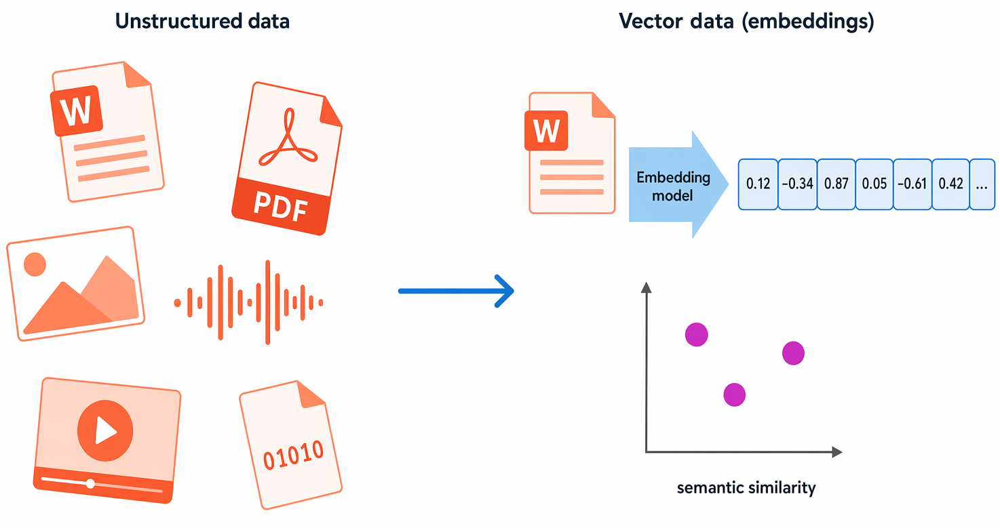

<br>

Las organizaciones también trabajan cada vez más con datos vectoriales (también denominados incrustaciones), el tipo de datos que permite a los asistentes de inteligencia artificial responder a preguntas sobre sus propios documentos y datos.

### Almacenes de datos

Las organizaciones suelen almacenar los datos en formato estructurado, semiestructurado o no estructurado para registrar los detalles de entidades (por ejemplo, clientes y productos), eventos específicos (como transacciones de ventas) u otra información en documentos, imágenes y otros formatos. Los datos almacenados se pueden recuperar para su análisis y la generación de informes más adelante.

Habitualmente se usan dos categorías generales de almacén de datos:

- Almacenes de archivos
- Bases de datos

Exploraremos ambos tipos de almacén de datos en temas posteriores.

<br>

---

## Exploración del almacenamiento de archivos

La capacidad de almacenar datos en archivos es un elemento básico de cualquier sistema informático. Los archivos se pueden almacenar en sistemas de archivos locales en el disco duro del equipo personal y en medios extraíbles, como unidades USB, pero en la mayoría de las organizaciones los archivos de datos importantes se almacenan centralmente en algún tipo de sistema de almacenamiento de archivos compartido. Cada vez más, esa ubicación de almacenamiento central se hospeda en la nube, lo que permite un almacenamiento rentable, seguro y de confianza para grandes volúmenes de datos.

El formato de archivo específico que se usa para almacenar datos depende de muchos factores, entre los que se incluyen:

- El tipo de datos que se almacenan (estructurados, semiestructurados o no estructurados).
- Las aplicaciones y los servicios que necesitan leer, escribir y procesar los datos.
- La necesidad de que los archivos de datos sean legibles para los usuarios o estén optimizados para un almacenamiento y procesamiento eficientes.

A continuación se describen algunos formatos de archivo comunes.

### Archivos de texto delimitado

A menudo, los datos se almacenan como texto sin formato con delimitadores de campo y terminadores de fila específicos. El formato más común para los datos delimitados son los valores separados por comas (CSV), en los que los campos están separados por comas y las filas finalizan con un retorno de carro o una nueva línea. Opcionalmente, la primera línea puede incluir los nombres de campo. Otros formatos comunes incluyen valores separados por tabulaciones (TSV) y delimitados por espacios (en los que se usan tabulaciones o espacios para separar los campos), así como datos de ancho fijo en los que a cada campo se le asigna un número fijo de caracteres. El texto delimitado es una buena opción para los datos estructurados a los que necesita tener acceso una amplia gama de aplicaciones y servicios en un formato legible.

En el ejemplo siguiente se muestran los datos de clientes en formato delimitado por comas:

```csv
FirstName,LastName,Email
Joe,Jones,joe@litware.com
Samir,Nadoy,samir@northwind.com
```


### Notación de objetos JavaScript (JSON)

JSON es un formato omnipresente en el que se usa un esquema de documento jerárquico para definir entidades de datos (objetos) que tienen varios atributos. Cada atributo puede ser un objeto (o una colección de objetos ), lo que hace de JSON un formato flexible adecuado tanto para datos estructurados como semiestructurados.

En el ejemplo siguiente se muestra un documento JSON que contiene una colección de clientes. Cada cliente tiene tres atributos (firstName, lastName y contact) y el atributo contact contiene una colección de objetos que representan uno o varios métodos de contacto (correo electrónico o teléfono). Los objetos se incluyen entre llaves ({..}) y las colecciones se incluyen entre corchetes ([..]). Los atributos se representan mediante pares name:value y separados por comas (,).

JSON
```json
{
  "customers":
  [
    {
      "firstName": "Joe",
      "lastName": "Jones",
      "contact":
      [
        {
          "type": "home",
          "number": "555 123-1234"
        },
        {
          "type": "email",
          "address": "joe@litware.com"
        }
      ]
    },
    {
      "firstName": "Samir",
      "lastName": "Nadoy",
      "contact":
      [
        {
          "type": "email",
          "address": "samir@northwind.com"
        }
      ]
    }
  ]
}
```

### Lenguaje de marcado extensible (XML)

XML es un formato de datos legible popular en la década de 1990 y 2000. En gran medida lo ha reemplazado el formato JSON, menos detallado, pero todavía hay algunos sistemas que usan XML para representar datos. XML usa etiquetas entre corchetes angulares (<.. />) para definir elementos y atributos, como se muestra en este ejemplo:

XML
```xml
<Customers>
  <Customer name="Joe" lastName="Jones">
    <ContactDetails>
      <Contact type="home" number="555 123-1234"/>
      <Contact type="email" address="joe@litware.com"/>
    </ContactDetails>
  </Customer>
  <Customer name="Samir" lastName="Nadoy">
    <ContactDetails>
      <Contact type="email" address="samir@northwind.com"/>
    </ContactDetails>
  </Customer>
</Customers>
```

### Objeto binario grande (BLOB)

En última instancia, todos los archivos se almacenan como datos binarios (1 y 0), pero en los formatos legibles que se describen anteriormente, los bytes de datos binarios se asignan a caracteres imprimibles (normalmente a través de un esquema de codificación de caracteres como ASCII o Unicode). Aun así, algunos formatos de archivo, especialmente para los datos no estructurados, almacenan los datos como datos binarios sin formato que las aplicaciones deben interpretar y representar. Los tipos comunes de datos almacenados como datos binarios incluyen imágenes, vídeo, audio y documentos específicos de aplicaciones.

Al trabajar con datos como estos, los profesionales de datos suelen hacer referencia a los archivos de datos como BLOB (objetos binarios grandes).

### Formatos de archivo optimizados

Aunque los formatos legibles para datos estructurados y semiestructurados pueden ser útiles, normalmente no están optimizados para el procesamiento o el espacio de almacenamiento. Con el paso del tiempo, se han desarrollado algunos formatos de archivo especializados que permiten la compresión, la indexación y un almacenamiento y procesamiento eficientes.

Algunos formatos de archivo optimizados comunes que puede ver son Parquet y Avro:

- Parquet es un formato de datos columnar y el estándar de facto para los lakehouses de datos modernos. Es un proyecto de Apache. Un archivo Parquet contiene grupos de filas. Los datos de cada columna se almacenan juntos en el mismo grupo de filas. Cada grupo de filas contiene uno o varios fragmentos de datos. Un archivo Parquet incluye metadatos que describen el conjunto de filas que hay en cada fragmento. Una aplicación puede usar estos metadatos para localizar rápidamente el fragmento correcto para un conjunto determinado de filas y, a continuación, para recuperar los datos de las columnas especificadas relativos a esas filas. Parquet se especializa en almacenar y procesar tipos de datos anidados de forma eficaz y admite esquemas de compresión y codificación eficientes.

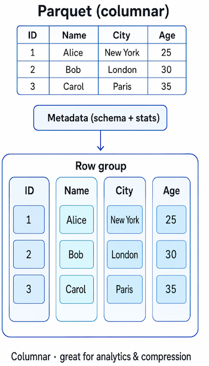

<br>

- Avro es un formato basado en filas. creado por Apache. Cada archivo contiene un encabezado que describe la estructura de los datos del archivo. Este encabezado se almacena como JSON. Los datos se almacenan como información binaria en uno o varios bloques de registros. Una aplicación usa la información del encabezado para analizar los datos binarios y extraer los campos que contienen. Avro es un formato adecuado para comprimir datos y reducir los requisitos de almacenamiento y ancho de banda de red.

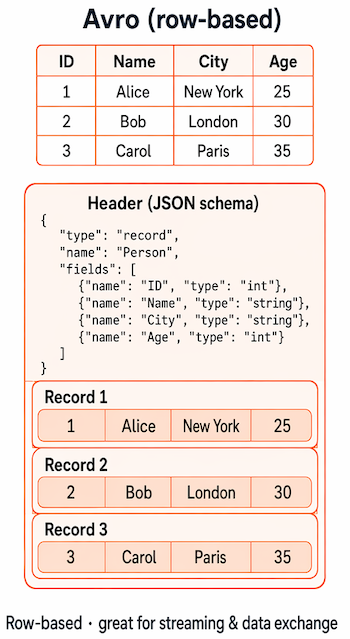

<br>

- Delta Lake es un formato de almacenamiento de código abierto que se basa en Parquet mediante la adición de un registro de transacciones, que permite transacciones ACID, control de versiones de datos y actualizaciones confiables sobre los archivos almacenados en un lago de datos.

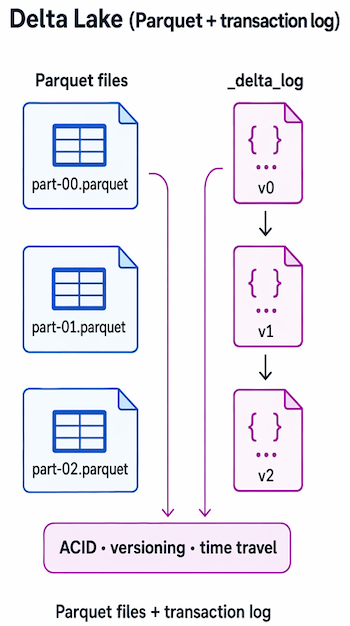

<br>

## Exploración de bases de datos

Las bases de datos se usan para definir un sistema central en el que los datos se pueden almacenar y consultar. En un sentido simplista, el sistema de archivos en el que se almacenan los archivos es un tipo de base de datos; pero cuando usamos el término en un contexto de datos profesional, normalmente nos referimos a un sistema dedicado para administrar registros de datos en lugar de archivos.

## Bases de datos relacionales

Las bases de datos relacionales suelen usarse para almacenar y consultar datos estructurados. Los datos se almacenan en tablas que representan entidades, por ejemplo, clientes, productos o pedidos de ventas. A cada instancia de una entidad se le asigna una clave principal que la identifica de forma única; estas claves se usan para hacer referencia a la instancia de entidad en otras tablas. Por ejemplo, se puede hacer referencia a la clave principal de un cliente en un registro de pedidos de ventas para indicar qué cliente ha realizado el pedido. Este uso de claves para hacer referencia a entidades de datos permite normalizar una base de datos relacional. En parte, esto conlleva la eliminación de valores de datos duplicados para que, por ejemplo, los detalles de un cliente individual se almacenen una sola vez, no para cada pedido de ventas que realiza el cliente. Las tablas se administran y consultan mediante el Lenguaje de consulta estructurado (SQL), que se basa en un estándar ANSII, por lo que es similar en varios sistemas de base de datos.

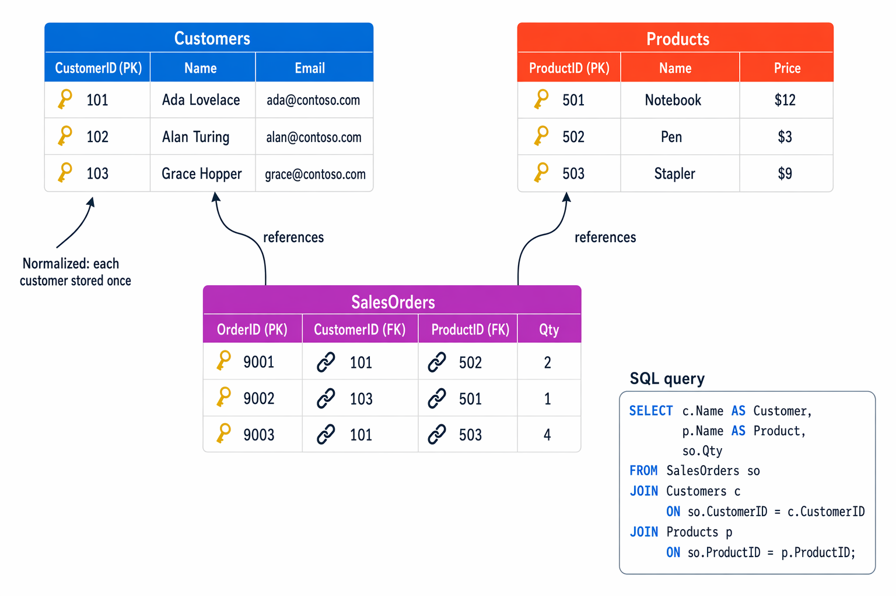

<br>

### Bases de datos no relacionales

Las bases de datos no relacionales son sistemas de administración de datos que no aplican un esquema relacional a los datos. A menudo, las bases de datos no relacionadas se conocen como NoSQL base de datos, aunque algunas admiten una variante del lenguaje SQL.

Hay cuatro tipos comunes de bases de datos no relacionales de uso común.

- **Bases de datos de clave-valor**, en las que cada registro consta de una clave única y un valor asociado, que puede estar en cualquier formato. 

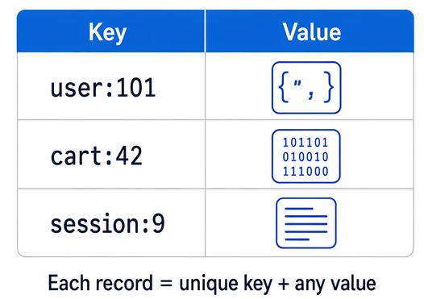

<br>

- **Bases de datos de documentos**, que son una forma específica de base de datos de clave-valor, en la que el valor es un documento JSON (que el sistema está optimizado para analizar y consultar).

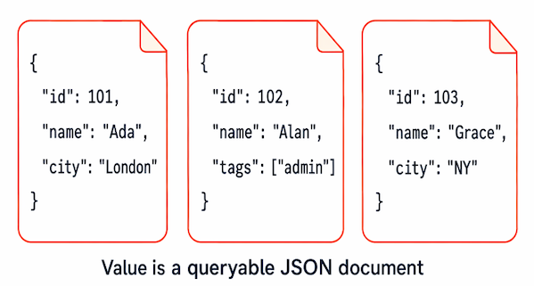

<br>

- **Bases de datos de familia de columnas**, que almacenan datos tabulares con filas y columnas, pero con la posibilidad de dividir esas columnas en grupos, conocidos como familias de columnas. Cada familia de columnas contiene un conjunto de columnas que tienen una relación lógica entre sí.

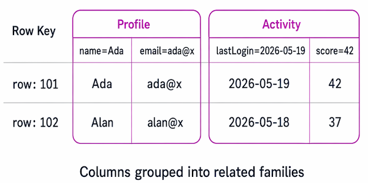

<br>

- **Bases de datos de grafos**, que almacenan entidades como nodos con vínculos para definir relaciones entre ellas.

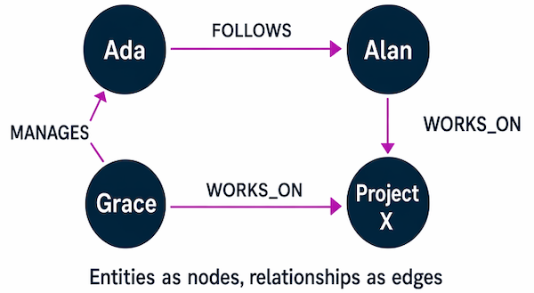

<br>

## Exploración del procesamiento de datos transaccionales

Un sistema de procesamiento de datos transaccional es lo que la mayoría de los usuarios considera la función principal de la informática empresarial. Un sistema transaccional registra las transacciones que encapsulan eventos específicos que la organización desea realizar un seguimiento. Una transacción podría ser financiera, como el movimiento de dinero entre cuentas de un sistema bancario, o podría formar parte de un sistema minorista, realizar un seguimiento de los pagos de bienes y servicios de los clientes. Piense en una transacción como una unidad de trabajo pequeña y discreta.

Los sistemas transaccionales suelen ser de gran volumen; a veces, controlan muchos millones de transacciones en un solo día. Los datos que se procesan deben ser accesibles rápidamente. El trabajo que realizan los sistemas transaccionales a menudo se conoce como procesamiento de transacciones en línea (OLTP).

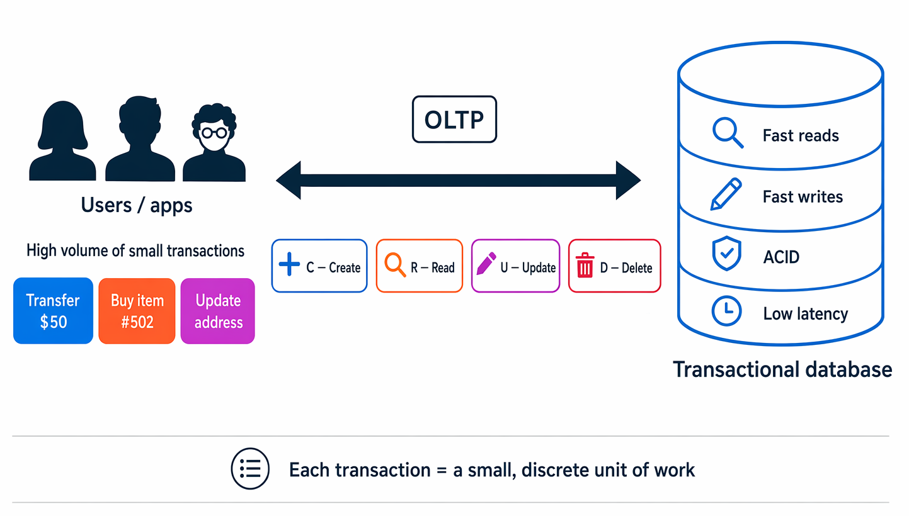

<br>

Las soluciones OLTP se basan en un sistema de base de datos en el que el almacenamiento de datos está optimizado para operaciones de lectura y escritura para admitir cargas de trabajo transaccionales en las que se crean, recuperan, actualizan y eliminan los registros de datos (a menudo denominados operaciones CRUD ). Estas operaciones se aplican transaccionalmente, de una forma que garantiza la integridad de los datos almacenados en la base de datos.

Para que las siguientes propiedades resulten más tangibles, imagine una transferencia bancaria de 40 desde la cuenta A (saldoinicial :100) a la cuenta B (saldo inicial: $50): el sistema debe debitar la cuenta A y acreditar la cuenta B como una sola operación fiable.

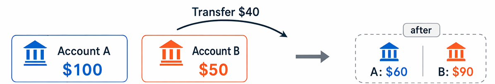

<br>

Para ello, los sistemas OLTP aplican transacciones que admiten la denominada semántica ACID:

- **Atomicidad** : cada transacción se trata como una sola unidad, que se realiza correctamente o falla por completo. Por ejemplo, una transacción que conlleve el adeudo de fondos de una cuenta y el abono de la misma cantidad en otra debe completar ambas acciones. Si alguna de las acciones no se puede completar, se debe producir un error en la otra.

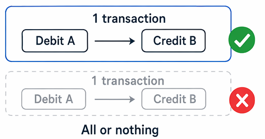

<br>

- **Coherencia** : las transacciones solo pueden tomar los datos de la base de datos de un estado válido a otro. Para continuar con el ejemplo anterior del adeudo y el abono, el estado completado de la transacción debe reflejar la transferencia de fondos de una cuenta a la otra.

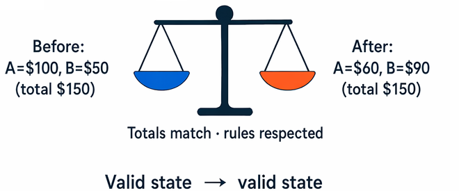

<br>

- **Aislamiento** : las transacciones simultáneas no pueden interferir entre sí y deben dar lugar a un estado de base de datos coherente. Por ejemplo, mientras que la transacción para transferir fondos de una cuenta a otra está en proceso, otra transacción que comprueba el saldo de estas cuentas debe devolver resultados coherentes: la transacción de comprobación de saldo no puede recuperar un valor para una cuenta que refleje el saldo antes de la transferencia y un valor para la otra cuenta que refleje el saldo después de la transferencia.

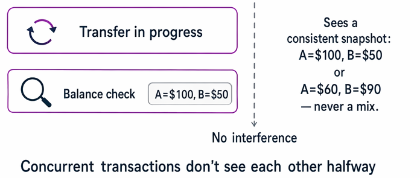

<br>

- **Durabilidad** : cuando se haya confirmado una transacción, permanecerá confirmada. Una vez completada la transacción de transferencia de cuenta, los saldos revisados de la cuenta se conservan para que incluso si el sistema de base de datos estuviera desactivado, la transacción confirmada se reflejará cuando se vuelva a activar.

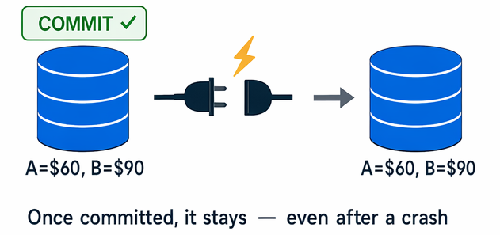

<br>

## Exploración del procesamiento de datos analíticos

El procesamiento analítico de datos suele utilizar sistemas de solo lectura (o de lectura casi exclusiva) que almacenan grandes volúmenes de datos históricos o métricas de negocio. Los análisis pueden basarse en una instantánea de los datos en un momento concreto o en una serie de instantáneas.

Los detalles específicos de un sistema de procesamiento analítico pueden variar según la solución, pero una arquitectura común para el análisis a escala empresarial tiene el siguiente aspecto:

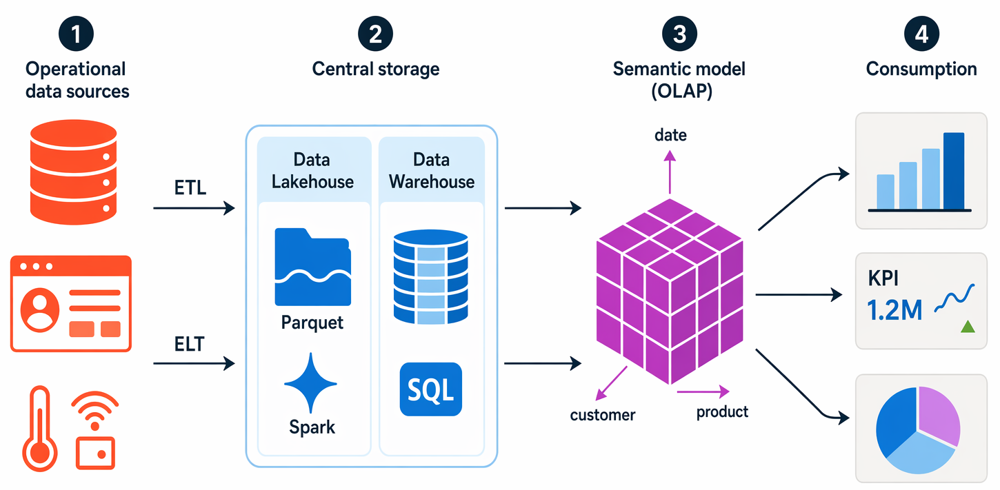

<br>

1. Los datos operativos se extraen, transforman y cargan (ETL) en un lago de datos para su análisis, o bien se extraen y cargan primero, y se transforman después, un patrón llamado ELT habitual en los lakehouses modernos.

2. Los datos se cargan en un esquema de tablas, normalmente en un almacén de lago de datos con abstracciones tabulares sobre archivos en el lago de datos, o un almacenamiento de datos con un motor SQL totalmente relacional.

3. Los datos del almacenamiento de datos se pueden agregar y cargar en un modelo de procesamiento analítico en línea (OLAP), que actualmente se denomina más comúnmente un modelo semántico (e históricamente un cubo). Los valores numéricos agregados (medidas) de las tablas de hechos se calculan para intersecciones de dimensiones a partir de tablas de dimensiones. Por ejemplo, los ingresos de ventas podrían sumarse por fecha, cliente y producto. Power BI modelos semánticos son el ejemplo más común que encontrará.

4. Los datos del lago de datos, el almacenamiento de datos y el modelo analítico se pueden consultar para generar informes, visualizaciones y paneles.

Los lagos de datos son comunes en escenarios de procesamiento analítico de datos modernos, en los que se debe recopilar y analizar un gran volumen de datos basados en archivos.

Los almacenamientos de datos son una manera establecida de almacenar datos en un esquema relacional optimizado para las operaciones de lectura, principalmente las consultas para admitir la visualización de informes y datos.

Data Lakehouses es una innovación más reciente que combina el almacenamiento flexible y escalable de un lago de datos con la semántica de consulta relacional de un almacenamiento de datos. El esquema de tabla puede requerir cierta desnormalización de datos en un origen de datos OLTP (introduciendo algunas duplicaciones para que las consultas funcionen más rápido).

Un modelo OLAP (o modelo semántico) es un tipo agregado de almacenamiento de datos optimizado para cargas de trabajo analíticas. Las agregaciones de datos se encuentran entre dimensiones en distintos niveles, lo que permite explorar o reducir en profundidad las agregaciones en varios niveles jerárquicos; por ejemplo, para buscar el total de ventas por región, por ciudad o para una dirección individual. Dado que los datos están preagregados, las consultas para devolver los resúmenes que contiene se pueden ejecutar rápidamente.

Los diferentes tipos de usuario pueden llevar a cabo el trabajo analítico de datos en distintas fases de la arquitectura general. Por ejemplo:

- Los científicos de datos pueden trabajar directamente con archivos de datos en un lago de datos para explorar los datos y crear modelos a partir de estos.
- Los analistas de datos pueden consultar tablas directamente en el almacenamiento de datos para generar informes y visualizaciones complejos.
- Los usuarios empresariales pueden consumir datos preagregados en un modelo analítico en forma de informes o paneles.

### Plataformas de análisis modernas

Azure proporciona varios servicios administrados que cubren la canalización de análisis completa, desde la ingesta de datos sin procesar hasta informes interactivos. Dos plataformas "todo en uno" reúnen la mayoría de estas funcionalidades en una sola área de trabajo. **Microsoft Fabric** y **Azure Databricks** son esas dos plataformas; un tercer servicio, **Microsoft Purview**, se centra en la gobernanza de datos en todos los orígenes. Aún no es necesario familiarizarse con ninguno de estos servicios: las descripciones siguientes le proporcionan una idea general de lo que hace cada uno.

**Microsoft Fabric** es una plataforma de análisis de software como servicio (SaaS) unificada que reúne las funcionalidades de almacenamiento, ingeniería de datos, almacenamiento de datos e informes en una sola área de trabajo. **Azure Databricks** es una plataforma de análisis en la nube creada para la ingeniería de datos a gran escala y la ciencia de datos, mediante **Delta Lake**: Parquet más un registro de transacciones que permite el control de versiones y las transacciones ACID, como formato de almacenamiento estándar. **Microsoft Purview** proporciona seguridad de datos unificada, gobernanza y cumplimiento, lo que le ayuda a detectar, clasificar, proteger y administrar datos en todos los orígenes de datos.

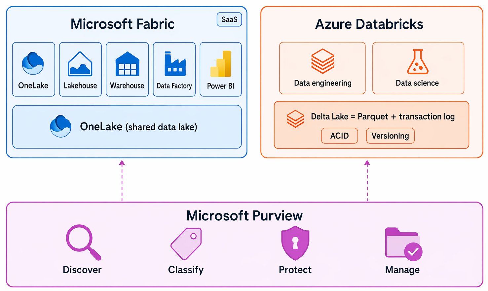

<br>

### Organización de datos con la arquitectura medallón

Un patrón común para organizar los datos en un lakehouse es la arquitectura de medallón, que utiliza tres capas:

- Bronze: datos sin procesar ingeridos as-is de los sistemas de origen, sin ninguna transformación aplicada, conservando los registros originales para el reprocesamiento.
- Silver: datos limpios y conformes, con duplicados eliminados y tipos de datos estandarizados.
- Gold: datos agregados y listos para la empresa modelados para casos de uso específicos de informes y análisis.

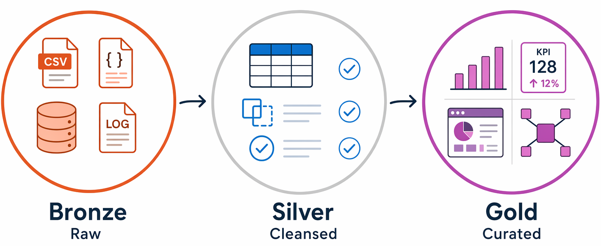

<br>

Los equipos usan este patrón porque crea límites de calidad claros en cada capa y siempre puede volver a procesar datos de los registros Bronze originales si cambian los requisitos.

Tanto Fabric como Databricks incluyen experiencias de Copilot que permiten explorar datos mediante lenguaje natural.

## Resumen

Los datos son la esencia de la mayoría de las aplicaciones y soluciones de software. Se pueden representar en muchos formatos, almacenarse en archivos y bases de datos, y usarse para registrar transacciones o para admitir los análisis y la realización de informes.

En este módulo ha aprendido a:

- Identificar formatos de datos comunes
- Describir las opciones para almacenar datos en archivos
- Describir las opciones para almacenar datos en bases de datos
- Describir las características de las soluciones de procesamiento de datos transaccionales
- Describir las características de las soluciones de procesamiento de datos analíticos

<br>

---

[Volver al índice](#índice)

---

<br>

# Exploración de roles y servicios de datos

Los profesionales de datos tienen roles distintos en la creación y administración de soluciones de software, y trabajan con varias tecnologías y servicios para ello.

### Objetivos de aprendizaje
En este módulo aprenderá a:

- Identificar los roles comunes de los profesionales de datos.
- Identificar los servicios en la nube comunes que usan los profesionales de datos.

### Requisitos previos
Ninguno

## Introducción

Durante la última década, la cantidad de datos que generan los sistemas y los dispositivos ha aumentado considerablemente. Debido a este aumento, los expertos en el tratamiento de datos se enfrentan a nuevas tecnologías, nuevos roles y nuevos enfoques para trabajar con los datos. Los expertos en el tratamiento de datos suelen desempeñar diferentes roles a la hora de administrar, usar y controlar los datos. En este módulo, conocerá los distintos roles que las organizaciones suelen aplicar a estos expertos y las tareas y las responsabilidades asociadas a dichos roles, así como los servicios de Microsoft Azure que se usan para su realización.

>!  Nota:
>
>Reconocemos que a diferentes personas les gusta aprender de diferentes maneras. Puede optar por completar este módulo en formato basado en vídeo o puede leer el contenido como texto e imágenes. El texto contiene más detalle que los vídeos, por lo que, en algunos casos, es posible que desee hacer referencia a él como material complementario para la presentación de vídeo.

<br>

---

## Exploración de los roles de trabajo del mundo de los datos

Hay una amplia variedad de roles implicados en la administración, el control y el uso de datos. Algunos roles están orientados a los negocios, mientras que otros implican más ingeniería. También los hay más centrados en la investigación, o incluso existen roles híbridos que combinan distintos aspectos de la administración de datos. La organización puede definir roles de maneras distintas o asignarles nombres diferentes, pero los que se describen en esta unidad resumen la clasificación más habitual de las tareas y las responsabilidades.

Los roles clave de trabajo que tratan con los datos de la mayoría de las organizaciones son:

- Los administradores de bases de datos administran bases de datos, asignan permisos a los usuarios, almacenan copias de seguridad de datos y restauran datos en caso de error.
- Los ingenieros de datos administran la infraestructura y los procesos para la integración de datos en toda la organización, aplican rutinas de limpieza de datos, identifican reglas de gobernanza de datos e implementan canalizaciones para transferir y transformar datos entre sistemas.
- Los analistas de datos exploran y analizan los datos para crear visualizaciones y gráficos que permiten a las organizaciones tomar decisiones fundamentadas.
- Los ingenieros de inteligencia artificial crean e integran características y flujos de trabajo con tecnología de inteligencia artificial, trabajando con modelos de lenguaje grande, canalizaciones de aprendizaje automático y orígenes de datos para habilitar escenarios inteligentes.

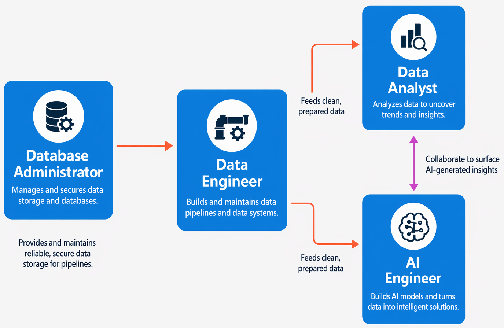

<br>

>! Nota:
>
> Los roles de trabajo definen tareas y responsabilidades diferenciadas. En algunas organizaciones, la misma persona podría desempeñar varios roles; por lo tanto, en su rol como administrador de bases de datos, podrían aprovisionar una base de datos transaccional y, a continuación, en su rol como ingeniero de datos, podrían crear una canalización para transferir datos de la base de datos a un almacenamiento de datos para su análisis.

### Administrador de base de datos

Un administrador de bases de datos es responsable del diseño, la implementación, el mantenimiento y los aspectos operativos de los sistemas de bases de datos locales y basados en la nube. Son responsables de la disponibilidad general y de las optimizaciones y el rendimiento coherentes de las bases de datos. Trabajan con las partes interesadas para implementar directivas, herramientas y procesos para la realización de copias de seguridad, así como planes de recuperación que permiten reponerse tras un desastre natural o un error humano.

Los administradores de base de datos también son responsables de administrar la seguridad de los datos en la base de datos, conceder privilegios sobre los datos, y conceder o denegar el acceso a los usuarios según corresponda.

Los administradores de bases de datos usan cada vez más herramientas de inteligencia artificial para solucionar problemas de rendimiento y redactar consultas mediante lenguaje natural, junto con el criterio y la experiencia que requiere el rol.

### Ingeniero de datos

Un ingeniero de datos colabora con las partes interesadas para diseñar e implementar cargas de trabajo relacionadas con los datos, incluidas canalizaciones de ingesta de datos, actividades de limpieza y transformación, y almacenes de datos para cargas de trabajo analíticas. Usan una amplia gama de tecnologías de plataforma de datos, incluidas bases de datos relacionales y no relacionales, almacenes de archivos y flujos de datos.

También son responsables de garantizar que la privacidad de los datos se mantenga dentro de la nube y que abarque desde el entorno local hasta los almacenes de datos en la nube. Se ocupan de la administración y la supervisión de canalizaciones de datos para asegurarse de que las cargas de datos funcionen según lo previsto.

Las herramientas de inteligencia artificial pueden ayudar a los ingenieros de datos con tareas de desarrollo de canalizaciones, como generar código de transformación y sugerir configuraciones mediante lenguaje natural, junto con las decisiones arquitectónicas y el criterio de calidad de los datos que requiere el rol.

### Analista de datos

Un analista de datos permite a las empresas maximizar el valor de sus recursos de datos. Son los responsables de explorar datos para identificar tendencias y relaciones, diseñar e implementar modelos analíticos, y habilitar funcionalidades de análisis avanzado mediante informes y visualizaciones.

Los analistas de datos se ocupan del procesamiento de los datos sin procesar para convertirlos en información pertinente, en función de los requisitos empresariales establecidos, con el fin de ofrecer conclusiones de interés.

Las herramientas de inteligencia artificial pueden ayudar a los analistas de datos con tareas como resumir informes, sugerir visualizaciones y generar expresiones analíticas mediante lenguaje natural, junto con las aptitudes de comprensión empresarial y comunicación que requiere el rol.

### Ingeniero de IA

Un ingeniero de inteligencia artificial crea e integra características con tecnología de inteligencia artificial en aplicaciones y flujos de trabajo de datos. Funcionan con modelos de lenguaje grandes (LLM): sistemas de inteligencia artificial entrenados en grandes cantidades de texto que pueden comprender y generar lenguaje humano, así como canalizaciones de aprendizaje automático y orígenes de datos para habilitar escenarios inteligentes, como chat-over-your-data, generación de contenido y clasificación automatizada.

Los ingenieros de inteligencia artificial colaboran estrechamente con los ingenieros de datos para acceder a los datos subyacentes y prepararlos, así como con analistas de datos para exponer información generada por ia en informes y aplicaciones. Microsoft Foundry proporciona las herramientas y la plataforma que usan los ingenieros de IA para crear, probar e implementar estas soluciones.

La asistencia a la inteligencia artificial es fundamental para el trabajo diario del ingeniero de inteligencia artificial: generar código, explicar el comportamiento del modelo y sugerir arquitecturas mediante lenguaje natural, aunque las decisiones de diseño, la evaluación y la implementación responsable de los sistemas de inteligencia artificial siguen siendo responsabilidades humanas distintas.

>! Nota:
>
>Los roles que se describen aquí representan los roles clave relacionados con los datos que se encuentran en la mayoría de las organizaciones medianas y grandes. Hay roles adicionales relacionados con los datos que no se mencionan aquí, como científicos de datos y arquitecto de datos; y hay otros profesionales técnicos que trabajan con datos, incluidos desarrolladores de aplicaciones e ingenieros de software.

<br>

---

## Identificación de los servicios de datos

Microsoft Azure es una plataforma de nube que usan las aplicaciones y la infraestructura de TI de algunas de las organizaciones más grandes del mundo. Incluye numerosos servicios para admitir soluciones en la nube, incluidas cargas de trabajo de datos transaccionales y analíticos.

A continuación se describen algunos de los servicios en la nube que se usan más a menudo para los datos.

>! Nota:
>
>En este artículo solo se tratan algunos de los servicios de datos más usados para las soluciones transaccionales y analíticas modernas. Hay disponibles otros servicios. Como principiante, no es necesario memorizar todos los servicios, el objetivo es conocer los tipos de herramientas disponibles y los roles que los usan.

>! Sugerencia
>
>En esta unidad encontrará los términos PaaS (plataforma como servicio) y SaaS (software como servicio). Estos son los modelos de entrega en la nube: PaaS significa que Microsoft administra la infraestructura subyacente (servidores, aplicación de revisiones, copias de seguridad) para centrarse en los datos y las aplicaciones. SaaS significa que todo el producto se entrega como un servicio listo para usar a través de Internet, sin instalación ni administración de infraestructura necesaria.

### Azure SQL

 *Azure SQL* es el nombre colectivo de una familia de soluciones de base de datos relacionales basadas en el motor de base de datos de Microsoft SQL Server. Los servicios específicos de Azure SQL incluyen:

- **Azure SQL Database**: una base de datos de plataforma como servicio (PaaS) totalmente administrada hospedada en Azure.
- **Azure SQL Managed Instance**: es una instancia hospedada de SQL Server con mantenimiento automatizado, que permite una configuración más flexible que Azure SQL Database, pero con más responsabilidad administrativa para el propietario.
- **Máquina virtual de Azure SQL**: consiste en una máquina virtual con una instalación de SQL Server, lo que ofrece una capacidad de configuración máxima con una responsabilidad de administración completa.

Normalmente, los administradores de bases de datos aprovisionan y administran sistemas de bases de datos de Azure SQL para admitir aplicaciones de línea de negocio (LOB) que necesitan almacenar datos transaccionales.

Los ingenieros de datos pueden usar sistemas de bases de datos de Azure SQL como orígenes para canalizaciones de datos que realizan operaciones de extracción, transformación y carga (ETL) para ingerir los datos transaccionales en un sistema analítico.

Los analistas de datos pueden consultar las bases de datos de Azure SQL directamente para crear informes, aunque en organizaciones grandes los datos suelen combinarse con datos de otros orígenes en un almacén de datos analíticos para admitir análisis empresariales.

Azure SQL incluye características integradas de inteligencia artificial que los administradores de bases de datos y los desarrolladores pueden usar para generar consultas y solucionar problemas de rendimiento mediante lenguaje natural.

### Bases de datos de código abierto de Azure

 Azure incluye servicios administrados para sistemas populares de bases de datos relacionales de código abierto, entre los que se incluyen:

Azure Database for MySQL: consiste en un sistema de administración de bases de datos de código abierto fácil de usar que suele emplearse en aplicaciones de pila de Linux, Apache, MySQL y PHP (LAMP).
Azure Database for PostgreSQL: se trata de una base de datos híbrida de objetos relacionales. Puede almacenar datos en tablas relacionales, pero una base de datos PostgreSQL también le permite almacenar tipos de datos personalizados, con sus propias propiedades no relacionales.
Al igual que sucede con los sistemas de bases de datos de Azure SQL, los administradores de bases de datos son los responsables de administrar las bases de datos relacionales de código abierto para admitir aplicaciones transaccionales. Dichas bases de datos proporcionan un origen de datos para los ingenieros de datos que crean canalizaciones destinadas a soluciones analíticas, así como para los analistas de datos que crean informes.

### Azure Cosmos DB

 Azure Cosmos DB es un sistema de base de datos no rerelational de escala global (NoSQL) que admite varias interfaces de programación de aplicaciones (API), lo que le permite almacenar y administrar datos como documentos JSON, pares clave-valor, familias de columnas y grafos.

En algunas organizaciones, los administradores de base de datos pueden aprovisionar y administrar las instancias de Cosmos DB, aunque suelen ser los desarrolladores de software quienes administran el almacenamiento de datos NoSQL como parte de la arquitectura general de la aplicación. A menudo, los ingenieros de datos necesitan integrar orígenes de datos de Cosmos DB en soluciones analíticas empresariales que admitan el modelado y la elaboración de informes por parte de los analistas de datos.

Azure Cosmos DB incluye características integradas de inteligencia artificial que los desarrolladores pueden usar para explorar y consultar datos mediante lenguaje natural.

### Azure Storage

 Azure Storage es un servicio de Azure básico que permite almacenar datos en:

- Contenedores de blobs: almacenamiento escalable y rentable para archivos binarios.
- Recursos compartidos de archivos: recursos compartidos de archivos de red, como es habitual en redes corporativas.
-Tablas: almacenamiento de clave-valor para aplicaciones que necesitan leer y escribir valores de datos rápidamente.

Los ingenieros de datos usan Azure Storage para hospedar lagos de datos, es decir, almacenamiento de blobs con un espacio de nombres jerárquico que permite organizar los archivos en carpetas en un sistema de archivos distribuido.

### Azure Data Factory

 Azure Data Factory es un servicio de Azure que permite definir y programar canalizaciones de datos para transferir y transformar datos. Puede integrar las canalizaciones con otros servicios de Azure, lo que le permite ingerir datos de almacenes de datos en la nube, procesar los datos mediante procesos basados en la nube y conservar los resultados en otro almacén de datos.

Los ingenieros de datos usan Azure Data Factory para compilar soluciones de extracción, transformación y carga (ETL) que rellenan almacenes de datos analíticos con datos de sistemas transaccionales de toda la organización. Una versión de Data Factory también está integrada en Microsoft Fabric como **Fabric Data Factory, la opción recomendada para canalizaciones de análisis integradas cuando todos los datos funcionan en la plataforma Fabric.

### Microsoft Fabric

 Microsoft Fabric es Microsoft plataforma unificada de análisis software como servicio (SaaS). Ofrece ingeniería de datos, almacenamiento de datos, análisis en tiempo real, ciencia de datos y Power BI juntos en un único área de trabajo basada en explorador sobre una capa de almacenamiento compartida denominada OneLake. No administra servidores ni clústeres, crea áreas de trabajo y elementos y Microsoft ejecuta la infraestructura.

Dentro de Microsoft Fabric, los profesionales de datos trabajan con funcionalidades integradas, entre las que se incluyen:

- Ingesta de datos y ETL con Fabric Data Factory
- Análisis de lago de datos con Fabric Lakehouse
- Análisis de almacenamiento de datos con Fabric Warehouse
- Ciencia de datos y aprendizaje automático
- Real-Time Intelligence para datos de streaming
- Visualización de datos con Power BI
- Bases de datos (base de datos SQL y Cosmos DB en Fabric)
- Gobernanza y administración de datos

Los ingenieros de datos pueden usar Microsoft Fabric para crear una solución unificada de análisis de datos que combina canalizaciones de ingesta de datos, almacenes de datos, análisis en tiempo real, inteligencia empresarial e información con tecnología de inteligencia artificial, todo almacenado centralmente en OneLake.

Microsoft Fabric incluye características integradas de inteligencia artificial que los profesionales de datos pueden usar para crear canalizaciones, escribir SQL, generar código de cuaderno y explorar datos mediante lenguaje natural.

### Microsoft Fabric IQ

 Microsoft Fabric logotipo de IQ. Fabric IQ es una carga de trabajo en Microsoft Fabric que unifica los datos en OneLake y proporciona un significado empresarial coherente, por lo que cada herramienta y equipo comparten las mismas definiciones para conceptos como CustomerOrder, o Product. Permite a los usuarios empresariales y a los agentes de inteligencia artificial formular preguntas sobre los datos en lenguaje natural, en función de una comprensión compartida de los datos empresariales.

>! Nota:
>
>Fabric IQ está actualmente en versión preliminar.

### Power BI

 Power BI logo. Power BI es la plataforma de inteligencia empresarial y visualización de datos de Microsoft. Los analistas de datos usan Power BI para conectarse a orígenes de datos, crear informes y paneles interactivos y compartir información en toda su organización.

Power BI está disponible como un servicio independiente y también está integrado en Microsoft Fabric, donde funciona junto con las funcionalidades de ingeniería de datos y almacenamiento en la misma área de trabajo. En Fabric, Power BI se conecta a los datos a través de **modelos semánticos: capas analíticas estructuradas que definen medidas, relaciones y lógica de negocios.

Power BI incluye características integradas de inteligencia artificial que los analistas de datos pueden usar para resumir informes, sugerir visualizaciones, generar medidas DAX y crear narraciones escritas a partir de datos mediante lenguaje natural.

### Azure Databricks

 Azure Databricks logo. Azure Databricks es una plataforma de análisis en la nube basada en Apache Spark. Está optimizado para ingeniería de datos a gran escala, ciencia de datos y análisis de SQL a través de formatos abiertos de lago de datos, fundamentalmente Delta Lake. Se ejecuta como un servicio administrado dentro de la suscripción de Azure y es una opción común para los equipos que necesitan flujos de trabajo basados en el código y los cuadernos.

Los ingenieros de datos pueden usar las capacidades de Databricks y Spark para crear almacenes de datos analíticos en Azure Databricks.

Los analistas de datos pueden usar la compatibilidad nativa con cuadernos en Azure Databricks para consultar y visualizar datos en una interfaz basada en web fácil de usar.

Azure Databricks incluye características integradas de inteligencia artificial que los ingenieros de datos y los analistas pueden usar para escribir código spark, generar consultas SQL y explicar lógica compleja de cuadernos mediante lenguaje natural.

### Azure Stream Analytics

 Azure Stream Analytics logo. Azure Stream Analytics es un motor de procesamiento de flujos en tiempo real que captura un flujo de datos de una entrada, aplica una consulta para extraer y manipular datos del flujo de entrada y escribe los resultados en una salida para su análisis o posterior procesamiento.

Los ingenieros de datos pueden incorporar Azure Stream Analytics en arquitecturas de análisis de datos que capturan datos de streaming para su ingesta en un almacén de datos analíticos o para su visualización en tiempo real.

### Azure Data Explorer

 Azure Data Explorer logo. Azure Data Explorer es una plataforma de análisis de macrodatos totalmente administrada e independiente que ofrece consultas de alto rendimiento de datos de registro y telemetría.

Los analistas de datos pueden usar Azure Data Explorer para consultar y analizar datos que incluyan un atributo de marca de tiempo, como es habitual en los archivos de registro y los datos de telemetría de IoT (Internet de las cosas).

### Microsoft Purview

 Microsoft Purview logo. Microsoft Purview proporciona una solución para la gobernanza y detección de datos de toda la empresa. Puede usar Microsoft Purview para crear un mapa de los datos y realizar un seguimiento del linaje de datos en varios orígenes de datos y sistemas, lo que le permite encontrar datos de confianza para el análisis y la elaboración de informes.

Los ingenieros de datos pueden usar Microsoft Purview para aplicar la gobernanza de datos en toda la empresa y garantizar la integridad de los datos que se usan para admitir cargas de trabajo analíticas.

### Microsoft Foundry

 Logotipo de Microsoft Foundry. Microsoft Foundry es la plataforma como servicio (PaaS) unificada de Azure de Microsoft para operaciones de IA empresariales, creadores de modelos y el desarrollo de aplicaciones. Proporciona las herramientas, el acceso al modelo y la infraestructura que los ingenieros de inteligencia artificial (y los desarrolladores) usan para diseñar, probar e implementar soluciones inteligentes, incluidas las aplicaciones de chat a través de los datos, los flujos de trabajo de varios agentes y las canalizaciones automatizadas de inteligencia artificial integradas con Azure servicios de datos.

## Resumen

Administrar y trabajar con datos es una aptitud especializada que requiere conocimientos de varias tecnologías. La mayoría de las organizaciones definen roles de trabajo para las distintas tareas responsables de administrar datos.

En este módulo ha aprendido a:

- Identificar los perfiles profesionales de datos más comunes
- Identificación de servicios en la nube comunes usados por profesionales de datos

### Pasos siguientes

Ahora que ha aprendido sobre los roles de datos profesionales y los servicios que usan, considere la posibilidad de obtener más información sobre las cargas de trabajo relacionadas con los datos en Microsoft Azure mediante la realización de una certificación de Microsoft en [Aspectos básicos de datos de Azure](https://learn.microsoft.com/es-es/credentials/certifications/azure-data-fundamentals/?practice-assessment-type=certification).

<br>

---

[Volver al índice](#índice)

---

<br>
