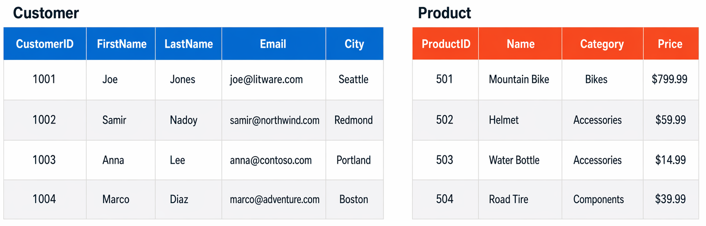

# Introducción a los conceptos de datos principales de Microsoft Azure
Ruta de aprendizaje - 2 Módulos

Los datos son la base sobre la que se crea todo el software. Al aprender sobre formatos de datos comunes, cargas de trabajo, roles y servicios, puede prepararse para una carrera como profesional de datos. Esta ruta de aprendizaje lo ayuda a prepararse para la certificación [Azure Data Fundamentals](https://learn.microsoft.com/es-es/credentials/certifications/azure-data-fundamentals/?azure-portal=true&practice-assessment-type=certification).

## Explorar conceptos básicos de datos

Los datos impulsan la transformación digital que está arrasando entre las organizaciones y la sociedad en general. Pero, ¿qué son los "datos" y cómo se representan y usan?

Objetivos de aprendizaje
En este módulo aprenderá a:
- Identificar formatos de datos comunes.
- Describir las opciones para almacenar datos en archivos.
- Describir las opciones para almacenar datos en bases de datos.
- Describir las características de las soluciones de procesamiento de datos transaccionales.
- Describir las características de las soluciones de procesamiento de datos analíticos.

---

 

### Introducción

Durante las últimas décadas, la cantidad de datos que generan los sistemas, las aplicaciones y los dispositivos ha aumentado considerablemente. Los datos están en todas partes, en una gran variedad de estructuras y formatos.

Ahora los datos pueden recopilarse de manera más fácil y almacenarse de forma más barata, lo que permite que casi todas las empresas puedan tener acceso a ellos. Las soluciones de datos incluyen tecnologías de software y plataformas que pueden facilitar la recopilación, el análisis y el almacenamiento de información valiosa. Todas las empresas buscan aumentar sus ingresos y obtener mayores ganancias. En este mercado competitivo, los datos son un recurso valioso. Cuando se analizan correctamente, los datos se pueden convertir en una gran cantidad de información útil que ayuda a tomar decisiones empresariales críticas.

La capacidad de capturar, almacenar y analizar datos es un requisito básico para todas las organizaciones del mundo. En este módulo, obtendrá información sobre las opciones para representar y almacenar datos, así como sobre las cargas de trabajo de datos típicas. Al completar este módulo, establecerá las bases para conocer mejor las técnicas y los servicios que se usan para trabajar con datos.

### Identificación de los formatos de datos

Los datos son una colección de elementos, como números, descripciones y observaciones, que se usan para registrar información. Las estructuras de datos en las que se organizan estos datos suelen representar entidades que son importantes para una organización (como clientes, productos, pedidos de ventas, etc.). Normalmente, cada entidad tiene uno o varios atributos o características (por ejemplo, un cliente podría tener un nombre, una dirección, un número de teléfono, etc.).

Los datos se pueden clasificar en estructurados, semiestructurados o no estructurados.

#### Datos estructurados

Los datos estructurados son aquellos que se ajustan a un esquema fijo, por lo que todos los datos tienen los mismos campos o propiedades. Normalmente, el esquema de las entidades de datos estructurados es tabular; es decir, los datos se representan en una o varias tablas que constan de filas para representar cada instancia de una entidad de datos y columnas para representar los atributos de la entidad. Por ejemplo, en la imagen siguiente se muestran las representaciones de datos tabulares para las entidades Customer y Product.

 

Los datos estructurados suelen almacenarse en una base de datos en la que varias tablas pueden hacer referencia entre sí mediante el uso de valores de clave en un modelo relacional, que exploraremos con más detalle más adelante.

#### Datos semiestructurados

Los datos semiestructurados son información que tiene cierta estructura, pero que permite alguna variación entre las instancias de entidad. Por ejemplo, aunque la mayoría de los clientes pueden tener una dirección de correo electrónico, algunos podrían tener varias y otros, ninguna.

Un formato común para los datos semiestructurados es la notación de objetos JavaScript (JSON). En el ejemplo siguiente se muestran un par de documentos JSON que representan información de clientes. Cada documento de cliente incluye la dirección y la información de contacto, pero los campos específicos varían entre los clientes.

> JSON
>
> // Customer 1  
> {  
>   "firstName": "Joe",  
>   "lastName": "Jones",  
>   "address":  
>   {  
>     "streetAddress": "1 Main St.",  
>     "city": "New York",  
>     "state": "NY",  
>     "postalCode": "10099"  
>   },  
>   "contact":  
>   [  
>     {  
>       "type": "home",  
>       "number": "555 123-1234"  
>     },  
>     {  
>       "type": "email",  
>       "address": "joe@litware.com"  
>     }  
>   ]  
> } 
> 
> 
> 
> // Customer 2
> 
> {
> 
>   "firstName": "Samir",
> 
>   "lastName": "Nadoy",
> 
>   "address":
> 
>   {
> 
>     "streetAddress": "123 Elm Pl.",
> 
>     "unit": "500",
> 
>     "city": "Seattle",
> 
>     "state": "WA",
> 
>     "postalCode": "98999"
> 
>   },
> 
>   "contact":
> 
>   [
> 
>     {
> 
>       "type": "email",
> 
>       "address": "samir@northwind.com"
> 
>     }
> 
>   ]
> 
> }

