# Introducción a los datos no relacionales en Microsoft Azure Data

Los datos no relacionales son una manera común de que las aplicaciones almacenen y consulten datos sin sufrir la sobrecarga de un esquema relacional. En Microsoft Azure, puede usar Azure Storage y Azure Cosmos DB para crear almacenes de datos seguros y altamente escalables para datos no relacionales. Esta ruta de aprendizaje lo ayuda a prepararse para la certificación [Azure Data Fundamentals](https://learn.microsoft.com/es-es/credentials/certifications/azure-data-fundamentals/?azure-portal=true&practice-assessment-type=certification).


## Explorar Azure Storage para datos no relacionales

Azure Storage es un servicio básico en Microsoft Azure que se usa normalmente para almacenar datos no relacionados.

Objetivos de aprendizaje
En este módulo aprenderá a:
- Describa las características y funcionalidades de Azure Blob Storage.
- Describa las características y funcionalidades de Azure Data Lake Storage Gen2.
- Describa las características y funcionalidades de Microsoft OneLake en Fabric.
- Describa las características y funcionalidades de Azure File Storage.
- Describa las características y funcionalidades de Azure Table Storage.
- Cree y explore una cuenta de Azure Storage.

<br>

---

### Introducción

La mayoría de las aplicaciones de software necesitan almacenar datos. Por lo general, los datos se almacenan en una base de datos relacional, en la que se organizan en tablas relacionadas y se administran mediante el Lenguaje de consulta estructurado (SQL). Sin embargo, muchas aplicaciones no necesitan la estructura rígida de una base de datos relacional y dependen del almacenamiento no relacional (a menudo denominado NoSQL).

Azure Storage y Microsoft OneLake ofrecen una variedad de opciones para almacenar datos en la nube. En este módulo, explorará las funcionalidades fundamentales de Azure Storage y Microsoft OneLake y aprenderá cómo se usan para admitir aplicaciones que requieren almacenes de datos no relacionados.

<br>

---

### Exploración de Azure Blob Storage

Azure Blob Storage es un servicio que le permite almacenar grandes cantidades de datos no estructurados como objetos binarios grandes, o blobs, en la nube. Los blobs son una manera eficaz de almacenar archivos de datos en un formato optimizado para el almacenamiento basado en la nube, y las aplicaciones pueden leerlos y escribirlos mediante la API de almacenamiento de blobs de Azure.

<br>

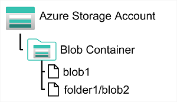

En una cuenta de Azure Storage, los blobs se almacenan en contenedores. Un contenedor proporciona una manera cómoda de agrupar blobs relacionados. Puede controlar quién puede leer y escribir blobs dentro de un contenedor en el nivel de contenedor. La autenticación de Microsoft Entra ID (servicio de administración de identidades y accesos de Azure) es el método de inicio de sesión recomendado para Azure Blob Storage, ya que permite asignar permisos precisos mediante el control de acceso basado en roles de Azure (RBAC), un sistema que controla quién puede realizar acciones específicas en los recursos de Azure.

Dentro de un contenedor, puede organizar los blobs en una jerarquía de carpetas virtuales, similares a los archivos de un sistema de archivos en un disco. Sin embargo, de manera predeterminada, estas carpetas no son más que una forma de utilizar un carácter "/" en el nombre de un blob para organizar los blobs en espacios de nombres. Las carpetas son puramente virtuales y no es posible hacer operaciones de nivel de carpeta para controlar el acceso ni hacer operaciones masivas.

Azure Blob Storage admite tres tipos de blobs diferentes:

- Blobs en bloques. Un blob de bloques se maneja como un conjunto de bloques. Cada bloque puede variar de tamaño, hasta 4000 MiB. Un blob en bloques puede contener hasta 190,7 TiB (4000 MiB X 50 000 bloques). El bloque es la cantidad más pequeña de datos que se puede leer o escribir como una unidad individual. Los blobs en bloques se recomiendan especialmente para almacenar objetos binarios grandes discretos que cambian con poca frecuencia.

- Blobs de páginas. Un blob de páginas se organiza como una colección de páginas de 512 bytes de tamaño fijo. Un blob de páginas está optimizado para admitir operaciones de lectura y escritura aleatorias; puede recuperar y almacenar datos para una sola página si es necesario. Un blob en páginas puede contener hasta 8 TB de datos. Azure usa blobs en páginas para implementar el almacenamiento de discos virtuales de las máquinas virtuales.

- Blobs en anexos. Un blob de anexión es un blob de bloques optimizado para admitir operaciones de anexión. Solo puede agregar bloques al final de un blob de anexión; no se admite la actualización o eliminación de bloques existentes. Cada bloque puede tener un tamaño distinto, de hasta 4 MB. El tamaño máximo de un blob de anexos es poco más de 195 GB.

<br>

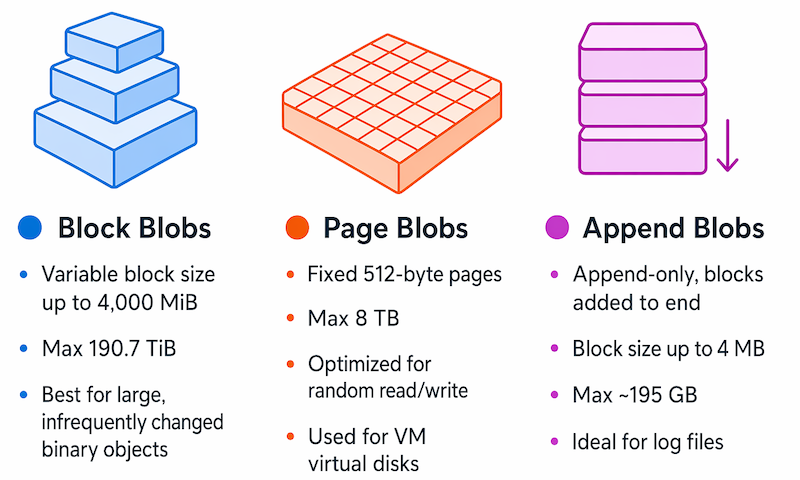

Blob Storage proporciona cuatro niveles de acceso, lo que ayuda a equilibrar la latencia de acceso y el costo de almacenamiento:

- El nivel Hot es el predeterminado. Este nivel se usa para los blobs a los que se accede con frecuencia. Los datos de tipo BLOB se alojan en medios de alto rendimiento.

- El nivel Cool tiene menores costes de almacenamiento, pero mayores costes de acceso que el nivel Hot. Use el nivel de acceso esporádico para los datos a los que se accede con poca frecuencia. Los datos deben permanecer en el nivel Cool durante un mínimo de 30 días para evitar penalizaciones de eliminación temprana. Es habitual que el acceso a los blobs recién creados sea más frecuente al principio y menos frecuente a medida que pasa el tiempo. En estas situaciones, puede crear el blob en la capa caliente, pero migrarlo a la capa fría más adelante. Puede migrar un blob del nivel de acceso esporádico al frecuente.

- El nivel Frío está optimizado para almacenar datos a los que rara vez se accede o modifica, pero todavía requiere una recuperación rápida. El nivel de acceso en frío tiene menores costes de almacenamiento y mayores costes de acceso en comparación con el nivel de acceso esporádico. Los datos deben permanecer en el nivel de frío durante un mínimo de 90 días para evitar penalizaciones de eliminación temprana. Use este nivel para datos como copias de seguridad a corto plazo, datos de recuperación ante desastres o grandes conjuntos de datos que necesitan almacenamiento rentable.

- El nivel Archivo proporciona el menor costo de almacenamiento, pero una mayor latencia. El nivel de acceso de archivo está pensado para los datos históricos que no deben perderse, pero que raramente se necesitan. Los datos deben permanecer en el nivel de archivo durante un mínimo de 180 días para evitar penalizaciones de eliminación anticipada. Los blobs del nivel de acceso de archivo se almacenan de forma eficaz en un estado sin conexión. La latencia de lectura típica para los niveles de acceso frecuente, esporádico y frío son unos pocos milisegundos, pero para el nivel de archivo, los datos pueden tardar hasta 15 horas en estar disponibles. Para recuperar un blob desde el nivel de acceso de archivo, debe cambiar el nivel de acceso a acceso frecuente, esporádico o en frío. Con ello, el blob se rehidratará. Solo puede leer el blob una vez que se ha completado el proceso de rehidratación.

<br>

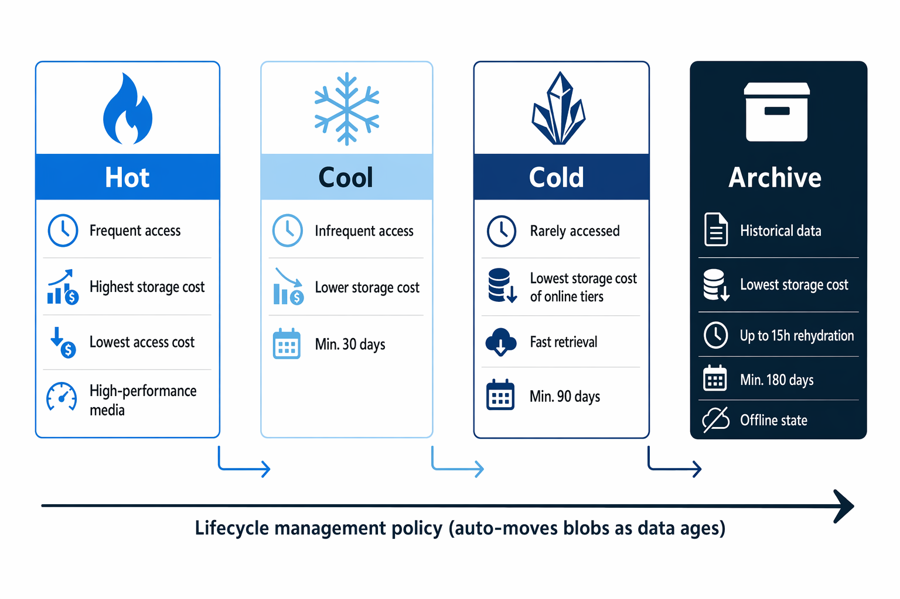

Puede crear directivas de administración del ciclo de vida para los blobs de una cuenta de almacenamiento. Una directiva de administración del ciclo de vida puede trasladar automáticamente un blob de acceso frecuente a acceso esporádico y en frío y, a continuación, al nivel de acceso de archivo, a medida que pasa el tiempo y se usa con menos frecuencia (la directiva se basa en el número de días transcurridos desde la última modificación). Una directiva de administración del ciclo de vida también puede organizarse para eliminar blobs obsoletos.

Azure Storage también proporciona opciones de redundancia integradas para mantener los datos de alta disponibilidad y protegidos contra errores. El almacenamiento con redundancia local (LRS) mantiene tres copias de los datos dentro de un único centro de datos. El almacenamiento con redundancia de zona (ZRS) distribuye copias en tres zonas de disponibilidad de la región primaria, por lo que los datos permanecen accesibles incluso si una zona deja de funcionar. Para la protección contra desastres regionales, el almacenamiento con redundancia geográfica (GRS) y el almacenamiento con redundancia de zona geográfica (GZRS) replican los datos de forma asincrónica en una región secundaria a cientos de kilómetros de distancia. También puede habilitar el acceso de lectura a la región secundaria (RA-GRS o RA-GZRS) para que la aplicación pueda leer datos de la región secundaria incluso antes de que se produzca una conmutación por error.

<br>

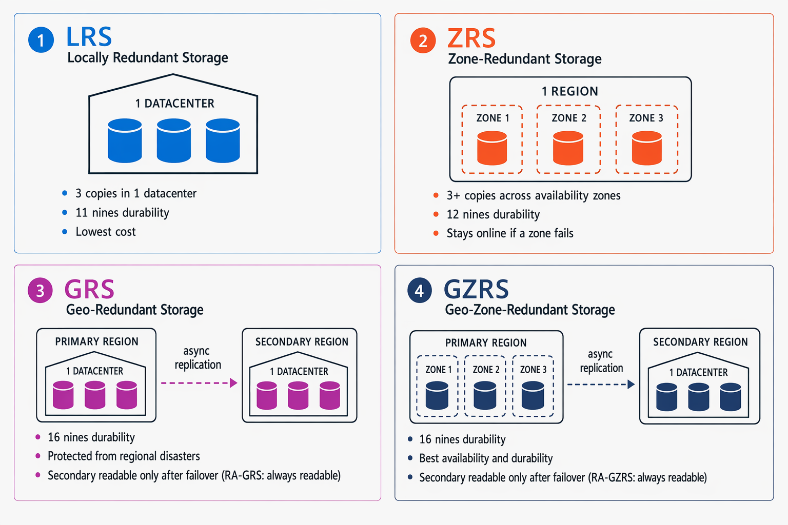

<br>

---

### Exploración de Azure Data Lake Storage Gen2

Azure Data Lake Storage Gen2 es una solución de lago de datos a escala en la nube integrada en Azure Storage. Combina la escalabilidad y el control de costos de los Azure Blob Storage, incluidos los niveles de almacenamiento y la administración del ciclo de vida, con un sistema de archivos jerárquico compatible con los principales sistemas de análisis.

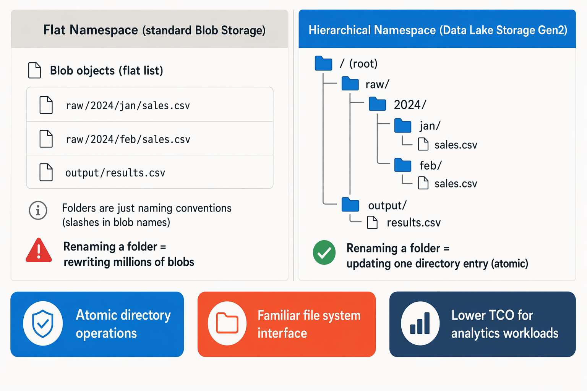

Los sistemas como Azure Databricks pueden montar un sistema de archivos distribuido hospedado en Azure Data Lake Storage Gen2 y usarlo para procesar grandes volúmenes de datos. Los inquilinos de Microsoft Fabric aprovisionan automáticamente OneLake, que está construido sobre Azure Data Lake Storage Gen2.

Para crear un sistema de archivos de Azure Data Lake Storage Gen2, debes habilitar la opción Espacio de nombres jerárquico de una cuenta de Azure Storage. Puede hacerlo al crear inicialmente la cuenta de almacenamiento o puede actualizar una cuenta de Azure Storage existente para admitir un espacio de nombres jerárquico. Tenga en cuenta que la actualización es un proceso unidireccional: después de la actualización, no se puede revertir la cuenta de almacenamiento a un espacio de nombres plano.

<br>

---

### Explorar Microsoft OneLake en Fabric

Microsoft Fabric aprovisiona automáticamente OneLake, basado en Azure Data Lake Gen 2.

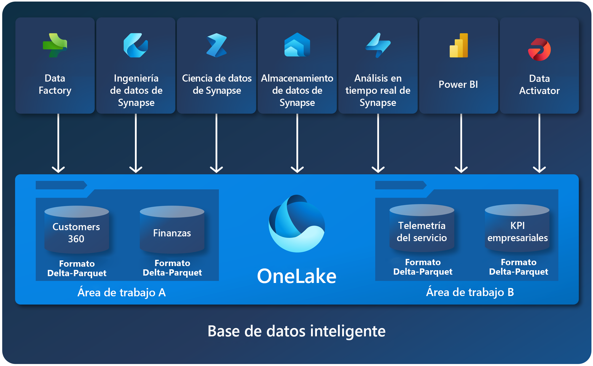

OneLake es un lago de datos único, unificado y lógico diseñado para toda su organización. OneLake viene automáticamente con todos los inquilinos de Microsoft Fabric y sirve como repositorio central para todos los datos de análisis. Ya sea estructurado o no estructurado, OneLake admite cualquier tipo de archivo y permite usar los mismos datos en varios motores analíticos sin movimiento de datos ni duplicación.

### Ventajas clave de OneLake
- Lago de datos de toda la organización Antes de OneLake, la creación de varios lagos de datos para diferentes grupos empresariales era común. Ahora, OneLake proporciona una solución colaborativa, lo que garantiza que toda la organización comparte un único lago de datos.

- Propiedad distribuida y colaboración Dentro de un inquilino, puede crear áreas de trabajo, lo que permite que diferentes partes de la organización administren sus elementos de datos. Esta propiedad distribuida promueve la colaboración al tiempo que mantiene los límites de gobernanza.

- Abierto y compatible Basado en Azure Data Lake Storage (ADLS) Gen2, OneLake almacena datos en formato Delta Parquet, un formato de archivo abierto y eficaz que se usa ampliamente para datos analíticos. Admite las API y los SDK de ADLS Gen2 existentes, lo que hace que sea compatible con las aplicaciones actuales.

- Fácil de navegar Es sencillo navegar por los datos de OneLake desde Windows mediante [el explorador de archivos oneLake](https://learn.microsoft.com/es-es/fabric/onelake/onelake-file-explorer).

Para obtener más información, vea [OneLake, OneDrive para obtener datos](https://learn.microsoft.com/es-es/fabric/onelake/onelake-overview).

<br>

---

### Explorar Azure Files

Muchos sistemas locales que incluyen una red de equipos internos usan recursos compartidos de archivos. Un recurso compartido de archivos le permite almacenar un archivo en un equipo y conceder acceso a ese archivo a usuarios y aplicaciones que se ejecutan en otros equipos. Esta estrategia puede funcionar bien para los equipos de la misma red de área local, pero no se escala bien, ya que el número de usuarios aumenta o si los usuarios se encuentran en diferentes sitios.

Azure Files es básicamente una manera de crear recursos compartidos de red basados en la nube, como normalmente se encuentran en organizaciones locales para que los documentos y otros archivos estén disponibles para varios usuarios. Al hospedar recursos compartidos de archivos en Azure, las organizaciones pueden eliminar los costos de hardware y la sobrecarga de mantenimiento, y beneficiarse de la alta disponibilidad y el almacenamiento en la nube escalable para los archivos.

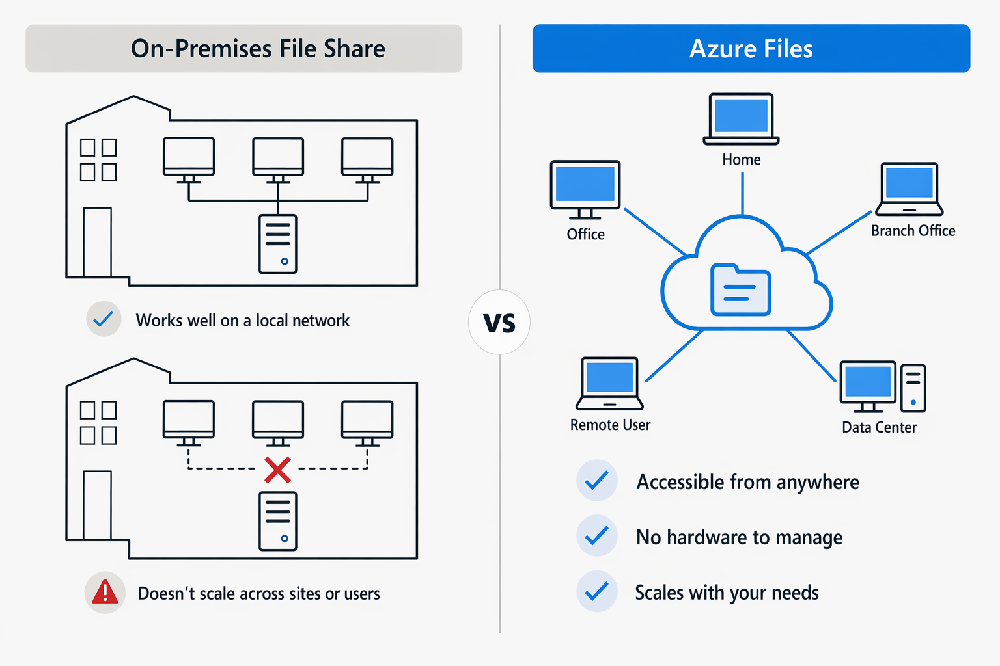

Puede crear Azure File Storage en una cuenta de almacenamiento. Azure Files permite compartir grandes cantidades de datos en una sola cuenta de almacenamiento, hasta 256 TiB para cuentas basadas en SSD e incluso más para cuentas basadas en HDD. Estos datos se pueden distribuir en cualquier número de comparticiones de archivos de la cuenta. El tamaño máximo de un solo archivo es 4 TiB, pero puede establecer cuotas para limitar el tamaño de cada recurso compartido por debajo de esta figura. Actualmente, Azure File Storage admite hasta 2000 identificadores simultáneos por archivo o directorio.

Después de crear una cuenta de almacenamiento, puede cargar archivos en Azure File Storage mediante Azure Portal o herramientas como la utilidad AzCopy . También puede usar el servicio Azure File Sync para sincronizar copias almacenadas en caché local de archivos compartidos con los datos de Azure File Storage.

<br>

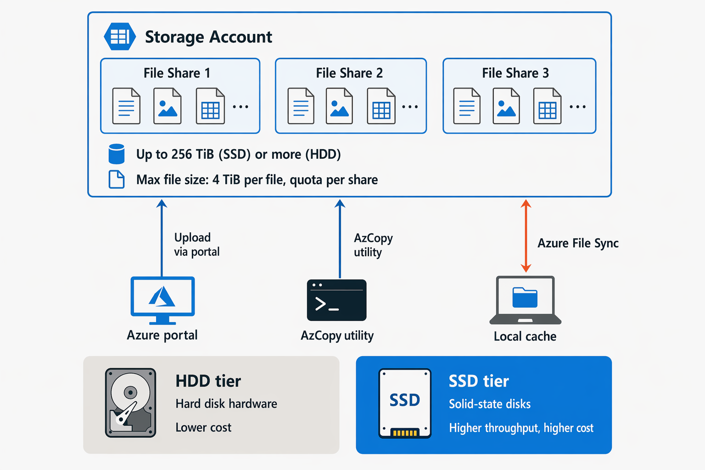

Azure File Storage ofrece dos niveles multimedia. El nivel HDD usa hardware basado en disco duro en un centro de datos y el nivel SSD usa discos de estado sólido. El nivel SSD ofrece un mayor rendimiento, pero se cobra a una tarifa superior.

Azure Files admite dos protocolos comunes de uso compartido de archivos de red:

- Server Message Block (SMB) el uso compartido de archivos se suele usar en varios sistemas operativos (Windows, Linux, macOS).

- Los recursos compartidos del sistema de archivos de red (NFS) se usan en Linux (kernel 4.3 o posterior). Los recursos compartidos de archivos Azure NFS no se admiten en Windows o macOS. Para crear un recurso compartido NFS, debe usar una cuenta de almacenamiento de capa SSD y crear y configurar una red virtual a través de la cual se puede controlar el acceso al recurso compartido.

<br>

---

### Exploración de tablas de Azure

Azure Table Storage es una solución de almacenamiento NoSQL que usa tablas que contienen key/value elementos de datos. Cada elemento se representa mediante una fila que contiene columnas para los campos de datos que deben almacenarse.

> ! Nota:
> 
> Los conceptos de esta unidad también se aplican a Azure Cosmos DB para Table, un servicio más reciente que almacena datos en el mismo formato de clave y valor, pero agrega un mayor rendimiento y disponibilidad global. En el caso de las nuevas cargas de trabajo, Azure Cosmos DB para Table es la opción recomendada.

Sin embargo, no se confunda al pensar que una tabla de Azure Table Storage es como una tabla de una base de datos relacional. Una tabla de Azure le permite almacenar datos semiestructurados. Todas las filas de una tabla deben tener una clave única (compuesta por una clave de partición y una clave de fila) y, al modificar los datos de una tabla, una columna de marca de tiempo registra la fecha y hora en que se realizó la modificación; pero aparte de eso, las columnas de cada fila pueden variar. Las tablas de Azure Table Storage no tienen los conceptos de claves externas, relaciones, procedimientos almacenados, vistas u otros objetos que puede encontrar en una base de datos relacional.

Los datos de Azure Table Storage suelen estar desnormalizados y cada fila contiene todos los datos de una entidad lógica. Por ejemplo, una tabla que contiene información del cliente puede almacenar el nombre, el nombre de familia, uno o varios números de teléfono y una o varias direcciones para cada cliente. El número de campos de cada fila puede ser diferente, en función de la cantidad de números de teléfono y direcciones de cada cliente, y de los detalles registrados para cada dirección. En una base de datos relacional, esta información se dividiría en varias filas de varias tablas.

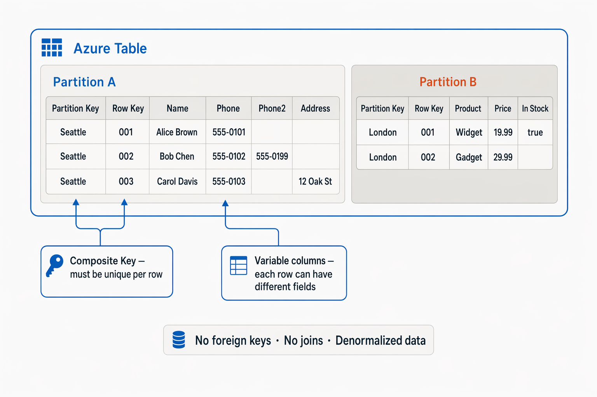

> ! Nota: 
> 
> Los precios que se muestran en este diagrama son ficticios y se usan únicamente con fines ilustrativos.

Para garantizar que el acceso sea rápido, Azure Table Storage divide una tabla en particiones. La partición es un mecanismo para agrupar filas relacionadas según la PartitionKey, un valor elegido para reflejar una propiedad común de las filas relacionadas. Las filas que comparten la misma clave de partición se almacenan juntas. Además de ayudar a organizar los datos, la creación de particiones también puede mejorar la escalabilidad y el rendimiento de las siguientes formas:

- Las particiones son independientes entre sí, y pueden agrandarse o reducirse a medida que se agregan o se quitan filas de una partición. Una tabla puede contener cualquier número de particiones.

- Al buscar datos, puede incluir la clave de partición en los criterios de búsqueda. Esto ayuda a reducir el volumen de datos que se va a examinar y mejora el rendimiento, ya que reduce la cantidad de E/S (operaciones de entrada y salida o lecturas y escrituras) necesaria para localizar los datos.

La clave de una tabla de Azure Table Storage consta de dos elementos; la clave partition que identifica la partición que contiene la fila y una clave row que es única para cada fila de la misma partición. Los elementos de una misma partición se almacenan en el orden de las claves de fila. Si una aplicación agrega una nueva fila a una tabla, Azure garantiza que la fila se coloca en la posición correcta de la tabla. Este esquema permite que una aplicación realice rápidamente consultas de punto, que identifican una sola fila, y consultas por rango, que capturan un bloque contiguo de filas en una partición.

<br>

---

### Ejercicio: Exploración de Azure Storage

Ahora es su oportunidad para explorar Azure Storage.

> ! Nota: 
> 
> Para completar este laboratorio, necesitará una suscripción de Azure en la que tenga acceso administrativo.

Inicie el ejercicio y siga las instrucciones.

[Launch Exercise]([https://](https://go.microsoft.com/fwlink/?linkid=2261876))

<br>

---

### Resumen

Azure Storage es un servicio clave de Microsoft Azure y permite una amplia gama de soluciones y escenarios de almacenamiento de datos.

En este módulo ha aprendido a:

- Descripción de las características y funcionalidades de Azure Blob Storage
- Descripción de las características y funcionalidades de Azure Data Lake Gen2
- Describir las características y funcionalidades de Microsoft OneLake
- Descripción de las características y funcionalidades de Azure File Storage
- Descripción de las características y funciones de Azure Table Storage
- Aprovisionamiento y uso de una cuenta de Azure Storage

<br>

---

---

## Exploración de los aspectos básicos de Azure Cosmos DB

Azure Cosmos DB proporciona un almacén altamente escalable para datos no rerelationales.

### Objetivos de aprendizaje
En este módulo, ha aprendido a hacer lo siguiente:
- Describir las funcionalidades y características clave de Azure Cosmos DB
- Identificar las API admitidas en Azure Cosmos DB
- Aprovisione y explore una base de datos de Azure Cosmos DB.

<br>

---

### Introducción

Las bases de datos relacionales almacenan datos en tablas relacionales, pero a veces la estructura que impone este modelo puede ser demasiado rígida y, a menudo, conduce a un rendimiento deficiente a menos que dedique tiempo a implementar un ajuste detallado. Existen otros modelos, denominados colectivamente bases de datos NoSQL. Estos modelos almacenan datos en otras estructuras, como documentos, gráficos, almacenes de clave-valor y almacenes de familias de columnas.

Azure Cosmos DB es un servicio de base de datos en la nube altamente escalable para datos NoSQL.

<br>

---

### Descripción de Azure Cosmos DB

En la unidad anterior, ha aprendido que Azure Cosmos DB es un servicio de base de datos en la nube altamente escalable para NoSQL datos. En esta unidad, explorará lo que hace que sea diferente de las bases de datos relacionales tradicionales, cómo organiza los datos internamente y cuándo es la opción adecuada para la aplicación.

#### ¿Qué es Azure Cosmos DB?

Azure Cosmos DB es un servicio de base de datos NoSQL totalmente administrado en Azure, una oferta de plataforma como servicio (PaaS). Microsoft controla toda la infraestructura subyacente: aprovisionamiento de servidores, aplicación de revisiones, actualizaciones y copias de seguridad. Se centra en la lógica de la aplicación mientras Cosmos DB controla la sobrecarga operativa.

Cosmos DB es independiente del esquema. Los elementos almacenados en el mismo contenedor no necesitan compartir la misma estructura. Un elemento puede tener cinco propiedades; otro en el mismo contenedor podría tener 15 completamente diferentes. Esta flexibilidad hace que Cosmos DB sea adecuado para las aplicaciones en las que las formas de datos cambian con el tiempo o varían entre registros.

Microsoft usa Cosmos DB internamente para algunos de sus servicios más exigentes, como Xbox Live, Microsoft 365 y las partes principales de Azure. Esos servicios administran colectivamente miles de millones de operaciones al día, lo que le da una idea de la escala para la que se crea Cosmos DB.

#### Cómo Azure Cosmos DB organiza los datos

Cosmos DB usa una jerarquía de recursos de cuatro niveles para organizar los datos:
- Account: recurso de Azure de nivel superior. Una sola cuenta puede contener bases de datos ilimitadas.
- Base de datos: un espacio de nombres lógico que agrupa los contenedores relacionados.
- Contenedor: la unidad principal de almacenamiento y escalado. Configure la clave de partición, el rendimiento, la directiva de indexación y un período de vida opcional (TTL) en el nivel de contenedor.
- Elementos: entidades de datos individuales almacenadas dentro de un contenedor. En función de la API que use, los elementos se pueden llamar documentos, filas, nodos o bordes.

La clave de partición es una propiedad que elige distribuir datos entre particiones lógicas. Cada partición lógica puede hospedar un máximo de 20 GB de datos. Una clave de partición bien elegida( una con muchos valores distintos e incluso una distribución de datos entre esos valores) es importante para mantener el rendimiento equilibrado a medida que crece la base de datos.

<br>

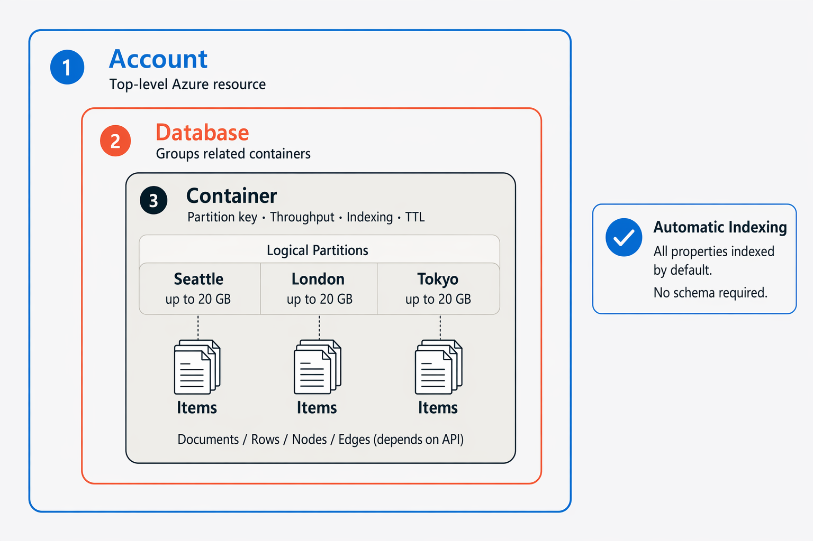

Cosmos DB crea y mantiene automáticamente índices en todas las propiedades de elemento de forma predeterminada. No es necesario definir un esquema por adelantado ni administrar índices manualmente; el servicio controla ambos.

#### Distribución global y rendimiento

Cosmos DB se ha creado para la distribución global. Agregue regiones de Azure a su cuenta en cualquier momento y el servicio replica sus datos automáticamente en cada una. Los usuarios de diferentes ubicaciones leen y escriben en la réplica regional más cercana, lo que mantiene la latencia baja independientemente de dónde estén.

Las cuentas de escritura en varias regiones proporcionan garantías de alta disponibilidad. En el percentil 99, las lecturas suelen completarse en alrededor de 4 milisegundos y escrituras en alrededor de 5 milisegundos.

Dado que las réplicas existen en varias regiones, debe decidir cómo deben estar las réplicas coherentes entre sí. Cosmos DB ofrece cinco niveles de coherencia para que pueda optimizar ese equilibrio:

Las réplicas convergen con el tiempo; la garantía más débil, pero la mayor disponibilidad.

| Nivel de coherencia | Descripción |
|---------------------|-------------|
| Fuerte | Cada lectura refleja la escritura más reciente. |
| Obsolescencia limitada | Las lecturas van por detrás de las escrituras en un intervalo configurable (tiempo o número de versiones). |
| Sesión | La coherencia se garantiza dentro de una sola sesión de cliente. Este es el nivel más usado. |
| Prefijo coherente | Las lecturas nunca ven escrituras desordenadas, pero pueden ver datos obsoletos.  |
| Eventual | Las réplicas convergen con el tiempo; la garantía más débil, pero la mayor disponibilidad. |
| | |

Para la mayoría de las aplicaciones transaccionales, la coherencia de sesión es el punto de partida recomendado.

<br>

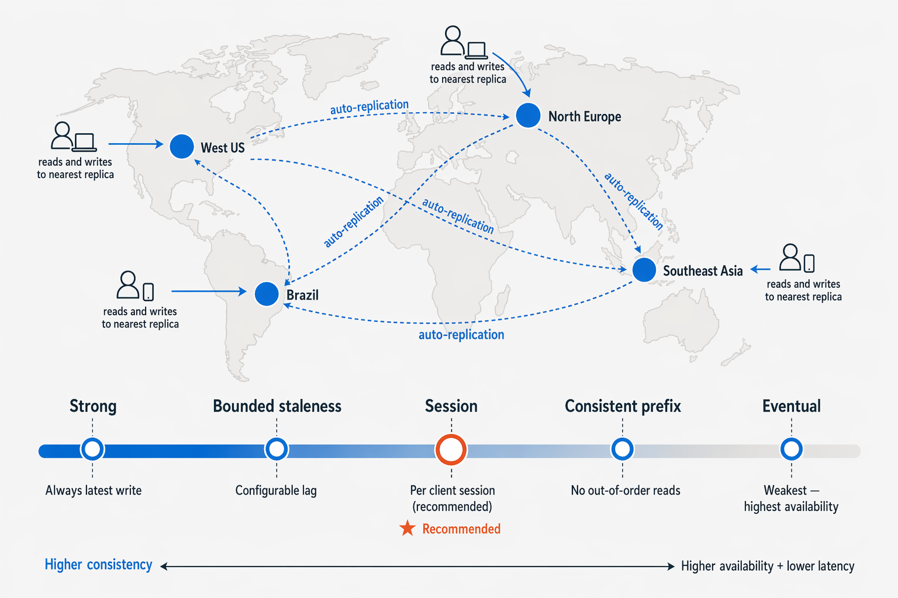

#### Modos de rendimiento y precios

Cosmos DB mide la capacidad en unidades de solicitud por segundo (RU/s). Una RU/s equivale aproximadamente al costo de leer un elemento de 1 KB. Cada operación (lecturas, escrituras, consultas y eliminaciones) consume cierto número de RU/s, lo que proporciona una única métrica para razonar sobre el rendimiento y el costo.

Hay tres modos de rendimiento disponibles:

| Modo de rendimiento | Descripción |
|---------------------|-------------|
| Dedicado | El rendimiento se reserva exclusivamente para un único contenedor. |
| compartido | El rendimiento se asigna a nivel de base de datos y se comparte entre un máximo de 25 contenedores. |
| Sin servidor | No es necesario aprovisionar capacidad de procesamiento por adelantado; solo se paga por cada solicitud. Ideal para cargas de trabajo con tráfico imprevisible o bajo. |
| | |

<br>

> ! Nota:
> 
> Las cuentas sin servidor se limitan a una sola región de Azure. Si la aplicación requiere distribución global entre varias regiones, use en su lugar una cuenta de rendimiento aprovisionada.

La opción de escalabilidad automática le permite establecer un máximo de RU/s y Cosmos DB ajusta automáticamente la capacidad dentro de ese intervalo en función de la demanda real.

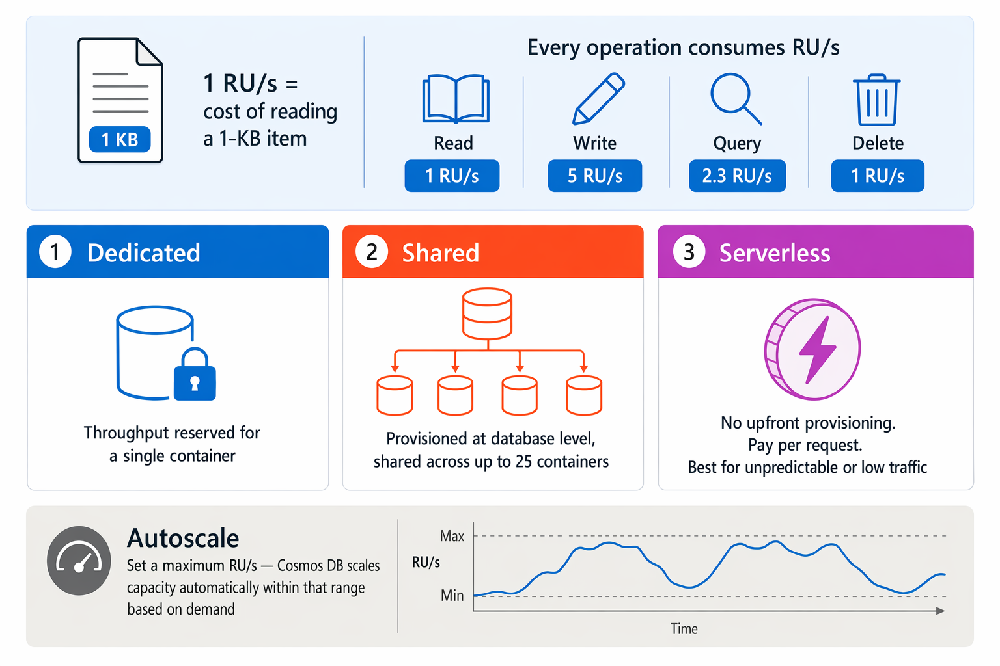


#### Cuándo usar Cosmos DB

Cosmos DB es una opción segura para las aplicaciones que necesitan esquema flexible, alcance global y latencia baja coherente:
- IoT y telemetría: ingesta rápida de datos de dispositivos de alta frecuencia, disponibles para el procesamiento casi en tiempo real.
- Juegos: perfiles de jugador, tablas de clasificación y estadísticas en el juego que requieren tiempos de respuesta de milisegundos de un solo dígito.
- Comercio minorista y comercio electrónico: catálogos de productos, carros de compras y canalizaciones de pedidos a cualquier escala.
- Aplicaciones web y móviles: experiencias de usuario personalizadas, características sociales e integraciones de terceros.

Algunas cargas de trabajo no son una buena opción. Si la aplicación depende de combinaciones complejas de varias tablas, Azure SQL Database es más adecuada. En el caso del análisis histórico a gran escala, considere Microsoft Fabric o Azure Synapse Analytics en su lugar.

En la unidad siguiente, verá las distintas API compatibles con Cosmos DB y cómo cada una le permite trabajar con los datos mediante herramientas conocidas y lenguajes de consulta.

<br>

---

### Identificación de las API de Azure Cosmos DB

En la unidad anterior, ha explorado qué es Azure Cosmos DB y cómo organiza los datos. Una de sus características más prácticas es que no le bloquea en un solo lenguaje de consulta o modelo de datos. En su lugar, Cosmos DB expone varias API compatibles con el protocolo de conexión para que los desarrolladores usen herramientas, bibliotecas y sintaxis conocidas para trabajar con sus datos, incluso cuando se migra una aplicación existente.

### ¿Por qué Cosmos DB admite varias API?

Al crear una cuenta de Cosmos DB, elija la API que se va a usar. Esa opción determina cómo interactúa la aplicación con la base de datos: con qué formato de datos envía, con qué lenguaje de consulta usa y con qué bibliotecas cliente funciona. Internamente, Cosmos DB almacena datos en su propio formato; la API actúa como una capa de abstracción en la parte superior.

La principal ventaja es la portabilidad. Si el equipo ya tiene una aplicación basada en MongoDB o Apache Cassandra, puede apuntarla en Cosmos DB con cambios mínimos de código y obtener una distribución global, un rendimiento administrado y las ventajas inherentes del Acuerdo de Nivel de Servicio en el proceso.

Las cinco API admitidas son: **NoSQL, MongoDB, Table, Apache Cassandra y Apache Gremlin**. Cada uno está diseñado para un tipo diferente de datos o caso de uso.

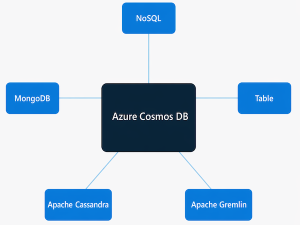

<br>

### Cosmos DB para NoSQL

Azure Cosmos DB para NoSQL es la API nativa de Cosmos DB. Almacena datos como documentos JSON y le permite consultar con una sintaxis similar a SQL.

> ! Nota:
>
> Esta API se llamó anteriormente a la API de SQL. Se cambió el nombre a la API de NoSQL en 2023. Si ve documentación anterior que hace referencia a la "API de SQL", es el mismo servicio.

Se recomienda la API de NoSQL para las nuevas aplicaciones.

Una consulta tiene este aspecto:

SQL
---
```sql
SELECT *
FROM customers c
WHERE c.id = "joe@litware.com"
```

El resultado es un documento JSON:

JSON
---
```json
{
    "id": "joe@litware.com",
    "name": "Joe Jones",
    "address": {
        "street": "1 Main St.",
        "city": "Seattle"
    }
}
```
<br>

>  Sugerencia
> 
> Cosmos DB para NoSQL admite la duplicación de Fabric, que replica automáticamente los datos operativos en Microsoft Fabric, sin necesidad de canalizaciones. Esto facilita la ejecución de análisis en datos activos sin afectar a la carga de trabajo transaccional.

### Cosmos DB for MongoDB

Azure Cosmos DB para MongoDB es compatible con controladores y bibliotecas cliente de MongoDB, por lo que las aplicaciones de MongoDB existentes pueden conectarse a Cosmos DB sin cambios significativos en el código.

Los datos se almacenan en formato BSON (JSON binario: una codificación binaria de JSON) y las consultas usan el lenguaje de consulta mongoDB (MQL), una sintaxis compacta orientada a objetos donde se llama a métodos en objetos de colección. Para buscar un producto por identificador:

JavaScript
---
```javascript
db.products.find({id: 123})
```

Resultado:

JSON
---
```json
{
   "id": 123,
   "name": "Hammer",
   "price": 2.99
}
```

Esta API es una opción natural cuando el equipo ya tiene experiencia en MongoDB o cuando va a migrar una carga de trabajo de MongoDB existente a un servicio en la nube administrado.

### Cosmos DB para Table

Azure Cosmos DB para Table almacena datos como pares clave-valor en tablas, con el mismo modelo de programación que Azure Table Storage. Si ya tiene una aplicación de Azure Table Storage, puede conectarse a Cosmos DB para Table con cambios mínimos de código.

Lo que gana en comparación con Azure Table Storage incluye mayor escalabilidad, distribución global, índices secundarios automáticos y escalabilidad automática instantánea. Una tabla podría tener este aspecto:

---
| Clave de Partición | RowKey |	Nombre | Correo electrónico |
|--------------------|--------|--------|--------------------|
| 1 | 123 |	Joe Jones |	joe@litware.com |
| 1	| 124 |	Samir | Nadoy | samir@northwind.com |
---

Cada fila se identifica mediante una combinación PartitionKey y RowKey . Puede recuperar una fila específica a través de un punto de conexión de estilo REST:

text
---
```text
https://endpoint/Customers(PartitionKey='1',RowKey='124')
```

<br>

> ! Sugerencia 
> 
> Azure Table Storage sigue estando disponible y compatible, pero Cosmos DB para Table es la opción recomendada para las nuevas cargas de trabajo que necesitan almacenamiento de clave-valor a escala.

### Cosmos DB para Apache Cassandra

Azure Cosmos DB para Apache Cassandra es compatible con Apache Cassandra, una base de datos de código abierto que usa un modelo de almacenamiento de familia de columnas. En las tablas de familia de columnas, las filas no tienen que contener las mismas columnas, a diferencia de una tabla relacional en la que el esquema se fija para todas las filas.

Por ejemplo, una tabla Employees podría tener este aspecto:

---
| ID |	Nombre | Gestor |
|----|---------|--------|
| 1 | Sue Smith | |
| 2	| Ben Chan | Sue Smith |
---

Cassandra usa CQL (lenguaje de consulta de Cassandra), que tiene una sintaxis similar a SQL. Para recuperar un registro específico:

SQL
---
```sql
SELECT * FROM Employees WHERE ID = 2
```

Esta API es una buena opción para los equipos que migran una carga de trabajo de Apache Cassandra a una base de datos en la nube totalmente administrada.

### Cosmos DB for Apache Gremlin

Azure Cosmos DB para Apache Gremlin está diseñado para trabajar con datos de grafos, un modelo en el que las entidades se representan como vértices (nodos) y las relaciones como aristas. Las bases de datos de grafos son útiles cuando las conexiones entre los datos son tan importantes como los propios datos: piense en redes sociales, motores de recomendaciones, detección de fraudes y jerarquías organizativas.

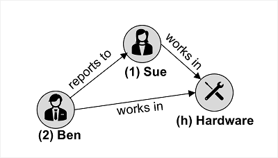

En el ejemplo anterior, los vértices de empleados y departamentos están conectados por aristas que representan relaciones jerárquicas y la pertenencia al departamento.

Gremlin es el lenguaje de consulta que se usa para atravesar y manipular datos de grafos. Para agregar un vértice de empleado y conectarlo a uno existente:

apache
---
```apache
g.addV('employee').property('id', '3').property('firstName', 'Alice')
g.V('3').addE('reports to').to(g.V('1'))
```

Para recuperar todos los vértices del empleado en orden de identificación:

apache
---
```apache
g.V().hasLabel('employee').order().by('id')
```

Con cinco API entre las que elegir, puede hacer coincidir la interfaz de Cosmos DB con el modelo de datos, las aptitudes existentes del equipo y el código de la aplicación. En la unidad siguiente, obtendrá experiencia práctica con Cosmos DB directamente.

<br>

---

### Ejercicio: exploración de Azure Cosmos DB

Ahora es su oportunidad para explorar Azure Cosmos DB.

> ! Nota:> 
> 
> Para completar este laboratorio, necesitará una suscripción de Azure en la que tenga acceso administrativo.

Inicie el ejercicio y siga las instrucciones.

[Launch Exercise](https://microsoftlearning.github.io/DP-900T00A-Azure-Data-Fundamentals/Instructions/Labs/dp900-03-cosmos-lab.html)

<br>

---

### Resumen

Azure Cosmos DB proporciona una solución de base de datos de escala global para datos no rerelationales.

En este módulo, ha aprendido a:

- Describir e las características y funcionalidades clave de Azure Cosmos DB
- Identificación de las API de Azure Cosmos DB
- Aprovisionar y usar una instancia de Azure Cosmos DB


<br>

---