# Índice

Ruta de aprendizaje - 3 módulos

1. [Exploración de los aspectos básicos del análisis a gran escala](#exploración-de-los-aspectos-básicos-del-análisis-a-gran-escala)
2. [Exploración de los aspectos básicos del análisis en tiempo real](#exploración-de-los-aspectos-básicos-del-análisis-en-tiempo-real)
3. [Exploración de los aspectos básicos de la visualización de datos](#exploración-de-los-aspectos-básicos-de-la-visualización-de-datos)

 

---

 

# Introducción al análisis de datos en Microsoft Azure

El crecimiento exponencial de los datos en los últimos años está impulsando la transformación digital de empresas y otras organizaciones, ya que les permite tomar de decisiones de forma rápida e informada a través del análisis de datos. Microsoft Azure proporciona varios servicios que puede combinar para crear soluciones de análisis a gran escala que aprovechen las tecnologías y técnicas más recientes para la ingesta, el almacenamiento, el modelado y la visualización de datos. Esta ruta de aprendizaje lo ayuda a prepararse para la certificación [Azure Data Fundamentals](https://learn.microsoft.com/es-es/certifications/azure-data-fundamentals?azure-portal=true).

### Requisitos previos
Antes de iniciar esta ruta de aprendizaje, debe tener un conocimiento fundamental de los conceptos básicos de los datos, los datos relacionales y los datos no relacionales.

 

---

# Exploración de los aspectos básicos del análisis a gran escala

Las organizaciones usan plataformas de análisis para crear soluciones de análisis de datos a gran escala que generan conclusiones e impulsan el éxito. Microsoft proporciona varias tecnologías que puede combinar para crear una solución de análisis de datos a gran escala.

Objetivos de aprendizaje
En este módulo aprenderá a:
- Descripción de la arquitectura de un almacenamiento de datos.
- Describir las características clave de las canalizaciones de ingesta de datos.
- Identificar tipos comunes de almacén de datos analíticos y servicios de Azure relacionados.
- Uso de Microsoft Fabric para ingerir y analizar datos.

### Requisitos previos

Antes de iniciar este módulo, debe tener un conocimiento conceptual de los datos y las bases de datos, y estar familiarizado con los servicios de Microsoft Azure para cargas de trabajo de datos como Azure Storage, Azure SQL Database y Azure Cosmos DB.

 

---

## Introducción

Antes de explorar cómo se crean las soluciones de análisis a gran escala, vamos a presentar las dos principales plataformas de análisis de Azure que encontrará a lo largo de este módulo.

Microsoft Fabric es Microsoft plataforma unificada de análisis de software como servicio (SaaS). Ofrece ingeniería de datos, almacenamiento de datos, análisis en tiempo real, ciencia de datos y Power BI juntos en un único área de trabajo basada en explorador sobre una capa de almacenamiento compartida denominada OneLake. No administra servidores ni clústeres, crea áreas de trabajo y elementos y Microsoft ejecuta la infraestructura.

Azure Databricks es una plataforma de análisis en la nube basada en Apache Spark. Está optimizado para la ingeniería de datos a gran escala, la ciencia de datos y el análisis de SQL a través de formatos abiertos de almacén de lago de datos. Utiliza Delta Lake —un formato de almacenamiento de código abierto que añade transacciones, aplicación de esquemas y control de versiones sobre los archivos Parquet—, lo que te proporciona la fiabilidad propia de un lakehouse a escala. Databricks se ejecuta como un servicio administrado dentro de tu suscripción de Azure y es una opción habitual para los equipos que necesitan flujos de trabajo centrados en el código con Spark y basados en cuadernos interactivos.

### Análisis a gran escala

Las soluciones de análisis de datos a gran escala combinan el almacenamiento de datos convencional que se usa para admitir inteligencia empresarial (BI) con técnicas usadas para el análisis de macrodatos. Normalmente, una solución de almacenamiento de datos convencional implica copiar datos de almacenes de datos transaccionales en una base de datos relacional con un esquema optimizado para consultar y crear modelos multidimensionales. Las soluciones de procesamiento de macrodatos se usan con grandes volúmenes de datos en varios formatos, que se cargan o capturan por lotes en flujos en tiempo real y se almacenan en un lago de datos desde el que los motores de procesamiento distribuidos como Apache Spark los procesan.

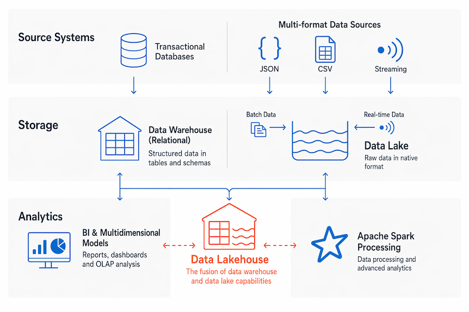

 

La combinación de almacenamiento de lago de datos flexible y análisis de SQL de almacenamiento de datos ha llevado a la aparición de un diseño de análisis a gran escala a menudo denominado almacenamiento de datos.

> ! Nota: 
> 
> Reconocemos que a diferentes personas les gusta aprender de diferentes maneras. Puede optar por completar este módulo en formato basado en vídeo o puede leer el contenido como texto e imágenes. El texto contiene más detalle que los vídeos, por lo que, en algunos casos, es posible que desee hacer referencia a él como material complementario para la presentación de vídeo.

 

---

## Descripción de la arquitectura de un almacenamiento de datos

La arquitectura de análisis de datos a gran escala puede variar, al igual que las tecnologías específicas que se usan para implementarla, pero, en general, se incluyen los siguientes elementos:

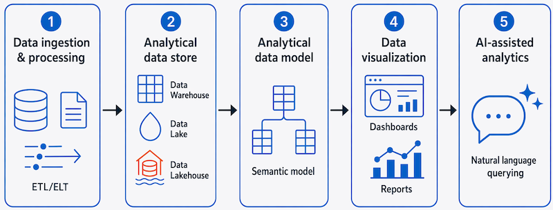

 

1. Ingesta y procesamiento de datos: los datos de uno o varios almacenes de datos transaccionales, archivos, secuencias en tiempo real u otros orígenes se cargan en un lago de datos o en un almacenamiento de datos relacional. La operación de carga normalmente implica un proceso de extracción, transformación y carga (ETL) o extracción, carga y transformación (ELT) en el que los datos se limpian, filtran y reestructuran para su análisis. En los procesos de ETL, los datos se transforman antes de cargarse en un almacén analítico, mientras que en un proceso de ELT los datos se copian en el almacén y, posteriormente, se transforman. En cualquier caso, la estructura de datos resultante está optimizada para las consultas analíticas. El procesamiento de datos suele realizarse mediante sistemas distribuidos que pueden procesar grandes volúmenes de datos en paralelo mediante clústeres de varios nodos. La ingesta de datos incluye el procesamiento por lotes de datos estáticos y el procesamiento en tiempo real de los datos de streaming.

2. Almacén de datos analíticos: los almacenes de datos para análisis a gran escala incluyen almacenes de datos relacionales, lagos de datos basados en el sistema de archivos y arquitecturas híbridas que combinan características de almacenes de datos y lagos de datos (a veces denominados almacenes de lago de datos o bases de datos de lago). Los trataremos con más detalle más adelante.

3. Modelo de datos analíticos: aunque los analistas de datos y los científicos de datos pueden trabajar con los datos directamente en el almacén de datos analíticos, es habitual crear uno o varios modelos de datos para facilitar la generación de informes, paneles y visualizaciones interactivas. Históricamente, estos modelos se describieron como cubos, en los que los valores de datos numéricos se agregaron previamente en una o varias dimensiones (por ejemplo, ventas totales por producto y región) mediante tecnologías como SQL Server Analysis Services (SSAS) Multidimensional. En la actualidad, el enfoque preferido es un modelo semantic, el modelo tabular que sustenta Power BI y Microsoft Fabric. Un modelo semántico define tablas, relaciones, jerarquías y medidas escritas en DAX (expresiones de análisis de datos, un lenguaje de fórmulas que se usa para definir cálculos), con agregaciones calculadas en tiempo de consulta en lugar de almacenadas de antemano. En Microsoft Fabric, los modelos semánticos pueden usar Direct Lake modo para leer tablas delta de OneLake directamente, sin importar ni agregar datos previamente.

4. Visualización de datos: los analistas de datos consumen datos de modelos analíticos y directamente desde almacenes analíticos para crear informes, paneles y otras visualizaciones. Además, los usuarios de una organización, que pueden no ser profesionales de la tecnología, pueden realizar informes y análisis de datos de autoservicio. Las visualizaciones de datos muestran tendencias, comparaciones e indicadores clave de rendimiento (KPI) para una empresa u otra organización, y pueden adoptar la forma de informes impresos, gráficos y diagramas en documentos o presentaciones de PowerPoint, paneles web y entornos interactivos en los que los usuarios pueden explorar visualmente los datos.

5. Análisis asistido por inteligencia artificial: las organizaciones amplían cada vez más la pila de análisis con funcionalidades de lenguaje natural e inteligencia artificial. En Power BI, la característica Q&A permite a los usuarios escribir preguntas en lenguaje natural y recibir respuestas en forma de gráfico. Copilot en Microsoft Fabric permite a los usuarios describir lo que quieren en lenguaje natural; Copilot luego genera medidas DAX, escribe consultas SQL, resume informes y explica las tendencias de datos. En Azure Databricks, Genie proporciona una funcionalidad similar sobre los datos de Delta Lake: los usuarios hacen preguntas en lenguaje natural en una interfaz conversacional y Genie genera y ejecuta sql. Estas características amplían el autoservicio analítico a los usuarios que no escriben consultas ni compilan informes. 

### La pila de análisis moderna en Azure

Azure proporciona dos plataformas líderes para el análisis a gran escala: Microsoft Fabric y Azure Databricks. Ambos admiten la arquitectura de análisis completa descrita anteriormente, pero tienen enfoques diferentes.

### Microsoft Fabric

Microsoft Fabric organiza todas estas capas en un único área de trabajo de SaaS unificada. El almacenamiento lo proporciona OneLake, un lago de datos de todo el inquilino que comparten todas las cargas de trabajo de Fabric. En lugar de copiar datos entre silos de almacenamiento, cada servicio de Fabric lee y escribe directamente en OneLake, utilizando Delta Lake como formato estándar de código abierto para los datos de lakehouse.

Dentro de un área de trabajo de Fabric, los componentes principales se asignan a las capas de arquitectura anteriores:

- **Fabric Lakehouse**: combina el almacenamiento de tipo lago de datos con consultas SQL; los datos se almacenan en formato Delta Lake y se presentan a través de un punto de conexión de análisis SQL.
- **Fabric Warehouse**: un almacenamiento de datos relacionales totalmente administrado y compatible con SQL Server para análisis estructurados con aplicación de esquemas sólida.
- **Fabric Data Factory**: compila y programa canalizaciones y transformaciones de poco código para la ingesta y el movimiento de datos.
- **Power BI**: ofrece informes, paneles y modelos semánticos; Direct Lake modo lee las tablas Delta de OneLake directamente sin importar ni actualizar los datos.

### Azure Databricks

Azure Databricks es una plataforma de análisis en la nube basada en Apache Spark, optimizada para la ingeniería de datos a gran escala, la ciencia de datos y el análisis de SQL. Se ejecuta como servicio administrado dentro de la suscripción de Azure y usa Delta Lake como formato de almacenamiento abierto nativo.

Los componentes principales de Azure Databricks son:

- **Databricks Lakehouse**: una capa de almacenamiento unificada basada en Delta Lake que admite cargas de trabajo de aprendizaje automático y análisis de SQL en el mismo entorno.
- **Databricks SQL**: una instancia de SQL Warehouse sin servidor para ejecutar consultas analíticas directamente en tablas delta, con historial de consultas integrado, paneles y alertas.
- **Databricks Notebooks**: cuadernos de colaboración Python, SQL, Scala y R para canalizaciones de ingeniería de datos, análisis exploratorio y aprendizaje automático.
- **Catálogo de Unity**: una capa de gobernanza unificada para los recursos de inteligencia artificial y datos en el área de trabajo de Databricks, lo que proporciona un control de acceso específico, linaje de datos y detección.
- **Genie**: una interfaz conversacional con tecnología de inteligencia artificial que permite a los usuarios hacer preguntas en lenguaje natural sobre sus datos; Genie genera y ejecuta SQL automáticamente, devolviendo resultados sin necesidad de escribir ninguna consulta.

 

---

### Exploración de canalizaciones de ingesta de datos

Ahora que comprende la arquitectura de una solución de almacenamiento de datos a gran escala, es el momento de explorar cómo se ingieren los datos en un almacén de datos analíticos de uno o varios orígenes.

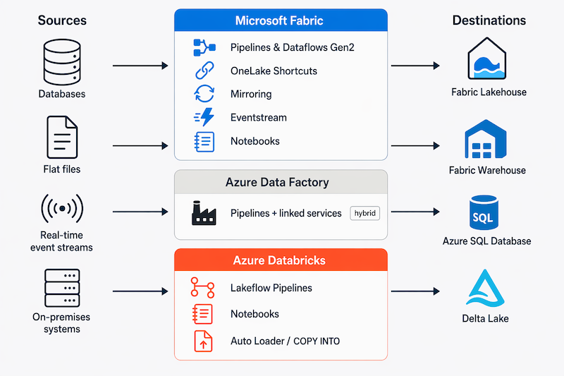

 

### Microsoft Fabric

Microsoft Fabric ofrece varias formas de llevar datos a OneLake, desde ETL basado en canalizaciones hasta federación sin copia y streaming en tiempo real.

### Fábrica de Datos de Fabric

Fabric Data Factory es el punto de partida recomendado para la ingesta basada en canalizaciones. Ofrece dos herramientas complementarias:

- **Canalizaciones**: orquestan flujos de trabajo de varios pasos para el movimiento y la transformación de datos, encadenando actividades que se ejecutan de forma secuencial o en paralelo.
- **Dataflows Gen2**: una experiencia visual de poco código para crear lógica de transformación de datos reutilizable mediante Power Query, sin escribir código.

Las canalizaciones constan de una o varias actividades que operan sobre datos. Un conjunto de datos de entrada proporciona los datos de origen y las actividades se pueden definir como un flujo de datos que manipula incrementalmente los datos hasta que se genera un conjunto de datos de salida. Las canalizaciones usan servicios vinculados para conectarse a orígenes y destinos, lo que permite cargar datos, ejecutar procedimientos almacenados, invocar cuadernos y aplicar lógica personalizada en un único flujo de trabajo. Puede guardar la salida en un Microsoft Fabric Lakehouse o Warehouse, o en cualquier otro destino admitido. Las canalizaciones también pueden incluir actividades integradas que no requieren un servicio vinculado.

### Accesos directos de OneLake

Un acceso directo es una referencia dinámica al almacenamiento externo: ADLS Gen2, Amazon S3, Google Cloud Storage u otra ubicación de OneLake. En lugar de copiar datos en Fabric, un acceso directo permite que los datos externos aparezcan como si ya estuvieran en tu Lakehouse. Sin canalizaciones, sin movimiento ni duplicación. Esto resulta especialmente útil cuando los datos deben permanecer en su ubicación original por motivos de cumplimiento o costo, pero deben consultarse desde Fabric.

### Mirroring

Creación de reflejos de Fabric replica continuamente una base de datos externa, Azure SQL Database, Snowflake, Azure Cosmos DB, entre otras, directamente en OneLake en tiempo casi real. La conexión de origen se configura una vez y Fabric controla el seguimiento de cambios y la replicación automáticamente, sin ninguna creación de canalizaciones. Los datos replicados llegan en formato Delta Lake y se pueden consultar inmediatamente a través del punto de conexión de SQL Analytics de Lakehouse.

### Eventstream

Para la ingesta de streaming en tiempo real, **Fabric Eventstream** se conecta a orígenes de eventos como Azure Event Hubs, Apache Kafka, Azure IoT Hub y puntos de conexión personalizados. Encamina, filtra y transforma eventos de streaming antes de cargarlos en un Fabric Lakehouse, una base de datos KQL (un almacén optimizado para series temporales consultado con Kusto Query Language) o un destino de Real-Time Intelligence, lo que permite realizar análisis casi en tiempo real sobre datos que llegan de forma continua.

### Cuadernos de Fabric

Fabric Notebooks (con tecnología de Apache Spark) son una opción de código primero para la ingesta de datos cuando no existe ningún conector integrado o cuando se necesita lógica de transformación personalizada. Puede escribir PySpark, Python, Scala, R o SQL para leer datos de API REST, bases de datos, archivos o cualquier extremo accesible y, a continuación, escribir los resultados directamente en una tabla Delta de Lakehouse o en un almacén de datos. Los Notebooks pueden ejecutarse de forma interactiva o programarse como parte de una canalización, lo que los convierte en una vía de escape flexible para escenarios que otras herramientas de Fabric no pueden cubrir de forma nativa.

### Azure Data Factory

Azure Data Factory es el servicio independiente Azure para crear canalizaciones de integración de datos fuera de Fabric, por ejemplo, cuando el destino es Azure SQL Database o un servicio externo, o cuando se conecta a orígenes de datos locales en un entorno híbrido. Al igual que Fabric Data Factory, usa el mismo modelo basado en canalización con servicios vinculados, por lo que las aptitudes se transfieren entre los dos.

### Azure Databricks

Azure Databricks proporciona varios enfoques de ingesta, que van desde canalizaciones declarativas hasta cuadernos ad hoc y mecanismos especializados de carga de archivos.

### Canalizaciones declarativas de Lakeflow

Lakeflow Spark Declarative Pipelines ofrece un marco declarativo para crear canalizaciones confiables y actualizadas incrementalmente en Delta Lake. Defina qué deben contener las tablas de salida; Databricks controla automáticamente el orden de ejecución, el seguimiento de dependencias y el procesamiento incremental. Este es el enfoque recomendado para las canalizaciones de ingestión aptas para producción y de ejecución continua.

### Cuadernos de Databricks

Databricks Notebooks admite PySpark, Python, Scala, SQL y R, y son una opción natural para el trabajo de ingesta ad hoc o exploratorio: leer desde API REST, orígenes JDBC, almacenamiento en la nube o orígenes de streaming y escribir en tablas de Delta Lake. Los Notebooks también se pueden poner en producción programándolos como trabajos o integrándolos en una canalización de Lakeflow como un paso de transformación.

>! Nota:
>
>Azure Databricks ofrece mecanismos de ingesta especializados adicionales más allá de los que se tratan aquí.

 

---

## Exploración de almacenes de datos analíticos

Hay dos tipos comunes de almacén de datos analíticos.

### Almacenes de datos

Un almacenamiento de datos es una base de datos relacional en la que los datos se almacenan en un esquema optimizado para análisis de datos en lugar de cargas de trabajo transaccionales. Normalmente, los datos de un almacén transaccional se transforman en un esquema en el que los valores numéricos se almacenan en tablas de hechos centrales, que están relacionadas con una o varias tablas de dimensiones que representan entidades por las que se pueden agregar los datos. Por ejemplo, una tabla de hechos podría contener datos de pedidos de ventas, que se pueden agregar por las dimensiones de cliente, producto, tienda y tiempo (lo que le permite, por ejemplo, encontrar fácilmente los ingresos totales mensuales de ventas por producto para cada tienda). Este tipo de esquema de tabla de dimensiones y hechos se denomina **esquema de estrella**; aunque a menudo se extiende a un **esquema de copo de nieve** agregando tablas adicionales relacionadas con las tablas de dimensiones para representar jerarquías dimensionales (por ejemplo, el producto podría estar relacionado con las categorías de productos).

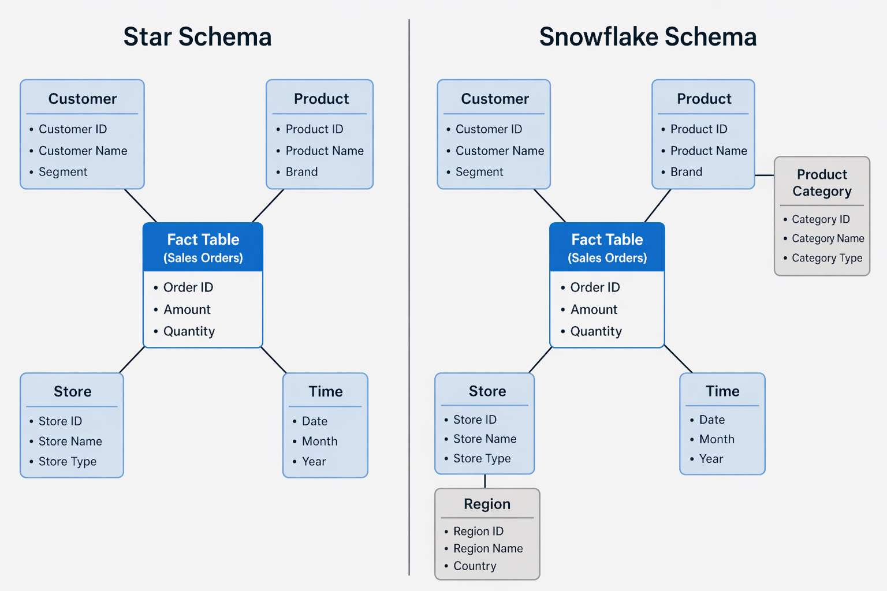

 

Un almacenamiento de datos es una excelente opción si tiene datos transaccionales que se pueden organizar en un esquema estructurado de tablas y quiere usar SQL para consultarlos.

### Lagos de datos

Un lago de datos es un almacén de archivos, normalmente en un sistema de archivos distribuido para el acceso a datos de alto rendimiento. Los motores de procesamiento distribuido nativos de la nube, como Apache Spark , se usan para procesar consultas en los archivos almacenados y devolver datos para informes y análisis. Estos sistemas suelen aplicar un enfoque de esquema en lectura para definir esquemas tabulares en archivos de datos semiestructurados en el punto en el que se leen los datos para el análisis, sin aplicar restricciones cuando se almacenan.

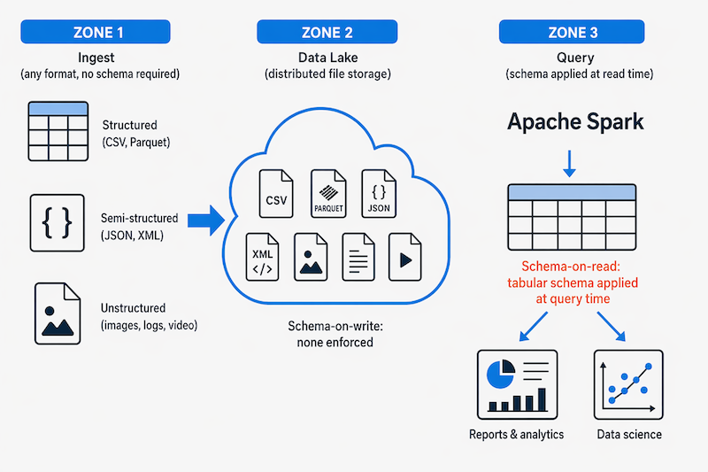

 

Los lagos de datos son excelentes para admitir una combinación de datos estructurados, semiestructurados e incluso no estructurados que quiere analizar sin necesidad de aplicar el esquema cuando los datos se escriben en el almacén.

### Enfoques híbridos

Puede usar un enfoque híbrido que combine características de lagos de datos y almacenamientos de datos en un almacén de lago de datos. Los datos sin procesar se almacenan como archivos en un lago de datos y un punto de conexión de SQL Analytics expone esos archivos como tablas que puede consultar con SQL. Los lagos de datos se habilitan a través de Delta Lake, el formato estándar de código abierto para lagos de datos que utilizan tanto Microsoft Fabric como Azure Databricks. Delta Lake agrega funcionalidades de almacenamiento relacional sobre archivos Parquet, por lo que puede definir tablas que aplican esquemas y coherencia transaccional, admiten orígenes de datos de streaming y cargados por lotes y proporcionan una API de SQL para realizar consultas.

En Microsoft Fabric, todos los datos del lago de datos se almacenan en OneLake, una capa de almacenamiento única para todo el inquilino que se comparte entre todas las cargas de trabajo de Fabric. Al crear un Fabric Lakehouse, se crea automáticamente un punto de conexión de SQL Analytics. Al crear una Fabric Warehouse, los datos también residen en OneLake, lo que proporciona a ambas experiencias una base de almacenamiento unificada.

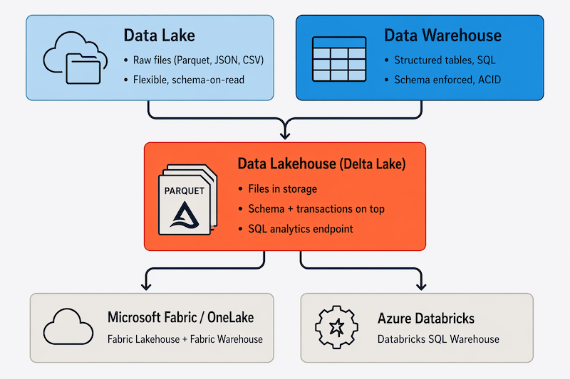

 

### Servicios de Azure para almacenes analíticos

En Azure, hay varios servicios principales que puede usar para implementar un almacén analítico a gran escala, entre los cuales se incluyen los siguientes:

[Microsoft Fabric](https://www.microsoft.com/microsoft-fabric) es una plataforma de análisis SaaS unificada de un extremo a otro basada en OneLake. Ofrece dos experiencias de almacén analítico principal:

- **Fabric Lakehouse**: almacena datos en formato Delta Lake en OneLake, admite cuadernos y Spark para cargas de trabajo de ciencia de datos y expone un punto de conexión de análisis SQL para consultas estructuradas. Es la opción adecuada al trabajar con datos mixtos o semiestructurados o ejecutar flujos de trabajo de aprendizaje automático.
- **Fabric Warehouse**: un almacenamiento de datos relacionales totalmente administrado y compatible con SQL Server también respaldado por OneLake. Es la opción adecuada cuando tus datos están estructurados, tu equipo trabaja con SQL y necesitas una aplicación estricta del esquema y concurrencia para muchos usuarios al mismo tiempo.

Fabric también incluye canalizaciones de datos integradas (Fabric Data Factory) para la ingesta y transformación de datos, así como la inteligencia de Real-Time nativa para el análisis de registros y telemetría. Fabric Mirroring permite replicar continuamente datos desde sistemas operacionales, como Azure Cosmos DB, Azure SQL Database y Snowflake, directamente en OneLake sin crear canalizaciones personalizadas.

[Azure Databricks](https://azure.microsoft.com/services/databricks) es una plataforma de análisis en la nube basada en Apache Spark, optimizada para análisis de datos a gran escala, ciencia de datos y análisis de SQL. Usa Delta Lake como formato de almacenamiento nativo, lo que proporciona compatibilidad con todas las transacciones de tabla, aplicación de esquemas y control de versiones. En el caso de los informes y la inteligencia empresarial basados en SQL, Azure Databricks proporciona una Databricks SQL Warehouse, un punto de conexión DE SQL dedicado optimizado para herramientas de BI y cargas de trabajo de consulta simultáneas. Databricks es una opción habitual cuando necesita flujos de trabajo de Spark centrados en el código, portabilidad multinube o experiencia previa en la organización con la plataforma.

Tanto Fabric como Azure Databricks incluyen características del asistente de IA para escribir CÓDIGO SQL y generar código de cuaderno.

>! Nota:
>
>Cada uno de estos servicios se puede considerar como un almacén de datos analíticos, en el sentido de que proporcionan un esquema y una interfaz a través de los cuales se pueden consultar los datos. En muchos casos, los datos se almacenan realmente en un lago de datos y el servicio procesa los datos y ejecuta consultas. Algunas soluciones combinan ambos servicios: un proceso de ingesta ELT puede copiar datos al lago de datos, usar un cuaderno de notas que se ejecuta en Azure Databricks para procesar un gran volumen de datos y, a continuación, cargar los resultados en tablas de un almacén de Microsoft Fabric.

 

---

## Ejercicio: Exploración de análisis de datos en Microsoft Fabric

En este ejercicio, creará una instancia de Data Lakehouse de Microsoft Fabric y la usará para ingerir y analizar algunos datos.

El ejercicio está diseñado para que pueda familiarizarse con algunos elementos clave de una solución a gran escala de análisis de datos, no como una guía completa para realizar análisis avanzados de datos con Microsoft Fabric. El ejercicio debe tardar unos 30 minutos en completarse.

>! Nota:
>
>Para completar este laboratorio, necesitará una cuenta de Microsoft Fabric o, si aún no tiene una cuenta, regístrese para obtener una evaluación gratuita.
>
>Vaya a Introducción a Fabric para obtener más información.

Inicie el ejercicio y siga las instrucciones.

[Launch Exercise](https://microsoftlearning.github.io/DP-900T00A-Azure-Data-Fundamentals/Instructions/Labs/dp900-04b-fabric-lake-lab.html)

 

---

## Resumen

El almacenamiento de datos a gran escala es una carga de trabajo compleja que puede implicar muchas tecnologías diferentes. En este módulo se ha proporcionado información general de nivel general sobre las características clave de una solución de almacenamiento de datos moderna y se han explorado algunos de los servicios de Azure que puede usar para implementar una.

En este módulo ha aprendido a:

- Identificar elementos comunes de una solución a gran escala de almacenamiento de datos
- Describir las características clave de las canalizaciones de ingesta de datos
- Identificar tipos comunes de almacén de datos analíticos y servicios de Azure relacionados
- Aprovisionar Microsoft Fabric y usarlo para ingerir, procesar y consultar datos

 

---

[Volver al índice](#índice)

---

 

# Exploración de los aspectos básicos del análisis en tiempo real

Obtenga información sobre los conceptos básicos del procesamiento de flujos y los servicios de Microsoft Azure que puede usar para implementar soluciones de análisis en tiempo real.

### Objetivos de aprendizaje

En este módulo aprenderá a:
- Comparar procesamiento por lotes y flujos.
- Describir los elementos comunes de las soluciones de datos de streaming.
- Describir las características y funcionalidades de la inteligencia en tiempo real en Microsoft Fabric.
- Describir las características y funcionalidades de streaming de Apache Spark Structured en Azure.
- Explorar el análisis en tiempo real en Microsoft Fabric.

### Requisitos previos
Antes de iniciar este módulo, debe tener conocimientos conceptuales sobre el almacenamiento y el análisis de datos modernos. Debe estar familiarizado con los servicios de Azure para cargas de trabajo de datos, como Azure Storage, Azure SQL Database y Microsoft Fabric.

 

---

## Introducción

Un mayor uso de la tecnología por parte de personas, empresas y otras organizaciones, junto con la proliferación de dispositivos inteligentes y acceso a Internet, ha generado un crecimiento masivo del volumen de datos que se pueden generar, capturar y analizar. Gran parte de estos datos se pueden procesar en tiempo real (o al menos, casi en tiempo real) como un flujo perpetuo de datos, lo que permite la creación de sistemas que revelan conclusiones y tendencias instantáneas, o toman medidas inmediatas de respuesta a los eventos a medida que se producen.

>! Nota:
>
>Este módulo está diseñado para presentar una introducción conceptual del procesamiento en tiempo real y describir los servicios de Azure que se pueden usar para crear soluciones de análisis en tiempo real. No está pensado para enseñar detalles de implementación para crear una solución de procesamiento de flujos.

 

---

## Comprensión del procesamiento de flujos y por lotes

El procesamiento de datos es simplemente la conversión de datos sin procesar en información significativa a través de un proceso. Existen dos métodos generales para procesar los datos:

- Procesamiento por lotes, en el que se recopilan y almacenan varios registros de datos antes de procesarse juntos en una sola operación.
- Procesamiento de flujos, en el que un origen de datos se supervisa y procesa constantemente en tiempo real a medida que se producen nuevos eventos de datos.

### Comprender el procesamiento por lotes

En el procesamiento por lotes, los elementos de datos recién llegados se recopilan y almacenan, y todo el grupo se procesa conjuntamente como un lote. El momento en el que se procesa cada grupo se puede determinar de varias maneras. Por ejemplo, los datos se pueden procesar según un intervalo de tiempo programado (por ejemplo, cada hora), o bien el procesamiento puede desencadenarse cuando se alcance una determinada cantidad de datos o como resultado de algún otro evento.

Por ejemplo, supongamos que quiere analizar el tráfico de carreteras contando el número de automóviles en un tramo de carretera. Un enfoque de procesamiento por lotes requeriría recopilar los automóviles de un aparcamiento y, a continuación, contarlos en una sola operación mientras están en reposo.

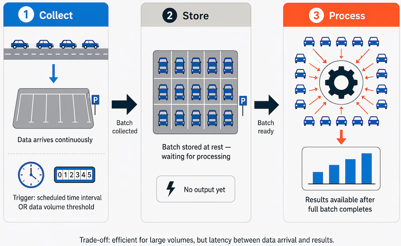

 

Si la carretera está ocupada, con un gran número de automóviles que conducen a intervalos frecuentes, este enfoque puede ser poco práctico. Tenga en cuenta que no obtiene ningún resultado hasta que haya estacionado un lote de automóviles y los haya contado.

Un ejemplo real de procesamiento por lotes es la forma en que las empresas de tarjetas de crédito controlan la facturación. El cliente no recibe una factura por cada compra que hace con su tarjeta de crédito, sino una factura mensual para todas las compras de ese mes.

| Aspecto | Ventajas del procesamiento por lotes | Desventajas del procesamiento por lotes |
|---------|--------------------------------------|-----------------------------------------|
| Capacidad de procesamiento | Los grandes volúmenes de datos se pueden procesar de forma eficaz en un momento conveniente. | Todos los datos de entrada deben estar totalmente preparados para poder comenzar el procesamiento. |
| Uso del sistema | Los trabajos se pueden programar durante las horas inactivas o fuera del pico (por ejemplo, durante la noche), lo que mejora el uso de los recursos. | A menudo hay un retraso entre la entrada de datos y la recepción de resultados. |
| Confiabilidad y control de errores | — | Los errores de datos, bloqueos o errores de programa pueden detener todo el proceso por lotes. |
| Validación de datos | — | Los datos de entrada deben comprobarse cuidadosamente antes de volver a ejecutar el trabajo por lotes. |
| Impacto de errores menores | — | Incluso los errores de datos pequeños pueden impedir que todo el trabajo por lotes se ejecute correctamente. |
---

 

### Comprender el procesamiento de flujos

En el procesamiento de flujos, cada nuevo fragmento de datos se procesa cuando llega. A diferencia del procesamiento por lotes, no hay espera hasta el siguiente intervalo de procesamiento por lotes: los datos se procesan como unidades individuales en tiempo real en lugar de procesarse un lote a la vez. El procesamiento de datos de flujos es beneficioso en los escenarios donde se generan datos dinámicos nuevos de forma continua.

Por ejemplo, un enfoque mejor para nuestro hipotético problema de recuento de automóviles podría ser aplicar un enfoque de flujo de datos, contando los automóviles en tiempo real a medida que pasan:

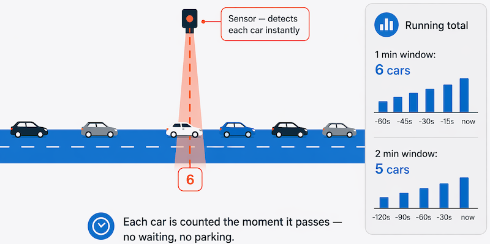

En este enfoque, no es necesario esperar hasta que todos los automóviles hayan estacionado para comenzar a procesarlos, y puede sumar los datos a lo largo de intervalos de tiempo. Por ejemplo, contando el número de automóviles que pasan cada minuto.

Entre los ejemplos reales de datos en streaming se incluyen:

- Una institución financiera realiza un seguimiento de los cambios en el mercado de valores en tiempo real, calcula el valor en riesgo y reequilibra automáticamente las carteras en función de los movimientos de precio de las acciones.
- Una empresa de juegos en línea recopila datos en tiempo real sobre las interacciones de los jugadores con los juegos y los incorpora en su plataforma de juegos. Después, analiza los datos en tiempo real y ofrece incentivos y experiencias dinámicas para atraer a los jugadores.
- Un sitio web inmobiliario hace un seguimiento de un subconjunto de datos de dispositivos móviles y ofrece recomendaciones en tiempo real de las propiedades que pueden visitar los clientes en función de su ubicación geográfica.

El procesamiento de flujos es ideal para las operaciones críticas en tiempo que requieren una respuesta instantánea en tiempo real. Por ejemplo, un sistema que supervisa la presencia de humo y altas temperaturas en un edificio necesita activar alarmas y desbloquear puertas para permitir que los residentes puedan salir inmediatamente en caso de que se produzca un incendio.

### Comprender las diferencias entre los datos por lotes y de streaming

Además de las diferencias en la forma en que el procesamiento por lotes y en streaming controlan los datos, hay otras diferencias:

- Ámbito de los datos: el procesamiento por lotes puede procesar todos los datos del conjunto de datos. Normalmente, el procesamiento en streaming solo tiene acceso a los datos más recientemente recibidos o dentro de una ventana de tiempo móvil (los últimos 30 segundos, por ejemplo).

- Tamaño de los datos: el procesamiento por lotes es adecuado para administrar grandes conjuntos de datos de forma eficaz. El procesamiento en streaming está diseñado para registros individuales o microlotes que constan de pocos registros.

- Rendimiento: la latencia es el tiempo que se tarda en recibir y procesar los datos. la latencia del procesamiento por lotes suele ser de unas horas. Normalmente, el procesamiento en streaming se produce inmediatamente, con la latencia en segundos o milisegundos.

- Análisis: normalmente se usa el procesamiento por lotes para realizar análisis complejos. El procesamiento en streaming se usa para funciones de respuesta simples, agregaciones o cálculos, como el cálculo de la media acumulada.

### Combinación del procesamiento por lotes y por flujos

Muchas soluciones de análisis a gran escala incluyen una combinación de procesamiento por lotes y de flujos, lo que permite el análisis de datos históricos y en tiempo real. Es habitual que las soluciones de procesamiento de flujos capturen datos en tiempo real, los filtren o agreguen para procesarlos y los presenten a través de paneles y visualizaciones en tiempo real (por ejemplo, muestran el total de automóviles que han pasado por una carretera durante la hora actual), al tiempo que también se conservan los resultados procesados en un almacén de datos para el análisis histórico junto con los datos procesados por lotes (por ejemplo, para habilitar el análisis de los volúmenes de tráfico durante el último año).

Incluso cuando no se requiere análisis o visualización de datos en tiempo real, las tecnologías de streaming a menudo se usan para capturar datos en tiempo real y almacenarlos en un almacén de datos para el posterior procesamiento por lotes (esto equivale a redirigir todos los coches que viajan a lo largo de una carretera a un estacionamiento antes de contarlos).

En el diagrama siguiente se muestra una arquitectura lambda, un patrón común para combinar el procesamiento por lotes y flujos en una solución de análisis de datos a gran escala.

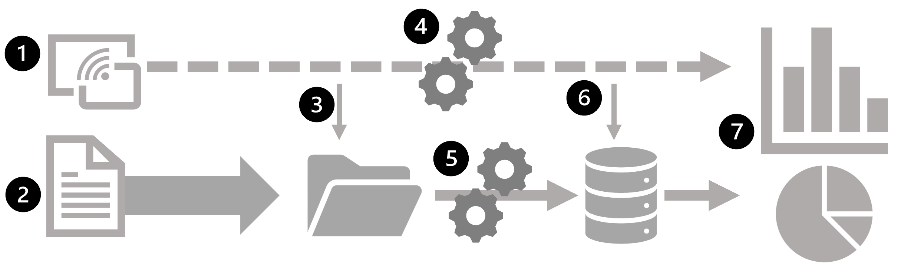

 

1. Los eventos de datos de un origen de datos de streaming se capturan en tiempo real.
2.Los datos de otros orígenes se ingieren en un almacén de datos (a menudo, un lago de datos) para el procesamiento por lotes.
3. Si no se requiere análisis en tiempo real, los datos de streaming capturados se escriben en el almacén de datos para su posterior procesamiento por lotes.
4. Cuando se requiere un análisis en tiempo real, se usa una tecnología de procesamiento de flujos para preparar los datos de flujos para el análisis o visualización en tiempo real. A menudo, se filtran o suman los datos por periodos de tiempo.
5. Los datos que no son de transmisión por lotes se procesan periódicamente para prepararlos para su análisis y los resultados se conservan en un almacén de datos analíticos (a menudo denominado almacenamiento de datos) para el análisis histórico.
6. Los resultados del procesamiento de flujos también se pueden conservar en el almacén de datos analíticos para admitir el análisis histórico.
7. Las herramientas analíticas y de visualización se usan para presentar y explorar los datos históricos y en tiempo real.

>!  Nota:
>
>Entre las arquitecturas de soluciones usadas con más frecuencia para un procesamiento de datos de flujos y por lotes de manera combinada, se encuentran arquitecturaslambda y delta. La arquitectura kappa es una alternativa más sencilla que elimina completamente la capa de lote independiente, tratando todos los datos como una secuencia continua y reproduciendolos cuando se necesita reprocesamiento histórico. Las plataformas modernas, como Microsoft Fabric y Apache Kafka, hacen que las soluciones de estilo kappa sean cada vez más prácticas. Los detalles de estas arquitecturas están fuera del ámbito de este curso.

 

---

## Exploración de elementos comunes de la arquitectura de procesamiento de flujos

Existen muchas tecnologías que puede usar para implementar una solución de procesamiento de flujos, pero, aunque los detalles de implementación específicos pueden variar, existen elementos comunes para la mayoría de las arquitecturas de flujos.

### Una arquitectura general para el procesamiento de flujos

En su forma más simple, una arquitectura de alto nivel para el procesamiento de flujos tiene el siguiente aspecto:

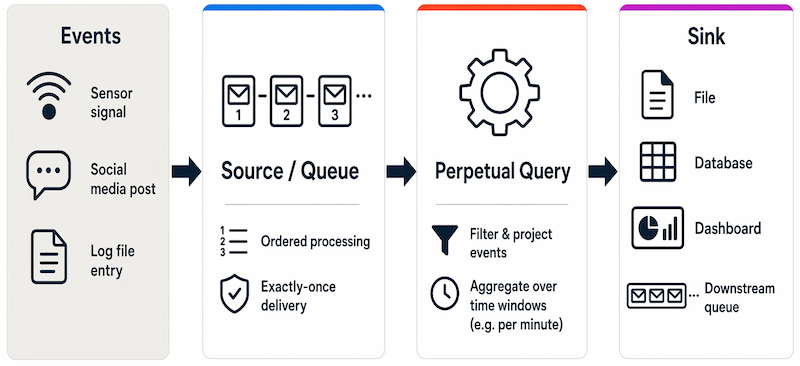

1. Un evento genera algunos datos. Podría ser una señal que emite un sensor, un mensaje de redes sociales que se publica, una entrada de archivo de registro que se escribe o cualquier otro evento que da como resultado algunos datos digitales.

2. Los datos generados se capturan en un origen de streaming para su procesamiento. En casos simples, el origen puede ser una carpeta de un almacén de datos en la nube o una tabla de una base de datos. En soluciones de flujos más sólidas, el origen puede ser una cola que encapsula la lógica para asegurarse de que los datos del evento se procesan en orden y que cada evento se procesa una sola vez.

2. Los datos del evento se procesan, a menudo mediante una consulta perpetua que opera en los datos del evento para seleccionar datos para tipos específicos de eventos, valores de datos de proyecto o valores de datos agregados a lo largo de períodos temporales (o ventanas) (por ejemplo, contando el número de emisiones de sensores por minuto).

4. Los resultados de la operación de procesamiento de flujos se escriben en una salida (o receptor), que puede ser un archivo, una tabla de base de datos, un panel visual en tiempo real u otra cola para su posterior procesamiento mediante una consulta de bajada posterior.

### Servicios de análisis en tiempo real

Microsoft admite numerosas tecnologías que puede usar para implementar el análisis en tiempo real de los datos de streaming, entre las que se incluyen:

- **Microsoft Fabric Real-Time Intelligence**: conjunto de herramientas integrado completo para datos en tiempo real integrados en Microsoft Fabric. Incluye Eventstreams (para ingerir, enrutar y transformar datos de streaming), Eventhouse (una base de datos optimizada para datos de eventos y series temporales, consultadas mediante KQL: lenguaje de consulta Kusto, un lenguaje de consulta diseñado para el análisis rápido de registros y telemetría), Real-Time Paneles (para la visualización de datos en directo) y Activator (para desencadenar acciones automatizadas cuando los datos de streaming cumplen condiciones definidas). La asistencia de inteligencia artificial en Fabric Real-Time intelligence le ayuda a generar consultas de KQL a partir de preguntas de lenguaje natural.

**Spark Structured Streaming**: una biblioteca de código abierto que le permite desarrollar soluciones de streaming complejas en servicios basados en Apache Spark, incluidos Azure Databricks y Microsoft Fabric.

**Azure Stream Analytics**: una solución de plataforma como servicio (PaaS) que puede usar para definir trabajos de streaming que ingieren datos de un origen de streaming, aplican una consulta perpetual y escriben los resultados en una salida. Es una opción sólida para escenarios de streaming independientes o híbridos fuera de Fabric.

### Orígenes para el procesamiento de flujos

Los siguientes servicios se usan normalmente para ingerir datos para el procesamiento de flujos en Azure:

- **Azure Event Hubs**: servicio de ingesta de datos que puede usar para administrar colas de datos de eventos, lo que garantiza que cada evento se procese en orden, solo una vez.

- **Azure IoT Hub**: servicio de ingesta de datos similar a Azure Event Hubs, pero optimizado para administrar datos de eventos de dispositivos de Internet de las cosas (IoT).

- **Azure Data Lake Store Gen 2**: servicio de almacenamiento altamente escalable que se usa a menudo en escenarios de procesamiento por lotes, pero que también se puede usar como origen de datos de streaming.

- **Apache Kafka**: solución de ingesta de datos de código abierto que se usa a menudo junto con Apache Spark.

### Receptores para el procesamiento de flujos

La salida del procesamiento de flujos a menudo se envía a los siguientes servicios:

- **Azure Event Hubs**: se usa para poner en cola los datos procesados para su procesamiento posterior.

- **Azure Data Lake Store Gen 2**, **Microsoft OneLake** o **Azure blob Storage**: se usan para conservar los resultados procesados como un archivo.

- **Azure SQL Database**, **Azure Databricks** o **Microsoft Fabric**: se usan para conservar los resultados procesados en una tabla en la que se puede realizar consultas y análisis.

- **Microsoft Power BI**: se usa para generar visualizaciones de datos en tiempo real en informes y paneles.

 

---

## Explorar la inteligencia en tiempo real de Microsoft Fabric

Microsoft Fabric Real-Time Intelligence es un conjunto de herramientas integradas en Microsoft Fabric para ingerir, procesar y analizar datos de streaming. Abarca la canalización completa desde la llegada de datos a la visualización y la acción automatizada: se conecta a orígenes de eventos, almacena y consulta los datos entrantes, crea paneles dinámicos y configura alertas que se desencadenan cuando se cumplen las condiciones definidas, todas dentro del mismo área de trabajo de Fabric.

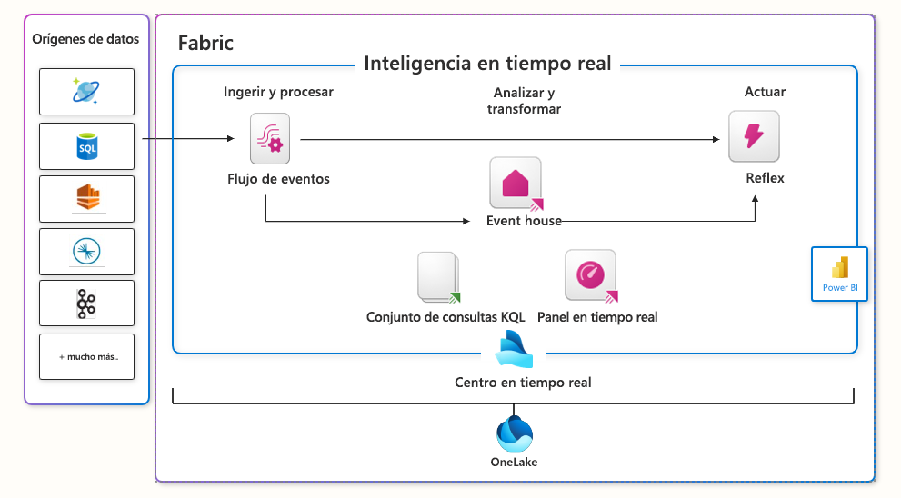

 

### Centro de datos en tiempo real
El centro en tiempo real de Microsoft Fabric actúa como un catálogo centralizado para su organización. Simplifica el acceso, la adición, la exploración y el uso compartido de datos. Al catalogar orígenes de datos de toda la organización, proporciona un único lugar para detectar y compartir datos de streaming. El centro hace que los datos estén disponibles y accesibles para realizar consultas y análisis. Puede compartir datos de streaming de varios orígenes para admitir el análisis en distintos equipos y dominios.

### Exploración de datos con inteligencia en tiempo real

Para explorar datos con inteligencia en tiempo real, elija inicialmente un flujo de datos de su organización o de orígenes externos o internos conectados y, a continuación, podrá usar herramientas de inteligencia en tiempo real para la exploración de datos y para visualizar patrones de datos, anomalías y previsión de cantidades.

Los paneles en tiempo real simplifican la comprensión de los datos, accesibles para todos a través de herramientas visuales, lenguaje natural y Copilot. A continuación, puede convertir la información en acciones mediante la configuración de alertas del activador para reaccionar en tiempo real.

>! Nota: 
> 
> Para obtener más información sobre las funcionalidades de Microsoft Fabric Real-Time Intelligence, consulte la documentación deReal-Time Intelligence en Microsoft Fabric.

 

--- 

## Explorar el streaming estructurado de Apache Spark

Apache Spark es un potente motor de procesamiento de datos diseñado para controlar rápidamente grandes cantidades de datos. En lugar de procesar datos en un único equipo, Spark divide el trabajo en muchas máquinas (un clúster) para que todo se ejecute en paralelo. Puede usar Spark en Microsoft Azure en los siguientes servicios:

- Microsoft Fabric
- Azure Databricks

Spark admite código escrito en Python, Scala o Java, y puede controlar el procesamiento por lotes y el procesamiento de flujos.

treaming estructurado de Spark
Spark Structured Streaming es una biblioteca integrada en Spark que facilita el trabajo con datos de streaming. Piense en ella como una manera de tratar un flujo de datos en vivo de la misma manera que trabajaría con una tabla en una hoja de cálculo, excepto que la tabla sigue creciendo en tiempo real a medida que llegan nuevos datos.

Así es como funciona en la práctica:

1. Se conecta a un origen de transmisión —por ejemplo, una cola de mensajes como Azure Event Hubs, una carpeta con archivos o una fuente de red.
2. Spark lee los datos entrantes en una trama de datos, básicamente una tabla de filas y columnas que rellena continuamente los nuevos datos a medida que llegan los eventos.
3. Escribe una consulta en esa trama de datos, por ejemplo, para contar eventos por minuto o calcular una media en ejecución.
4. Los resultados de la consulta se escriben en una salida (un destino), como un archivo, una base de datos o un panel de control.

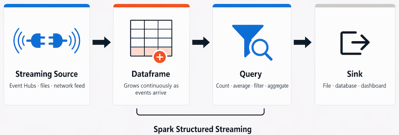

 

Spark Structured Streaming es una buena opción cuando ya usa Spark para el procesamiento de datos y quiere ampliar ese trabajo para incluir flujos de datos en tiempo real.

>! Nota:
>
>Para obtener más información sobre Spark Structured Streaming, consulte la [guía de programación de Spark Structured Streaming](https://spark.apache.org/docs/latest/structured-streaming-programming-guide.html).

### Delta Lake
Delta Lake es un formato de almacenamiento de código abierto que mejora cómo se almacenan los datos en un lago de datos. De forma predeterminada, un lago de datos es simplemente una colección de archivos; no hay ninguna manera integrada de garantizar que los datos estén completos, coherentes o estructurados correctamente. Delta Lake agrega esas garantías, lo que hace que el almacenamiento del lago de datos se comporte más como una base de datos tradicional.

Entre las principales ventajas de Delta Lake se incluyen:

- **Confiabilidad**: se realiza un seguimiento de los cambios en los datos, por lo que las escrituras parciales o con errores no dañan los datos.
- **Validación del esquema**: Los datos deben ajustarse a una estructura definida antes de ser aceptados, evitando que se cuelen registros desordenados o incompatibles.
- **Procesamiento por lotes y streaming unificados**: la misma tabla Delta puede servir como receptor de streaming (datos escritos en él en tiempo real) y un origen para consultas por lotes, por lo que no necesita almacenamiento independiente para datos históricos y activos.

Los entornos de ejecución de Spark en Microsoft Fabric y Azure Databricks incluyen compatibilidad integrada con Delta Lake.

Delta Lake combinado con Spark Structured Streaming es una buena solución cuando se desea un único almacén de datos coherente que funcione tanto para la ingesta en tiempo real como para el análisis histórico.

>! Nota:
>
>Para obtener más información sobre Delta Lake, consulte Tablas almacén de lago de datos y Delta Lake.

 

---

## Ejercicio: Explorar la inteligencia en tiempo real de Microsoft Fabric

Ahora es su oportunidad de explorar la inteligencia en tiempo real de Microsoft Fabric en una solución de ejemplo para configurar y usar las características principales de la inteligencia en tiempo real con un conjunto de datos de ejemplo.

>! Nota: 
> 
> Para completar este laboratorio, necesita una cuenta de Microsoft Fabric o, si aún no tiene una cuenta, regístrese para obtener una [evaluación gratuita](https://go.microsoft.com/fwlink/?LinkId=2182771). 
> 
> Para obtener más información sobre cómo empezar a trabajar con Microsoft Fabric, consulte [Introducción a Fabric](https://learn.microsoft.com/es-es/fabric/get-started/fabric-trial).

Inicie el ejercicio y siga las instrucciones.

[Launch Exercise](https://microsoftlearning.github.io/DP-900T00A-Azure-Data-Fundamentals/Instructions/Labs/dp900-05c-fabric-realtime-lab.html)

 

---

## Resumen

El procesamiento en tiempo real es un elemento común de las soluciones de análisis de datos empresariales. Microsoft Azure ofrece una variedad de servicios que puede usar para implementar el procesamiento de flujos y el análisis en tiempo real.

En este módulo, ha aprendido a:

- Comparación del procesamiento por lotes y por flujos
- Describa elementos comunes de las soluciones de datos de transmisión
- Describir las características y funcionalidades de la inteligencia en tiempo real de Microsoft Fabric
- Descripción de las características y funciones de Spark Structured Streaming en Azure
- Exploración del análisis en tiempo real en Microsoft Fabric

 

---

[Volver al índice](#índice)

---

 

# Exploración de los aspectos básicos de la visualización de datos

Conozca los principios fundamentales del modelado de datos analíticos y la visualización de datos, con Microsoft Power BI como plataforma para explorar estos principios en acción.

### Objetivos de aprendizaje

En este módulo aprenderá a:
- Describir un proceso de alto nivel para crear soluciones de informes con Microsoft Power BI.
- Describir los principios básicos del modelado de datos analíticos.
- Identificar los tipos comunes de visualización de datos y sus usos.
- Crear un informe interactivo con Power BI Desktop.

### Requisitos previos
- Ninguno

 

---

## Introducción

El modelado y la visualización de datos son el núcleo de las cargas de trabajo de inteligencia empresarial (BI) compatibles con las soluciones de análisis de datos a gran escala. La visualización de datos admite la creación de informes y la toma de decisiones en organizaciones.

En este módulo, obtendrá información sobre los principios fundamentales del modelado de datos analíticos y la visualización de datos, con Microsoft Power BI como plataforma para explorar estos principios en acción.

## Descripción de las herramientas y el flujo de trabajo de Power BI

Hay muchas herramientas de visualización de datos que los analistas de datos pueden usar para explorar datos y resumir información visualmente; incluida la compatibilidad con gráficos en herramientas de productividad como Microsoft Excel y widgets de visualización de datos integrados en cuadernos usados para explorar datos en servicios como Microsoft Fabric y Azure Databricks. Sin embargo, para el análisis de negocio a escala empresarial, a menudo se requiere una solución integrada que pueda admitir el modelado de datos complejo, los informes interactivos y el uso compartido seguro.

### Microsoft Power BI

Microsoft Power BI es un conjunto de herramientas y servicios que forman una carga de trabajo principal de Microsoft Fabric, que los analistas de datos pueden usar para crear visualizaciones de datos interactivas para que los usuarios empresariales los consuman.

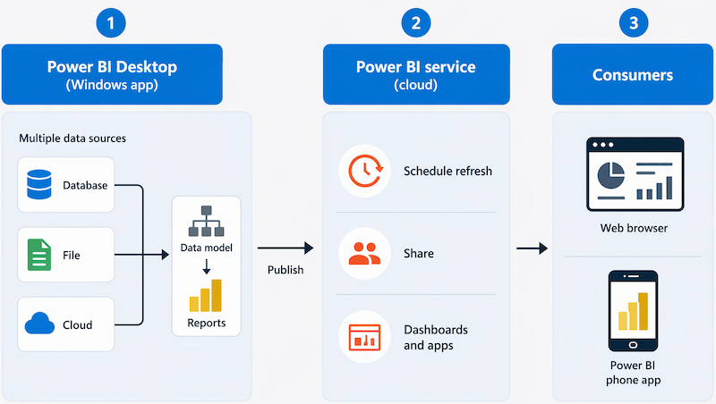

 

Un flujo de trabajo típico para crear una solución de visualización de datos comienza con Power BI Desktop, una aplicación de Microsoft Windows en la que puede importar datos de una amplia gama de orígenes de datos, combinar y organizar los datos de estos orígenes en un modelo de datos de análisis y crear informes que contengan visualizaciones interactivas de los datos.

Después de crear modelos de datos e informes, puede publicarlos en el servicio Power BI, un servicio en la nube en el que los usuarios profesionales pueden publicar informes e interactuar con ellos. También puede realizar algunas operaciones básicas de modelado de datos y edición de informes directamente en el servicio mediante un explorador web, pero su funcionalidad es limitada en comparación con la herramienta Power BI Desktop. Puede usar el servicio para programar actualizaciones de los orígenes de datos en los que se basan los informes y para compartir informes con otros usuarios. También puede definir paneles y aplicaciones que combinen informes relacionados en una ubicación única y fácil de consumir.

Los usuarios pueden consumir informes, paneles y aplicaciones en el servicio Power BI mediante un explorador web o en dispositivos móviles mediante la aplicación de teléfono de Power BI.

### Power BI en Microsoft Fabric

Power BI está totalmente integrado en Microsoft Fabric, Microsoft plataforma de análisis unificado. Dentro de Fabric, el contenido de Power BI se encuentra en áreas de trabajo compartidas junto con otros elementos de ingeniería de datos y análisis, todos respaldados por la misma capa de almacenamiento de OneLake. Entre las funcionalidades clave Fabric específicas se incluyen las siguientes:

- **Áreas de trabajo**: entornos compartidos en los que los equipos colaboran en informes y modelos semánticos en un explorador, sin necesidad de software de escritorio.

- **Modelos semántico**s: un modelo semántico define las medidas, las relaciones y las jerarquías en las que se basan los informes y se pueden compartir entre varios informes.

- **Direct Lake mode**: un modo de almacenamiento que permite Power BI consultar datos directamente desde archivos OneLake, combinando la velocidad de análisis en memoria con la escala de un lago de datos, sin necesidad de importar o actualizar datos independientes.

- **Edición de informes basada en web**: los analistas pueden crear y actualizar informes completamente en el explorador, lo que hace que Power BI sea accesible sin instalar Power BI Desktop.

### Asistencia de inteligencia artificial en Power BI

Power BI incluye características integradas de inteligencia artificial que ayudan a los analistas a trabajar de forma más eficaz.

### Copilot en Power BI

Las funcionalidades de Copilot requieren capacidad de Fabric (F2 o superior) o Power BI Premium (P1 o superior) y están disponibles tanto en Power BI Desktop como en el servicio de Power BI:

- **Summarize a report**: Copilot genera un resumen de lenguaje simple de lo que muestra un informe.
- **Crear páginas de informe**: Copilot crea páginas de informe y selecciona los tipos de gráfico adecuados en función de los datos y la solicitud.
- **Generar medidas DAX**: Copilot escribe expresiones de medida DAX a partir de una descripción del lenguaje natural.

### Otras características de IA
Las siguientes características con tecnología de inteligencia artificial están disponibles sin una licencia de Copilot:

- **Narración inteligente visual**: genera automáticamente un resumen de texto que describe los datos de un informe y se actualiza dinámicamente a medida que cambian los datos.

Estas características hacen que la inteligencia artificial forme parte natural del flujo de trabajo diario del analista dentro de Power BI y Microsoft Fabric.

 

---

## Descripción de los conceptos básicos del modelado de datos

Los modelos analíticos,también denominados modelos semantic en Microsoft Fabric y Power BI, estructuran los datos para admitir el análisis. Un modelo se crea a partir de tablas de datos relacionadas. Define los valores numéricos que desea analizar o notificar, conocidos como medidas, y las entidades que se usan para agregarlos por, conocidos como dimensiones.

Por ejemplo, un modelo puede incluir medidas numéricas para las ventas (como ingresos o cantidad) y dimensiones para productos, clientes y tiempo. Esto le permite agregar medidas en una o varias dimensiones, por ejemplo, para identificar los ingresos totales por cliente o los artículos totales vendidos por producto al mes.

### Tablas y esquema

Las tablas de dimensiones representan las entidades por las que desea agrupar o filtrar, por ejemplo, producto o cliente. Cada fila tiene un valor de clave único y las columnas restantes almacenan atributos como nombres de producto, categorías o ciudades del cliente. La mayoría de los modelos analíticos incluyen una dimensión Time para poder agregar medidas en períodos de tiempo.

Las tablas de hechos almacenan las medidas numéricas que desea analizar. Cada fila representa un evento registrado, por ejemplo, una transacción de ventas con valores para la cantidad vendida y los ingresos.

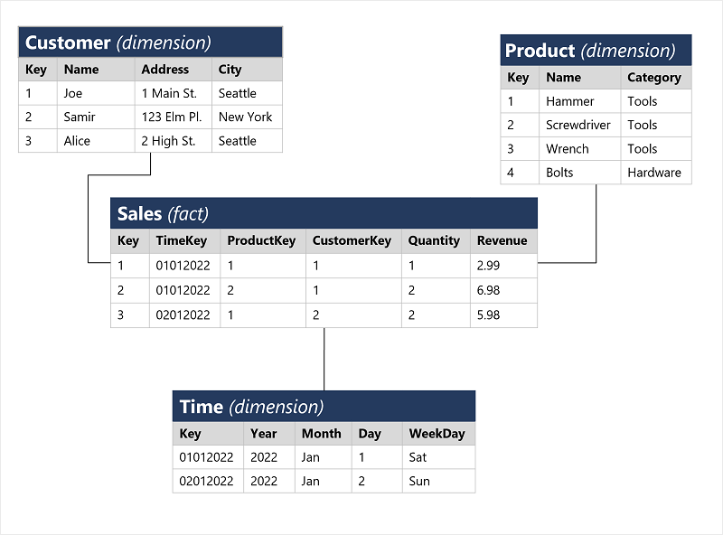

 

Cuando una tabla de hechos se relaciona con una o varias tablas de dimensiones, el diseño se denomina esquema de estrella. Si las tablas de dimensiones se relacionan aún más con las tablas de detalles adicionales (por ejemplo, una tabla Category vinculada a una tabla Product ), el diseño se denomina esquema de copo de nieve.

Al cargar datos en un modelo semántico, Power BI los almacena en un almacén de columnas en memoria eficaz mediante el motor VertiPaq. Las agregaciones se calculan en tiempo de consulta, lo que proporciona análisis y informes rápidos.

### Jerarquías de atributos
Las jerarquías permiten subir o bajar por los valores agregados en diferentes niveles de una dimensión. Por ejemplo:

- En la tabla **Product (Producto )**, una jerarquía podría agrupar productos en categorías.
- En la tabla **Customer (Cliente )**, una jerarquía podría agrupar los clientes por ciudad.
- En la tabla **De tiempo** , una jerarquía puede agrupar días en meses y meses en años.

Al ver las ventas totales por año y, a continuación, explorar en profundidad para ver un desglose mensual, el motor VertiPaq calcula los valores agregados en cada nivel en el momento de la consulta.

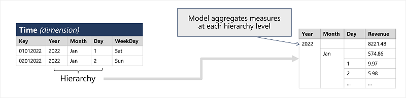

 

### Modelado analítico en Microsoft Power BI

En Power BI, se define un modelo semántico de tablas importadas de uno o varios orígenes de datos. Use la vista Model en Power BI Desktop para crear relaciones entre tablas de hechos y dimensiones, definir jerarquías, establecer tipos de datos y formatos de visualización y configurar otras propiedades que dan forma al modelo para su análisis.

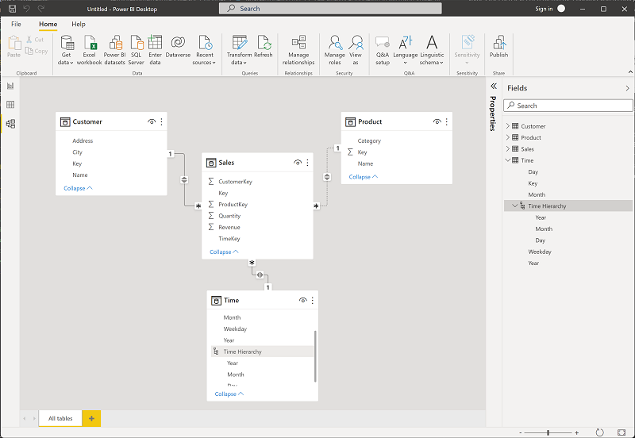

 

Si sus datos están almacenados en **OneLake—el** lago de datos compartido de Microsoft Fabric—, use el modo de almacenamiento **Direct Lake** para conectar su modelo semántico directamente a los archivos del lago. Esto proporciona rendimiento de consultas en memoria sin un paso de importación de datos independiente.

 

---

## Descripción de consideraciones para la visualización de datos

Después de crear un modelo, puede usarlo para generar visualizaciones de datos que se pueden incluir en un informe.

Hay muchos tipos de visualización de datos, algunos más usados y otros más especializados. Power BI incluye un amplio conjunto de visualizaciones integradas, que se pueden ampliar con visualizaciones personalizadas y de terceros. En el resto de esta unidad se analizan algunas visualizaciones de datos comunes, pero no es una lista completa.

### Tablas y texto

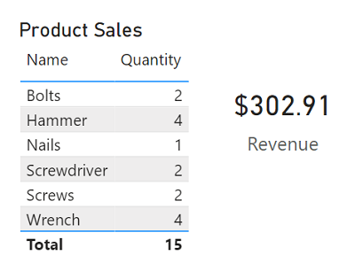

Las tablas y el texto suelen ser la manera más sencilla de comunicar datos. Las tablas son útiles cuando se deben mostrar numerosos valores relacionados y los valores de texto individuales de las tarjetas pueden ser una manera útil de mostrar cifras o métricas importantes.

### Gráficos de barras y de columnas

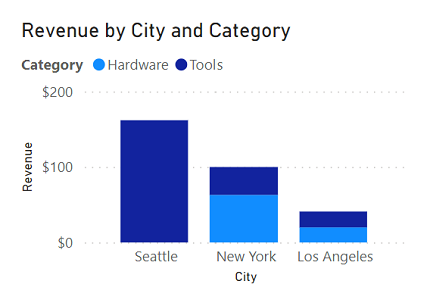

Los gráficos de barras y columnas son una buena manera de comparar visualmente valores numéricos para categorías discretas.

### Gráficos de líneas

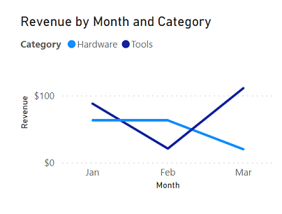

Los gráficos de líneas también se pueden usar para comparar valores clasificados y son útiles cuando es necesario examinar tendencias, a menudo a lo largo del tiempo.

### Gráficos circulares

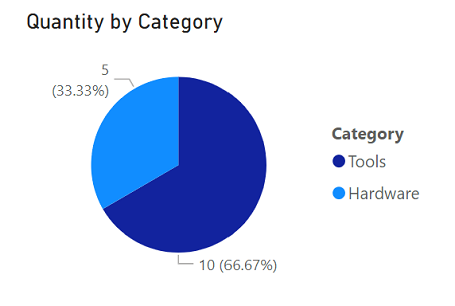

Los gráficos circulares se suelen usar en los informes empresariales para comparar visualmente los valores clasificados como proporciones de un total.

### Gráficos de dispersión

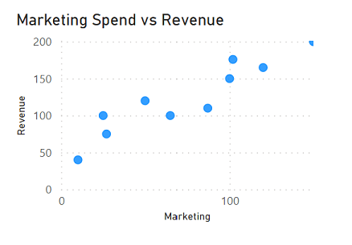

Los gráficos de dispersión son útiles cuando se quieren comparar dos medidas numéricas e identificar una relación o correlación entre ellas.

### Mapas

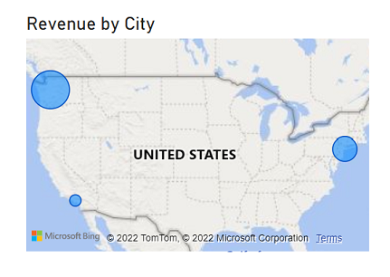

Maps son una excelente manera de comparar visualmente los valores de diferentes áreas geográficas o ubicaciones.

### Informes interactivos en Power BI

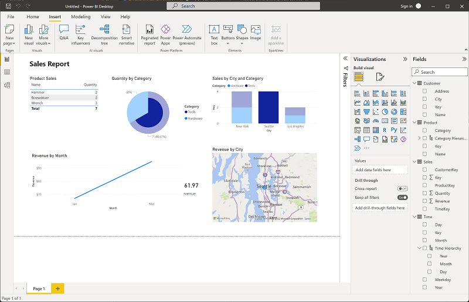

En Power BI, los elementos visuales de los datos relacionados de un informe se vinculan automáticamente entre sí y proporcionan interactividad. Por ejemplo, al seleccionar una categoría individual en una visualización, se filtrará y resaltará automáticamente esa categoría en otras visualizaciones relacionadas del informe. En la imagen anterior, la ciudad Seattle se ha seleccionado en el gráfico de columnas Ventas por ciudad y Categoría, y las demás visualizaciones se filtran para reflejar valores solo de Seattle.

### Visualizaciones controladas por ia en Power BI

Power BI incluye varias características de visualización con tecnología de inteligencia artificial que ayudan a los analistas a explorar y explicar los datos de forma más eficaz:

- **Narraciones inteligentes**: genera automáticamente resúmenes escritos que describen lo que muestra una visualización, que se actualiza dinámicamente a medida que cambian los datos.
- **Preguntas y respuestas visuales**: permite que los usuarios de informes formulen preguntas en lenguaje natural y reciban respuestas instantáneas en forma de gráficos basadas en el modelo semántico.
- **Influenciadores clave**: identifica qué factores impulsan más fuertemente una métrica seleccionada, mostrando los resultados como un objeto visual interactivo.
- **Árbol de descomposición**: permite la exploración en profundidad interactiva en varias dimensiones para identificar lo que contribuye a un valor.

Estas características son la forma en que Power BI lleva la inteligencia artificial directamente al flujo de trabajo diario del analista.

## Ejercicio: Exploración de aspectos básicos de la visualización de datos con Power BI

Ahora es su oportunidad de explorar el modelado y la visualización de datos con Microsoft Power BI.

>! Nota:
>
>Para completar este ejercicio, necesitará un equipo que ejecute Microsoft Windows.

Inicie el ejercicio y siga las instrucciones.

[Launch Exercise](https://microsoftlearning.github.io/DP-900T00A-Azure-Data-Fundamentals/Instructions/Labs/dp900-pbi-06-lab.html)

 

---

## Resumen

El modelado y la visualización de datos permiten a las organizaciones extraer información de los datos.

En este módulo, ha aprendido a:

- Describir un proceso de alto nivel para crear soluciones de informes con Microsoft Power BI
- Describir los principios básicos del modelado de datos analíticos
- Identificación de tipos comunes de visualización de datos y sus usos
- Creación de un informe interactivo con Power BI Desktop

### Pasos siguientes

Ahora que ha aprendido sobre el modelado y la visualización de datos, considere la posibilidad de obtener más información sobre las cargas de trabajo relacionadas con los datos en Azure mediante la realización de una certificación de Microsoft en [Aspectos básicos de datos de Azure](https://learn.microsoft.com/es-es/credentials/certifications/azure-data-fundamentals/).

 

---

[Volver al índice](#índice)

---
