## DP-900T00A-Azure-Data-Fundamentals

# [Exploración de Azure Cosmos DB](https://microsoftlearning.github.io/DP-900T00A-Azure-Data-Fundamentals/Instructions/Labs/dp900-03-cosmos-lab.html)

In this lab, you’ll create your first NoSQL database using Azure Cosmos DB. “NoSQL” databases store data in a flexible way, rather than in the strict rows-and-columns tables of a relational database. Cosmos DB stores each piece of data as a JSON item (a simple text format that lists properties and their values, like "price": 48.74).

You’ll create (“provision”) a Cosmos DB account, add some sample data, view it as JSON, and then run simple SQL-like queries to find what you’re looking for. Don’t worry if these terms are new, every step is explained as you go.

 

## Create a Cosmos DB account

“Provisioning” just means creating and setting up a new resource. To use Cosmos DB, you first create a Cosmos DB account. In this lab, you’ll create an account that uses Azure Cosmos DB for NoSQL, the option designed for storing and querying JSON data.

1. In the Azure portal, select + Create a resource at the top left, and search for $Azure Cosmos DB$. In the results, select Azure Cosmos DB and select Create.

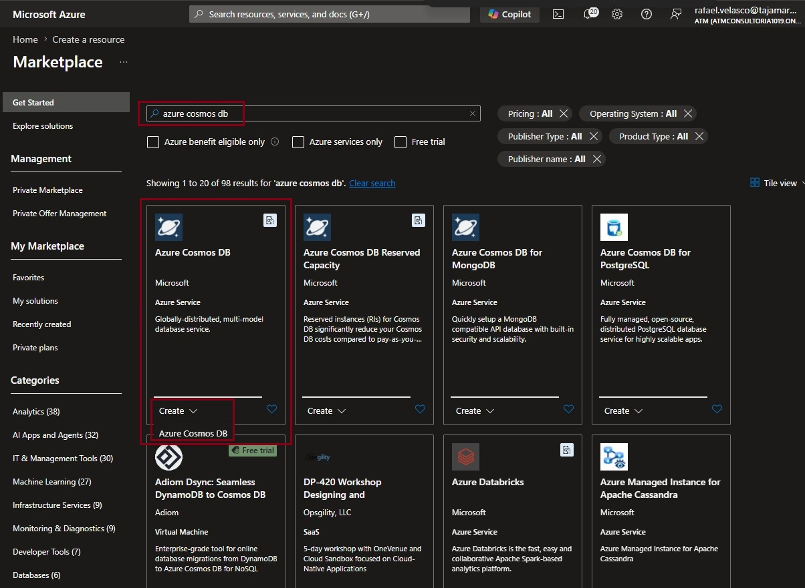

 

2. In the Azure Cosmos DB for NoSQL tile, select Create.

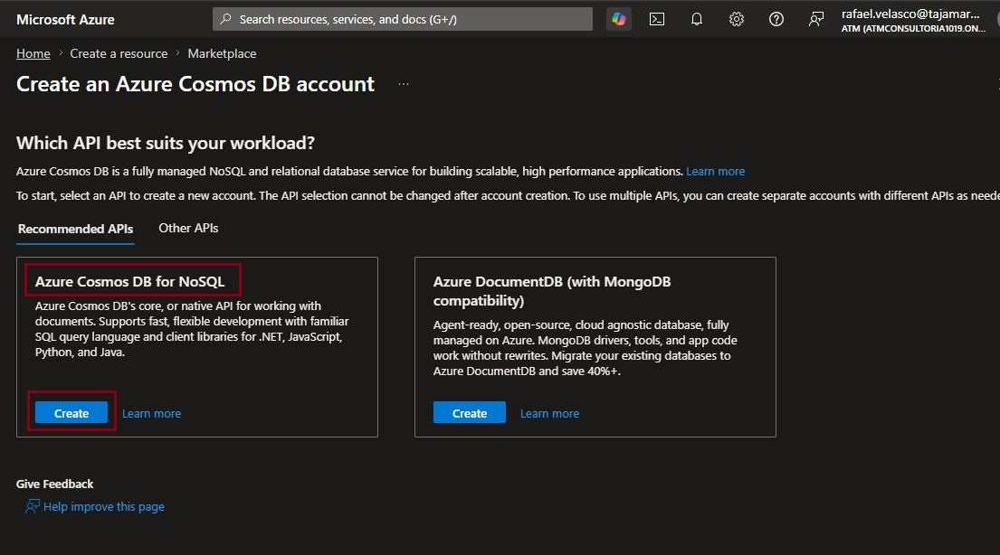

 

> !Tip: The account is the top level for your Cosmos DB resources. Choosing Azure Cosmos DB for NoSQL lets you store and query JSON data with a simple, SQL-like query language.

 

3. Enter the following details, and then select Review + create:

- Workload Type: Learning
- Subscription: If you’re using a sandbox, select Concierge Subscription. Otherwise, select your Azure subscription.
- Resource group: If you’re using a sandbox, select the existing resource group (which will have a name like learn-xxxx…). Otherwise, create a new resource group with a name of your choice.
- Account Name: Enter a unique name
- Availability Zones: Disable
- Location: Choose any recommended location
- Capacity mode: Provisioned throughput
- Apply Free-Tier Discount: Select Apply if available
- Limit total account throughput: Unselected

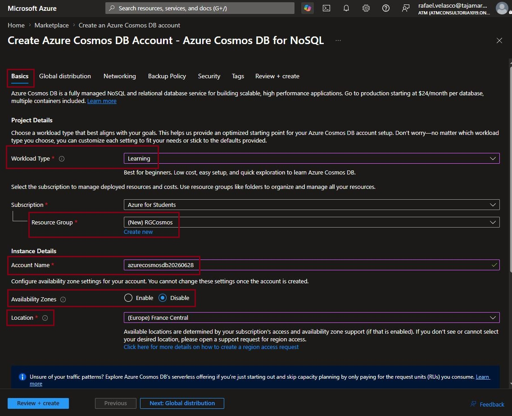

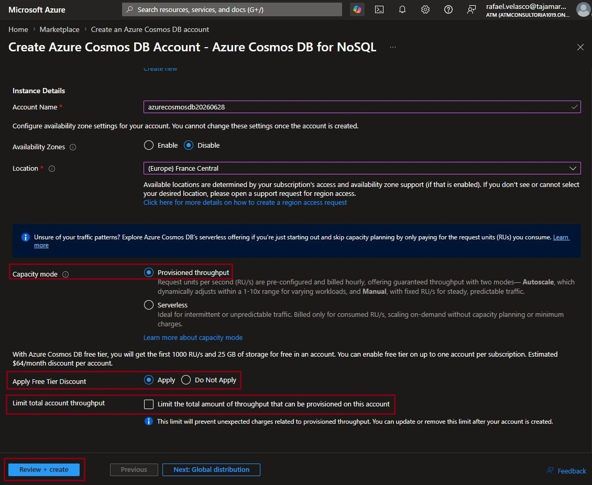

 

> ! Why these choices?
> 
> We’re setting the workload type to Learning because it comes with beginner-friendly defaults that make setup easier and keep costs low. Your account name needs to be unique across the whole service, since it becomes part of your service’s URL. We’re picking a location close to you so your tests run faster; which locations you see will depend on your subscription and whether certain availability zones are enabled. For capacity mode, we’re going with Provisioned throughput so performance stays predictable during this short lab—though Serverless can be fine if you only need it occasionally. If the free tier is available, we’ll use it so you can experiment without racking up charges. Finally, we’re keeping the “limit total account throughput” setting turned off so nothing gets slowed down unexpectedly while you work.

 

4. When the configuration has been validated, select Create.

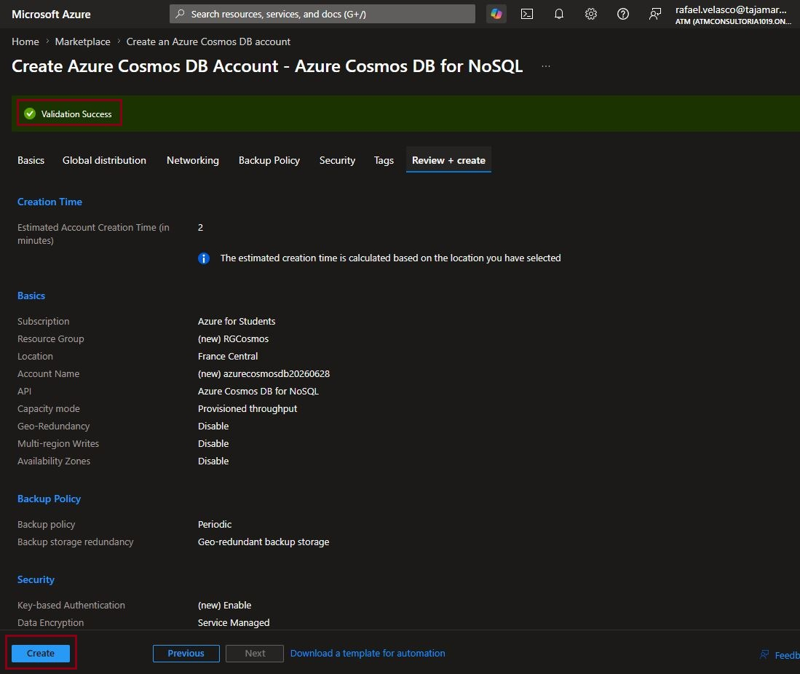

 

> ! Tip: Azure portal will estimate how long it will take to provision this instance of Azure Cosmos DB. The estimated creation time is calculated based on the location you have selected.

 

5. Wait for deployment to complete. Then go to the deployed resource.

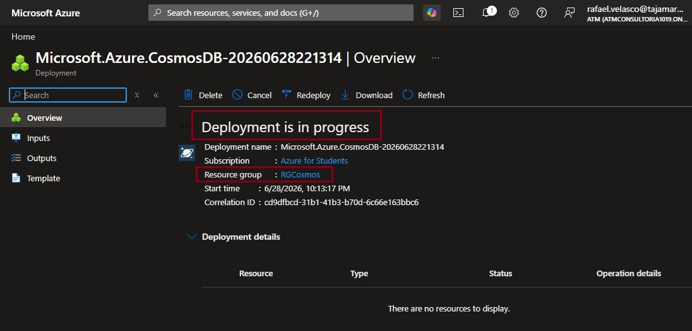

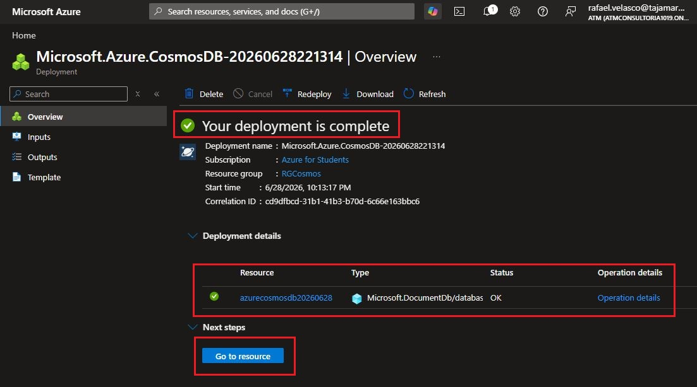

 

## Create a sample database

Throughout this procedure, close any tips that are displayed in the portal.

1. On the page for your new Cosmos DB account, in the pane on the left, select Data Explorer.

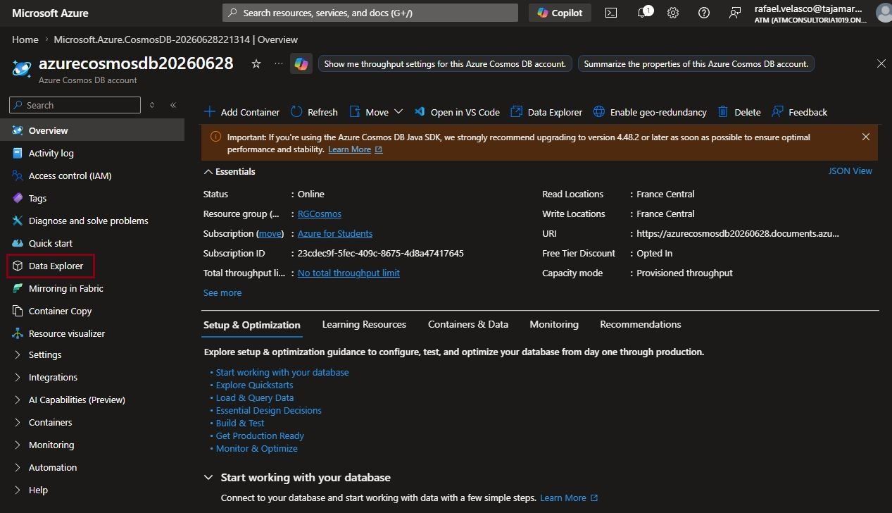

 

2. In the Data Explorer page, select Launch quick start.

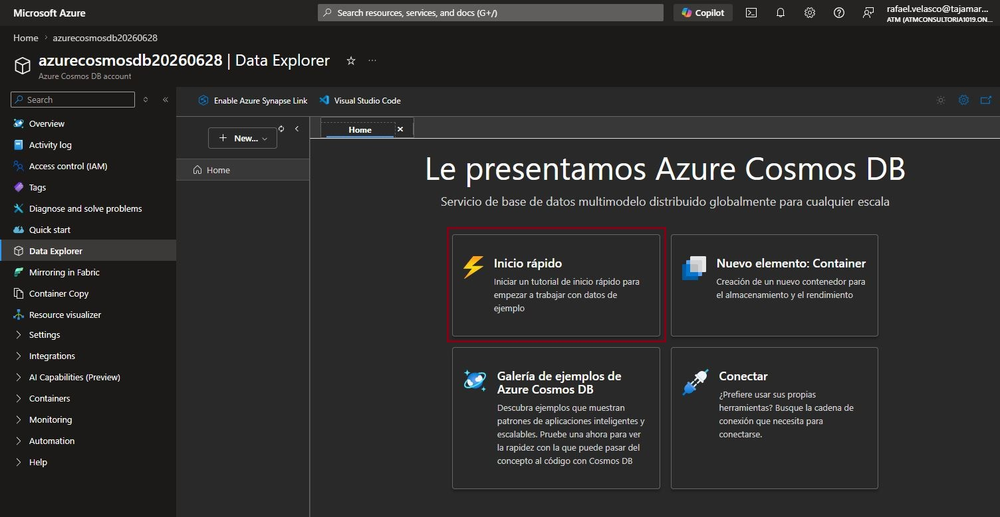

 

>! Tip: Quick start creates a working database, container, and sample data so you can practice adding and querying items without designing a schema first.

 

3. In the New Container pane, review the pre-populated settings for the sample database (a database named SampleDB, a container named SampleContainer, and a partition key of /categoryId), and then select OK. A short guided tutorial may appear alongside the pane; you can step through it with Next or simply select OK to continue.

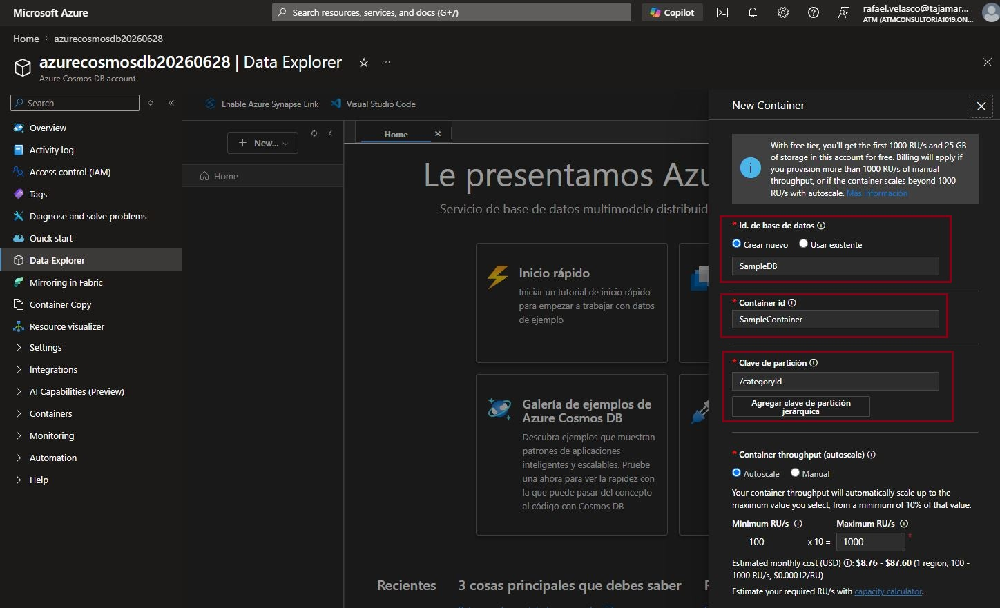

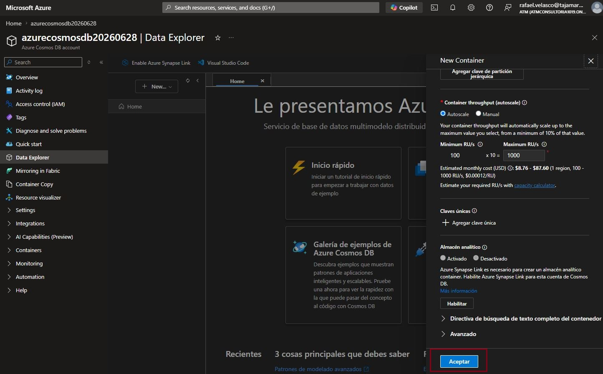

 

> ! What is a partition key? When you create a container, Azure Cosmos DB asks for a partition key, a property in your data (for example, categoryId) that it uses to group related items together. Cosmos DB spreads these groups across the storage and compute behind the scenes so your database stays fast as it grows. You don’t need to choose one here because Quick Start picks a sensible partition key for you, but in a real project choosing a good partition key, one with many distinct values that your queries filter on, is one of the most important design decisions you’ll make.

4. Observe the status in the panel at the bottom of the screen until the SampleDB database and its SampleContainer container has been created (which may take a minute or so).

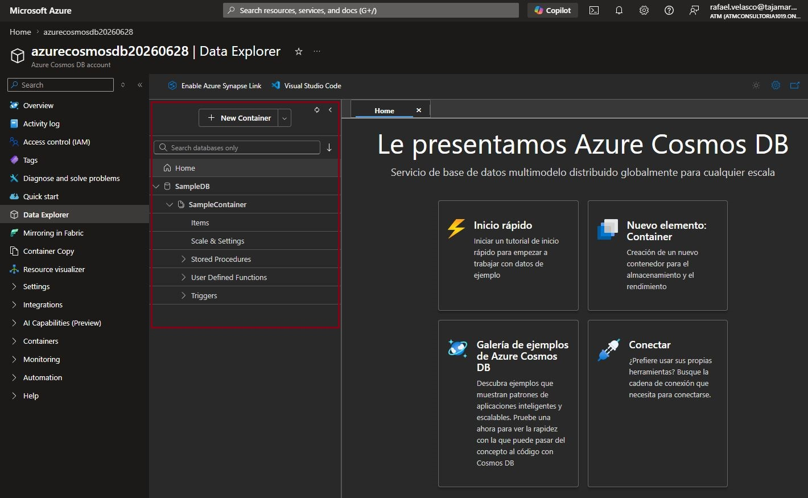

 

## View and create items

1. In the Data Explorer page, expand the SampleDB database and the SampleContainer container, and select Items to see a list of items in the container. The items represent product data, each with a unique id and other properties. Select any item to see a JSON representation of its data in the pane on the right.

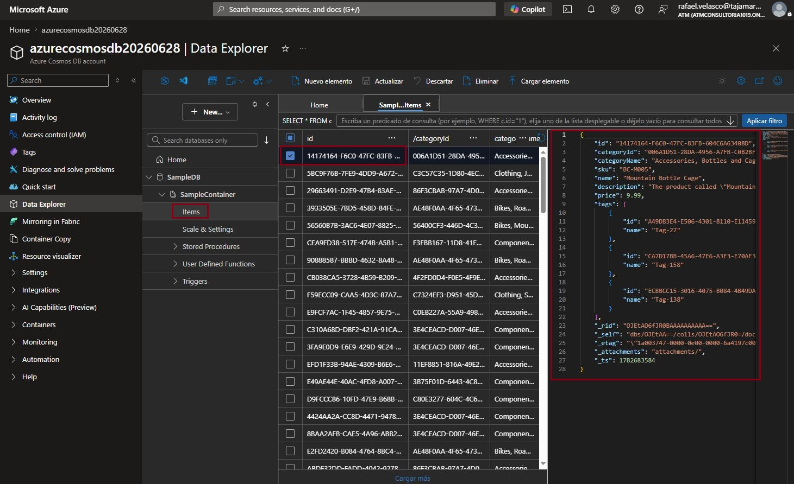

 

2. At the top of the page, select New Item to create a new blank item.

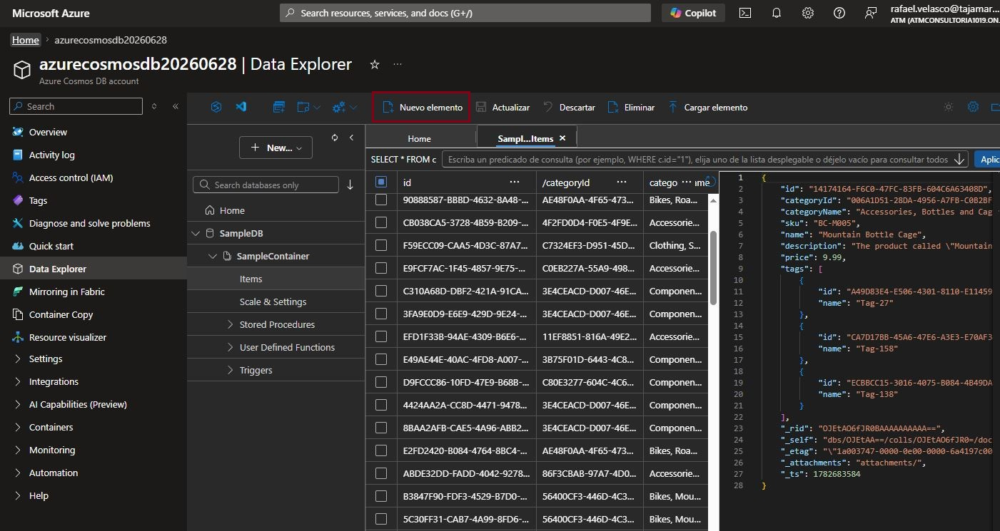

 

3. Modify the JSON for the new item as follows, and then select Save.

> Code
> ---
> {
> 
>     "name": "Road Helmet,45",
> 
>     "id": "123456789",
> 
>     "categoryId": "123456789",
> 
>     "SKU": "AB-1234-56",
> 
>     "description": "The product called \"Road Helmet,45\" ",
> 
>     "price": 48.74
> 
> }
> 
> 

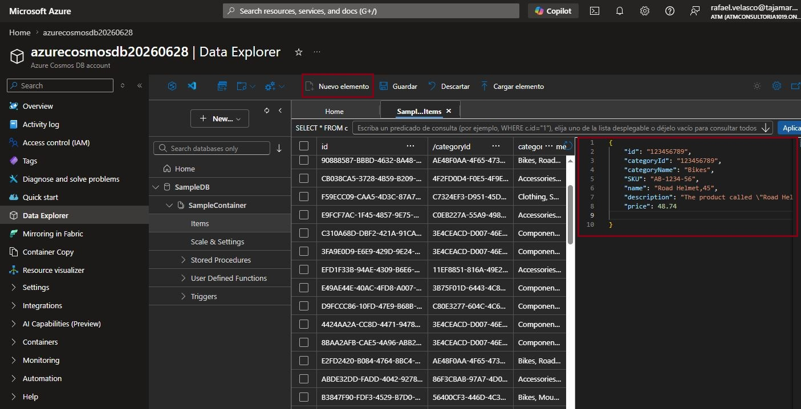

 

4. After saving the new item, notice that additional metadata properties are added automatically.

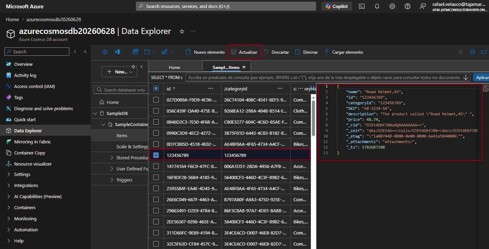

> ! Tip: Cosmos DB stores items as JSON (JavaScript Object Notation), so you can add fields that fit your scenario without a rigid schema. The id must be unique within the container. After you save, Cosmos DB adds system properties (like timestamps and internal identifiers) to help manage and optimize your data:
> 
> 
> 
> _rid — The internal resource ID used by Cosmos DB to identify the item internally.
> 
> _self — The full resource link for the item.
> 
> _etag — The entity tag used for optimistic concurrency checks.
> 
> _ts — The Unix timestamp (in seconds) when the item was last modified.
> 
> _attachments — A link to the document’s attachments (if any).

 

## Query the database

1. In the Data Explorer page, select the New SQL Query icon.

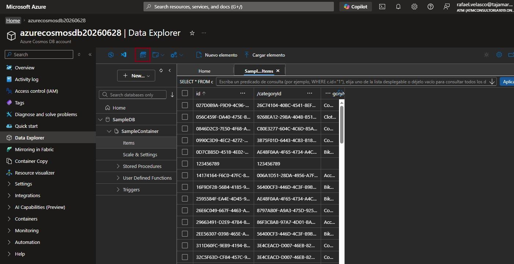 

 

2. In the SQL Query editor, review the default query (SELECT * FROM c) and use the Execute Query button to run it.

 

3. Review the results, which includes the full JSON representation of all items.

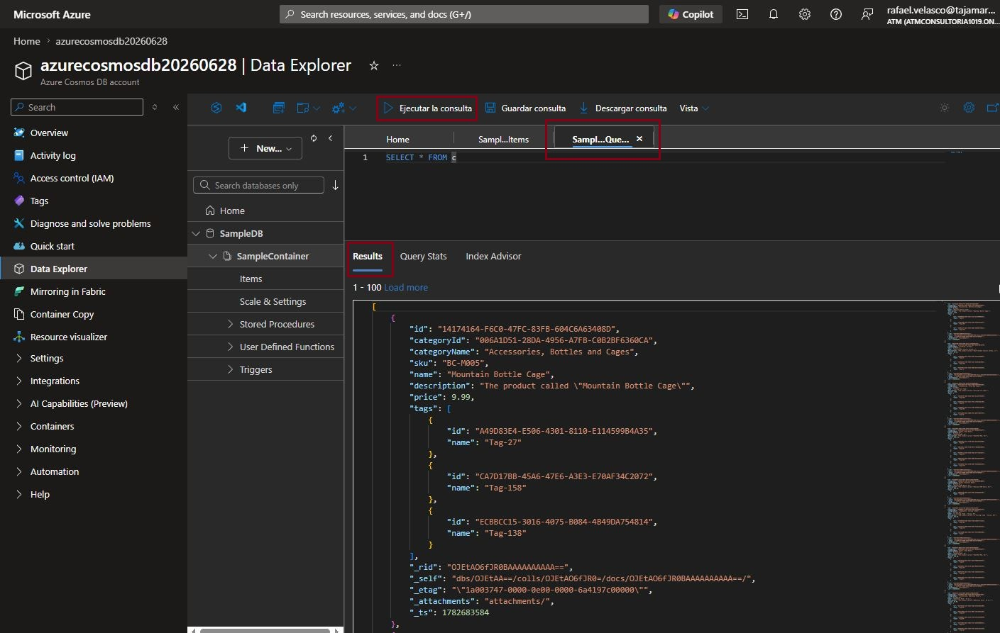

 

4. Modify the query as follows:

> Sql
> 
> ---
> 
> SELECT *
> 
> FROM c
> 
> WHERE CONTAINS(c.name,"Helmet")

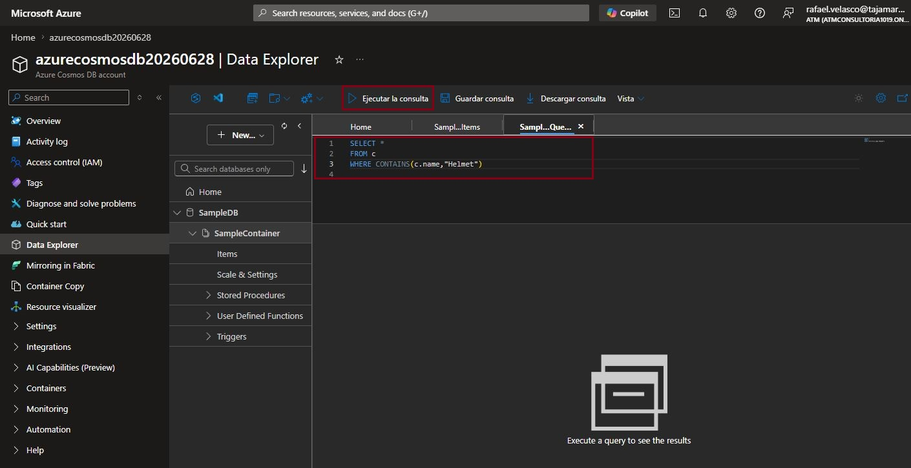

> ! Tip: The NoSQL API uses familiar, SQL-like queries to search JSON documents. SELECT * FROM c lists all items, and CONTAINS filters by text inside a property—useful for quick searches without extra setup.

 

5. Use the Execute Query button to run the revised query and review the results, which includes JSON entities for any items with a name field containing the text “Helmet”.

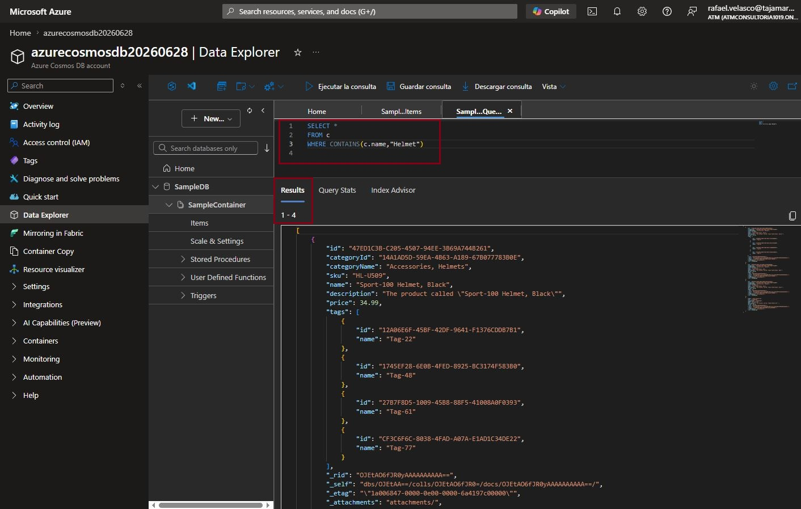

 

6. Close the SQL Query editor, discarding your changes.

You’ve seen how to create and query JSON entities in a Cosmos DB database by using the data explorer interface in the Azure portal. In a real scenario, an application developer would use one of the many programming language specific software development kits (SDKs) to call the NoSQL API and work with data in the database.

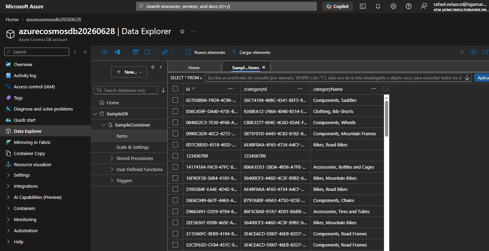

 

## Clean up

When you’ve finished exploring Azure Cosmos DB, you should delete the resources you created so you don’t incur any further costs.

1. In the Azure portal, navigate to the resource group that contains your Cosmos DB account.

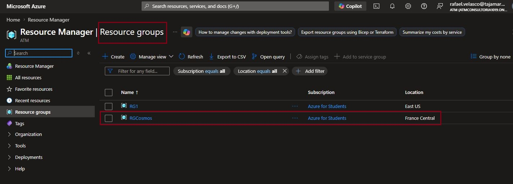

 

2. Select Delete resource group, confirm the deletion by entering the resource group name, and select Delete.

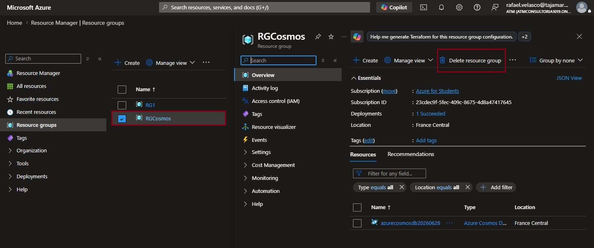 

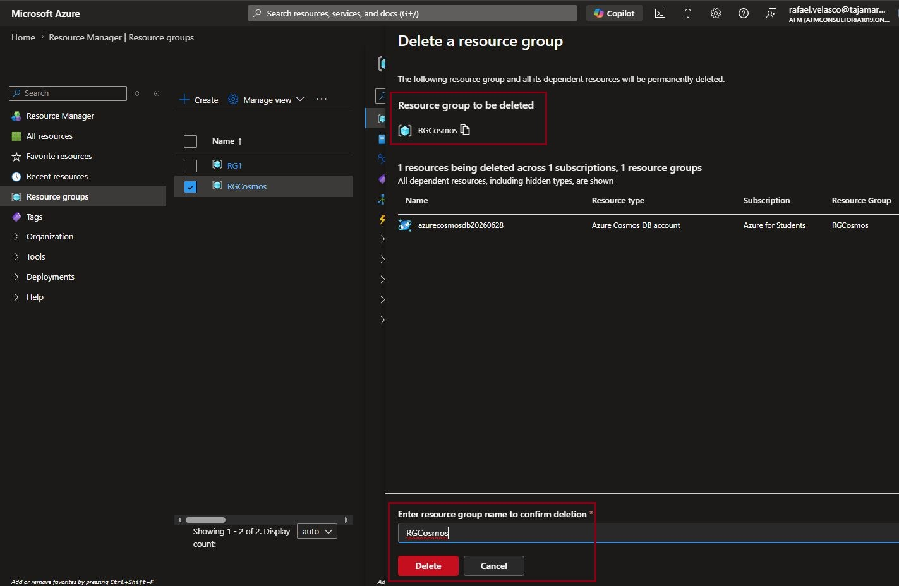

 

> ! Tip: Deleting the resource group removes the Cosmos DB account and everything inside it in a single step. This is the quickest way to make sure nothing is left running and costing money.

 

We verified that the resource group had been removed.

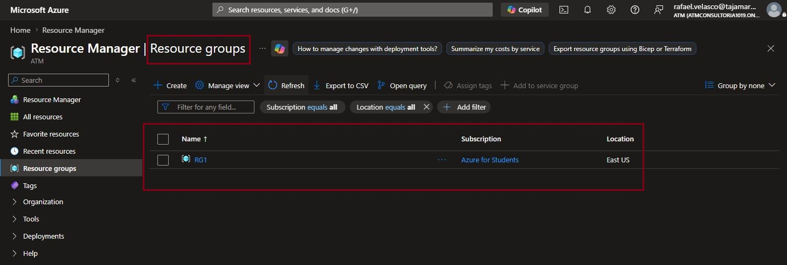

 

In this lab, you created an Azure Cosmos DB account, added JSON items, and queried them using a SQL-like language. You’ve taken your first steps with NoSQL data in the cloud!