## DP-900T00A-Azure-Data-Fundamentals

# [Explore data analytics in Microsoft Fabric](https://microsoftlearning.github.io/DP-900T00A-Azure-Data-Fundamentals/Instructions/Labs/dp900-04b-fabric-lake-lab.html)

In this lab, you’ll explore how to bring in and analyze data using **Microsoft Fabric**, an all-in-one analytics platform that handles everything from storing data to building reports in one place.

You’ll work with a **lakehouse**, which is a single place that can store both raw data files and organized tables you can query with SQL. You’ll then use a **copy job** (an automated, guided way to copy data from one place to another) to bring in a real-world set of New York City taxi trips, and finish by running SQL queries to answer questions about the data.

By completing this lab, you will:

- **Understand Microsoft Fabric lakehouse concepts**: Learn how to create workspaces and lakehouses, which are central to organizing and managing data in Fabric.
- **Bring in data using a copy job**: Use a guided copy job to load external data into the lakehouse, making it ready to query without writing any code.
- **Explore and query data with SQL**: Analyze the loaded data using familiar SQL queries, gaining insights directly within Fabric.
- **Manage resources**: Learn good habits for cleaning up resources to avoid unnecessary charges.
Don’t worry if these terms are new, every step is explained as you go.

<br>

---

## Background on the NYC Taxi dataset

The “NYC Taxi - Green” dataset contains detailed records of taxi trips in New York City, including pickup and drop-off times, locations, trip distances, fares, and passenger counts. It’s widely used in data analytics for exploring how people move around a city, forecasting demand, and spotting unusual patterns. In this lab, you’ll use this real-world dataset to practice bringing in and analyzing data in Microsoft Fabric.

This lab will take approximately 30 minutes to complete.

>! Note: You’ll need a Microsoft Fabric license to complete this exercise. See Getting started with Fabric for details of how to enable a free Fabric trial license. You will need a Microsoft school or work account to do this. If you don’t have one, you can sign up for a trial of Microsoft Office 365 E3 or higher.

*The first time you use any Microsoft Fabric features, prompts with tips may appear. Dismiss these.*

<br>

---

## Create a workspace

Before working with data in Fabric, create a workspace with the Fabric trial enabled.

>! **What is a workspace**? Think of it as a project folder that holds everything you create in Fabric (lakehouses, pipelines, reports, and more). Enabling Fabric capacity gives the workspace the computing power needed to run those items.

1. Navigate to the [Microsoft Fabric home page](https://app.fabric.microsoft.com/home?experience=fabric) at https://app.fabric.microsoft.com/home?experience=fabric in a browser, and sign in with your Fabric credentials.

2. At the bottom of the menu bar on the left is an experience switcher. If it shows **Power BI**, select it and choose **Fabric** so that all of the data engineering features used in this lab are available.

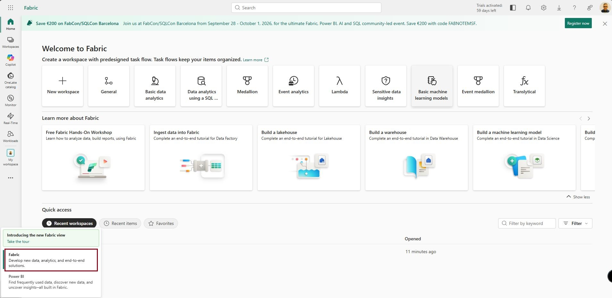

<br>

3. In the menu bar on the left, select **Workspaces** (the icon looks similar to 🗇).

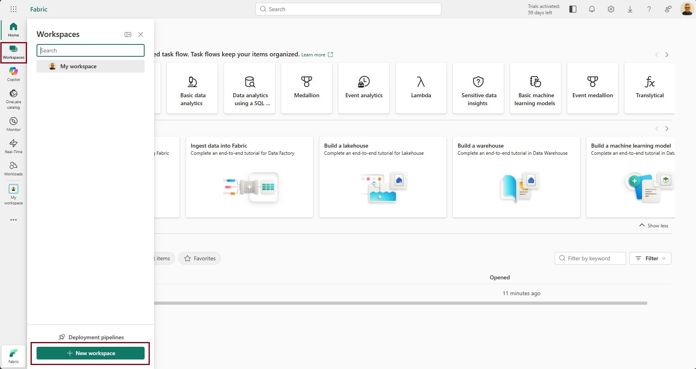

<br>

4. Select + **New workspace**, give your workspace a name (such as *dp900-fabric-lakehouse*), and in the **Advanced** section select a licensing mode that includes Fabric capacity (Trial, Premium, or Fabric). Then select **Apply**.

>! **Tip** Selecting a capacity that includes Fabric gives the workspace the engines needed for data engineering tasks. Using a dedicated workspace keeps your lab resources isolated and easy to clean up.

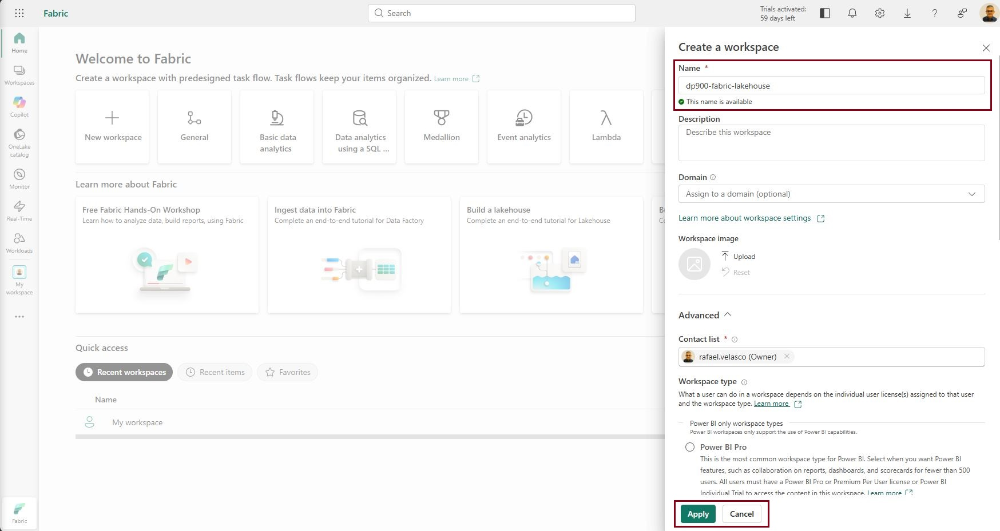

<br>

5. When your new workspace opens, it should be empty.

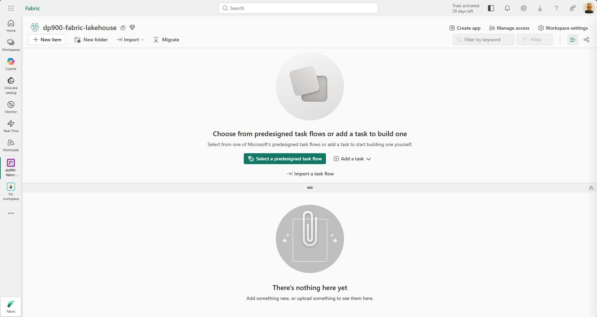

<br>

---

## Create a lakehouse

Now that you have a workspace, it’s time to create a lakehouse for your data files.

>! *What is a lakehouse? It’s a single storage area that holds both raw data files *and* organized tables. The tables can be queried with SQL, just like in a regular database, while the files area can hold data in any format. This combination is why it’s called a “lake” (flexible file storage) plus a “house” (structured tables).*

1. In your workspace toolbar, select + **New item**. In the **New item** pane, search for Lakehouse and select the **Lakehouse** tile.

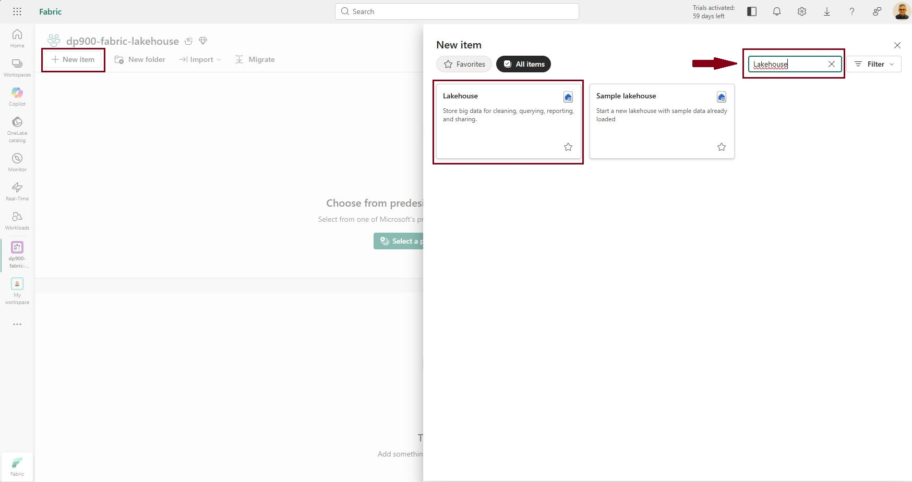

<br>

2. In the **New Lakehouse** dialog, enter a name such as *taxi_lakehouse*, leave **Lakehouse schemas** selected, and select **Create**.

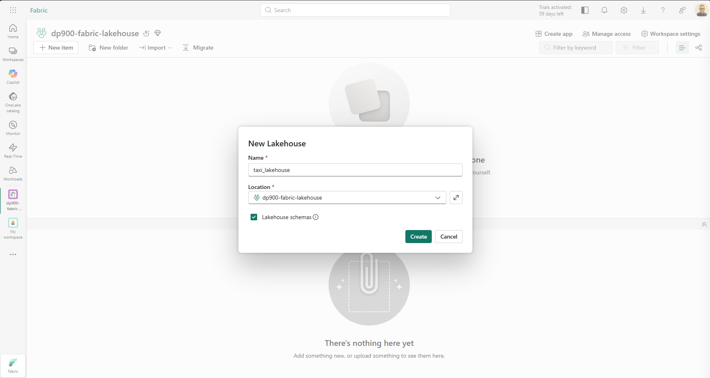

<br>

After a minute or so, a new lakehouse will be created.

3. View the new lakehouse, and note that the **Explorer** pane on the left enables you to browse tables and files in the lakehouse:

- The **Tables** folder contains tables that you can query using SQL semantics, organized into schemas (such as the default **dbo** schema). Tables in a Microsoft Fabric lakehouse are based on the open source Delta Lake file format, commonly used in Apache Spark.
- The **Files** folder contains data files in the OneLake storage for the lakehouse that aren’t associated with managed delta tables. You can also create shortcuts in this folder to reference data that is stored externally.

Currently, there are no tables or files in the lakehouse.

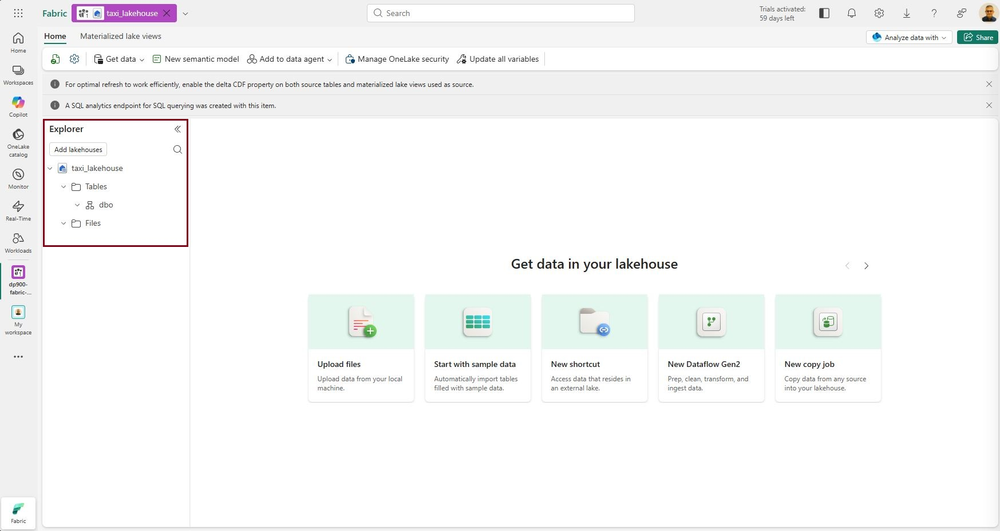

<br>

>! Tip: Use Files for raw or staged data, and Tables for curated, query-ready datasets. Tables are backed by Delta Lake so they support reliable updates and efficient queries.

<br>

---

## Ingest data

A simple way to bring data into the lakehouse is to use a **Copy job**. This copies the data from a source (in this case, a sample dataset) into a table in your lakehouse.

>! **What is a copy job**? It’s a guided, repeatable way to move data from a source into your lakehouse without writing any code. A copy job can run once or on a schedule, which makes it much easier than copying data by hand.

1. On the Home page for your lakehouse, in the **Get data** menu, select **New copy job**.

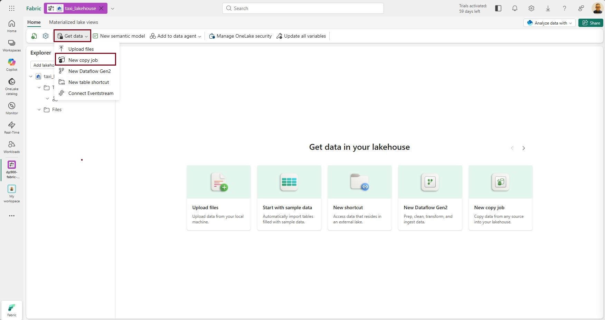

<br>

2. In the **New Copy job** dialog, name the job *Ingest Data* and select **Create**.

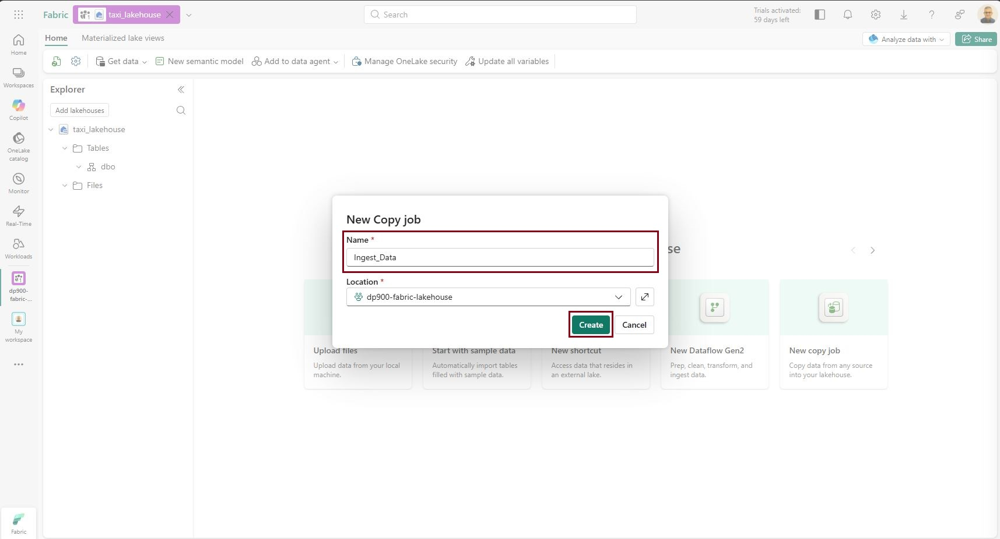

<br>

3. On the **Choose data source** page, select the **Sample data** tab at the top.

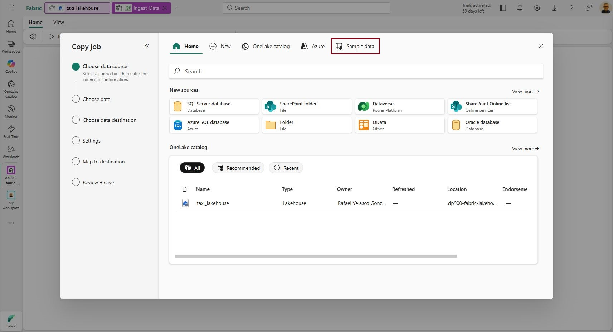

<br>

4. Select the **NYC Taxi - Green** sample dataset.

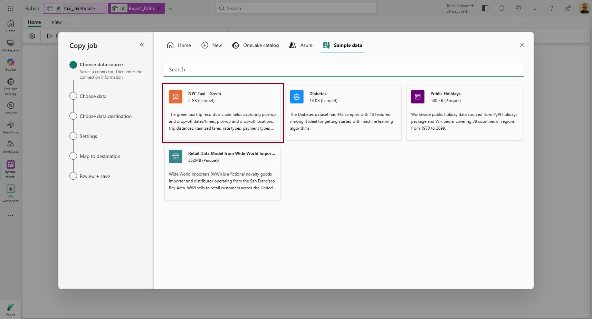

<br>

5. On the **Choose data** page, review the preview of the taxi trip data, and then select **Next**.

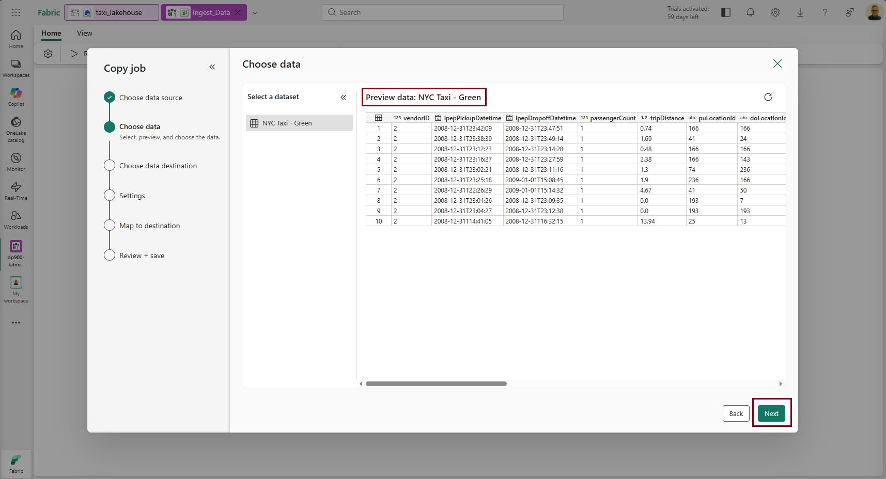

<br>

6. On the **Settings** page, ensure **Full copy** is selected as the read method and **Tables** is selected as the destination root folder, and then select **Next**.

>! ***Why these choices? Full copy** loads all of the data in a single run, and choosing Tables as the root folder loads the data straight into a managed Delta table that you can query right away.*

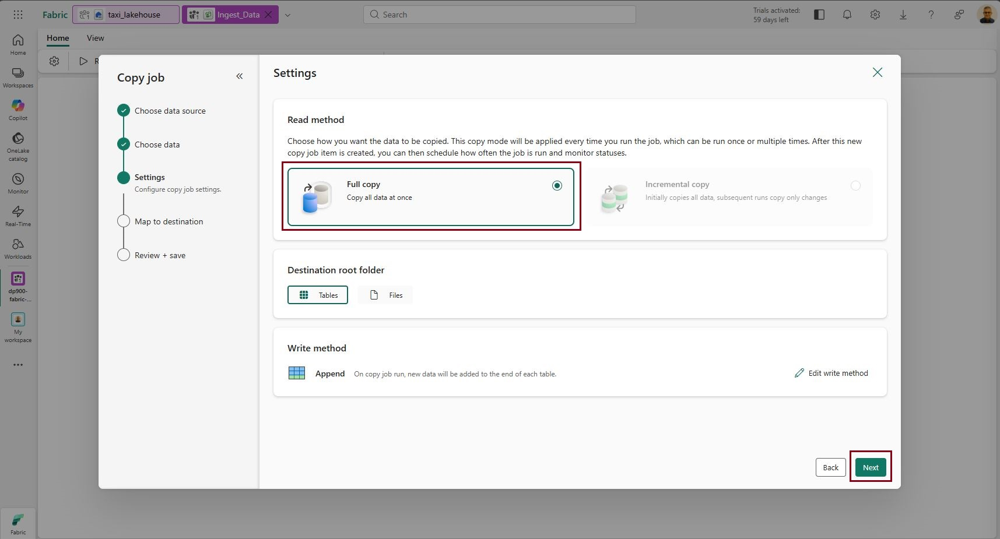

<br>

7. On the **Map to destination** page, set the destination schema to *dbo* and the destination table name to *taxi_rides*, and then select **Next**.

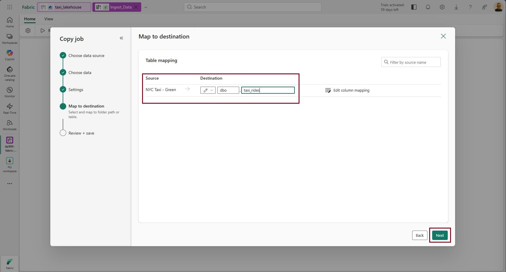

<br>

8. On the **Review + save** page, make sure **Start data transfer immediately** is selected and the **Run once** option is selected, and then select **Save + Run**.

>! **Tip**: Starting immediately lets you watch the copy job run and confirm the data arrives without extra steps.

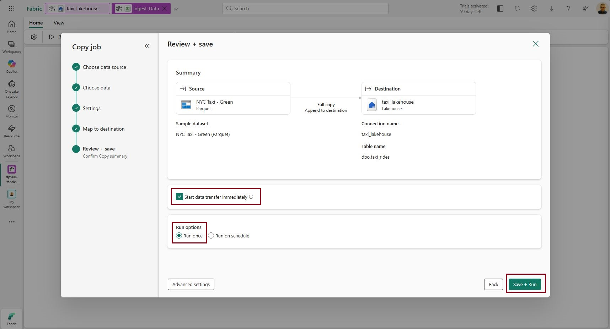

<br>

9. The copy job runs. In the **Results** pane, wait until the **Status** shows **Succeeded** and **Tables completed** shows **1/1**.

>! **Note**: Because the sample data is copied as Parquet files, the Rows read and Rows written counters may show 0 even though the table is created and populated successfully.

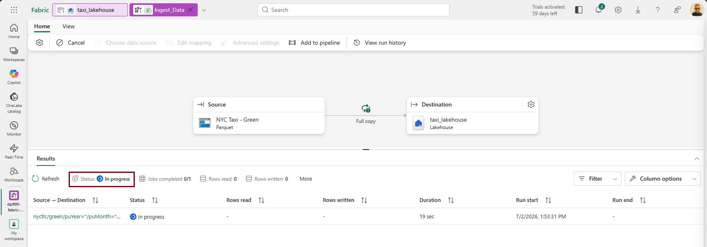

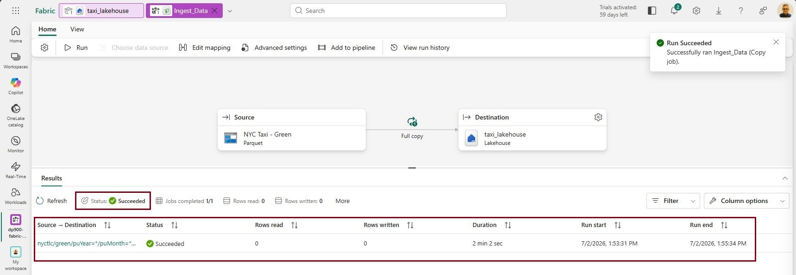

<br>

10. In the menu bar at the top, select your lakehouse (you can also find it from your workspace). In the **Explorer** pane, expand **Tables** > **dbo** and select the **taxi_rides** table to view its contents.

>! **Tip**: If the table doesn’t appear right away, use the … menu on the Tables node and select Refresh.

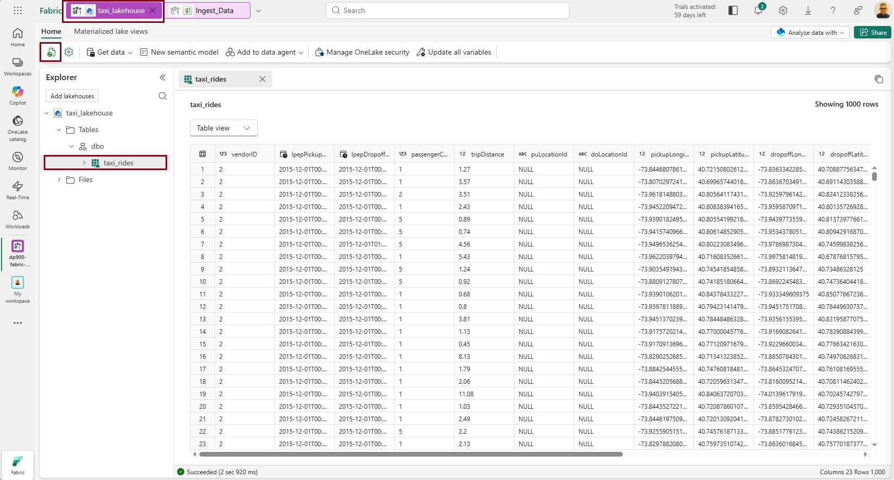

<br>

## Query data in a lakehouse

Now that you have ingested data into a table in the lakehouse, you can use SQL to query it.

>! **Tip**: Lakehouse tables are SQL-friendly. You can analyze data right away without moving it to another system.

1. At the top right of the lakehouse page, select **Analyze data with**, and then select **SQL analytics endpoint**.

    >! **Tip**: The SQL analytics endpoint is optimized for running SQL queries over your lakehouse tables and integrates with familiar query tools.

<br>

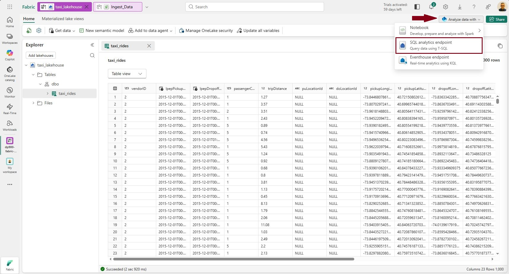

<br>

2. In the toolbar, select **New SQL query**. Then enter the following SQL code into the query editor:

SQL
```sql
 SELECT  DATENAME(dw,lpepPickupDatetime) AS Day,
         AVG(tripDistance) As AvgDistance
 FROM taxi_rides 
 GROUP BY DATENAME(dw,lpepPickupDatetime)
```

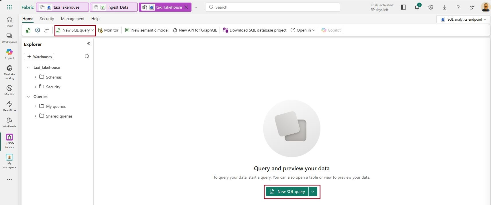

<br>

3. Select the ▷ **Run** button to run the query and review the results, which should include the average trip distance for each day of the week.

>! **Tip**: This query groups trips by day name and calculates the average distance, showing a simple example of aggregation you can build on.

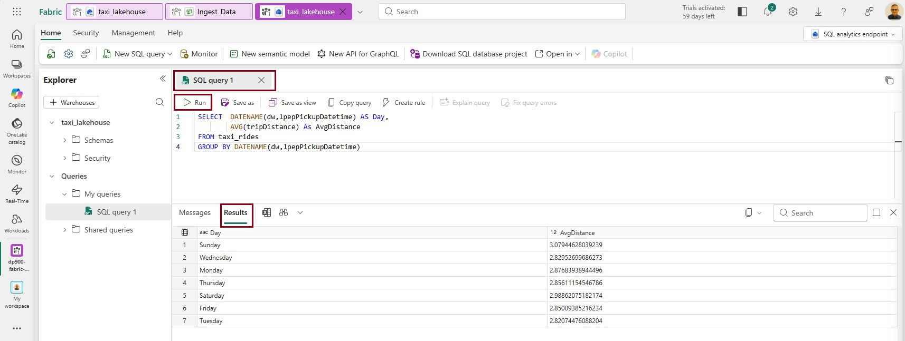

<br>

---

## Clean up resources

If you’ve finished exploring Microsoft Fabric, you can delete the workspace you created for this exercise.

>! **Tip**: Deleting the workspace removes all items created in the lab and helps prevent ongoing charges.

1. In the bar on the left, select the icon for your workspace to view all of the items it contains.

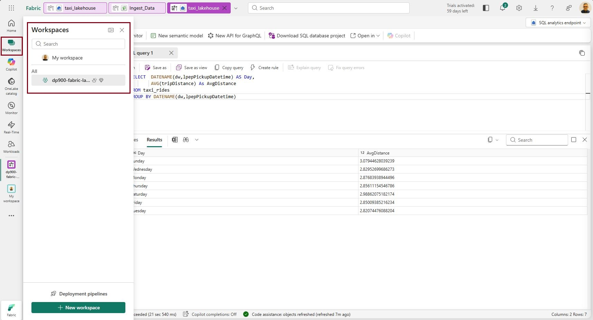

<br>

2. In the toolbar, select **Workspace settings**.

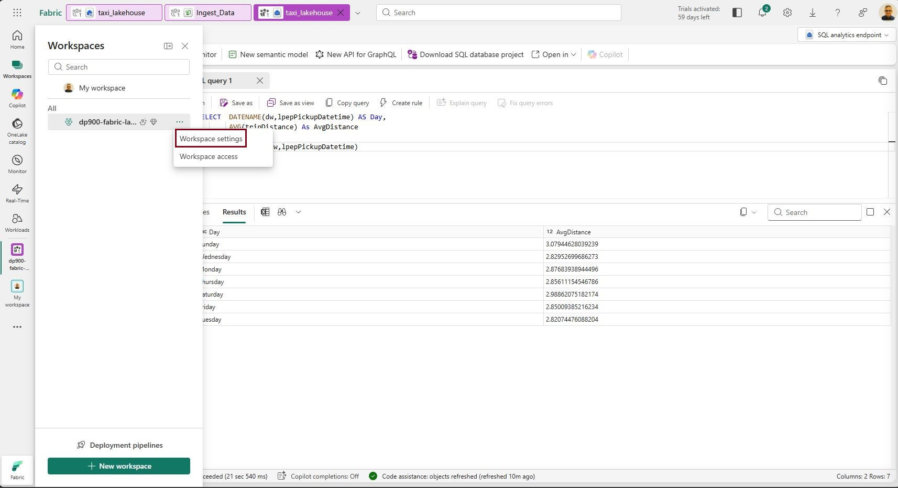

<br>

3. In the **General** section, select **Remove this workspace**.

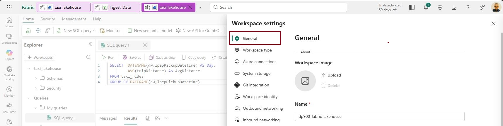

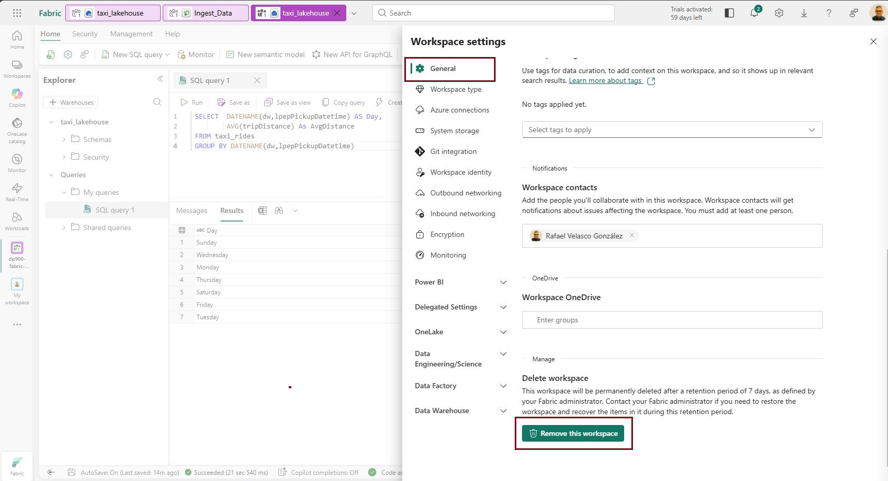

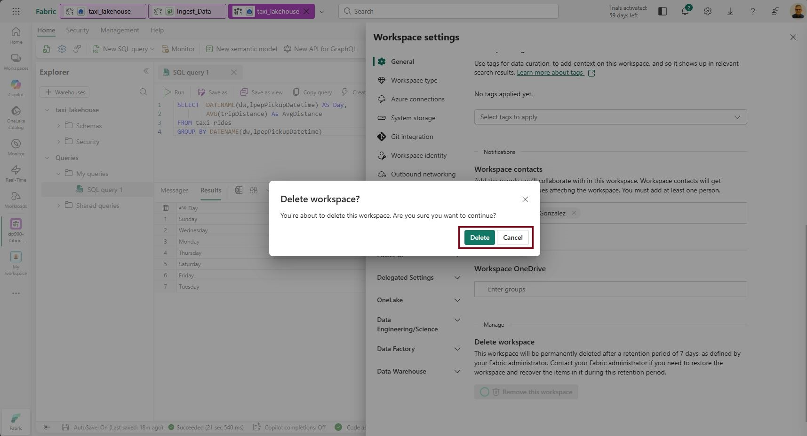

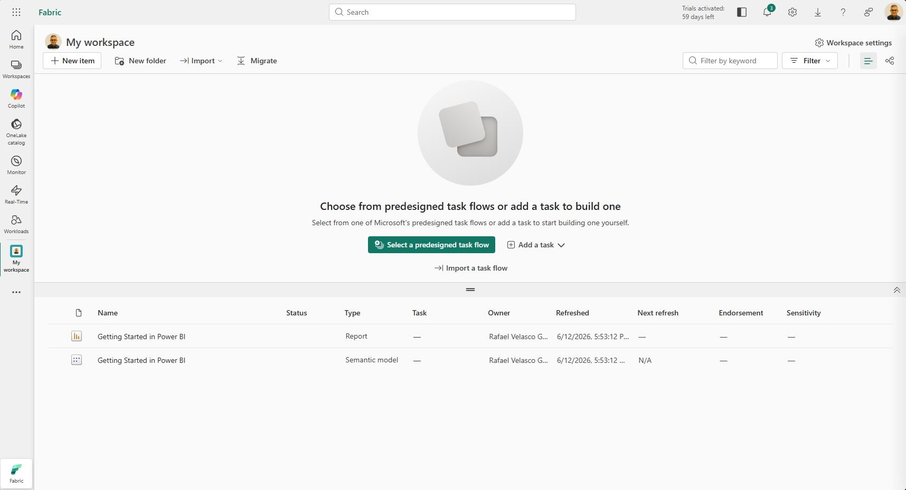

<br>

---

[Volver al inicio](#dp-900t00a-azure-data-fundamentals)

---
