## DP-900T00A-Azure-Data-Fundamentals

# [Explore Azure SQL Database]([https://](https://microsoftlearning.github.io/DP-900T00A-Azure-Data-Fundamentals/Instructions/Labs/dp900-01-sql-lab.html))

## Provision an Azure SQL Database resource

1. Sign in to the [portal de Azure](https://portal.azure.com/?azure-portal=true) using your Azure account.

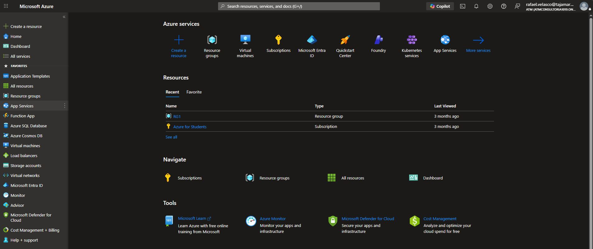

2. At the top left of the page, select ＋ Create a resource. In the Search the Marketplace box, type Azure SQL and press Enter. In the search results, select Azure SQL (published by Microsoft).

 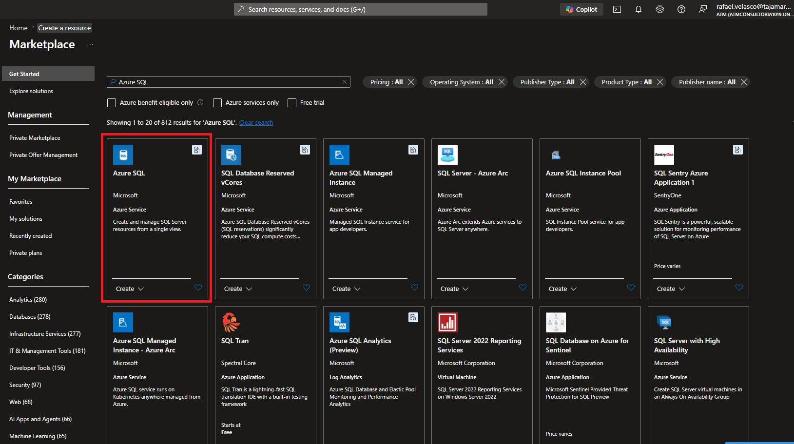
 
 3. On the Azure SQL page, select Create. On the Find the right Azure SQL solution for your workload page, in the Create a database tile, select More details, and then select Create SQL Database.

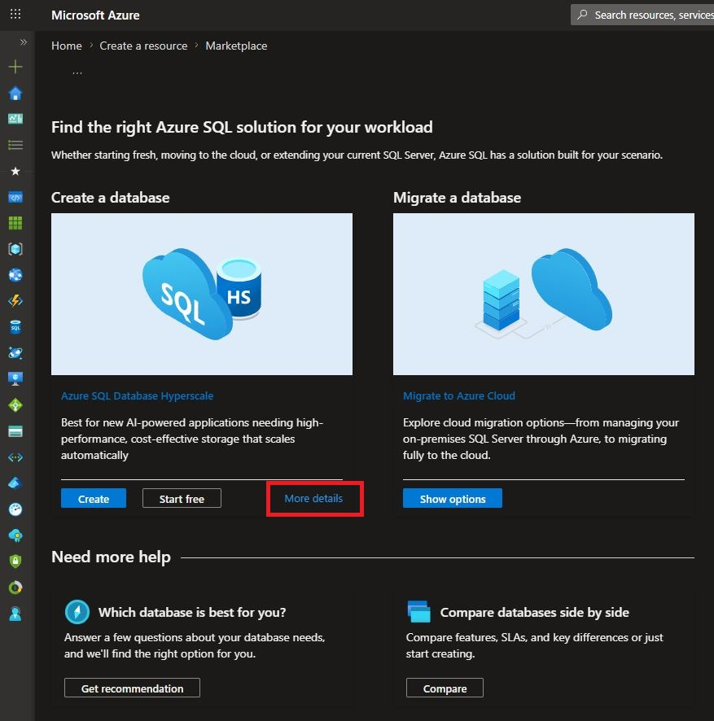

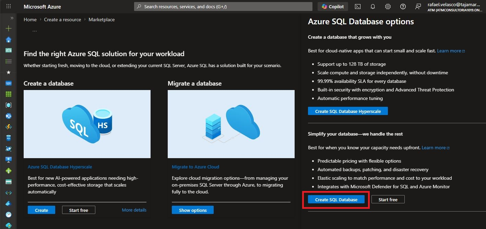

4. Enter the following values on the Create SQL Database page, and leave all other properties with their default setting:

- Subscription: Select your Azure subscription.
- Resource group: Create a new resource group with a name of your choice.

> What is a resource group? It’s just a folder that holds related Azure resources together. When you’re finished, you can delete the folder to remove everything in one click.

- Database name: Dealership

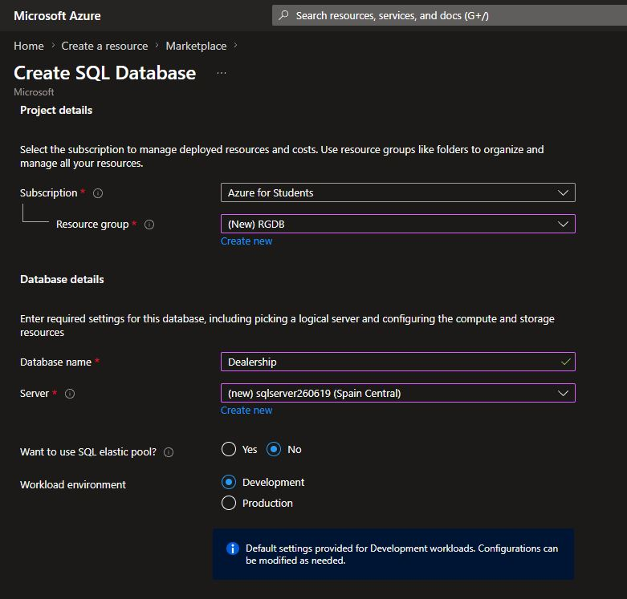

- Server: Select Create new and create a new server with a unique name in any available location. Use SQL authentication and specify your name as the server admin login and a suitably complex password (remember the password - you’ll need it later!)

Select OK to close the server form.

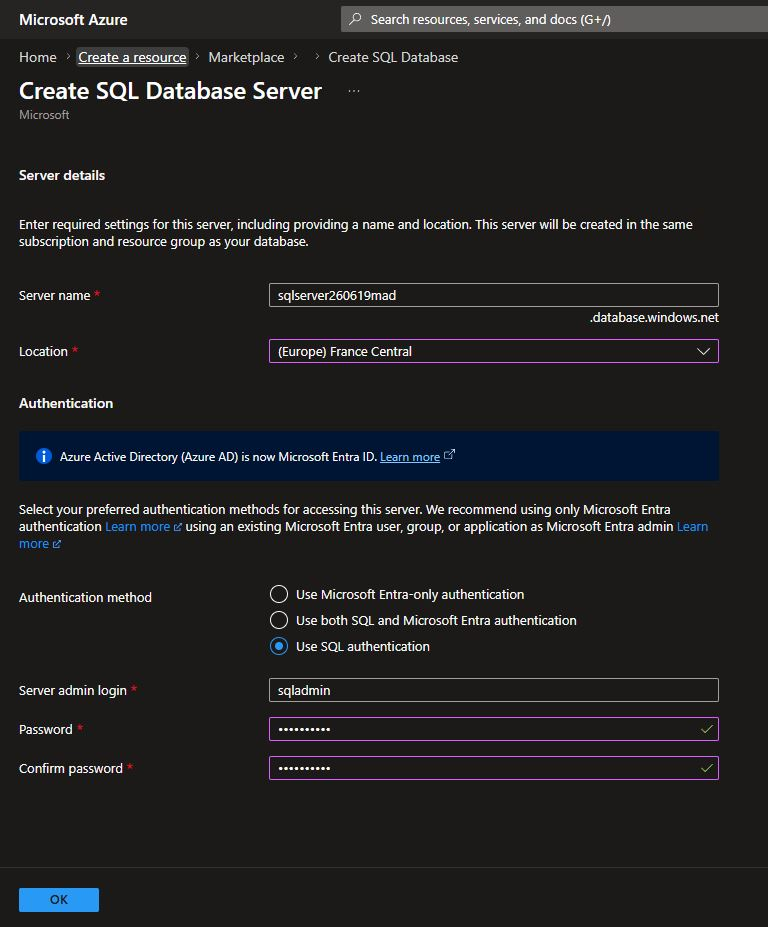

- Want to use SQL elastic pool?: No
- Workload environment: Development
- Compute + storage: Leave unchanged.
- Backup storage redundancy: Locally-redundant backup storage

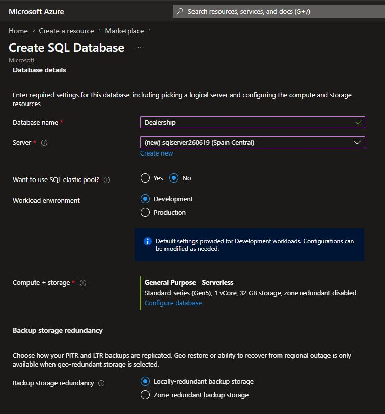

5. Select Next: Networking >. On the Networking page, in the Network connectivity section, select Public endpoint. Then, in the Firewall rules section, set both Allow Azure services and resources to access this server and Add current client IP address to Yes.

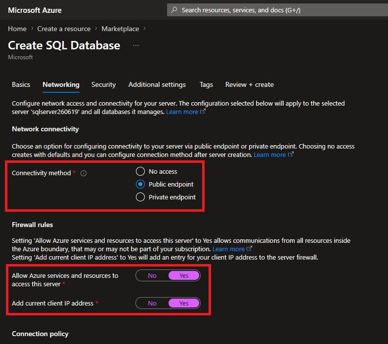 

Others options: Leave unchanged.

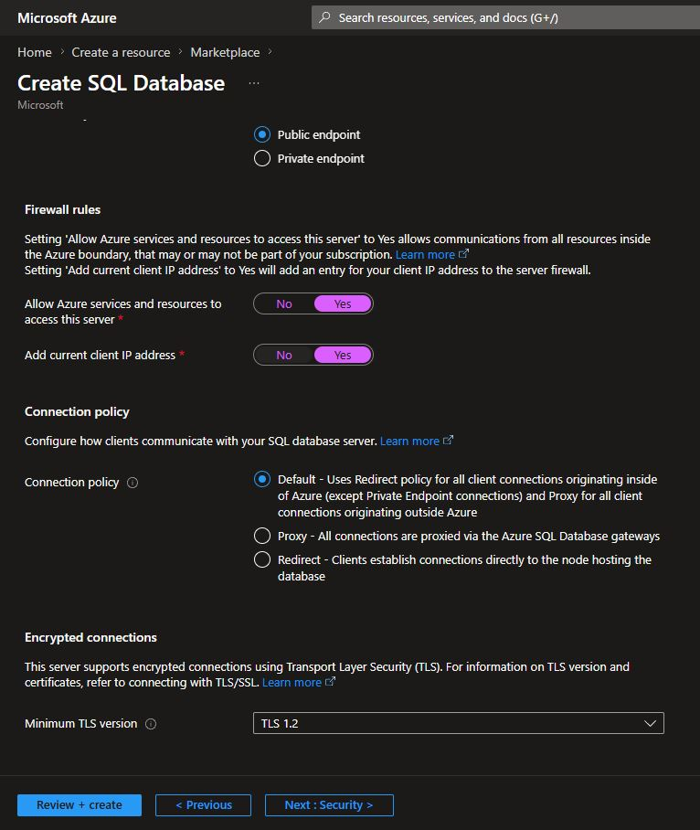 

6. Select Next: Security > and make sure the Enable Microsoft Defender for SQL option is set to Not now.

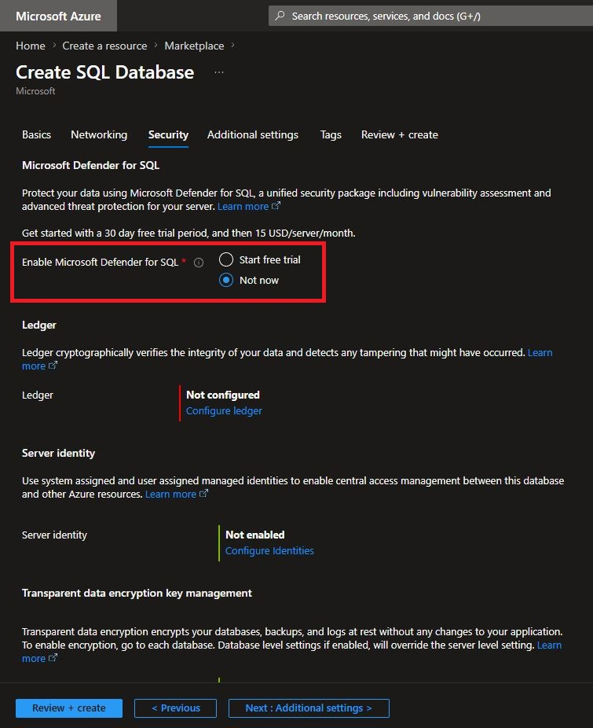

7. Select Next: Additional settings >. On the Additional settings tab, make sure the Use existing data option is set to None.

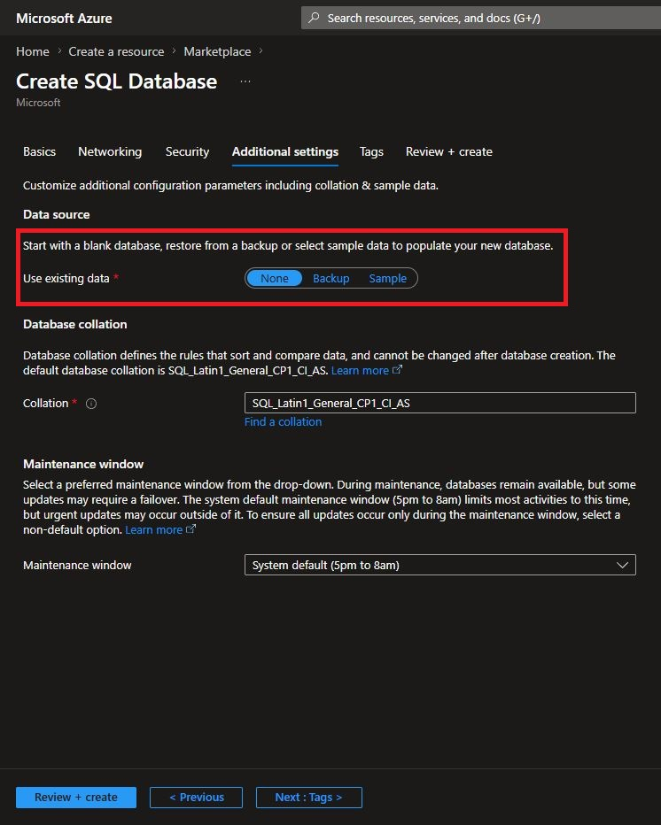

8. Select Review + create, review the settings, and then select Create.

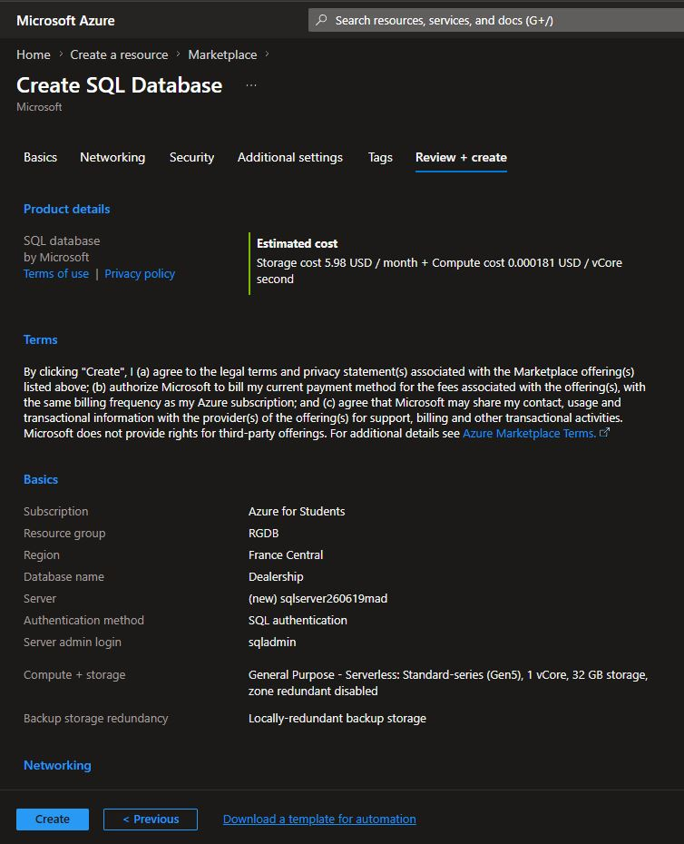

9. Wait a few minutes for the deployment to complete. When it’s finished, select Go to resource.

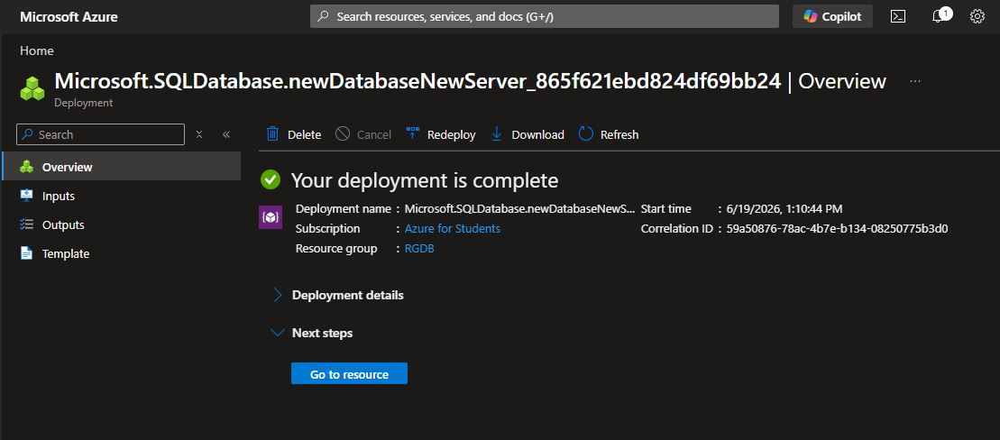

## Create the database tables and add sample data

Your database is created, but it’s empty. In a relational database, data is stored in tables, which are like spreadsheets made of rows and columns. You’ll now create two tables and fill them with a small amount of sample data.

1. In the menu on the left side of the database page, select Query editor (preview). On the sign-in pane, select the SQL authentication tab, enter the server admin login and password you created earlier, and then select Connect.

