## DP-900 Lab 01-02 MySQL

# Azure Database for MySQL

## Provisionar un recurso de Azure Database for MySQL

### Paso 1: Crear un nuevo recurso

- Ingresa al portal de Azure.
- Selecciona + Crear un recurso en la esquina superior izquierda.
- En el buscador, escribe Azure Database for MySQL.
- Selecciona la opción que aparece y haz clic en Crear.

 

### Paso 2: Seleccionar tipo de recurso

- Revisa las opciones disponibles para Azure Database for MySQL.
- En Tipo de recurso, selecciona Servidor flexible.
- Haz clic en Creacion rapida o avanzado(nuestro caso avanzada).

 

### Paso 3: Configurar la base de datos
En la página Crear base de datos SQL, introduce los siguientes valores:
- Suscripción: selecciona tu suscripción activa de Azure.
- Grupo de recursos: crea un nuevo grupo con un nombre que elijas.
- Nombre del servidor: escribe un nombre único para el servidor.
- Región: selecciona una ubicación cercana a ti.
- Versión de MySQL: déjala sin cambios.
- Tipo de carga de trabajo: selecciona para proyectos de desarrollo o hobby.
- Computación + almacenamiento: déjalo sin cambios.
- Zona de disponibilidad: déjalo sin cambios.
- Habilitar alta disponibilidad: déjalo sin cambios.
- Nombre de usuario del administrador: ingresa el nombre de usuario que quieras usar.
- Contraseña y Confirmar contraseña: establece una contraseña segura.

Luego, selecciona Siguiente: Redes.

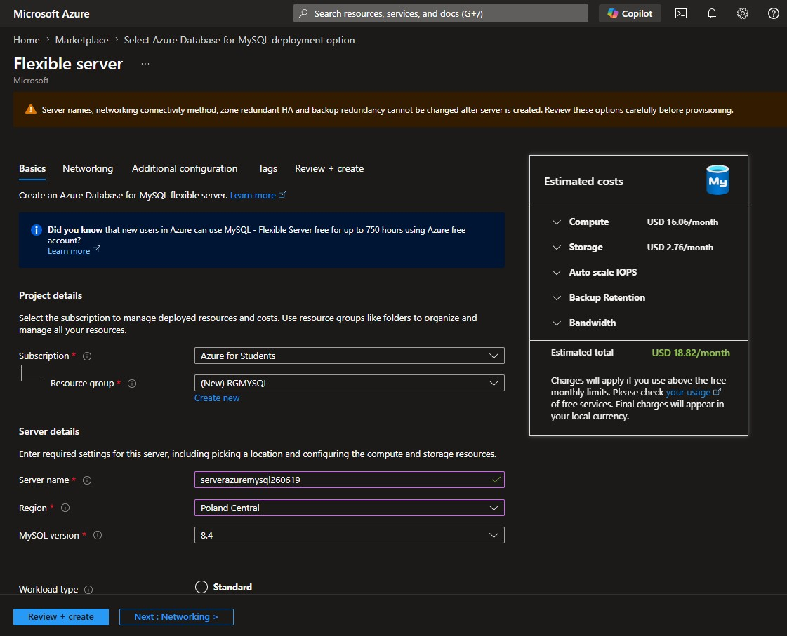

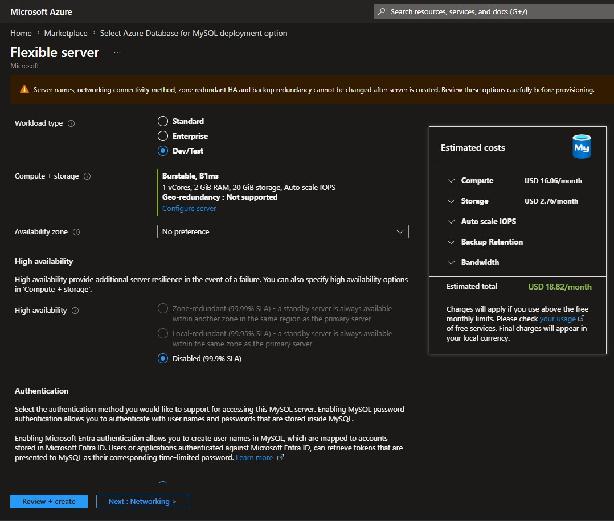

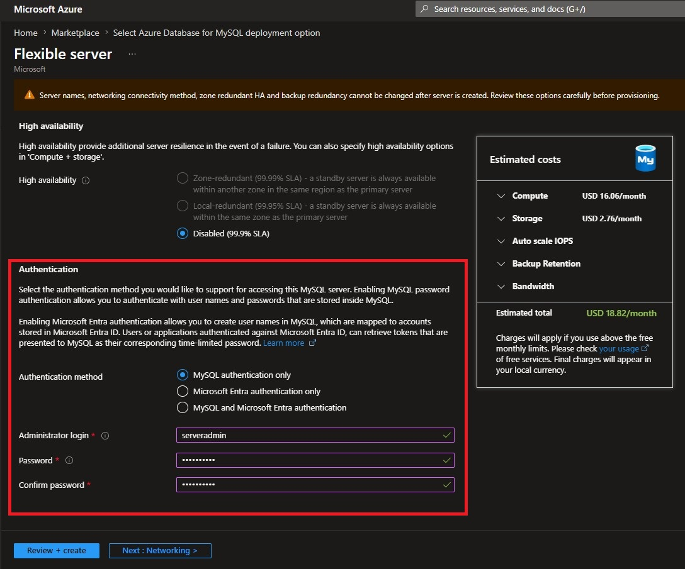

 

### Paso 4: Configurar reglas de firewall

- En la sección Reglas de firewall, selecciona + Agregar dirección IP del cliente actual para permitir el acceso desde tu equipo.

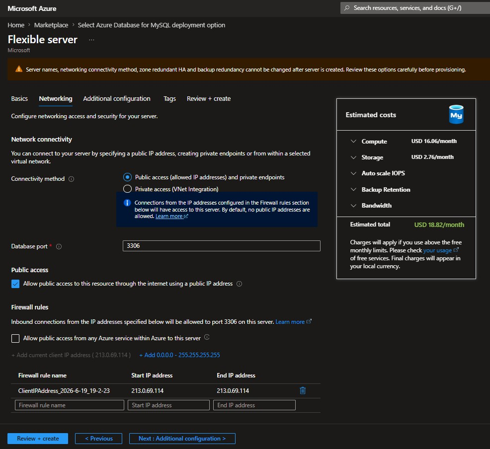

 

### Paso 5: Revisar y crear

- Selecciona Revisar + Crear para validar la configuración.
- Luego, haz clic en Crear para iniciar la implementación.

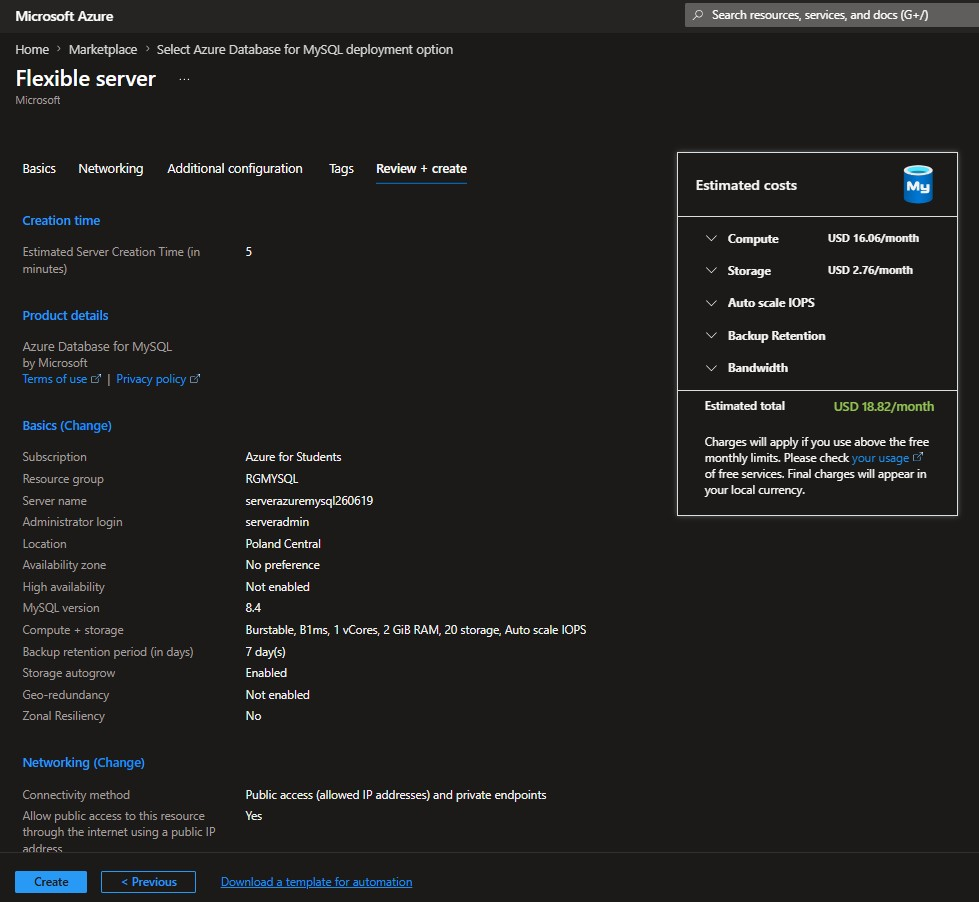

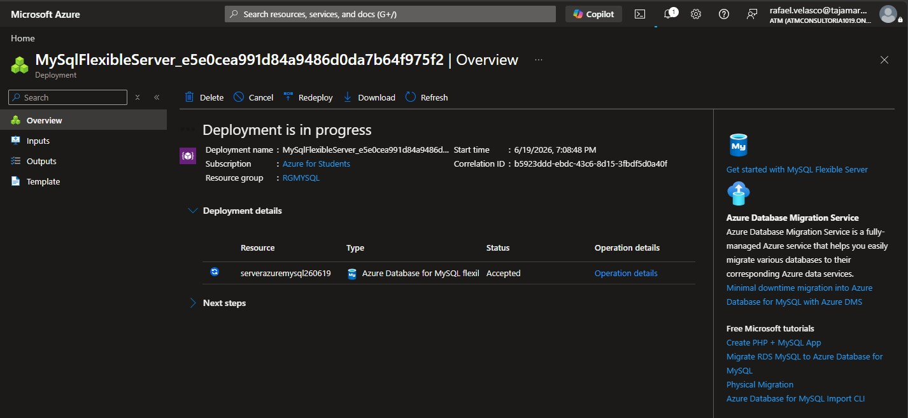

 

### Paso 6: Esperar a la implementación

- Espera a que la implementación se complete.
- Cuando termine, selecciona Ir al recurso para acceder al servidor MySQL recién creado.

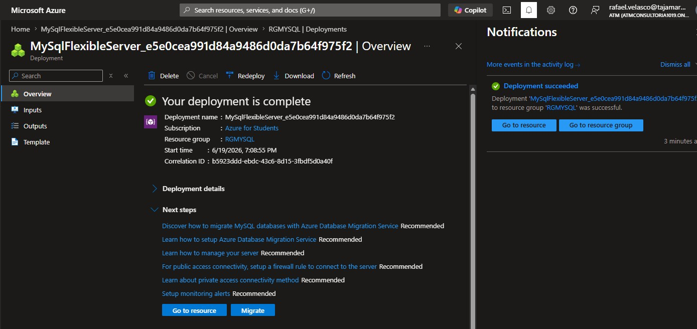

 

### Paso 7: Explorar y administrar el recurso

- Desde la página del recurso, puedes revisar todas las opciones para administrar tu Azure Database for MySQL.

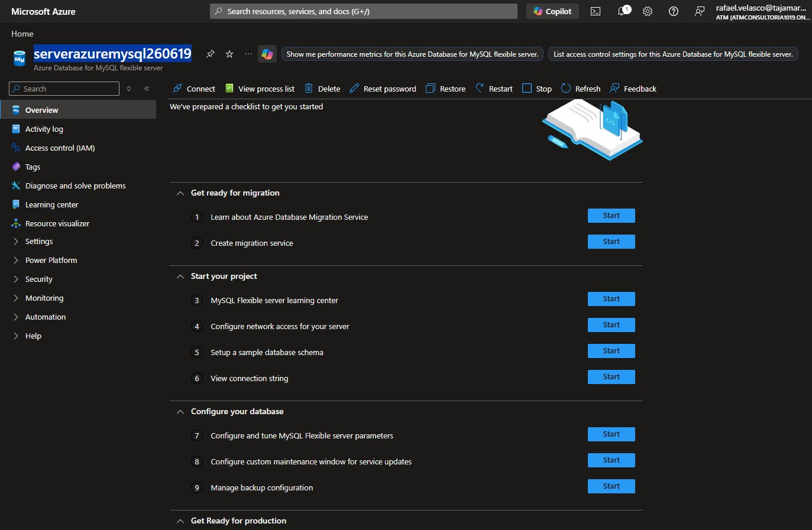

### Opciones para administrar Azure Database for MySQL

### Settings

- Databases

Podemos añadir o eliminar bases de datos.
Muestra las cuatro bases de datos del sistema que MySQL utiliza internamente para:
- Usuarios y permisos.
- Configuración del servidor.
- Información de rendimiento.
- Metadatos del sistema.

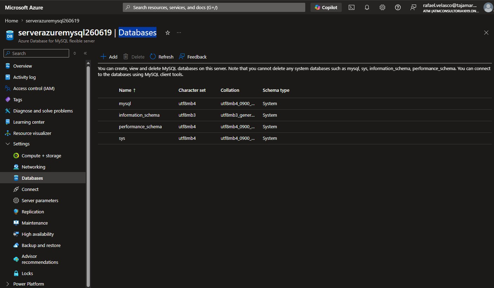

- Server Parameters

Permiten configurar el comportamiento del motor MySQL mediante parámetros de administración como conexiones máximas, memoria, tiempos de espera y registro de actividad.
Concepto relacionado:
- Administración de bases de datos
- Configuración del motor de base de datos

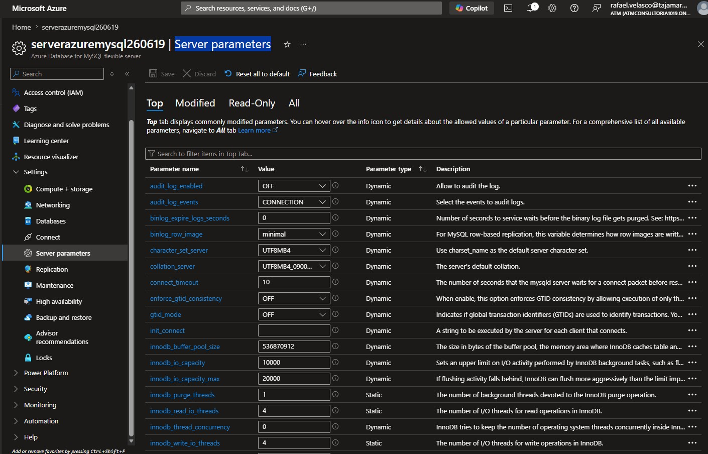

- Backup and Restore

Azure Database for MySQL incluye mecanismos de copia de seguridad y restauración administrados por la plataforma para facilitar la recuperación ante errores o pérdidas de datos.
Concepto relacionado:
- Disponibilidad
- Recuperación ante desastres
- Copias de seguridad

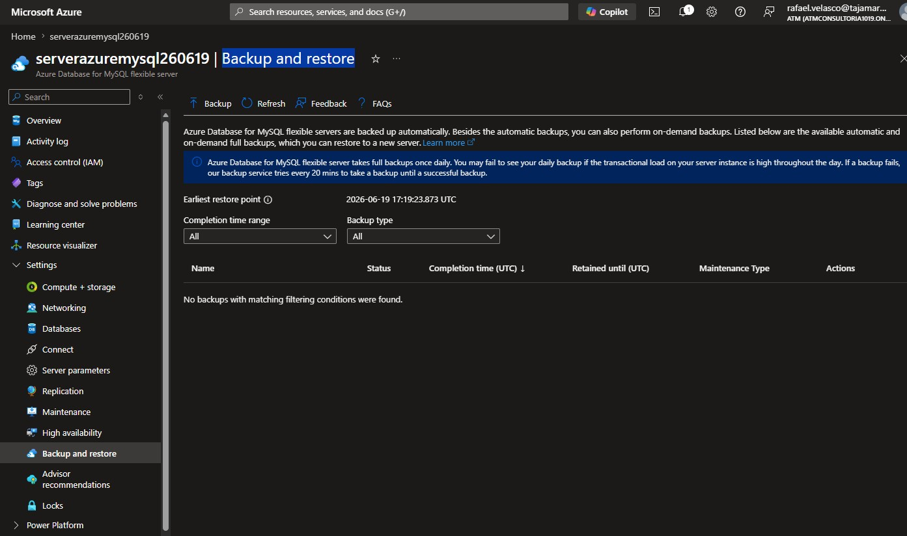

### Monitoring 

- Metrics

Sirve para monitorizar el rendimiento mediante métricas como:
- CPU
- Memoria
- Conexiones
- IOPS
- Almacenamiento

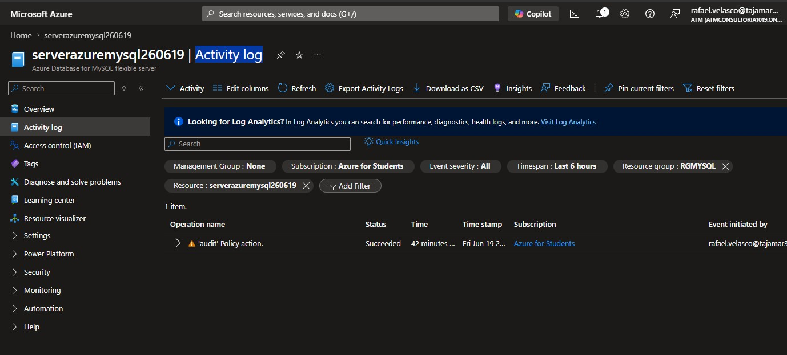

### Activity Log

Muestra todas las operaciones realizadas sobre el recurso:
- Creación del servidor.
- Cambios de configuración.
- Eliminaciones.
- Actualizaciones.

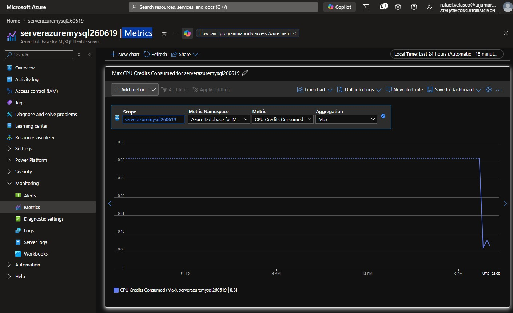

## Conexion con CLI al servidor 

