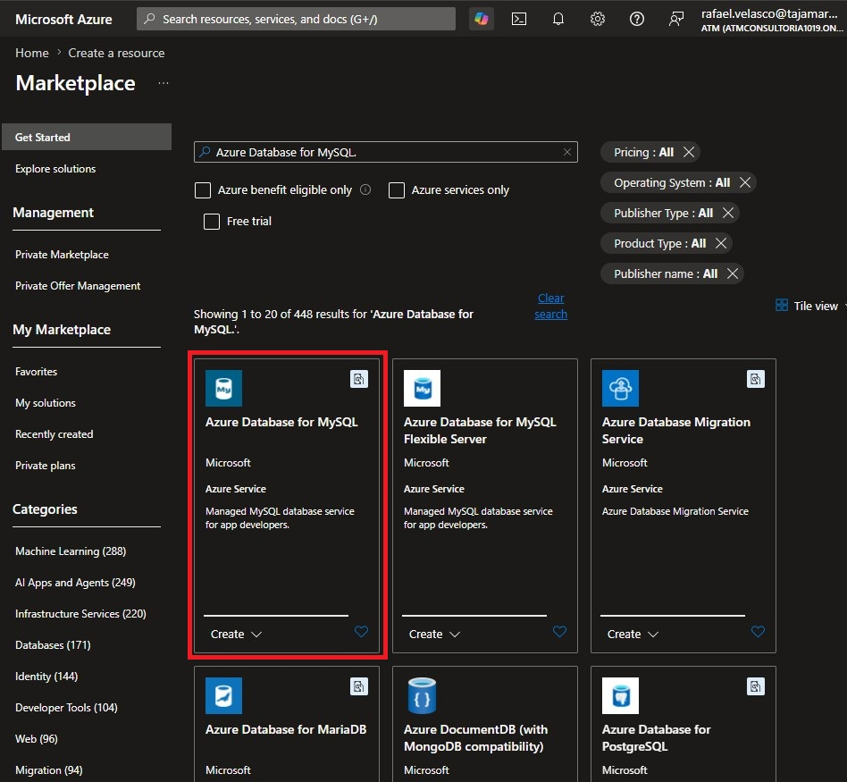
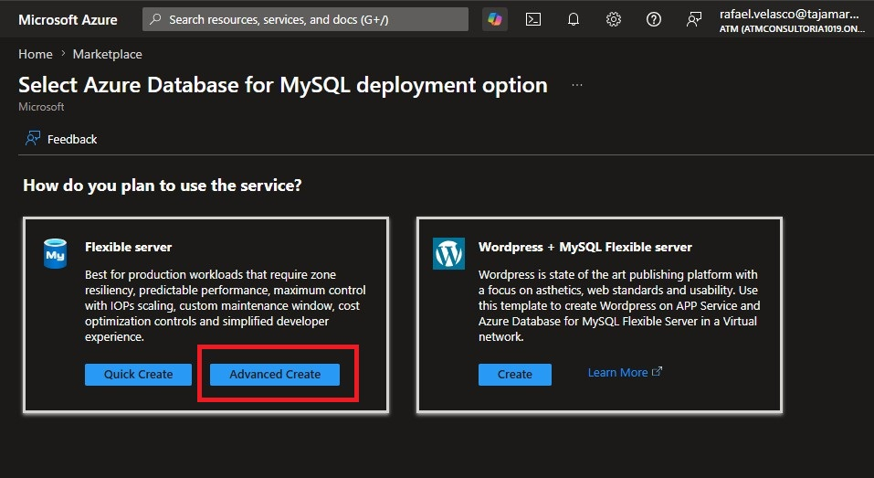

## DP-900 Lab 01-02 MySQL

# Azure Database for MySQL

## Provisionar un recurso de Azure Database for MySQL

### Paso 1: Crear un nuevo recurso

- Ingresa al portal de Azure.
- Selecciona + Crear un recurso en la esquina superior izquierda.
- En el buscador, escribe Azure Database for MySQL.
- Selecciona la opción que aparece y haz clic en Crear.

 

### Paso 2: Seleccionar tipo de recurso

- Revisa las opciones disponibles para Azure Database for MySQL.
- En Tipo de recurso, selecciona Servidor flexible.
- Haz clic en Creacion rapida o avanzado(nuestro caso avanzada).

 

### Paso 3: Configurar la base de datos
En la página Crear base de datos SQL, introduce los siguientes valores:
- Suscripción: selecciona tu suscripción activa de Azure.
- Grupo de recursos: crea un nuevo grupo con un nombre que elijas.
- Nombre del servidor: escribe un nombre único para el servidor.
- Región: selecciona una ubicación cercana a ti.
- Versión de MySQL: déjala sin cambios.
- Tipo de carga de trabajo: selecciona para proyectos de desarrollo o hobby.
- Computación + almacenamiento: déjalo sin cambios.
- Zona de disponibilidad: déjalo sin cambios.
- Habilitar alta disponibilidad: déjalo sin cambios.
- Nombre de usuario del administrador: ingresa el nombre de usuario que quieras usar.
- Contraseña y Confirmar contraseña: establece una contraseña segura.

Luego, selecciona Siguiente: Redes.

