## DP-900T00A-Azure-Data-Fundamentals

# [Exploración de Azure Storage](https://microsoftlearning.github.io/DP-900T00A-Azure-Data-Fundamentals/Instructions/Labs/dp900-02-storage-lab.html)

## Provision an Azure Storage account
“Provisioning” just means creating and setting up a new resource. The first step in using Azure Storage is to create a storage account, which acts as a container for everything you store.

1. If you haven’t already done so, sign into the [Azure portal](https://portal.azure.com/?azure-portal=true#home).

2. On the Azure portal home page, select **＋ Create a resource** from the upper left-hand corner and search for $Storage$ $account$. Then in the resulting **Storage account** page, select **Create**.

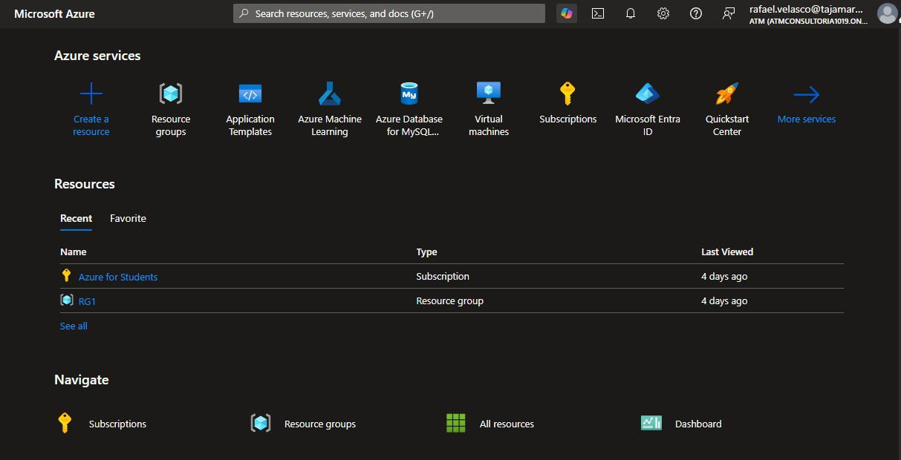

 

3. Enter the following values on the Basics tab of the Create a storage account page:

- Subscription: Select your Azure subscription.
- Resource group: Select Create new and enter a name of your choice, such as dp900-lab-rg.
- Storage account name: Enter a unique name for your storage account using lower-case letters and numbers only (this name must not already be in use by anyone else).
- Region: Select any available location near you.
- Performance: Standard
- Redundancy: Locally-redundant storage (LRS)

 

4. Select Next: Advanced > and view the advanced configuration options. In particular, note that this is where you can enable hierarchical namespace to support Azure Data Lake Storage Gen2. Leave the Enable hierarchical namespace option cleared (you’ll enable it later), and then select Next: Networking > to view the networking options for your storage account.

](images/04_stac_advanced.JPG)

 

<u>Networking</u> Default options, no changes.

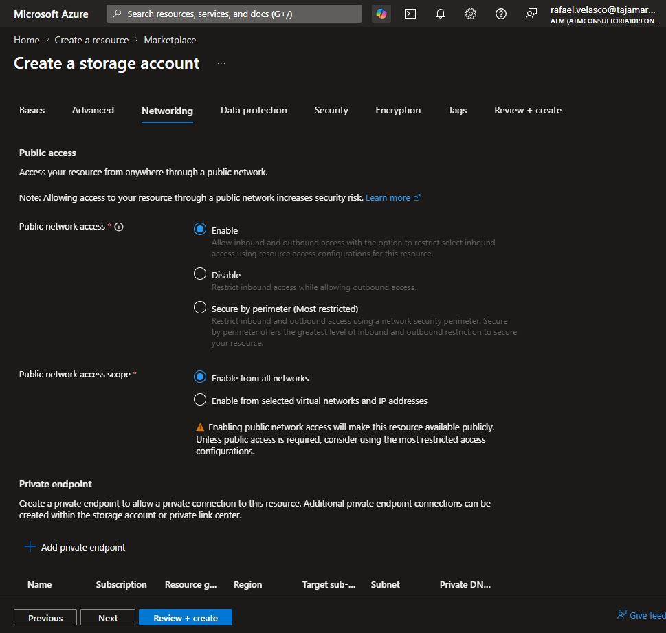

 

5. Select Next: Data protection > and then in the Recovery section, deselect all of the Enable soft delete… options. These options retain deleted files for subsequent recovery, but can cause issues later when you enable hierarchical namespace.

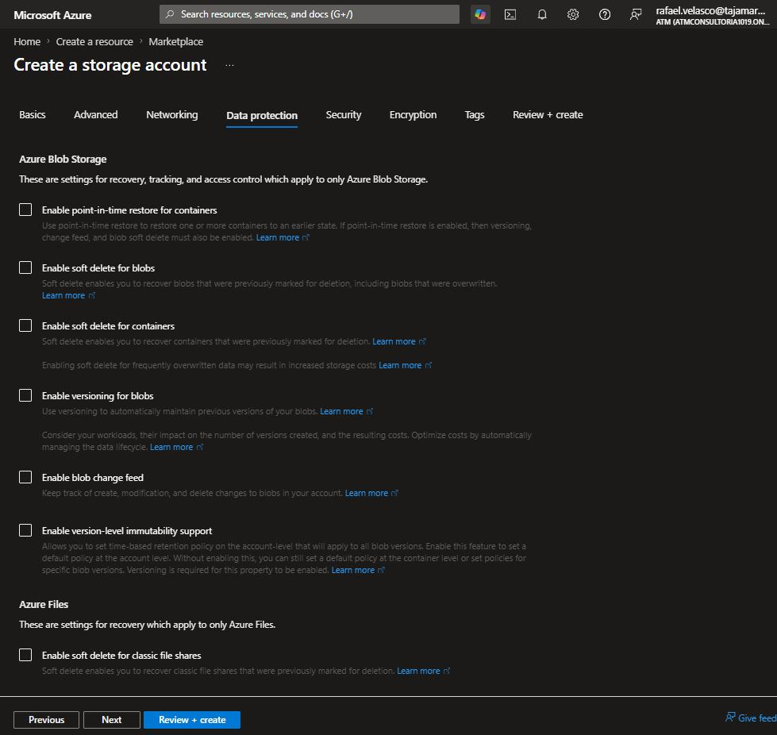

 

6. Continue through the remaining Next > pages without changing any of the default settings, and then on the Review page, wait for your selections to be validated and select Create to create your Azure Storage account.

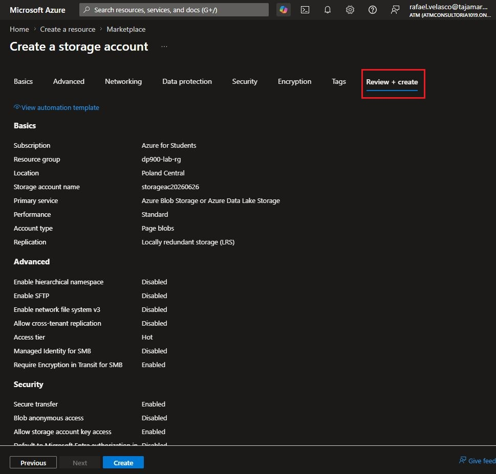

 

7. Wait for deployment to complete. Then select Go to resource to open the storage account that was deployed.

 

## Explore blob storage

Now that you have an Azure Storage account, you can create a container for blob data.

> ! **Tip**: A container groups blobs and is the first scoping level for access control. Starting with plain blob storage (no hierarchical namespace) shows virtual folder behavior you’ll compare to Data Lake Gen2 later.

1. Download the [product1.json](https://aka.ms/product1.json) JSON file from https://aka.ms/product1.json and save it on your computer (you can save it in any folder - you’ll upload it to blob storage later).

If the JSON file is displayed in your browser, right click the page, and select Save As. Name the file product1.json and store it in your downloads folder.

2. In the Azure portal page for your storage container, on the left side, in the Data storage section, select Containers.

 

3. In the Containers page, select ＋ Add container. In the New container pane, enter the name $data$.

Note that the Anonymous access level is automatically set to Private (no anonymous access) and can’t be changed, because anonymous access is disabled by default on the storage account. Select Create.

 

4. When the data container has been created, verify that it’s listed in the Containers page.

 

5. In the pane on the left side, in the top section, select Storage browser. This page provides a browser-based interface that you can use to work with the data in your storage account.

6. In the storage browser page, select Blob containers and verify that your data container is listed.

7. Select the data container, and note that it’s empty.

 

8. Select ＋ Add Directory and read the information about folders before creating a new directory named $products$.

 

9. In storage browser, verify that the current view shows the contents of the products folder you just created - observe that the “breadcrumbs” at the top of the page reflect the path Blob containers > data > products.

 

10. In the breadcrumbs, select data to switch to the data container, and note that it does not contain a folder named products.

Folders in blob storage are virtual, and only exist as part of the path of a blob. Since the products folder contained no blobs, it isn’t really there!

 

11. Use the ⤒ Upload button to open the Upload blob panel.

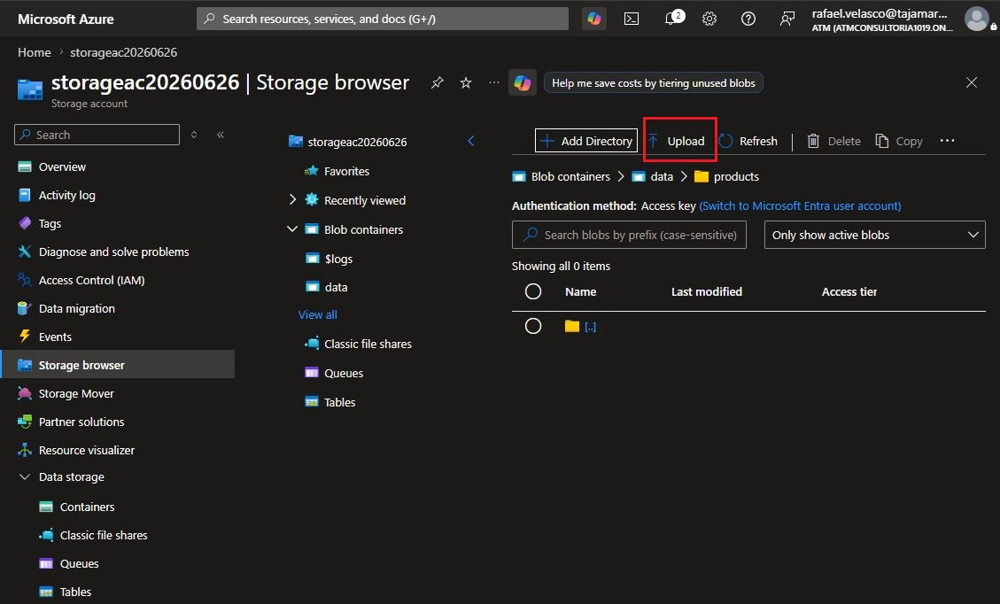

12. In the Upload blob panel, select the product1.json file you saved on your local computer previously. Then in the Advanced section, in the Upload to folder box, enter product_data and select the Upload button.

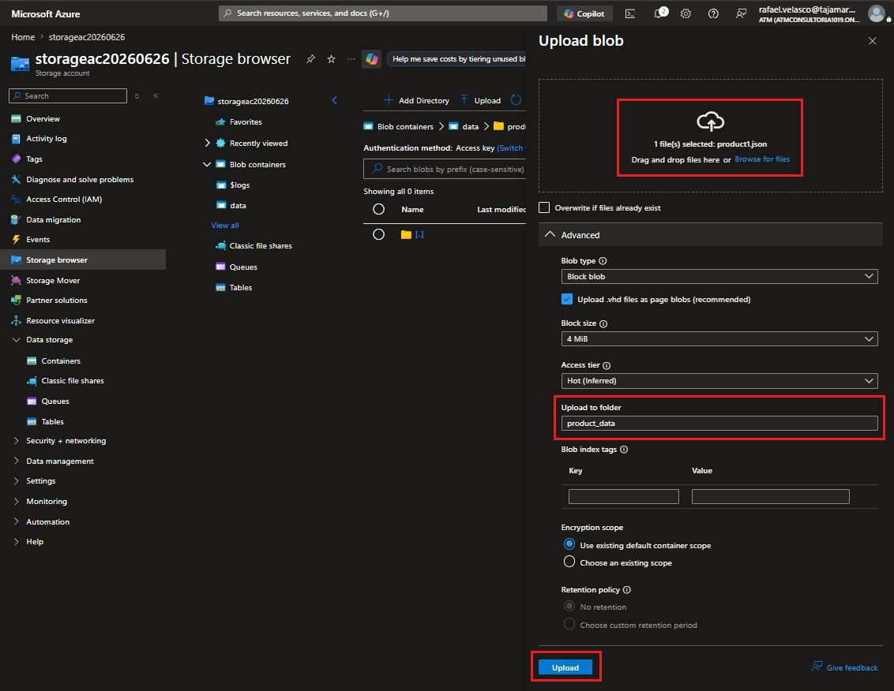

 

13. Close the Upload blob panel if it’s still open, and verify that a product_data virtual folder has been created in the data container.

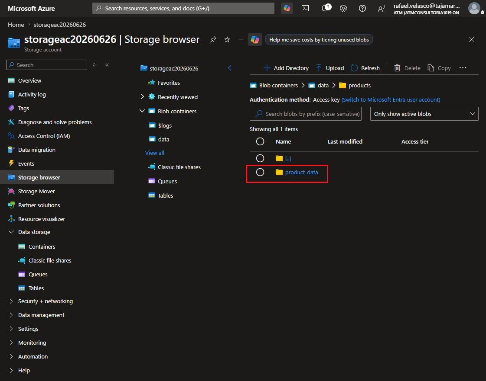

 

14. Select the product_data folder and verify that it contains the product1.json blob you uploaded.

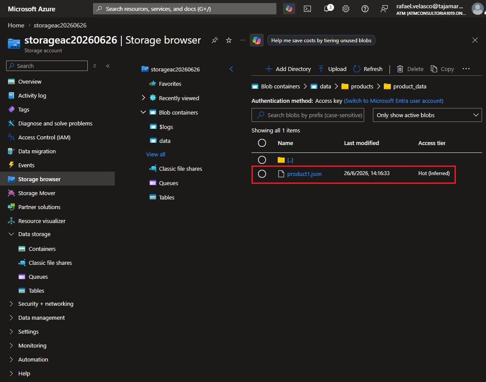

 

15. On the left side, in the Data storage section, select Containers.

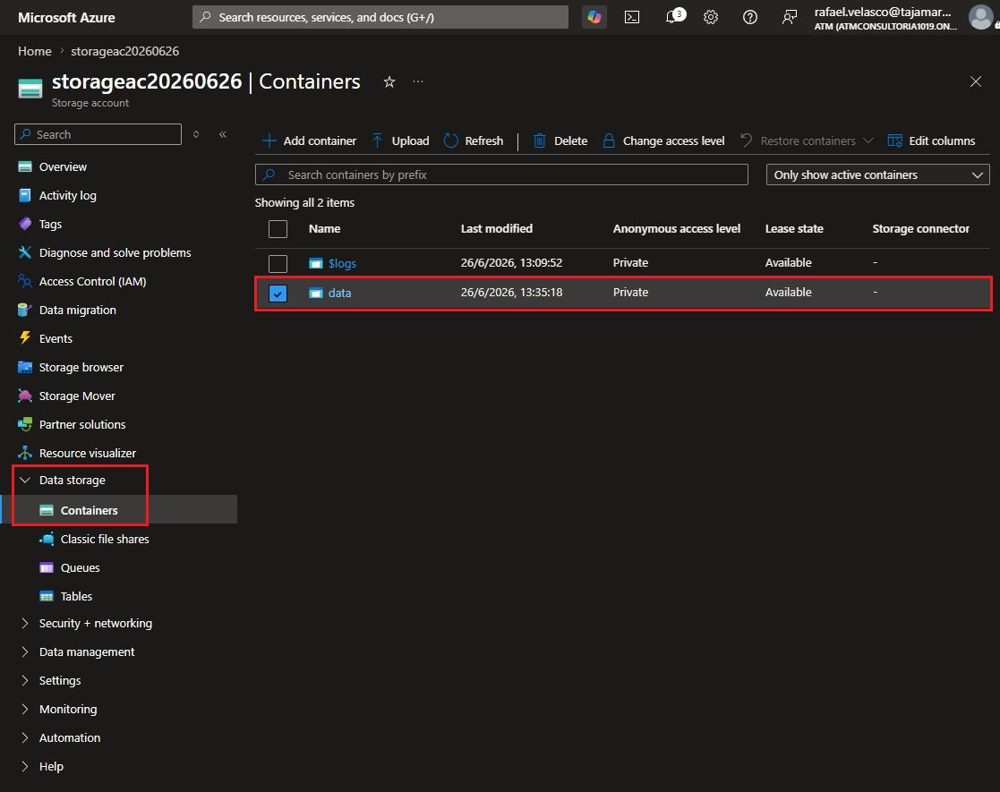

 

16. Open the data container, and verify that the product_data folder you created is listed.

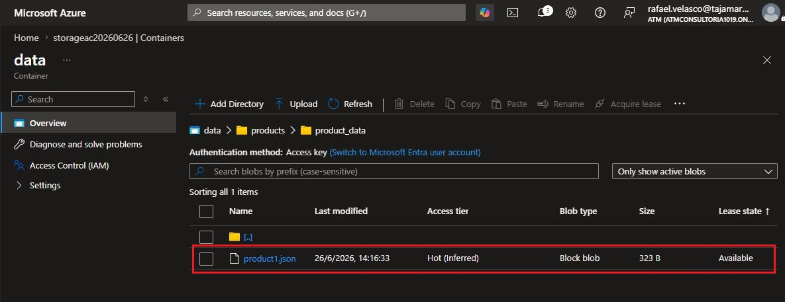

 

17. Select the ‧‧‧ icon at the right-end of the folder, and note that the menu doesn’t display any options. Folders in a flat namespace blob container are virtual, and can’t be managed.

> ! **Tip**: No real directory object exists, so there are no rename/permission operations — those require hierarchical namespace.

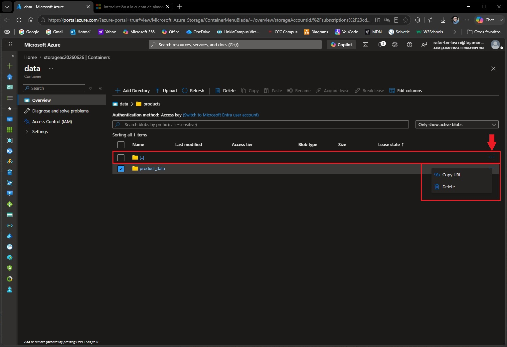

 

18. Use the X icon at the top right in the data page to close the page and return to the Containers page.

 

# Explore Azure Data Lake Storage Gen2

El soporte para Azure Data Lake Store Gen2 te permite usar carpetas jerárquicas para organizar y gestionar el acceso a blobs. También te permite usar almacenamiento en blob de Azure para alojar sistemas de archivos distribuidos para plataformas comunes de análisis de big data.

