## DP-900T00A-Azure-Data-Fundamentals

# Explore real-time analytics in Microsoft Fabric

Most data analysis works on data that was collected earlier. **Real-time analytics** is different: it works on data as it arrives, moment by moment. Think of a live feed of taxi trips, where new trips keep streaming in continuously.

In this lab, you’ll use the **Real-Time Intelligence** features in **Microsoft Fabric** to capture a live stream of taxi data, store it, and then query it to answer questions, watching the answers change as fresh data keeps flowing in. Don’t worry if these terms are new, every step is explained as you go.

This lab takes approximately 30 minutes to complete.

>! **Note**: You need a Microsoft Fabric tenant to complete this exercise.

## Create a workspace

Before working with data in Fabric, you need to create a workspace with the Fabric capacity enabled.

>! ***What is a workspace?** Think of it as a project folder that holds everything you create in Fabric (eventstreams, eventhouses, dashboards, and more). Enabling Fabric capacity gives the workspace the computing power needed to run those items.*

1. Navigate to the [Microsoft Fabric home page](https://app.fabric.microsoft.com/home?experience=fabric) at https://app.fabric.microsoft.com/home?experience=fabric in a browser, and sign in with your Fabric credentials.

2. At the bottom of the menu bar on the left is an experience switcher. If it shows **Power BI**, select it and choose **Fabric** so that all of the real-time intelligence features used in this lab are available.

 

3. In the menu bar on the left, select **Workspaces** (the icon looks similar to 🗇).

 

4. Select + **New workspace**, give your workspace a name (such as *dp900-realtime*), and in the **Advanced** section select a licensing mode that includes Fabric capacity (Trial, Premium, or Fabric). Then select **Apply**.

>! **Tip**: Using a capacity that includes Fabric ensures the workspace has the engines needed for real-time ingestion and analytics. A separate workspace keeps lab resources isolated and easy to clean up.

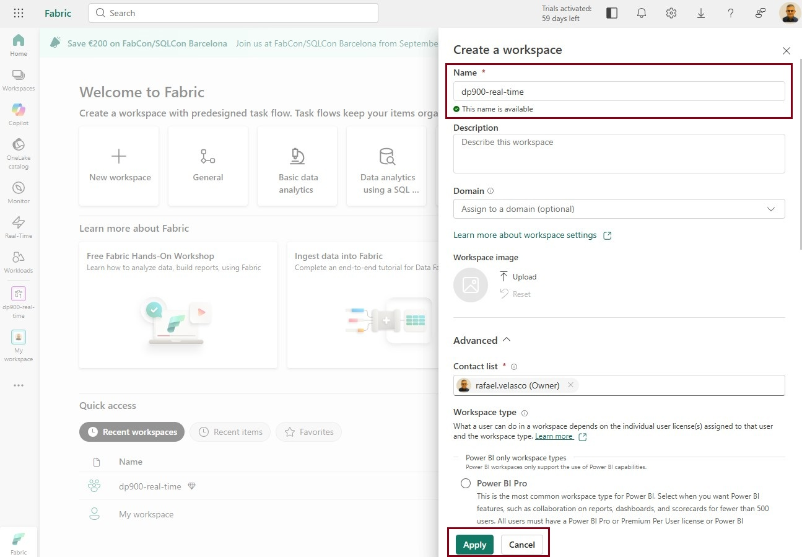

 

5. When your new workspace opens, it should be empty.

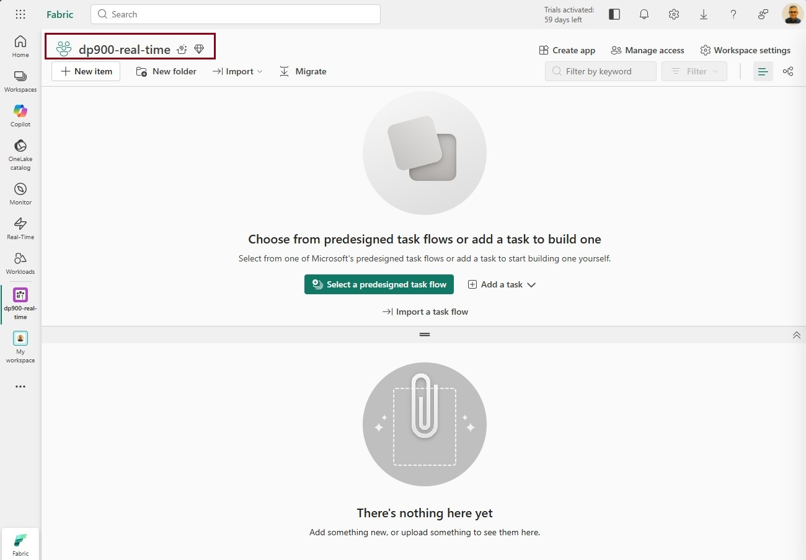

 

## Create an eventstream

Now you’re ready to find and capture real-time data from a streaming source. To do this, you’ll start in the Fabric Real-Time Hub.

>! ***What is an eventstream?** A stream is a continuous flow of data arriving in real time. An eventstream is the Fabric feature that connects to a streaming source and carries that flow to a destination where you can store and analyze it. The Real-Time Hub is the central place to find and connect to available streaming sources.*

>! ***Tip**: The first time you use the Real-Time Hub, some getting started tips may be displayed. You can close these.*

1. In the menu bar on the left, select the **Real-Time** hub.

The real-time hub provides an easy way to find and manage sources of streaming data.

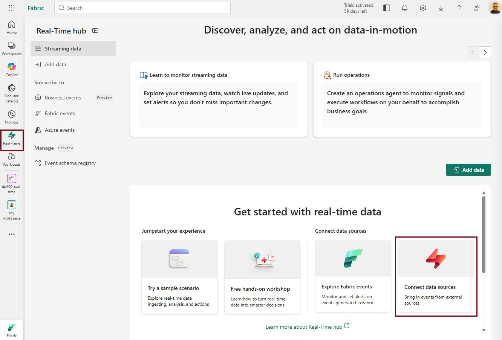

 

2. In the real-time hub, in the **Connect to** section, select **Data sources**.

A catalog of available streaming data sources is displayed.

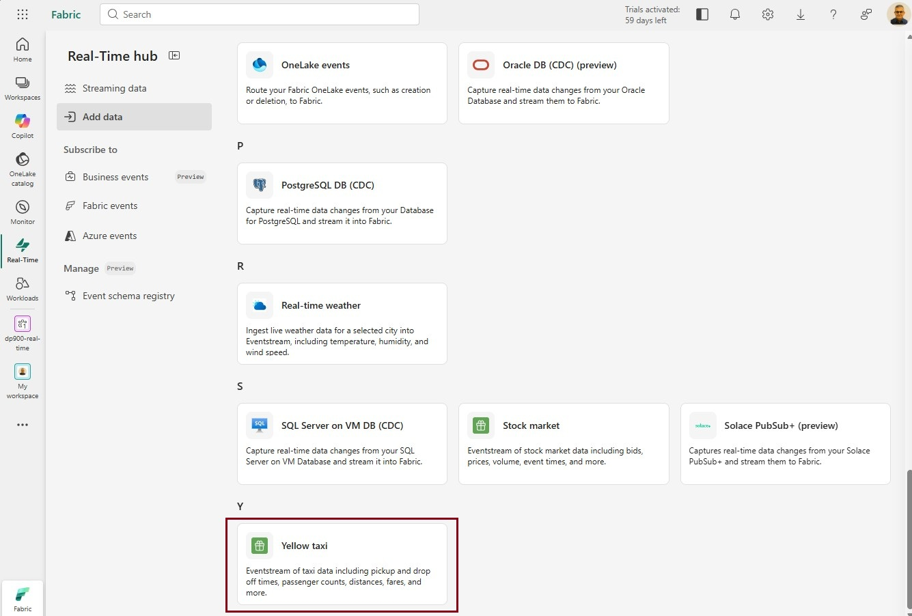

 

3. Find the **Yellow taxi** sample data source and select **Connect**. The **Connect data source** wizard opens on the **Configure connection settings** page.

>! ***Tip**: The Yellow taxi sample is a safe, public stream—no credentials required—and it’s consistent for all learners.*

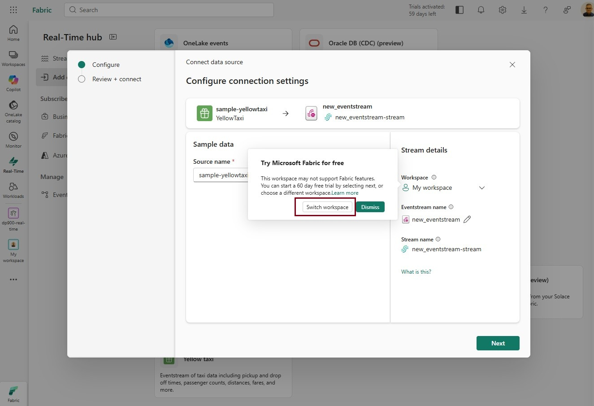

 

4. In the **Stream details** pane on the right, select the **Workspace** drop-down and choose the workspace you created earlier (for example, *dp900-realtime*) instead of My workspace. If a Try Microsoft Fabric for free prompt appears, you can dismiss it.

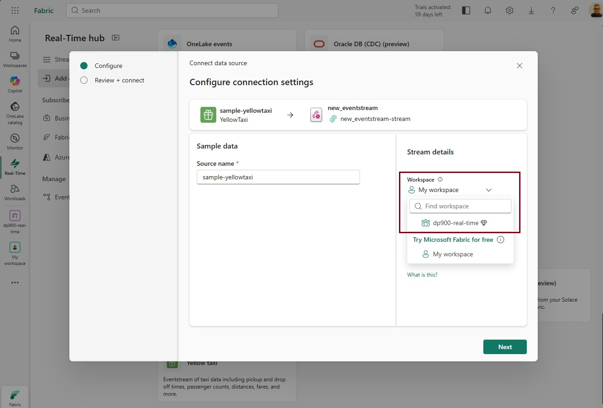

 

5. Set the **Source name** to *taxi*, and edit the default **Eventstream name** to *taxi-data*. The **Stream name** is automatically set to taxi-data-stream.

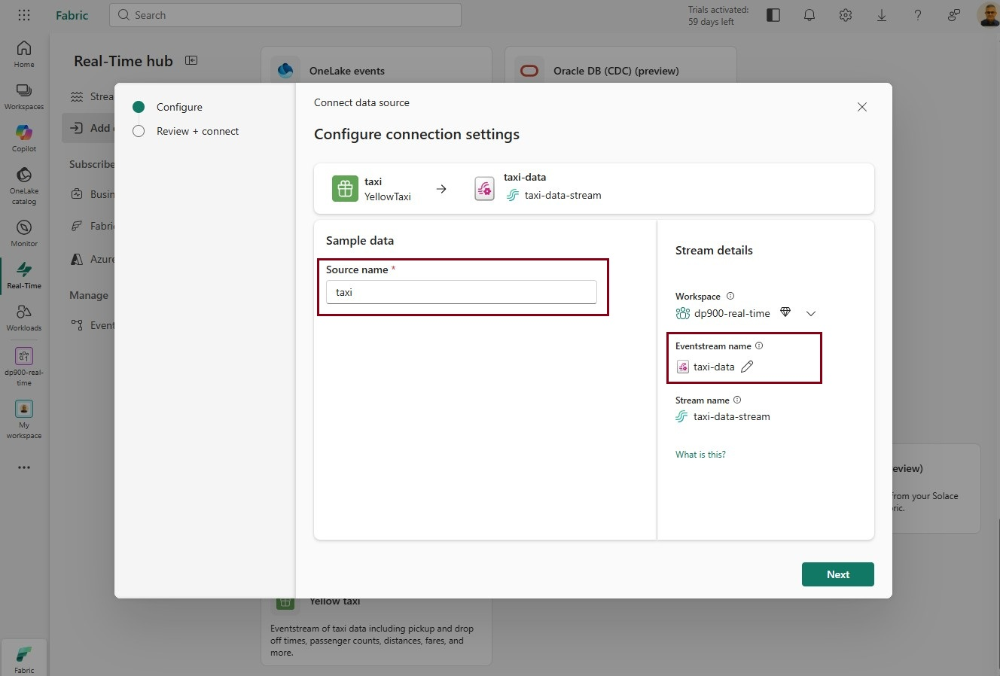

 

6. Select **Next**. On the **Review + connect page**, review the source and stream details, then select **Connect**.

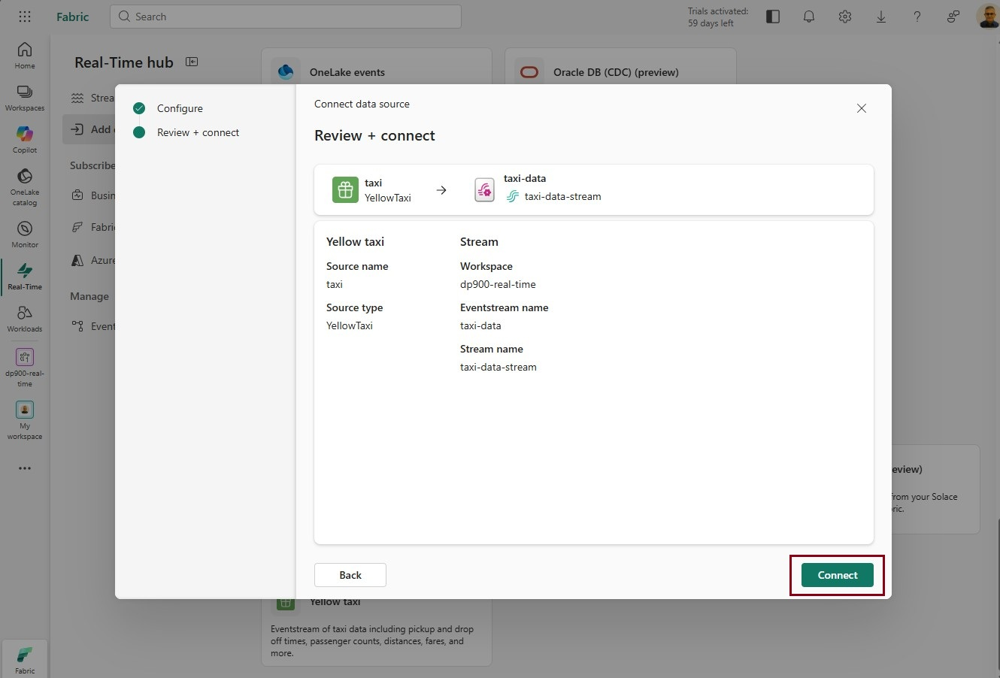

 

7. Wait for the **Create Eventstream** and **Create Eventstream** source tasks to show a status of **Successful**, then select **Open Eventstream**.

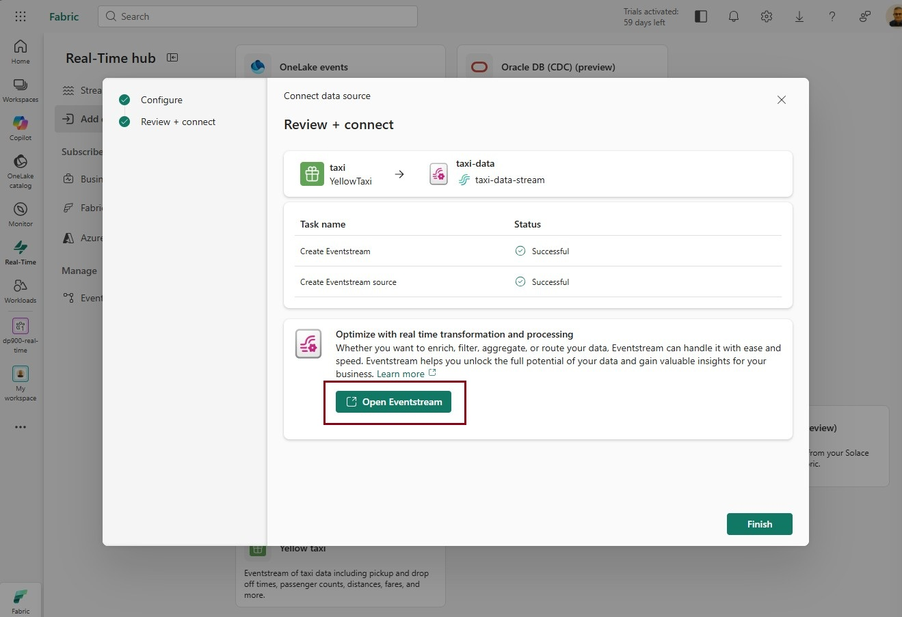

 

The eventstream opens on the design canvas, showing the **taxi** source and the **taxi-data-stream**.

 

---

## Create an eventhouse and store the stream

The eventstream captures the real-time taxi data, but it doesn’t currently store it anywhere. To keep the data so you can query it, add an **eventhouse** as a destination of the eventstream.

>! ***What is an eventhouse?** It’s durable storage built for real-time data. It contains a **KQL database**, where your streaming data is saved into tables. **KQL** (Kusto Query Language) is a read-only, SQL-like language designed to quickly explore, filter, and analyze large amounts of data, including data that keeps arriving.*

1. With the **taxi-data** eventstream open on the design canvas in **Edit mode**, on the toolbar select **Add destination**, and then select **Eventhouse**.

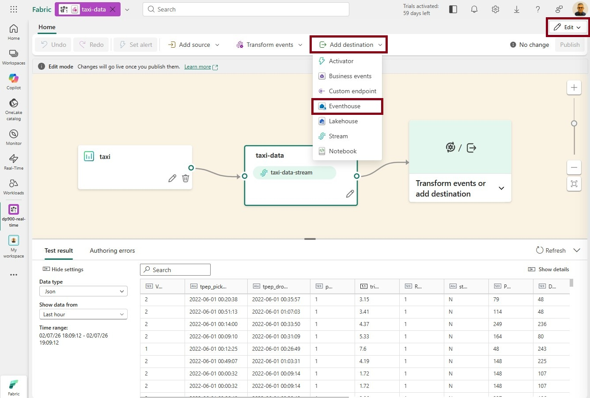

 

2. In the **Eventhouse** pane that opens on the right, configure the destination:

- For D**ata ingestion mode**, select **Event processing before ingestion**.
- Leave the default **Destination name** (*Eventhouse*).
- For **Workspace**, select the workspace you created earlier (for example, *dp900-realtime*).
- For **Eventhouse**, select **Create new**, name the eventhouse *taxi-eventhouse*, and select **Done**.
  The **KQL Database** is automatically set to the same name.

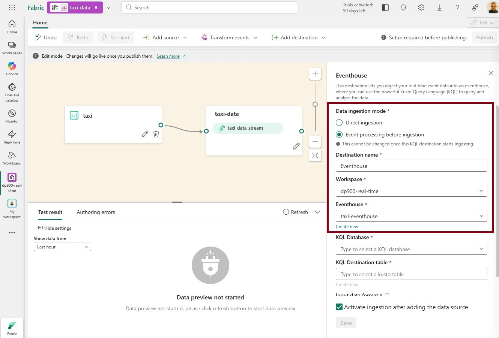

 

3. For KQL Destination table, select **Create new**, name the table *yellow-taxi*, and select **Done**. Make sure **Activate ingestion after adding the data source** is selected, and then select **Save**.

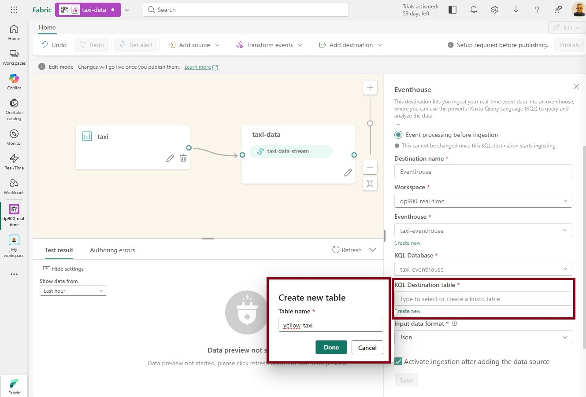

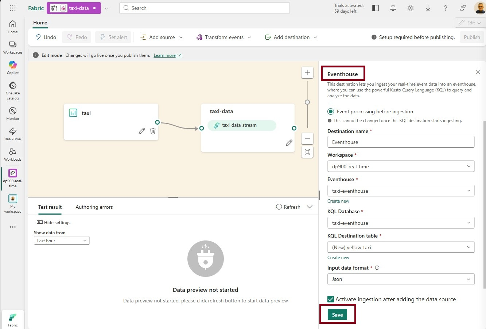

 

4. On the canvas, an **Eventhouse** destination node is added. Make sure it’s connected to the **taxi-data-stream** node. If the stream and the eventhouse aren’t joined, drag a connection from the circle on the right edge of the stream node to the **Eventhouse** node.

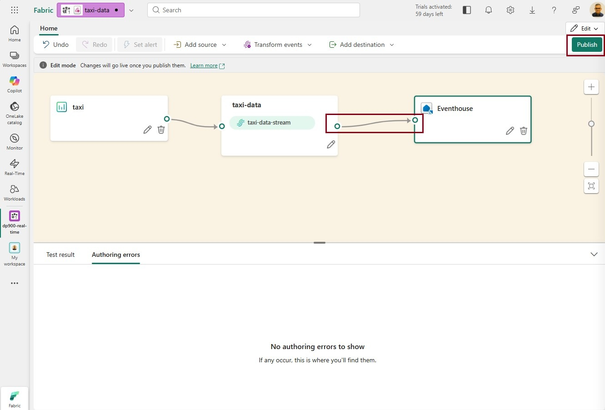

 

5. On the toolbar, select **Publish** to make your changes live.

>! ***Tip**: Changes you make on the canvas stay in Edit mode until you publish them. Publishing switches the eventstream to Live mode and starts moving events to the eventhouse.*

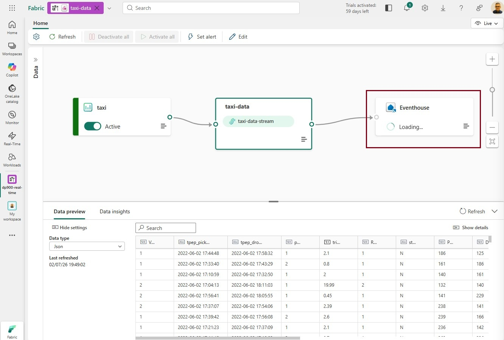

 

6. After the eventstream switches to **Live** mode, the **taxi** source, the **taxi-data-stream**, and the **Eventhouse** destination each show a status of **Active**. Select the **Eventhouse** node, and in the pane below the canvas select the **Data preview** tab. Wait a few minutes for ingestion to start, selecting **Refresh** until rows of taxi data appear.

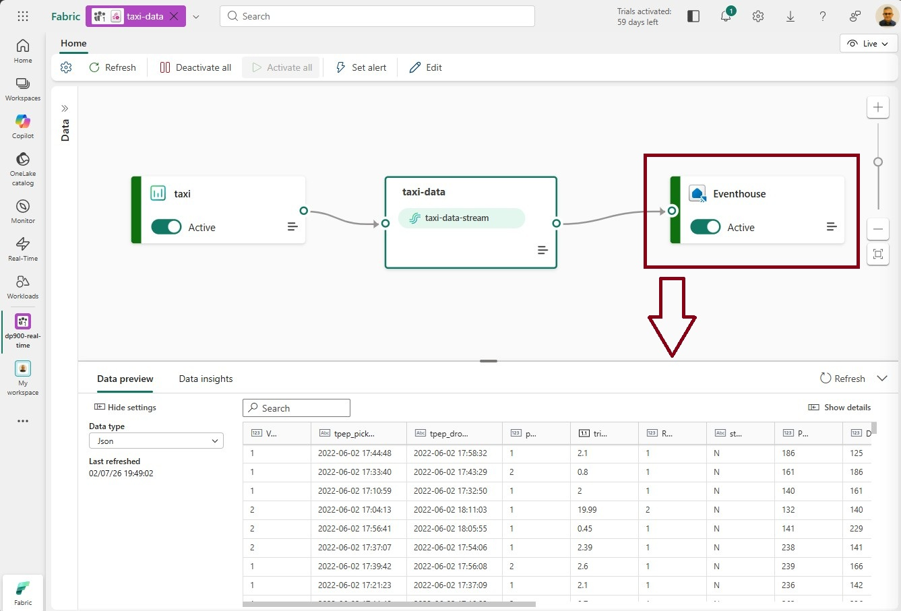

 

>! ***Tip**: After publishing, it can take a few minutes before the first events are written to the table. If the preview is empty, wait and select Refresh again.*

Now let’s explore how you can query and analyze the captured data.

 

---

## Query the captured data

The eventstream loads the real-time taxi data into the **yellow-taxi** table in your KQL database. You can query that table to explore the captured data.

>! ***Tip**: KQL is designed for fast exploration of time-stamped, high-volume data. Querying lets you validate ingestion and start analysis immediately.*

1. In the menu bar on the left, select **Workspaces**, open your workspace (for example, *dp900-realtime*), and then select the **taxi-eventhouse** KQL database.

!

 

2.

