### PL-300-Microsoft-Power-BI-Data-Analyst

# Setup local lab environment

Ideally, you should complete these labs in a hosted lab environment. If you want to complete them on your own computer, you can do so by installing the following software.

   - All setup and resource files can be [downloaded from GitHub](https://github.com/MicrosoftLearning/PL-300-Microsoft-Power-BI-Data-Analyst/raw/Main/AllfilesDownload.zip).

     - Extract the ‘AllFilesDownload’ folder to D:/ and rename it to ‘D:\Allfiles'.

***You may experience unexpected dialogs and behavior when using your own environment. Due to the wide range of possible local configurations, the course team cannot support issues you may encounter in your own environment.***

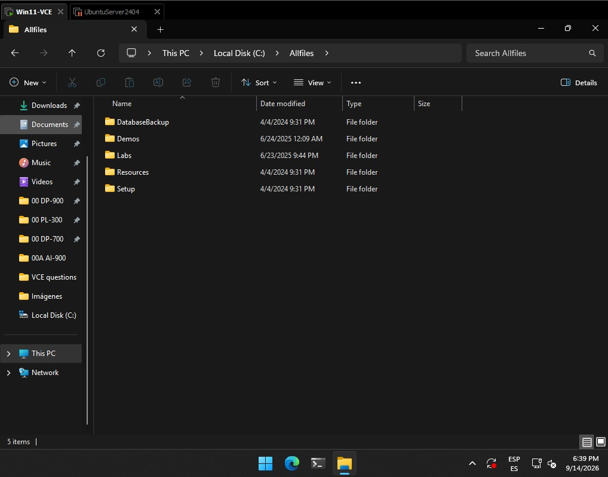

 

## Instructions using Windows 11

>! The instructions below are for a Windows 11 computer. Connecting from a different OS may not result in the same experience.

## Power BI Desktop

1. Download and install from the Microsoft store. If you do not have access to the Microsoft store, [download from the web](https://www.microsoft.com/download/details.aspx?id=58494). Power BI Desktop is the primary application for these labs.

   - Use the default options in the installer.

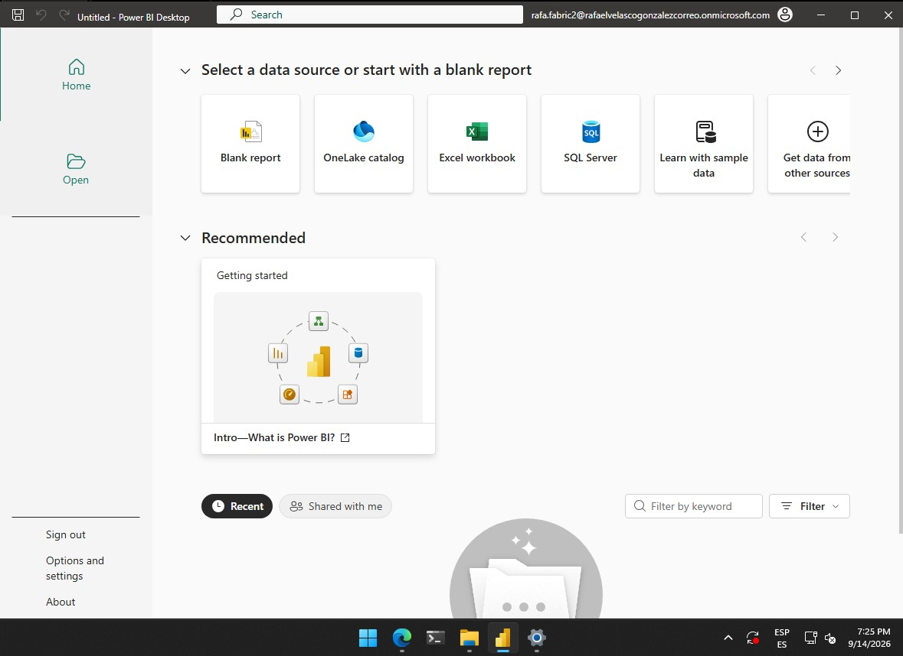

 

### Microsoft 365 Developer account

For some of the exercises, you will need to log into Power BI with an organizational account. You can use your own, but if you don’t have access, you can create a free [Microsoft 365 Developer account](https://developer.microsoft.com/microsoft-365/dev-program).

> Since I have a valid organizational account and can log in to Power BI, I do not need to create a free Microsoft 365 developer account.

### SQL Server Database Engine

The lab connects to a localhost SQL Server instance. The following instructions will help you install SQL Server and configure the default options. You only need to install the Database Engine feature.

   - Download the free [Developer copy of install media](https://www.microsoft.com/sql-server/sql-server-downloads?SilentAuth=1&f=255&MSPPError=-2147217396&rtc=1)
   - [Install SQL Server from the Installation Wizard (Setup)](https://learn.microsoft.com/sql/database-engine/install-windows/install-sql-server-from-the-installation-wizard-setup)

>! You can use an existing SQL Server instance if you have access, instead of installing a local version. However, you’ll need to modify the connection string from “localhost” to your instance name.

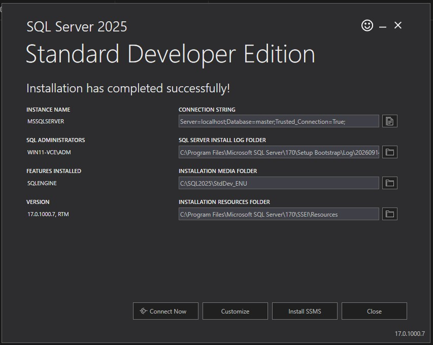

### Additional installation: SQL Server Management Studio (SSMS)

We need to install SSMS (SQL Server Management Studio) to connect to the databases on `localhost`.

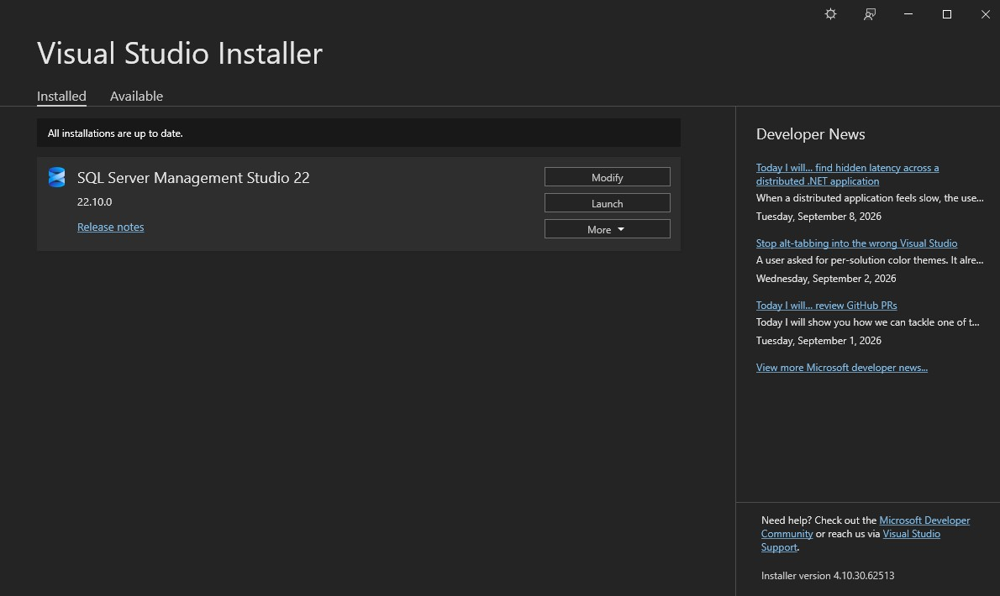

 

Open SSMS (SQL Server Management Studio)

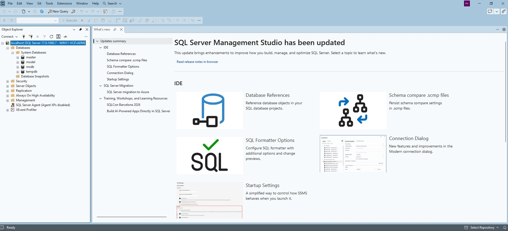

 

Now we are going to add the two databases available in `Allfiles`, specifically in the `DatabaseBackup` folder.

In `Databases`, select `Restore Database...`

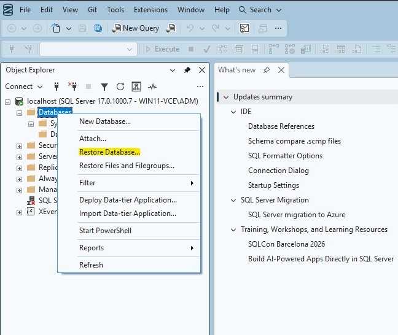

 

Select `Device`, click the three dots (`...`), then click `Add` and locate the `.bak` file of the database you want to restore.

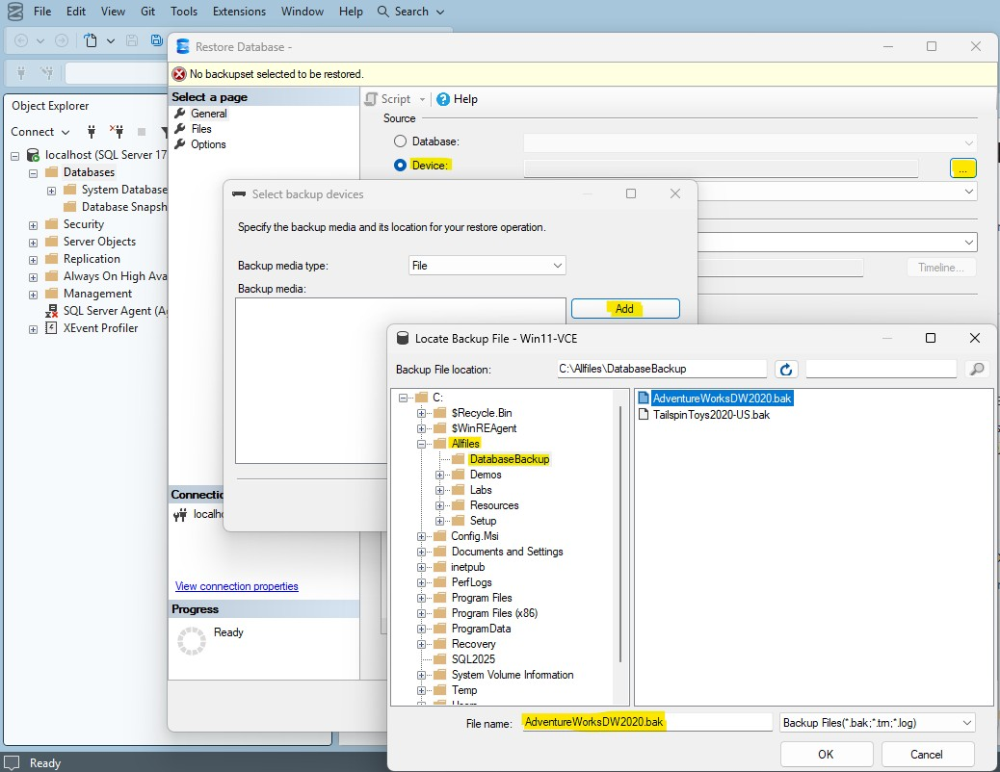

 

Once the backup file has been added, confirm the selection by clicking `OK`.

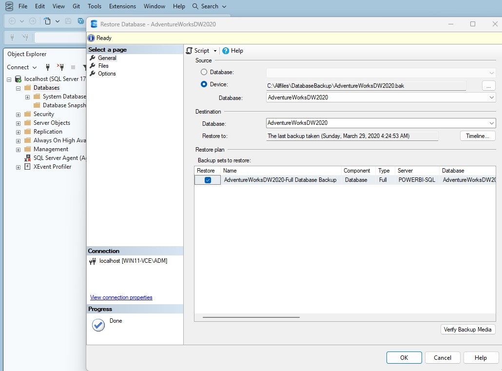

 

A confirmation message is displayed when the database has been restored successfully.

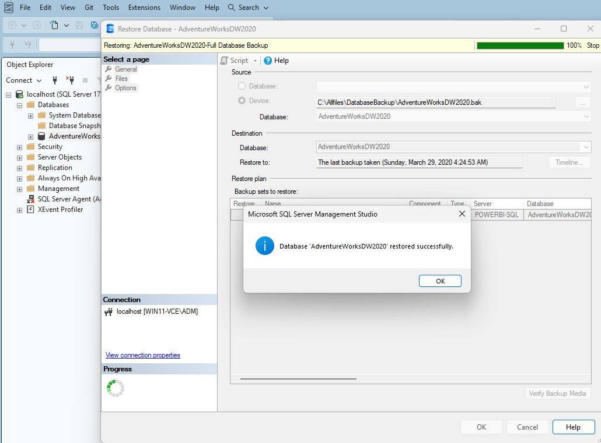

 

Check that the database has been restored and appears under `Databases`.

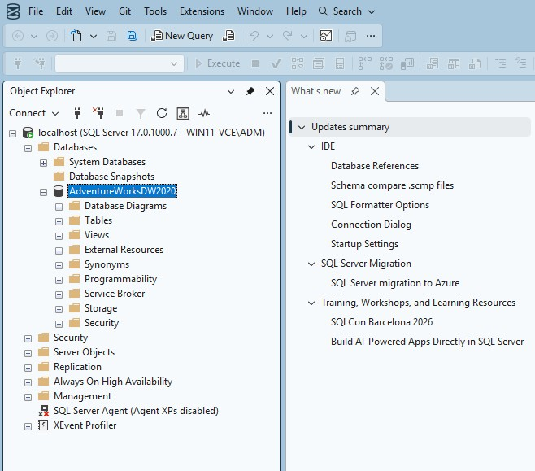

 

Repeat the same procedure to restore the other database.

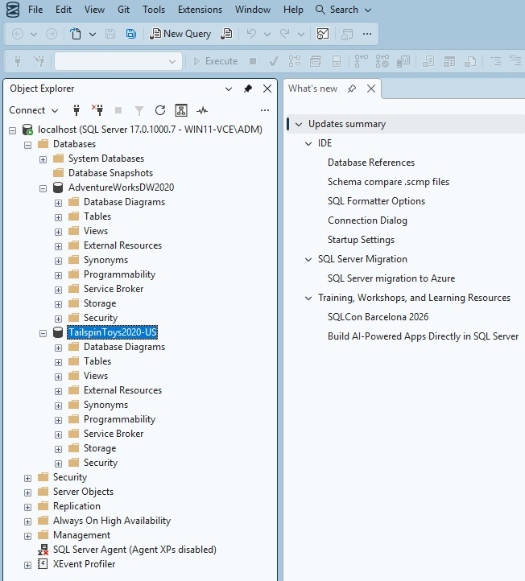

 

### Microsoft Edge

1. Install the latest version of [Microsoft Edge](https://microsoft.com/edge) to access Power BI service online.

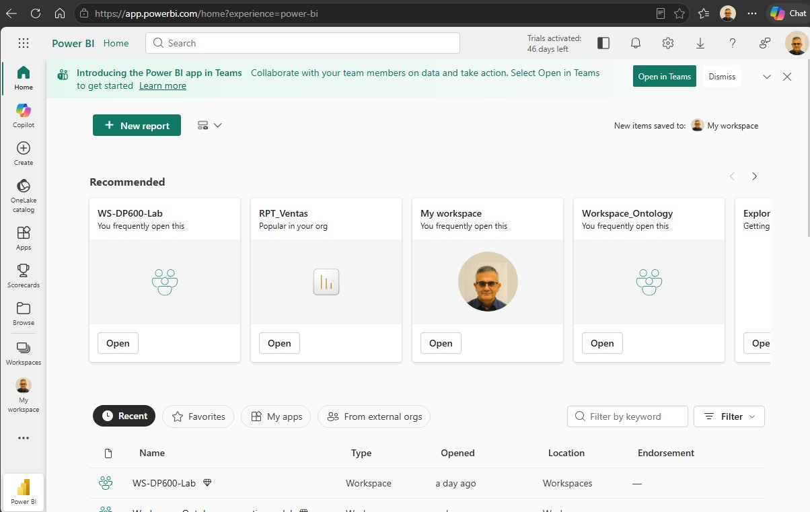

 

---

[Up](#pl-300-microsoft-power-bi-data-analyst)

